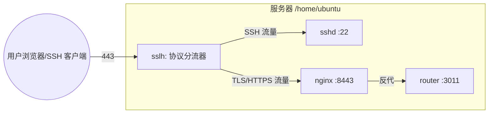

# 443 被 SSH 反向隧道占用时，如何不影响原有服务同时让 Nginx 正常对外

## 战报结论（先讲结果）

**一句话结论**：我们没有“抢走”443，而是让 443 成为“智能入口”。用 `sslh` 在 443 上做协议分流：
- **SSH 流量**仍进入 `sshd`（原本 443 的反向隧道继续可用）。
- **HTTPS 流量**转发给 `nginx` 的 8443 监听，从而**不改原有服务**的情况下让 `https://test-router.yeying.pub/` 在 **默认 443** 正常访问。

**运维问题的答案**：
> “地址栏不指定 8443 也能打开页面？”

因为现在的 **443 是 `sslh` 监听**，它识别到 HTTPS 之后转发给 **Nginx 的 8443**，所以浏览器访问 `https://test-router.yeying.pub/` 时走的是 **443 → sslh → 8443 → nginx → 3011**，无需手动指定端口。

**效果验证（最终状态）**：
- `443`：由 `sslh` 监听，支持 SSH + HTTPS
- `8443`：由 `nginx` 监听，提供 `test-router` 的 HTTPS 入口
- `3011`：由 `router` 服务监听，提供后端业务
- **原有 SSH 反向隧道、端口、服务全部保持**

---

## 执行路线（新手可复现步骤）

> 目标：**443 原本被 SSH 占用**，现在让 `nginx` 可对外提供 HTTPS，且 **不影响任何现有服务**。

### 0. 先确认现状（必须做，避免误操作）

查看端口占用：
```bash
sudo ss -ltnp
sudo ss -lunp
```
重点确认：
- `:443` 是否由 `sshd` 占用
- `:8443` 是否已被 `nginx` 监听
- `:3011` 是否由 `router` 监听

查看 Nginx 配置：
```bash
sudo sed -n '1,200p' /etc/nginx/conf.d/test-router.conf
```
你会看到：
```
listen 8443 ssl;
proxy_pass http://127.0.0.1:3011;
```
这说明 **Nginx 是 8443 → 3011 的反向代理**。

### 1. 为 443 引入“协议分流器”（核心步骤）

安装 `sslh`（协议多路复用器）：
```bash
sudo apt-get update -y
sudo apt-get install -y sslh
```

配置 `sslh`（绝对路径）：
- 文件：`/etc/default/sslh`
- 示例配置：
```
DAEMON=/usr/sbin/sslh
DAEMON_OPTS="--user sslh --listen 0.0.0.0:443 --listen [::]:443 --ssh 127.0.0.1:22 --tls 127.0.0.1:8443 --on-timeout=ssh"
```
**参数解释**：
- `--listen 0.0.0.0:443`：对外开放 443
- `--ssh 127.0.0.1:22`：SSH 流量转给本机 22
- `--tls 127.0.0.1:8443`：HTTPS 流量转给 Nginx 的 8443
- `--on-timeout=ssh`：若无法判断协议，默认走 SSH（兼容性更高）

### 2. 释放 443 给 `sslh`，但不影响 SSH

把 SSH 的 443 监听移除（只保留 22）：
- 文件：`/etc/ssh/sshd_config.d/01-listen-443.conf`
- 修改为：
```
Port 22
```
应用：
```bash
sudo systemctl restart ssh.socket
```

启动 `sslh`：
```bash
sudo systemctl restart sslh
```

验证 443 现在由 `sslh` 接管：
```bash
sudo ss -ltnp | rg ':443'
```

### 3. 确保 router 服务稳定运行（防止 502）

`nginx` 反代到 `127.0.0.1:3011`，所以 `router` **必须稳定监听**。我们用 systemd 保证它常驻：

**服务文件**：`/etc/systemd/system/router.service`
```
[Unit]
Description=Router Service
After=network.target

[Service]
Type=simple
User=ubuntu
WorkingDirectory=/opt/deploy/router-v0.0.12-3cc5ed8
ExecStart=/opt/deploy/router-v0.0.12-3cc5ed8/build/router --port 3011 --log-dir /opt/deploy/router-v0.0.12-3cc5ed8/logs
Restart=on-failure
RestartSec=3

[Install]
WantedBy=multi-user.target
```

启用：
```bash
sudo systemctl daemon-reload
sudo systemctl enable --now router.service
```

验证：
```bash
sudo ss -ltnp | rg ':3011'
systemctl status router.service
```

### 4. 验证端到端访问

```bash
curl -k -I https://127.0.0.1:8443 -H 'Host: test-router.yeying.pub'
curl -k -I https://127.0.0.1:443  -H 'Host: test-router.yeying.pub'
```
两条都应返回 `HTTP/1.1 200 OK`。

---

## 原理讲解（为什么这样做）

### 1) 为什么不能直接让 nginx 监听 443？

因为 443 原本被 `sshd` 占用（用于 SSH 反向隧道）。如果直接改 Nginx 去占 443，会导致：
- Nginx 启动失败，或者
- SSH 443 断开（反向隧道失效）

这与“**不影响原有服务**”的目标冲突。

### 2) sslh 的本质

`sslh` 是“协议分流器”：它只拿到一个入口端口（443），根据协议特征判断：
- 如果是 SSH，就转给 `127.0.0.1:22`
- 如果是 TLS/HTTPS，就转给 `127.0.0.1:8443`

因此 **443 成为共享入口**，而不是被单一服务占用。

### 3) nginx 8443 与 nginx 443 的区别

| 方案 | 443 的占用 | Nginx 监听 | SSH 443 | 对外访问 | 影响原有服务 | 说明 |
|---|---|---|---|---|---|---|
| **直占 443** | nginx | 443 | 失效 | 正常 | 有风险 | 简单但会破坏 SSH 443 |
| **sslh 复用** | sslh | 8443 | 保留 | 正常 | 无影响 | 兼容性最好，推荐 |

所以当前方案是 **在不牺牲任何既有能力的前提下**，让 Nginx 成功对外服务。

---

## 全局架构图（Mermaid）



> 以上语法为标准 Mermaid flowchart，可在 GitHub/Typora 直接渲染。

---

## 关键路径与目录结构（确保可落地）

**核心路径（绝对路径）**：
- ` /etc/default/sslh `
- ` /etc/ssh/sshd_config.d/01-listen-443.conf `
- ` /etc/nginx/conf.d/test-router.conf `
- ` /opt/deploy/router-v0.0.12-3cc5ed8/build/router `
- ` /opt/deploy/router-v0.0.12-3cc5ed8/config.yaml `
- ` /opt/deploy/router-v0.0.12-3cc5ed8/logs `
- ` /etc/systemd/system/router.service `

**部署目录结构**：
```
/opt/deploy/router-v0.0.12-3cc5ed8/
├─ build/router
├─ config.yaml
├─ logs/
├─ run/
└─ scripts/starter.sh
```

---

## 教师指挥官式总结（你该怎么理解）

1. **先保护边界**：443 不是“空端口”，它是“前线阵地”。动它就要保证 SSH 仍能走。
2. **再建立中枢**：`sslh` 就是战场指挥官，负责把不同流量送到正确的部队。
3. **最后稳住后勤**：`router` 必须长期在线，systemd 是最佳保障，否则 nginx 只能报 502。

你现在看到“地址栏不写 8443 也能访问”，**不是因为 nginx 真监听了 443**，而是因为 sslh 在 443 做了“智能分流”。这是在不牺牲任何既有能力的前提下，达成 **两头都通** 的最稳妥方案。

