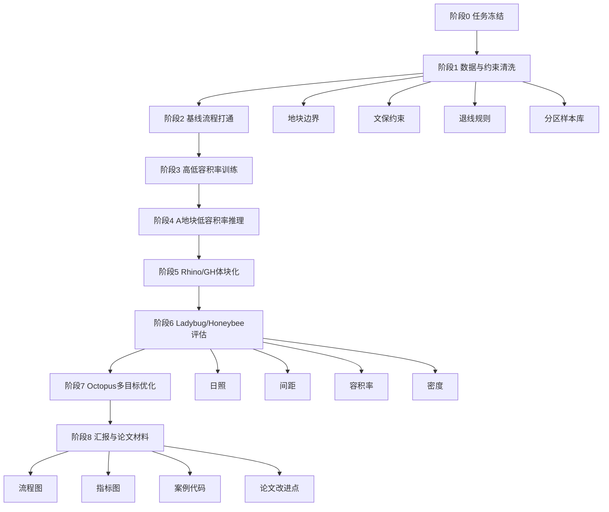
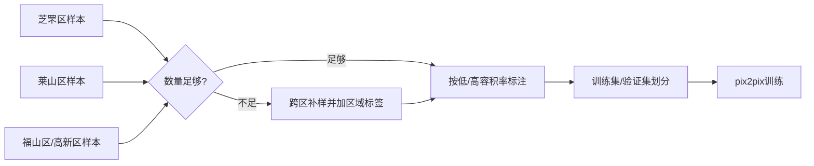
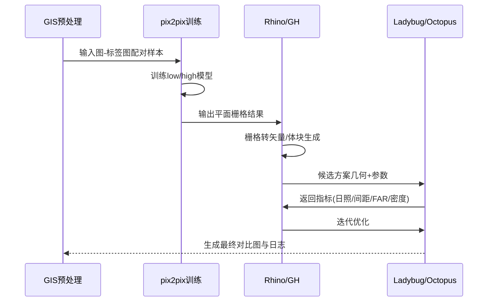
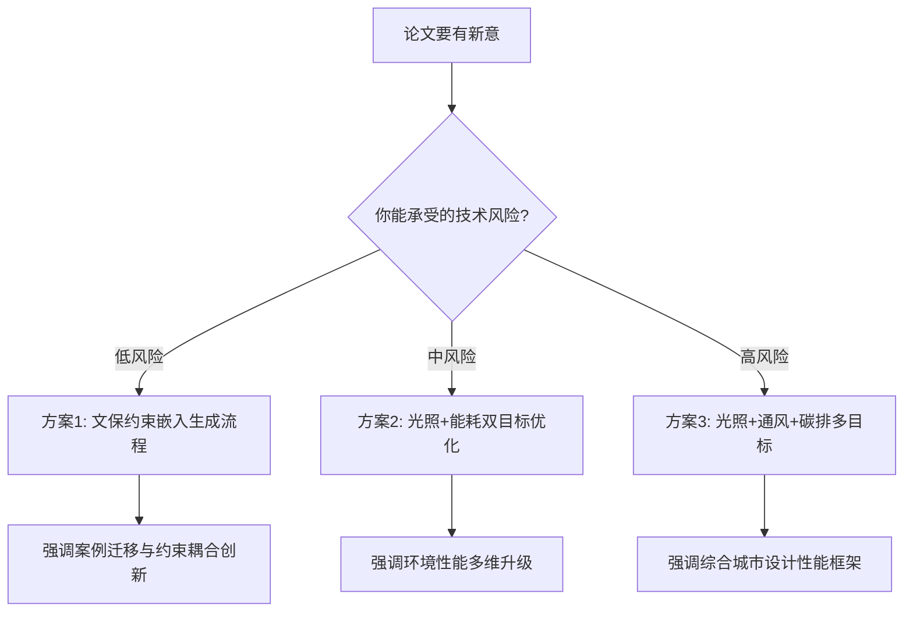
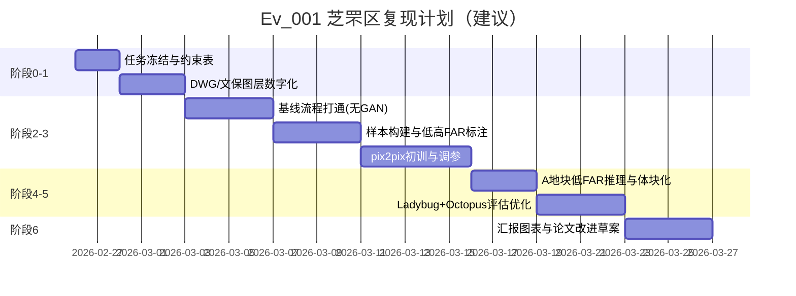

# Env｜芝罘区项目复现总控手册（教师与指挥官版）

> 你现在不是“不会从哪下手”。
> 你现在是这个项目的总指挥，只是还缺一张作战地图。
> 这份文档，就是你的地图、口令、节奏、风险控制和交付标准。

---

## 0. 先把局面说透（你必须先理解这三句话）

1. **客户要的不是“论文复述”**，而是“在芝罘区真实地块上可落地的复现流程 + 结果图 + 可解释指标 + 可汇报故事”。
2. **你要做两条线**：
   - 业务线：把项目流程跑通并可交付（A 地块优先，低容积率方案先出结果）。
   - 学术线：在原论文“光照”为主的基础上，设计一个有论文价值的小改进（后续和客户确认）。
3. **你当前最重要任务不是训练模型**，而是先把“约束、数据、指标、流程”四件事锁死，避免后期返工。

---

## 1. 项目证据盘点（你手里到底有什么）

### 1.1 已收到资料（可追溯路径）

| 类别 | 路径 | 用途 | 你现在要做什么 |
|---|---|---|---|
| 规划条件 | `/home/snw/文档/SNW_Codex/Ev/Ev_001_plan/案例资料/02015环山路以南，南山公园以东（啤酒厂）地块条件.doc` | 硬性指标与法定约束来源 | 作为“硬约束真值表” |
| 地块底图 | `/home/snw/文档/SNW_Codex/Ev/Ev_001_plan/案例资料/啤酒厂用地2018.7.9(1)(1).dwg` | 边界、道路、现状对象 | 导入 Rhino/QGIS，整理图层 |
| 文保边界图 | `/home/snw/文档/SNW_Codex/Ev/Ev_001_plan/案例资料/文物材料/保护范围及建设控制地带示意图.jpg` | 保护范围（红）+ 建设控制地带（绿） | 数字化成约束面 |
| 文保方案 | `/home/snw/文档/SNW_Codex/Ev/Ev_001_plan/案例资料/文物材料/醴泉啤酒公司旧址维修保护方案.pdf` | 文物价值、保护逻辑 | 形成“保留对象不可触碰规则” |
| 厂区照片 | `/home/snw/文档/SNW_Codex/Ev/Ev_001_plan/案例资料/厂区照片/` | 现状与汇报素材 | 建“前后对比图素材池” |
| 会议记录（口头） | 你给的要点（环山路、南山公园、保护性建筑、退线、4500、高低容积率等） | 实际交付导向 | 转成执行任务 + 验收条款 |

### 1.2 你必须知道的“硬约束真值”（来自规划条件 doc）

> 下列内容是“法定/强约束口径”，后续必须与客户口径做一次“冲突对齐”。

- 地块位置：**环山路以南，南山公园以东（原啤酒厂）**。
- 可建设总面积约：**4.02 公顷**。
  - A 地块：**3.33 公顷**
  - B 地块：**0.69 公顷**
- 退线（关键）：
  - 退环山路：多层 ≥ 20m，高层 ≥ 25m
  - 退西侧规划路：≥ 15m
  - 退东侧边界：≥ 6.5m
  - 退南侧边界：≥ 15m
- A 地块（规划条件口径）：
  - 容积率：**2.30 < FAR ≤ 2.77**
  - 建筑密度：**< 20%**
  - 绿地率：**> 30%**
  - 高度：**< 110m**
- B 地块：文化设施，地上建筑面积 ≤ 991㎡（保留保护建筑规模）。
- 文保关联：方案审批前要结合文物局意见，妥善处理“旧址与新建建筑关系”。

### 1.3 会议口头需求（业务口径）转译

你记录的关键词我已转成可执行语句：

| 口头关键词 | 工程化解释 |
|---|---|
| 芝罘区核心做 | 主训练/主验证样本来自芝罘区 |
| 莱山区/福山区/高新区作为参考 | 当芝罘样本不足时做数据补充与迁移训练 |
| 训练高低容积率 | 模型需有 low/high 两类能力（分类或双模型） |
| A 地块只需要低容积率 | 交付优先级：A 仅输出 low-FAR 方案 |
| B 地块可不做 | B 地块作为可选项，不纳入首轮验收 |
| 日照间距、容积率、退线、密度 | 首轮必须指标（硬） |
| 通风、热、能源、碳排放 | 作为二阶段增强指标（软） |
| 图片、流程、案例代码、数据集 | 交付件必须包含“可复现证据链” |

---

## 2. 总作战图（先看全局，再做局部）



> 你现在的正确起手顺序：**阶段0 -> 阶段1 -> 阶段2**，不要直接跳阶段3训练。

---

## 3. 关键冲突先拆解（避免后面“做了白做”）

### 冲突 A：规划条件 vs 会议口径

- 规划条件 A 地块是高 FAR 区间（2.30~2.77）。
- 会议口径又说 “A 地块只做低容积率”。

**解决办法（强烈建议）**：双口径交付

1. **研究演示口径**（先交付）：A 地块 low-FAR 可行方案（客户当前需求）。
2. **合规对照口径**（保底）：附一页“与法定指标差异说明”，避免未来审查风险。

### 冲突 B：论文原始案例（上海） vs 当前案例（芝罘）

- 这不是问题，反而是论文机会：**跨城市迁移复现**。
- 你的叙事应该是：
  - “方法在上海提出”
  - “在芝罘区进行约束迁移和工程复现”

### 冲突 C：你是建筑小白 + 工具链偏技术

- 解决策略：全流程分成“**你能看懂的 7 个动作**”。
- 每个动作只盯三件事：输入、操作、输出。

---

## 4. 你现在就能执行的“7个动作”

## 动作 1：冻结任务边界（今天必须完成）

**输入**：会议记录 + 规划条件 + 客户当前优先级

**操作**：写一页《任务冻结单》

你要写清楚：
- 本轮必须交付：A 地块 low-FAR 方案 + 流程复现 + 指标图 + 代码与数据目录。
- 本轮可选交付：B 地块、高 FAR 推理、碳排精算。
- 指标优先级：日照/间距/容积率/退线/密度为首批硬指标。

**输出**：`任务冻结单_v1.md`

---

## 动作 2：建立统一项目目录（别再散文件）

在你的执行机（已装 Rhino8）创建：

```text
Ev_001_work/
  00_admin/
    meeting_notes/
    requirement_freeze/
  01_raw/
    planning_doc/
    dwg/
    heritage/
    photos/
    district_osm/
  02_gis/
    boundary/
    constraint_layers/
    samples_tiles/
  03_ml/
    dataset/
    configs/
    checkpoints/
    logs/
  04_rhino_gh/
    rhino_models/
    gh_defs/
    gh_exports/
  05_eval/
    daylight/
    spacing/
    density_far/
    optional_wind_energy_carbon/
  06_report/
    figures/
    tables/
    mermaid/
    slides/
  07_repro/
    scripts/
    env/
    runbooks/
```

---

## 动作 2.5：把 Rhino 变成“可干活状态”（你现在最需要）

你说“Rhino8 已装好，但不知道从哪里下手”，那就按下面做，做完你就能开工。

### 2.5.1 Rhino / GH 插件安装顺序（建议按这个顺序）

1. 打开 Rhino 8，输入命令：`Grasshopper`（确认 GH 能打开）。
2. 在 Rhino 输入命令：`PackageManager`。
3. 搜索并安装（能搜到就优先用这个方式）：
   - `Ladybug Tools`
   - `Honeybee`
4. `Octopus` 如果 PackageManager 搜不到，就走 Food4Rhino 手动安装：
   - 下载插件压缩包
   - 把 `.gha` 放到：`%APPDATA%\\Grasshopper\\Libraries`
   - 右键文件属性，若有“解除锁定”，勾选后再打开 GH
5. 重启 Rhino + GH，确认 GH 顶部标签页出现：
   - Ladybug
   - Honeybee
   - Octopus

### 2.5.2 环境健康检查（10分钟）

在 GH 里做 3 个最小测试：

1. Ladybug：加载 EPW -> 太阳路径能正常出图。
2. Honeybee：给一个简单 box -> 能跑出基础能耗或辐射结果。
3. Octopus：给两个虚拟数值目标 -> 能出现迭代散点图。

只要这三个测试通过，你的工具链就“活了”。

### 2.5.3 Python/GIS 环境（用于数据与训练）

> Rhino 是几何与评估中枢；数据与训练建议放 Python 环境。

推荐一条命令建环境（Windows PowerShell）：

```powershell
conda create -n ev001 python=3.10 -y
conda activate ev001
pip install geopandas shapely rasterio fiona pyproj osmnx pandas numpy matplotlib opencv-python torch torchvision
```

完成后做最小验证：

```powershell
python - << 'PY'
import geopandas, osmnx, torch
print('geopandas ok')
print('osmnx ok')
print('torch', torch.__version__)
PY
```

### 2.5.4 你今天最该完成的“环境里程碑”

- [ ] GH 正常打开
- [ ] Ladybug/Honeybee/Octopus 在 GH 可见
- [ ] Python 环境可导入 GIS 与 torch
- [ ] 能跑一个“从边界到体块到日照”的最小链路

---

## 动作 3：把“图纸约束”数字化（这是整个项目地基）

### 3.1 你要做出的约束图层（最小闭环）

| 图层名 | 类型 | 来源 | 用途 |
|---|---|---|---|
| `site_boundary` | polygon | DWG | 地块边界 |
| `block_A` | polygon | 规划条件 | A 地块计算主体 |
| `block_B` | polygon | 规划条件 | 可选 |
| `heritage_core` | polygon | 文保示意图（红） | 禁建/强保护 |
| `heritage_control` | polygon | 文保示意图（绿） | 限制建设强度 |
| `setback_huanshan` | polygon | 退线规则 | 退线判定 |
| `setback_west/east/south` | polygon | 退线规则 | 退线判定 |
| `buildable_area_A` | polygon | boundary - setback - protection | 真正可建区 |

### 3.2 操作建议（Rhino 小白可执行）

1. `Import` 导入 DWG。
2. 整理图层，统一命名。
3. 用 `Offset` 生成退线边界。
4. 根据文保图手工描绘 `heritage_core`、`heritage_control`（先粗后精）。
5. 用布尔运算得到 `buildable_area_A`。
6. 导出 dxf/shp（给 GIS 和 ML 阶段复用）。

---

## 动作 4：样本策略（芝罘主训 + 其他区补样）



### 4.1 低/高 FAR 划分建议（可调整）

你有两种科学做法：

- **做法A（推荐）**：按样本分位数划分（P33/P66），避免拍脑袋阈值。
- **做法B**：按业务阈值（例如 low ≤ 1.8，high ≥ 2.3，中间忽略或单独一类）。

> 你目前目标是 A 地块 low-FAR，
> 但训练阶段仍建议保留 high-FAR 能力，便于后续论文对比和客户扩展。

---

## 动作 5：先做“无模型基线”，再做 GAN

很多人一上来训练，最后发现约束没法落地。

**正确顺序：**
1. 先做规则生成基线（不依赖 GAN）
2. 跑通 Rhino -> Ladybug -> Octopus 的评估闭环
3. 再接入 pix2pix 输出

### 为什么必须先基线？

- 你能确认工具链没坏。
- 你能先出一版汇报图，项目不空档。
- 后续 GAN 效果差时，你有兜底方案。

---

## 动作 6：GAN 训练与体块化（技术主线）



### 6.1 你必须盯住的 5 个技术要点

1. **配对一致性**：输入图和标签图必须同窗口、同坐标、同分辨率。
2. **栅格可矢量化**：输出图边界要可提取，避免噪声碎片。
3. **约束后置校核**：模型输出后，必须二次检查退线/保护区冲突。
4. **随机种子可复现**：每次训练都记录 seed、数据版本、参数。
5. **日志证据链**：每次跑完产出“图 + 指标表 + 命令 + 时间戳”。

### 6.2 推荐最小训练参数（先能跑）

- tile size：256（先小，稳定）
- batch size：1~4（视显存）
- epochs：100 起步（先试）
- 指标：L1 + SSIM + 约束违规率

---

## 动作 7：指标体系（交付版 + 论文版）

### 7.1 首轮交付硬指标（必须）

| 指标 | 解释 | 输出形式 |
|---|---|---|
| 日照时数 | 关键时段/典型日照达标情况 | 热力图 + 达标比例 |
| 建筑间距 | 是否满足日照与消防间距底线 | 合规率表 |
| 容积率 FAR | 计容面积/地块面积 | 数值 + 区间对照 |
| 退线合规 | 与四侧退线规则是否冲突 | 违规图层标红 |
| 建筑密度 | 建筑基底面积占比 | 百分比 + 上限对照 |

### 7.2 二阶段增强指标（可作为论文改进）

| 指标方向 | 低成本版本 | 高成本版本 |
|---|---|---|
| 通风 | 基于风向与开敞度代理指标 | CFD |
| 热环境 | Ladybug 热舒适 proxy | 高分辨率微气候模拟 |
| 能源 | Honeybee 年负荷粗算 | 详细建筑能耗模型 |
| 碳排放 | 材料强度估算 + 体量法 | 全生命周期 LCA |

> 你的论文改进，不一定要一步上 CFD。
> 你完全可以选“光照 + 能源 proxy + 碳排 proxy”的轻量组合，先形成可发表方法链。

### 7.3 地块激励函数（你会议里提到的“地块激励”）

你可以把“优化目标”写成一个可解释的奖励函数（或得分函数），用于：
- 训练后方案排序；
- Octopus 目标权重讨论；
- 论文里解释“为什么这个方案更好”。

建议先用这个版本（首轮够用）：

```text
Score = + w1 * SunScore
        + w2 * SpacingScore
        + w3 * SetbackCompliance
        + w4 * DensityScore
        + w5 * FARScore
        + w6 * VentilationProxy
        - p1 * HeritageViolationPenalty
        - p2 * HardConstraintPenalty
```

其中：
- `SetbackCompliance`：退线完全合规记 1，否则按违规比例扣分。
- `FARScore`：A 地块本轮按 low-FAR 目标区间给分（区间外急剧扣分）。
- `HeritageViolationPenalty`：进入保护范围直接高额惩罚（可设为硬性淘汰）。
- `HardConstraintPenalty`：如建筑高度、密度超限，直接大惩罚或淘汰。

> 实战建议：先别纠结“绝对正确权重”，
> 先拿一组可讲清的权重跑通（例如 `w1:w2:w3:w4:w5:w6 = 3:2:3:2:2:1`），再和客户一起调。

---

## 5. “前期-后期”如何落地（你会议里提到的重点）

你可以把方案分成两幕：

- **前期（本轮交付）**：
  - 目标：流程复现 + A 地块 low-FAR + 核心指标。
  - 价值：快、稳、可讲清。
- **后期（论文/扩展）**：
  - 目标：加入通风/热/能源/碳排，形成多目标升级模型。
  - 价值：学术创新与产品化潜力。

---

## 6. 论文创新点：给你 3 个可选方向（按风险排序）



### 推荐你现在选哪个？

**推荐：方案2（中风险）**

- 比纯光照更有论文价值。
- 不至于像 CFD 一样把周期拖爆。
- 和客户业务也能对齐（通风/热/能源/碳排的讨论入口已经有了）。

---

## 7. 周计划（按“可执行”拆到每周）



---

## 8. 你每天怎么记录（这是你后面写论文和汇报的命根子）

每天固定写一条 `run_log_YYYYMMDD.md`，必须包含：

1. 今日目标（1句话）
2. 输入数据版本（路径 + 时间）
3. 关键参数（模型/优化器/约束）
4. 输出结果（图 + 表）
5. 失败点（至少1条）
6. 明日动作（最多3条）

模板：

```markdown
# Run Log - 2026-02-26

## 今日目标
- 生成 A 地块 buildable_area_A 并完成退线合规校核。

## 输入
- DWG: ...
- 文保边界: ...
- 规则表: ...

## 参数
- setback_xxx = ...

## 输出
- 图: ...
- 指标: FAR=..., density=...

## 问题
- xxxxx

## 明日动作
1. xxxxx
2. xxxxx
3. xxxxx
```

---

## 9. 汇报时你该怎么说（教师+指挥官版本）

你开场直接三句：

1. 我们这次不是做概念图，而是做“可复现流程 + 可量化指标 + 可迁移案例”。
2. 当前以芝罘区 A 地块 low-FAR 为首轮交付，B 地块作为可选扩展。
3. 在原论文光照基础上，我们正在加入第二性能维度（能源/热/通风/碳排，待最终锁定）。

### 你必须向客户确认的 8 个问题（避免返工）

1. A 地块 low-FAR 的目标区间具体是多少？
2. B 地块是否完全不做，还是做“占位分析”？
3. 日照采用哪一天/哪时段/达标阈值？
4. “退化率”是否指“绿化率”或“形态复杂度指标”？
5. 退线冲突时，是“严格硬约束”还是允许局部豁免？
6. 文保核心区是否绝对禁建？
7. 最终交付偏“方案展示”还是“技术报告+代码复现”？
8. 论文改进方向优先：通风、热、能源、碳排，哪一个最想要？

---

## 10. 风险雷达（你现在最可能踩的坑）

| 风险 | 预警信号 | 规避动作 |
|---|---|---|
| 约束冲突 | 规划条件与客户口径不一致 | 双口径输出（研究版/合规版） |
| 数据脏乱 | DWG 图层杂、边界不闭合 | 先做图层清洗与几何修复 |
| GAN难收敛 | 训练图像配对错位 | 强制同窗口裁切 + 自动校验 |
| 结果不可讲 | 只有图，没指标 | 每图必须绑定指标表 |
| 论文不够新 | 只是复现，没有改进 | 加入第二性能维度并做对比 |

---

## 11. 最终交付清单（你照这个收尾就很稳）

### 11.1 客户交付

- `流程总图`（含约束-生成-评估-优化）
- `A地块 low-FAR 方案图`（总图/体块/指标叠图）
- `指标对比表`（日照、间距、FAR、退线、密度）
- `技术说明文档`（可复现步骤）
- `代码与数据目录说明`

### 11.2 论文交付

- 方法复现章节（芝罘案例）
- 改进章节（新增性能维度）
- 对比实验（原法 vs 改进法）
- 附录（参数表、图层字典、日志证据链）

---

## 12. 给你的执行口令（每天开工先看）

- **先锁约束，再跑流程。**
- **先出基线，再训模型。**
- **每跑一次，留一条证据链。**
- **每个结果，都要能讲“为什么”。**

你现在最该做的第一步只有一个：

> 今天先完成《任务冻结单 + 约束真值表 + 图层字典》。

完成这一步，你就从“慌”切换到“可控”。

---

## 附录A：术语极简扫盲（建筑小白友好）

- **容积率 FAR**：总建筑面积 / 用地面积。越大通常越“密”。
- **建筑密度**：建筑基底面积 / 用地面积。越大越“挤”。
- **退线**：建筑离道路/边界必须留出的最小距离。
- **日照间距**：为满足采光，建筑之间必须保持的距离关系。
- **Pareto 解集**：没有绝对最优，只有一组互相折中的“好方案”。

---

## 附录B：你可直接复用的图表（在 `graph_Env/`）

- `graph_Env/01_项目总流程.md`
- `graph_Env/02_数据与约束映射.md`
- `graph_Env/03_训练评估闭环.md`
- `graph_Env/04_里程碑甘特.md`
- `graph_Env/05_论文改进决策树.md`
