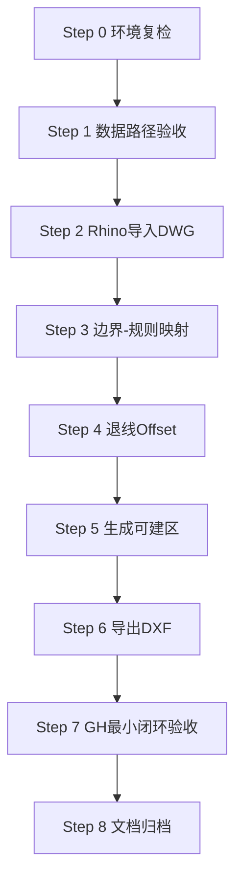
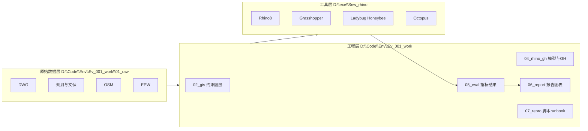
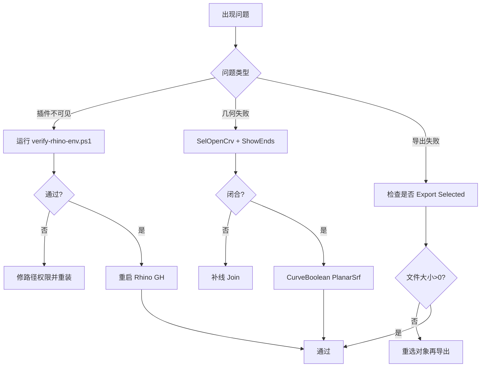

# Env_000_pre｜环境与数据准备 + 退线总控手册（教师与指挥官）

> 任务主题：环境与数据准备以及退线  
> 目标产物：`/home/snw/SnwHist/FirstExample/Env_000_pre.md`  
> 适用读者：新开 Codex / Rhino 新手 / 建筑领域小白

---

## 0. 战报结论（先看这页）

### 0.1 当前战况

你已经完成了最难的底座：

- `D:\Code\Env\Ev_001_work` 分层目录已建好
- 核心资料已归档（`planning_doc`、`dwg`、`heritage`、`photos`）
- OSM 数据已下载并通过 md5 校验
- EPW 已下载并解压到 `01_raw\climate_epw`
- 清单与复现文档已形成（summary/tree/manifests/runbook）
- Rhino8 + Ladybug/Honeybee + Octopus 已安装、验收、日志落盘

### 0.2 指挥官判断

现在不是“装环境阶段”，而是“**约束建模 + 退线落图 + 可建区导出**”阶段。  
本轮最短交付链路：

1. 环境复检
2. Rhino 导入 DWG
3. 退线 Offset
4. 生成 `buildable_area_A`
5. 导出 `buildable_area_A.dxf`
6. GH 做最小验证

---

## 1. 一页执行路线



---

## 2. 总架构图（项目资产 + 工具链）



---

## 3. 上下文、路径与目录（绝对 + 相对）

## 3.1 路径映射

> 相对路径统一从 `D:\Code\Env` 开始。

| 资产 | 绝对路径 | Env 相对路径 |
|---|---|---|
| 项目根 | `D:\Code\Env\Ev_001_work` | `Ev_001_work` |
| 规划 doc | `D:\Code\Env\Ev_001_work\01_raw\planning_doc\site_conditions_02015.doc` | `Ev_001_work\01_raw\planning_doc\site_conditions_02015.doc` |
| 地块 DWG | `D:\Code\Env\Ev_001_work\01_raw\dwg\site_20180709.dwg` | `Ev_001_work\01_raw\dwg\site_20180709.dwg` |
| OSM | `D:\Code\Env\Ev_001_work\01_raw\district_osm\shandong-latest.osm.pbf` | `Ev_001_work\01_raw\district_osm\shandong-latest.osm.pbf` |
| OSM md5 | `D:\Code\Env\Ev_001_work\01_raw\district_osm\shandong-latest.osm.pbf.md5` | `Ev_001_work\01_raw\district_osm\shandong-latest.osm.pbf.md5` |
| OSM 校验结果 | `D:\Code\Env\Ev_001_work\01_raw\district_osm\checksum_verified.txt` | `Ev_001_work\01_raw\district_osm\checksum_verified.txt` |
| 烟台 EPW | `D:\Code\Env\Ev_001_work\01_raw\climate_epw\Yantai_547630_TMYx\CHN_SD_Yantai.547630_TMYx.epw` | `Ev_001_work\01_raw\climate_epw\Yantai_547630_TMYx\CHN_SD_Yantai.547630_TMYx.epw` |
| 青岛 EPW | `D:\Code\Env\Ev_001_work\01_raw\climate_epw\Qingdao_548570_TMYx\CHN_SD_Qingdao.Intl.AP.548570_TMYx.epw` | `Ev_001_work\01_raw\climate_epw\Qingdao_548570_TMYx\CHN_SD_Qingdao.Intl.AP.548570_TMYx.epw` |
| runbook | `D:\Code\Env\Ev_001_work\07_repro\runbooks\next_steps_rhino_gh.md` | `Ev_001_work\07_repro\runbooks\next_steps_rhino_gh.md` |
| Rhino 插件根（外部） | `D:\exe\Snw_rhino` | `..\..\exe\Snw_rhino` |
| Rhino 环境验收日志（外部） | `D:\exe\Snw_rhino\logs\Rhino8_Install_Status_20260303.md` | `..\..\exe\Snw_rhino\logs\Rhino8_Install_Status_20260303.md` |
| Rhino 环境复检日志（外部） | `D:\exe\Snw_rhino\logs\verify-rhino-env_20260303.txt` | `..\..\exe\Snw_rhino\logs\verify-rhino-env_20260303.txt` |
| Octopus 安装日志（外部） | `D:\exe\Snw_rhino\logs\install-octopus_20260303.txt` | `..\..\exe\Snw_rhino\logs\install-octopus_20260303.txt` |
| 环境复检脚本（外部） | `D:\exe\Snw_rhino\scripts\verify-rhino-env.ps1` | `..\..\exe\Snw_rhino\scripts\verify-rhino-env.ps1` |
| Octopus 补装脚本（外部） | `D:\exe\Snw_rhino\scripts\install-octopus-from-package.ps1` | `..\..\exe\Snw_rhino\scripts\install-octopus-from-package.ps1` |

## 3.2 目录骨架（交付时建议保留）

```text
D:\Code\Env\Ev_001_work
├─00_admin
│  ├─docs
│  └─manifests
├─01_raw
│  ├─planning_doc
│  ├─dwg
│  ├─heritage
│  ├─photos
│  ├─district_osm
│  └─climate_epw
├─02_gis
│  ├─boundary
│  └─constraint_layers
├─04_rhino_gh
├─05_eval
├─06_report
└─07_repro
   ├─data_download
   └─runbooks
```

---

## 4. 全流程实操（每步都可执行）

## Step 0｜环境复检（PowerShell / CMD / WSL）

### PowerShell（主入口）

```powershell
$root='D:\Code\Env\Ev_001_work'
$must=@(
  "$root\01_raw\dwg\site_20180709.dwg",
  "$root\01_raw\planning_doc\site_conditions_02015.doc",
  "$root\01_raw\district_osm\shandong-latest.osm.pbf",
  "$root\01_raw\district_osm\checksum_verified.txt",
  "$root\01_raw\climate_epw\Yantai_547630_TMYx\CHN_SD_Yantai.547630_TMYx.epw",
  "$root\07_repro\runbooks\next_steps_rhino_gh.md"
)
$must | % { '{0} => {1}' -f $_,(Test-Path $_) }

& 'D:\exe\Snw_rhino\scripts\verify-rhino-env.ps1'

Get-ChildItem "$env:APPDATA\Grasshopper\Libraries" -File |
  ? { $_.Name -match 'Octopus|encog-octopus|sharpNeatLib-octopus|HelixToolkit.Wpf' } |
  Select Name,Length,LastWriteTime

Get-Item 'D:\exe\Snw_rhino\logs\Rhino8_Install_Status_20260303.md'
Get-Item 'D:\exe\Snw_rhino\logs\verify-rhino-env_20260303.txt'
Get-Item 'D:\exe\Snw_rhino\logs\install-octopus_20260303.txt'
```

### CMD（快速）

```cmd
dir D:\Code\Env\Ev_001_work\01_raw\dwg\site_20180709.dwg
dir D:\Code\Env\Ev_001_work\01_raw\district_osm\shandong-latest.osm.pbf
dir "%APPDATA%\Grasshopper\Libraries\Octopus.gha"
```

### WSL（查看用）

```bash
ls -lah /mnt/d/Code/Env/Ev_001_work/01_raw/dwg/site_20180709.dwg
ls -lah /mnt/d/Code/Env/Ev_001_work/01_raw/climate_epw/Yantai_547630_TMYx
ls -lah /mnt/c/Users/Administrator/AppData/Roaming/Grasshopper/Libraries | rg "Octopus|encog|sharpNeat|Helix"
```

**验收标准**：关键文件均存在，插件脚本输出正常，Octopus 文件可见。

> 若后续插件丢失，可直接补装：

```powershell
Set-ExecutionPolicy -Scope Process Bypass -Force
& 'D:\exe\Snw_rhino\scripts\install-octopus-from-package.ps1' -SourcePath 'D:\exe\Snw_rhino\downloads\plugins\octopus\octopus04.zip'
```

---

## Step 1｜数据来源、下载与校验

## 1.1 网站来源（写入报告）

- OSM（Geofabrik）：`https://download.geofabrik.de/asia/china/shandong-latest.osm.pbf`
- EPW（OneBuilding）：`https://climate.onebuilding.org/WMO_Region_2_Asia/CHN_China/SD_Shandong/`

## 1.2 复跑下载脚本

```powershell
cd D:\Code\Env\Ev_001_work\07_repro\data_download
powershell -ExecutionPolicy Bypass -File .\download_osm_geofabrik.ps1
powershell -ExecutionPolicy Bypass -File .\download_epw_onebuilding.ps1
```

## 1.3 OSM md5 校验

```powershell
cd D:\Code\Env\Ev_001_work\01_raw\district_osm
Get-FileHash .\shandong-latest.osm.pbf -Algorithm MD5
Get-Content .\shandong-latest.osm.pbf.md5
Get-Content .\checksum_verified.txt
```

**为什么这样做**：这是复现可信性的底线，后续模型与图表才可追责。

---

## Step 2｜Rhino 导入与基础设置（键鼠操作）

1. 启动 `Rhino 8`
2. 新建米制文件，或命令 `Units` 设为 `Meters`
3. 点击 `File -> Import`
4. 选择 `D:\Code\Env\Ev_001_work\01_raw\dwg\site_20180709.dwg`
5. 单位弹窗：选择“文件单位/米”，缩放 `1.0`
6. 立即另存：`D:\Code\Env\Ev_001_work\04_rhino_gh\rhino_models\A01_import.3dm`

---

## Step 3｜退线前准备：图层 + 边界清理

## 3.1 创建图层（固定命名）

- `site_boundary_raw`
- `setback_20_huanshan`
- `setback_25_huanshan_highrise`（可选）
- `setback_15_west_south`
- `setback_6p5_east`
- `buildable_area`
- `export_temp`

## 3.2 清理边界命令

```text
SelDup      # 去重
Join        # 合并
SelOpenCrv  # 查开口曲线
ShowEnds    # 显示开口端
```

### 若出现“18 条组合成 1 条开放曲线”

1. `ShowEnds`
2. 放大端点，用 `Line` 补缝
3. `Extend` 或 `Trim` 修齐
4. 再 `Join`
5. 再 `SelOpenCrv`，直到返回 0

---

## Step 4｜退线（最关键，逐步点击）

## 4.1 规则确认（A 地块低容积率首轮）

- 外侧是环山路：`20m`（高层另建 25m 对比版）
- 外侧是西侧规划路：`15m`
- 外侧是南侧边界：`15m`
- 外侧是东侧边界：`6.5m`

> 核心原则：永远从**地块外轮廓**向内退，不从内部闭合矩形退。

## 4.2 Offset 操作模板

### A. 环山路边界（20m）

1. 选中“外侧是环山路”的边界段
2. 命令 `Offset`
3. 参数：`Distance=20`, `BothSides=No`
4. 鼠标点地块内部（向内）
5. 曲线放入 `setback_20_huanshan`

### B. 西 + 南（15m）

1. 选中对应段
2. `Offset`，`Distance=15`
3. 向内点
4. 放入 `setback_15_west_south`

### C. 东（6.5m）

1. 选中东侧段
2. `Offset`，`Distance=6.5`
3. 向内点
4. 放入 `setback_6p5_east`

### D. 高层对比版（可选）

- 对环山路段再做一版 `Distance=25`，存入 `setback_25_huanshan_highrise`

## 4.3 合成可建区

1. `CurveBoolean` 框选退线曲线并点目标内部区域
2. 形成闭合边界后执行 `PlanarSrf`
3. 面移入 `buildable_area`（UI：选中面 -> `Properties` 面板 -> `Layer` 下拉 -> 选 `buildable_area`）
4. `Area` 记录面积（可对照你已算出的 `26724.5175 m²`）

---

## Step 5｜导出可建区（DXF）

1. 选中 `buildable_area` 面 + 边界
2. 点击 `File -> Export Selected`
3. 导出到：`D:\Code\Env\Ev_001_work\02_gis\boundary\buildable_area_A.dxf`

验证命令：

```powershell
Get-Item 'D:\Code\Env\Ev_001_work\02_gis\boundary\buildable_area_A.dxf' |
  Select FullName,Length,LastWriteTime
```

---

## Step 6｜GH 最小闭环验收

1. Rhino 输入 `Grasshopper`
2. 检查标签：`LB`、`HB`、`HB-R`、`DF`、`HB-E`、`Octopus`
3. Ladybug 快测：
   - `LB Import EPW` 指向烟台 EPW
   - 接 `LB SunPath`，确认出图
4. Octopus 快测：
   - 放 `Octopus` 组件
   - 接两个简单目标测试可运行

---

## 5. 验收标准、回滚方案、排错

## 5.1 验收标准（DoD）

| 环节 | 通过标准 |
|---|---|
| 环境 | `verify-rhino-env.ps1` 输出正常，插件可见 |
| 数据 | OSM/EPW/DWG 存在，校验通过 |
| 退线 | 20/15/6.5 三类曲线完整且分层清晰 |
| 几何 | 可建区可成面，`SelOpenCrv=0` |
| 导出 | `buildable_area_A.dxf` 存在且大小 > 0 |
| 复现 | 新开 Codex 按文档可重跑 |

## 5.2 回滚方案

### 几何回滚

每步保存版本：

- `A01_import.3dm`
- `A02_clean.3dm`
- `A03_setback.3dm`
- `A04_export.3dm`

### Octopus 回滚

```powershell
$lib="$env:APPDATA\Grasshopper\Libraries"
$bak="D:\exe\Snw_rhino\logs\rollback_backup_$(Get-Date -Format yyyyMMdd_HHmmss)"
New-Item -ItemType Directory -Force -Path $bak | Out-Null
$targets='Octopus.gha','encog-octopus.dll','sharpNeatLib-octopus.dll','HelixToolkit.Wpf.dll'
foreach($t in $targets){
  $p=Join-Path $lib $t
  if(Test-Path $p){ Copy-Item $p $bak -Force; Remove-Item $p -Force }
}
```

### 数据回滚

- 按 `Ev_001_work\00_admin\manifests\raw_sha256.csv` 对比原始哈希
- 按 `Ev_001_work\00_admin\docs\tree_snapshot.txt` 对比目录

## 5.3 排错表（现象-根因-处理-验证）

| 现象 | 根因 | 处理 | 验证 |
|---|---|---|---|
| GH 看不到 LB/HB | 用户对象未部署或被阻止 | 跑 `verify-rhino-env.ps1`，重启 Rhino | 标签恢复 |
| GH 看不到 Octopus | `.gha/.dll` 缺失 | 检查 `Grasshopper\Libraries`，必要时重装 | `Octopus.gha` 可见 |
| Food4Rhino 下不了 | AWS WAF 验证 | 手动过验证码后下载 | 压缩包落盘 |
| Import 比例异常 | 单位错 | `Units` 设米，重新 Import | 尺寸正常 |
| Join 后还是 open | 边界断点 | `ShowEnds` + 补线 + `Join` | `SelOpenCrv=0` |
| Offset 往外 | 点击方向错误 | 撤销后朝地块内部点 | 曲线在内侧 |
| `PlanarSrf` 失败 | 曲线不闭合/自交 | `CurveBoolean` 重建闭环 | 成面成功 |
| dxf 空文件 | 未 `Export Selected` 或漏选 | 重选面+边界再导出 | 文件大小>0 |

---

## 6. 故障分流图（遇错按图走）



---

## 7. 为什么这样做（概念/原理）

1. **先约束后优化**：退线是硬约束，不先处理会让优化器大量搜索不可行解。  
2. **先可建区后性能分析**：先得到合法几何，再谈日照/通风/能源，评估结果才可信。  
3. **先低容积率主线**：匹配当前客户优先级，先做能交付、能汇报、能复现的版本。  
4. **脚本 + 清单 + 日志**：保证“同一流程可在新机器重放”，这是论文复现与项目交付共用的工程基础。

---

## 8. 今日收口清单（完成即过关）

- [ ] `buildable_area_A.dxf` 成功导出
- [ ] 面积结果已记录（含截图）
- [ ] GH 中 LB/HB/Octopus 标签可见
- [ ] 命令、路径、日志可被新开 Codex 重放

> 完成以上 4 项，你就正式从“准备期”进入“可评估设计期”。
