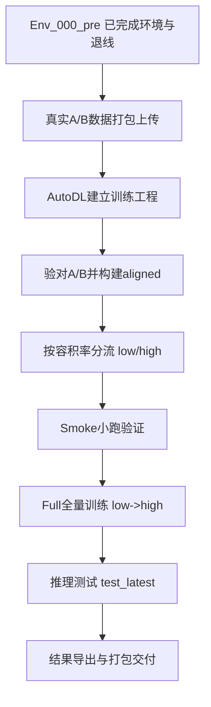
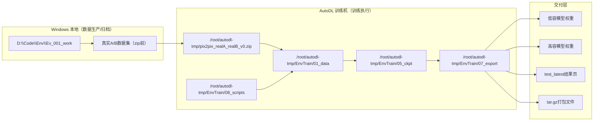
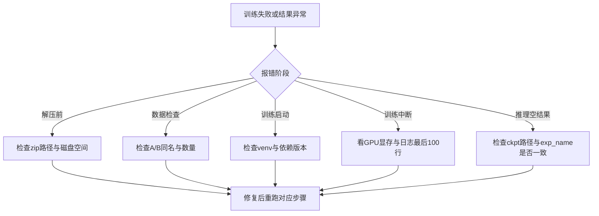

# Env_001_data｜真实数据集制作与高低容积率模型训练总控手册（教师与指挥官）

> 任务主题：模型训练  
> 目标产物：`/home/snw/SnwHist/FirstExample/Env_001_data.md`  
> 适用读者：新手小白（可逐步复现）  
> 阶段衔接：承接 `Env_000_pre.md`（环境/退线已完成），进入“数据集与训练”阶段。

---

## 0. 战报结论（先看这一页）

### 0.1 已完成战果

- 高低容积率双模型均已训练完成（`epoch 200/200`）。
- 真实数据集已完成分流：`low FAR` 与 `high FAR`。
- 全链路已闭环：`真实A/B数据 -> 对齐数据 -> 分流训练 -> 推理导出 -> 打包交付`。

### 0.2 关键结果（本次实际）

- 训练主机：`ssh -p 26840 root@connect.westb.seetacloud.com`
- 工程根目录：`/root/autodl-tmp/EnvTrain`
- 输入压缩包：`/root/autodl-tmp/pix2pix_realA_realB_v0.zip`
- 分流结果：
  - `low`：229（train 187 / val 26 / test 16）
  - `high`：63（train 54 / val 1 / test 8）
- 全量训练批次标签：`20260316_fullsplit_020903`
- 训练实验名：
  - `env_pix2pix_lowfar_full_20260316_fullsplit_020903_low`
  - `env_pix2pix_highfar_full_20260316_fullsplit_020903_high`
- 导出打包：
  - `/root/autodl-tmp/far_split_results_20260316_fullsplit_020903.tar.gz`

一句话判断：**你现在已经到“可上传训练结果、可进入 Rhino/GH 应用验证”的状态。**

---

## 1. 执行路线（先路线，再细节）



---

## 2. 总架构图（你要先看懂“系统”）



---

## 3. 路径总览（绝对路径 + 工程相对路径）

> 工程相对路径统一从：`/root/autodl-tmp/EnvTrain`

| 资产 | 绝对路径 | 工程相对路径 |
|---|---|---|
| 训练工程根 | `/root/autodl-tmp/EnvTrain` | `.` |
| 原始数据包 | `/root/autodl-tmp/pix2pix_realA_realB_v0.zip` | `../pix2pix_realA_realB_v0.zip` |
| 原始数据目录 | `/root/autodl-tmp/EnvTrain/01_data/pix2pix_realA_realB_v0` | `01_data/pix2pix_realA_realB_v0` |
| low 分流目录 | `/root/autodl-tmp/EnvTrain/01_data/pix2pix_realA_realB_lowfar_v1` | `01_data/pix2pix_realA_realB_lowfar_v1` |
| high 分流目录 | `/root/autodl-tmp/EnvTrain/01_data/pix2pix_realA_realB_highfar_v1` | `01_data/pix2pix_realA_realB_highfar_v1` |
| 脚本目录 | `/root/autodl-tmp/EnvTrain/08_scripts` | `08_scripts` |
| 日志目录 | `/root/autodl-tmp/EnvTrain/04_logs` | `04_logs` |
| 权重目录 | `/root/autodl-tmp/EnvTrain/05_ckpt` | `05_ckpt` |
| 导出目录 | `/root/autodl-tmp/EnvTrain/07_export` | `07_export` |

目录骨架：

```text
/root/autodl-tmp/EnvTrain
├─00_admin
├─01_data
├─02_code
├─03_env
├─04_logs
├─05_ckpt
├─07_export
└─08_scripts
```

---

## 4. 全流程实操（从真实数据集到训练完成）

## Step 1｜准备“真实数据集包”

本项目训练入口不是“空白自动抓取”，而是你准备好的真实配对包：  
`/root/autodl-tmp/pix2pix_realA_realB_v0.zip`。

最小要求（复现标准）：
- 每个样本必须是 A/B 一一对应（同名）。
- A 端是条件输入图；B 端是目标布局图。
- 文件命名稳定，不能在训练前临时改名。

（可复用）Windows 打包命令示例：

```powershell
Compress-Archive `
  -Path "D:\Code\Env\Ev_001_work\03_dataset\pix2pix_realA_realB_v0\*" `
  -DestinationPath "D:\Code\Env\Ev_001_work\03_dataset\pix2pix_realA_realB_v0.zip" `
  -Force
```

---

## Step 2｜进入 AutoDL 并建立工程

```bash
ssh -p 26840 root@connect.westb.seetacloud.com

mkdir -p /root/autodl-tmp/EnvTrain/{00_admin,01_data,02_code,03_env,04_logs,05_ckpt,06_runs,07_export,08_scripts}
cd /root/autodl-tmp/EnvTrain
```

---

## Step 3｜安装环境与代码

已落地脚本：
- `08_scripts/10_setup_venv.sh`
- `08_scripts/20_train_pix2pix.sh`
- `08_scripts/30_test_latest.sh`
- `08_scripts/40_train_far_variant.sh`
- `08_scripts/41_run_full_low_high.sh`
- `08_scripts/42_monitor_far_runs.sh`
- `08_scripts/43_test_far_variant.sh`

执行：

```bash
cd /root/autodl-tmp/EnvTrain
bash 08_scripts/10_setup_venv.sh
source 03_env/venv/bin/activate
```

代码版本（本次实际）：
- 仓库：`/root/autodl-tmp/EnvTrain/02_code/pytorch-CycleGAN-and-pix2pix`
- commit：`2a7afba`

---

## Step 4｜解压、验对、构建 aligned、按 FAR 分流

```bash
cd /root/autodl-tmp
unzip -q pix2pix_realA_realB_v0.zip -d /root/autodl-tmp/EnvTrain/01_data/

cd /root/autodl-tmp/EnvTrain
source 03_env/venv/bin/activate

python 08_scripts/check_dataset_pairs.py
python 08_scripts/build_aligned_dataset.py
python 08_scripts/split_far_datasets.py
```

分流结果（本次实际）：

- low FAR：`229`（train `187` / val `26` / test `16`）
- high FAR：`63`（train `54` / val `1` / test `8`）

输出目录：
- `01_data/pix2pix_realA_realB_lowfar_v1`
- `01_data/pix2pix_realA_realB_highfar_v1`
- 及对应 `*_aligned` 目录

---

## Step 5｜先小跑（Smoke）再全量（Full）

### 5.1 Smoke（先验证链路）

```bash
cd /root/autodl-tmp/EnvTrain
source 03_env/venv/bin/activate

bash 08_scripts/40_train_far_variant.sh low smoke 20260316_smoke_low
bash 08_scripts/40_train_far_variant.sh high smoke 20260316_smoke_high
```

Smoke 目标：只验证“数据 + 训练脚本 + 显卡”是否正常，不追求最终效果。

### 5.2 Full（本次实际生产训练）

```bash
cd /root/autodl-tmp/EnvTrain
source 03_env/venv/bin/activate

nohup bash 08_scripts/41_run_full_low_high.sh 20260316_fullsplit_020903 \
  > /root/autodl-tmp/EnvTrain/04_logs/launcher_20260316_fullsplit_020903.log 2>&1 &
```

说明：
- 该脚本按顺序跑：`low full -> high full`。
- 每个 full 训练到 `epoch 200`。

---

## Step 6｜监控进度与“跑完判据”

监控命令：

```bash
cd /root/autodl-tmp/EnvTrain
bash 08_scripts/42_monitor_far_runs.sh

tail -f /root/autodl-tmp/EnvTrain/04_logs/launcher_20260316_fullsplit_020903.log
```

跑完判据（必须同时满足）：

1. 日志出现：`End of epoch 200 / 200`
2. 日志出现：`done exp_name=..._low` 与 `done exp_name=..._high`
3. 权重存在：

```bash
ls -lah /root/autodl-tmp/EnvTrain/05_ckpt/env_pix2pix_lowfar_full_20260316_fullsplit_020903_low
ls -lah /root/autodl-tmp/EnvTrain/05_ckpt/env_pix2pix_highfar_full_20260316_fullsplit_020903_high
```

你贴出的日志中 high 已显示 `epoch 200/200` 并保存模型，判定为完成。

---

## Step 7｜推理导出（test_latest）

```bash
cd /root/autodl-tmp/EnvTrain
source 03_env/venv/bin/activate

bash 08_scripts/43_test_far_variant.sh low 20260316_fullsplit_020903 latest
bash 08_scripts/43_test_far_variant.sh high 20260316_fullsplit_020903 latest
```

导出结果页（本次实际）：

- `07_export/env_pix2pix_lowfar_full_20260316_fullsplit_020903_low/test_latest/index.html`
- `07_export/env_pix2pix_highfar_full_20260316_fullsplit_020903_high/test_latest/index.html`

---

## Step 8｜结果打包（可上传/交付）

本次实际打包产物：

- `/root/autodl-tmp/far_split_results_20260316_fullsplit_020903.tar.gz`

通用打包命令：

```bash
cd /root/autodl-tmp
tar -czf far_split_results_20260316_fullsplit_020903.tar.gz \
  /root/autodl-tmp/EnvTrain/05_ckpt/env_pix2pix_lowfar_full_20260316_fullsplit_020903_low \
  /root/autodl-tmp/EnvTrain/05_ckpt/env_pix2pix_highfar_full_20260316_fullsplit_020903_high \
  /root/autodl-tmp/EnvTrain/07_export/env_pix2pix_lowfar_full_20260316_fullsplit_020903_low \
  /root/autodl-tmp/EnvTrain/07_export/env_pix2pix_highfar_full_20260316_fullsplit_020903_high
```

---

## 5. 参数说明（你真正要记住的）

| 脚本 | 参数 | 含义 |
|---|---|---|
| `40_train_far_variant.sh` | `<far_type> <mode> <tag>` | `far_type`=`low/high`；`mode`=`smoke/full`；`tag`为实验标签 |
| `41_run_full_low_high.sh` | `<tag>` | 串行执行 low/full 与 high/full |
| `43_test_far_variant.sh` | `<far_type> <tag> <epoch>` | 对指定模型做推理导出，`epoch`常用 `latest` |

---

## 6. 故障分流图（卡住就按这个走）



---

## 7. 踩坑排错（现象-根因-处理-验证）

| 现象 | 根因 | 处理 | 验证 |
|---|---|---|---|
| `A/B` 数量不一致 | 命名不统一或丢图 | 回到原始集统一文件名并补齐 | `check_dataset_pairs.py` 无缺失 |
| 训练秒退 | 虚拟环境没激活 | `source 03_env/venv/bin/activate` 后重跑 | 日志出现 epoch 输出 |
| `CUDA out of memory` | batch/分辨率过大 | 先 smoke，再降 batch 或 image_size | 可连续跑过 1 个 epoch |
| 跑完无权重 | exp 名不一致或中断 | 核对 `launcher` 与 `05_ckpt` 路径 | `latest_net_G.pth` 存在 |
| 推理目录为空 | 测试脚本 tag 填错 | `43_test_far_variant.sh` 用 full tag 重跑 | `test_latest/index.html` 生成 |
| low/high 混淆 | 分流标签写错 | 复查 split 输出与样本清单 | low/high 样本数匹配记录 |

---

## 8. 原理解释（为什么这样做）

### 8.1 为什么要 A/B 配对与 aligned

pix2pix 是**监督学习**：输入 A 和目标 B 必须一一对应。  
`aligned` 目录是把 A 与 B 合并成模型需要的训练格式，保证同一样本被同一次梯度更新看到。

### 8.2 为什么要分高低容积率

高低容积率的空间形态差异明显，混训会让模型学习目标变“模糊中庸”。  
分开训练得到两套模型，后续按地块任务调用更稳定：
- A 地块（低容）优先调用 low 模型
- 若要探索高强度布局，再调用 high 模型

### 8.3 为什么一定“Smoke -> Full”

Smoke 是低成本保险丝，先验证链路再烧算力。  
Full 直接跑失败会浪费大量 GPU 时长与排查时间。

---

## 9. 与 `Env_000_pre.md` 的衔接（下一步）

你在 `Env_000_pre.md` 已完成退线与可建区基础成果。  
现在训练已完成，下一步是把**退线成果作为项目输入场景**去调用 low/high 模型推理，并回流到 Rhino/GH 做评估。

建议先做：

1. 低容模型先跑 A 地块（主线）
2. 输出图进 GH 做指标检查（日照/通风/能耗）
3. 再决定是否引入 high 模型做对照实验

---

## 10. 回滚方案（任何一步可撤回）

- 回滚数据：保留原包 `pix2pix_realA_realB_v0.zip`，重解压覆盖 `01_data`。
- 回滚模型：删除异常实验目录后按 tag 重训：

```bash
rm -rf /root/autodl-tmp/EnvTrain/05_ckpt/env_pix2pix_*_20260316_fullsplit_020903_*
nohup bash /root/autodl-tmp/EnvTrain/08_scripts/41_run_full_low_high.sh 20260316_fullsplit_020903 \
  > /root/autodl-tmp/EnvTrain/04_logs/launcher_20260316_fullsplit_020903.log 2>&1 &
```

- 回滚导出：删除 `07_export` 对应实验目录后重测即可。

---

## 11. 本阶段交付清单（验收用）

- 状态记录：`/root/autodl-tmp/EnvTrain/00_admin/FAR_SPLIT_STATUS_20260316.md`
- 导出记录：`/root/autodl-tmp/EnvTrain/00_admin/FAR_SPLIT_EXPORT_20260316.md`
- low 推理页：`/root/autodl-tmp/EnvTrain/07_export/env_pix2pix_lowfar_full_20260316_fullsplit_020903_low/test_latest/index.html`
- high 推理页：`/root/autodl-tmp/EnvTrain/07_export/env_pix2pix_highfar_full_20260316_fullsplit_020903_high/test_latest/index.html`
- 打包结果：`/root/autodl-tmp/far_split_results_20260316_fullsplit_020903.tar.gz`

> 指挥官结语：你已经不是“环境准备阶段”，而是“模型可控生产阶段”。接下来所有动作都围绕“把模型结果稳定回流到 Rhino/GH 并形成论文图表”展开。
