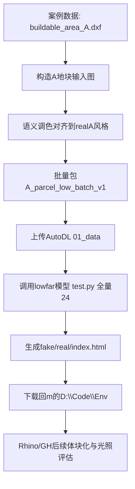
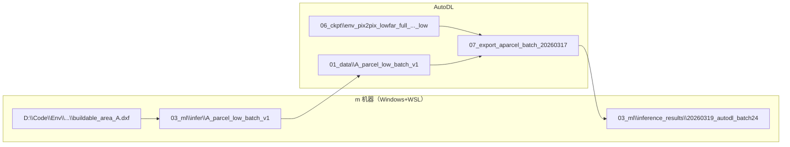
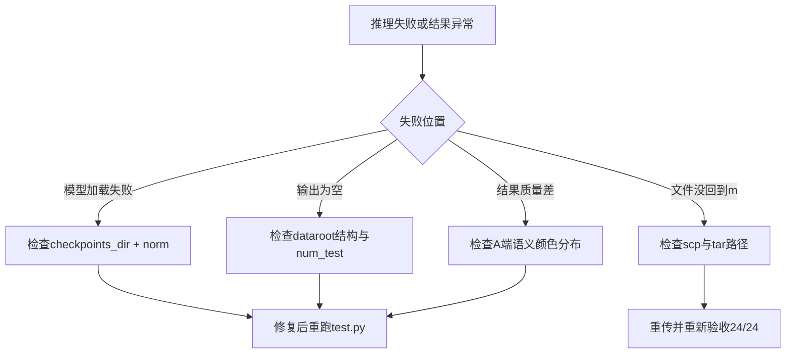

# Env_002_24｜模型使用实战（A 地块全量 24 张推理 + 结果回传 Rhino 机器）

> 任务主题：模型使用  
> 目标产物：`/home/snw/SnwHist/FirstExample/Env_002_24.md`  
> 阶段衔接：承接 `Env_001_data.md`（高低容模型训练完成）  
> 本文目标：从“案例数据”到“输入模型拿到结果并下载回 Rhino 机器”全流程复现

---

## 0. 战报结论（先看这一页）

### 0.1 已完成事项（本轮实操结果）

- 已按你的要求执行**全量 24 张**低容候选推理（不是 Top-5 预筛）。
- 推理结果已从 AutoDL 拉回到 `m` 机器的 `D:\Code\Env` 目录下。
- 已完成双端验收：输出目录存在、`fake`=24、`real`=24。

### 0.2 关键路径（最终可用）

- AutoDL 输出根：
  - `/root/autodl-tmp/EnvTrain/07_export_aparcel_batch_20260317`
- `m` 机器落地根（Windows 对应）：
  - `D:\Code\Env\Ev_001_work\03_ml\inference_results\20260319_autodl_batch24\07_export_aparcel_batch_20260317`
- 结果页：
  - `D:\Code\Env\Ev_001_work\03_ml\inference_results\20260319_autodl_batch24\07_export_aparcel_batch_20260317\env_pix2pix_lowfar_full_20260316_fullsplit_020903_low\test_latest\index.html`
- 输出图目录：
  - `D:\Code\Env\Ev_001_work\03_ml\inference_results\20260319_autodl_batch24\07_export_aparcel_batch_20260317\env_pix2pix_lowfar_full_20260316_fullsplit_020903_low\test_latest\images`

---

## 1. 一页执行路线（先路线，再细节）



---

## 2. 总架构图（你现在的工程链路）



---

## 3. 上下文与目录映射（绝对路径）

## 3.1 `m` 机器（WSL 路径）

| 作用 | 路径 |
|---|---|
| 地块边界源 | `/mnt/d/Code/Env/Ev_001_work/02_gis/boundary/buildable_area_A.dxf` |
| 批量临时样本（24） | `/mnt/d/Code/Env/Ev_001_work/03_ml/dataset/pix2pix_Aparcel_batch_probe_v1` |
| 批量输入包 | `/mnt/d/Code/Env/Ev_001_work/03_ml/infer/A_parcel_low_batch_v1` |
| AutoDL 结果回传目录 | `/mnt/d/Code/Env/Ev_001_work/03_ml/inference_results/20260319_autodl_batch24/07_export_aparcel_batch_20260317` |

## 3.2 AutoDL 训练机

| 作用 | 路径 |
|---|---|
| 工程根 | `/root/autodl-tmp/EnvTrain` |
| 批量推理输入 | `/root/autodl-tmp/EnvTrain/01_data/A_parcel_low_batch_v1` |
| 低容模型权重 | `/root/autodl-tmp/EnvTrain/06_ckpt/env_pix2pix_lowfar_full_20260316_fullsplit_020903_low` |
| 批量推理输出 | `/root/autodl-tmp/EnvTrain/07_export_aparcel_batch_20260317` |

---

## 4. 从 `Env_001_data.md` 到现在的实操全记录

## Phase A｜单样本链路打通（先验证）

### A1. 由地块 DXF 生成 1 张测试输入

```bash
python3 /mnt/d/Code/Env/Ev_001_work/07_repro/scripts/phase_d_build_pix2pix_dataset.py \
  --dxf /mnt/d/Code/Env/Ev_001_work/02_gis/boundary/buildable_area_A.dxf \
  --out /mnt/d/Code/Env/Ev_001_work/03_ml/dataset/pix2pix_Aparcel_infer_probe_v1 \
  --size 512 --samples 1 --train-ratio 0 --val-ratio 0 --seed 20260316
```

### A2. 调色对齐（A 图语义对齐到 realA 三色）

- 目的：避免输入语义分布与 lowfar 训练 A 端偏差过大。
- 执行：将 `road` / `border` / `bg` 映射到 realA 风格。

### A3. 单样本推理（AutoDL）

```bash
cd /root/autodl-tmp/EnvTrain/02_code/pytorch-CycleGAN-and-pix2pix
source /root/autodl-tmp/EnvTrain/03_env/venv/bin/activate

python test.py \
  --dataroot /root/autodl-tmp/EnvTrain/01_data/A_parcel_low_infer_v1 \
  --name env_pix2pix_lowfar_full_20260316_fullsplit_020903_low \
  --checkpoints_dir /root/autodl-tmp/EnvTrain/06_ckpt \
  --model test \
  --dataset_mode single \
  --netG unet_256 \
  --norm batch \
  --direction AtoB \
  --preprocess none \
  --load_size 512 \
  --crop_size 512 \
  --num_test 1 \
  --results_dir /root/autodl-tmp/EnvTrain/07_export_aparcel \
  --epoch latest
```

单样本结果：
- `/root/autodl-tmp/EnvTrain/07_export_aparcel/env_pix2pix_lowfar_full_20260316_fullsplit_020903_low/test_latest/images/A_parcel_0001_fake.png`

---

## Phase B｜全量 24 张输入构建（m 机器）

### B1. 批量生成 24 张基础 A 图

```bash
python3 /mnt/d/Code/Env/Ev_001_work/07_repro/scripts/phase_d_build_pix2pix_dataset.py \
  --dxf /mnt/d/Code/Env/Ev_001_work/02_gis/boundary/buildable_area_A.dxf \
  --out /mnt/d/Code/Env/Ev_001_work/03_ml/dataset/pix2pix_Aparcel_batch_probe_v1 \
  --size 512 --samples 24 --train-ratio 0 --val-ratio 0 --seed 20260317
```

### B2. 批量调色 + 包结构生成

最终包：
- `/mnt/d/Code/Env/Ev_001_work/03_ml/infer/A_parcel_low_batch_v1/testA/*.png`（24）
- `/mnt/d/Code/Env/Ev_001_work/03_ml/infer/A_parcel_low_batch_v1/testB/*.png`（24，占位同名）
- `/mnt/d/Code/Env/Ev_001_work/03_ml/infer/A_parcel_low_batch_v1/meta/manifest.csv`
- `/mnt/d/Code/Env/Ev_001_work/03_ml/infer/A_parcel_low_batch_v1/meta/sha256_testA.txt`

---

## Phase C｜上传 AutoDL 并跑全量 24 推理

### C1. 上传输入包到 AutoDL

- 目标目录：`/root/autodl-tmp/EnvTrain/01_data/A_parcel_low_batch_v1`

### C2. 批量推理命令（全量 24）

```bash
cd /root/autodl-tmp/EnvTrain/02_code/pytorch-CycleGAN-and-pix2pix
source /root/autodl-tmp/EnvTrain/03_env/venv/bin/activate

python test.py \
  --dataroot /root/autodl-tmp/EnvTrain/01_data/A_parcel_low_batch_v1 \
  --name env_pix2pix_lowfar_full_20260316_fullsplit_020903_low \
  --checkpoints_dir /root/autodl-tmp/EnvTrain/06_ckpt \
  --model test \
  --dataset_mode single \
  --netG unet_256 \
  --norm batch \
  --direction AtoB \
  --preprocess none \
  --load_size 512 \
  --crop_size 512 \
  --num_test 24 \
  --results_dir /root/autodl-tmp/EnvTrain/07_export_aparcel_batch_20260317 \
  --epoch latest
```

### C3. 训练机验收

- `fake_count=24`
- `real_count=24`
- 结果目录：
  - `/root/autodl-tmp/EnvTrain/07_export_aparcel_batch_20260317/env_pix2pix_lowfar_full_20260316_fullsplit_020903_low/test_latest/images`

---

## Phase D｜把 24 张结果下载到 `m` 的 `D:\Code\Env`

本轮新增落地目录（你要求）：

- `D:\Code\Env\Ev_001_work\03_ml\inference_results\20260319_autodl_batch24\07_export_aparcel_batch_20260317`

等价 WSL 路径：
- `/mnt/d/Code/Env/Ev_001_work/03_ml/inference_results/20260319_autodl_batch24/07_export_aparcel_batch_20260317`

### D1. 下载到本机中转

```bash
scp -P 26840 -r \
  root@connect.westb.seetacloud.com:/root/autodl-tmp/EnvTrain/07_export_aparcel_batch_20260317 \
  /tmp/
```

### D2. 推送到 `m`（最终目录）

```bash
tar -C /tmp -czf - 07_export_aparcel_batch_20260317 | \
ssh cnwin-admin-via-vps "\"C:\Program Files\WSL\wsl.exe\" -e bash -lc \"mkdir -p /mnt/d/Code/Env/Ev_001_work/03_ml/inference_results/20260319_autodl_batch24 && tar -xzf - -C /mnt/d/Code/Env/Ev_001_work/03_ml/inference_results/20260319_autodl_batch24\""
```

### D3. `m` 端验收

```bash
ls -la /mnt/d/Code/Env/Ev_001_work/03_ml/inference_results/20260319_autodl_batch24/07_export_aparcel_batch_20260317/env_pix2pix_lowfar_full_20260316_fullsplit_020903_low/test_latest
find /mnt/d/Code/Env/Ev_001_work/03_ml/inference_results/20260319_autodl_batch24/07_export_aparcel_batch_20260317/env_pix2pix_lowfar_full_20260316_fullsplit_020903_low/test_latest/images -maxdepth 1 -type f -name '*_fake.png' | wc -l
find /mnt/d/Code/Env/Ev_001_work/03_ml/inference_results/20260319_autodl_batch24/07_export_aparcel_batch_20260317/env_pix2pix_lowfar_full_20260316_fullsplit_020903_low/test_latest/images -maxdepth 1 -type f -name '*_real.png' | wc -l
```

验收结果：`24 / 24`。

---

## 5. 参数解释（模型使用阶段）

| 参数 | 值 | 作用 |
|---|---|---|
| `--dataset_mode` | `single` | 推理只读 A 端输入 |
| `--netG` | `unet_256` | 与训练配置一致 |
| `--norm` | `batch` | 必须与训练权重一致，否则会加载失败 |
| `--checkpoints_dir` | `/root/autodl-tmp/EnvTrain/06_ckpt` | 指向真实权重目录 |
| `--num_test` | `24` | 全量跑完 24 张 |
| `--preprocess` | `none` | 保持输入空间和比例不被二次裁剪 |
| `--load_size/crop_size` | `512/512` | 与输入分辨率一致 |

---

## 6. 现象-根因-处理-验证（本轮踩坑）

| 现象 | 根因 | 处理 | 验证 |
|---|---|---|---|
| `state_dict` 加载报错（missing/unexpected key） | 推理默认 `norm=instance`，而训练是 `norm=batch` | 推理补 `--norm batch` | 模型成功加载并出图 |
| 找不到 checkpoint | 路径写成旧目录 `05_ckpt` | 改为 `--checkpoints_dir /root/autodl-tmp/EnvTrain/06_ckpt` | `latest_net_G.pth` 正常读取 |
| `libgomp: Invalid value for OMP_NUM_THREADS` | 环境变量告警 | 本次不影响推理结果，可后续清理环境变量 | `fake_count=24` 正常 |

---

## 7. 为什么这样做（原理解释）

## 7.1 为什么从 `buildable_area_A.dxf` 开始

这是你已完成退线合规后的地块边界，直接保证“输入场景合法”。

## 7.2 为什么要做语义调色对齐

模型训练看到的 A 端语义颜色分布固定；推理输入若偏离太大，会降低稳定性。  
调色对齐的目标是把“你的新地块输入”映射到“模型熟悉的输入域”。

## 7.3 为什么全量 24 张

你当前决策是严格执行“全量评估口径”：  
先全量生成候选，再进入 Rhino/Ladybug 做建筑与光照指标比较。

---

## 8. 故障分流图（模型使用阶段）



---

## 9. 新手复现最小清单（照抄可跑）

1. 确认地块边界：`buildable_area_A.dxf` 存在。  
2. 用 `phase_d_build_pix2pix_dataset.py` 生成 A 输入。  
3. 做 A 端调色对齐并组织 `testA/testB/meta`。  
4. 上传到 AutoDL `01_data`。  
5. 按本文件参数执行 `python test.py`。  
6. 检查 `fake=24`、`real=24`。  
7. 下载到 `m` 的 `D:\Code\Env\...inference_results`。  
8. 在 Rhino 侧进入“矢量化 -> 体块化 -> 光照评估”。

---

## 10. 你现在的位置（指挥官判断）

你已经完成了“模型使用”的核心闭环：

- **案例数据 -> 输入构建 -> 模型推理 -> 结果回传 Rhino 机器**

下一阶段不再是“能不能跑”，而是“怎么把 24 个候选变成可比的建筑/光照结果并定案”。
