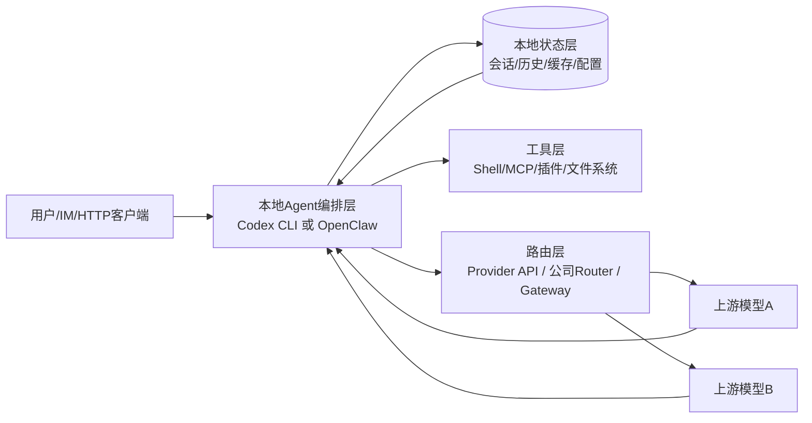
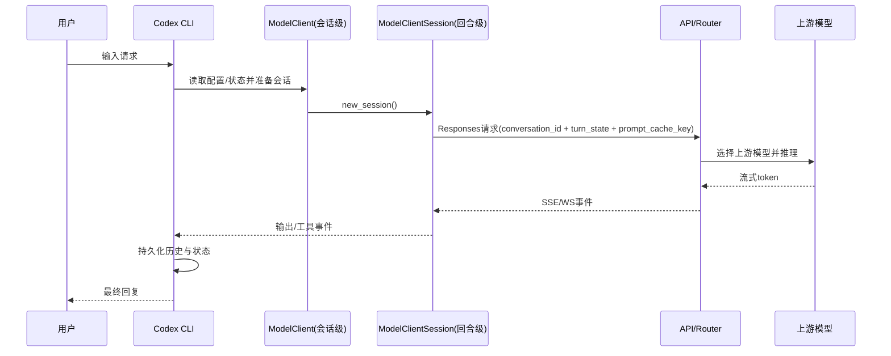
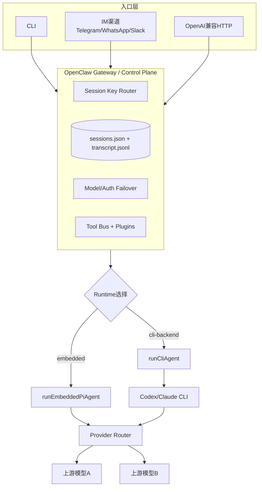
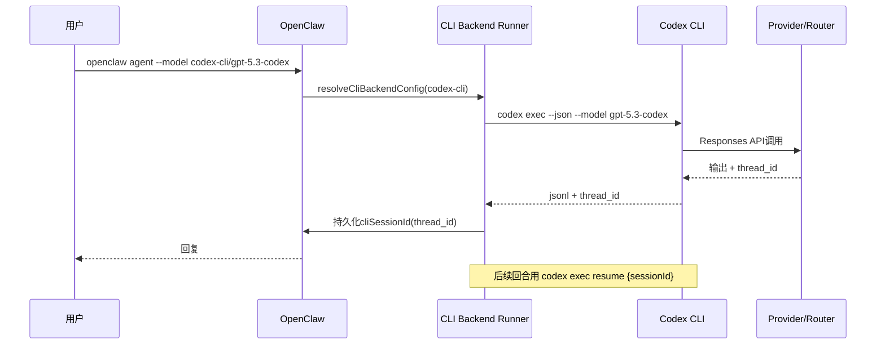
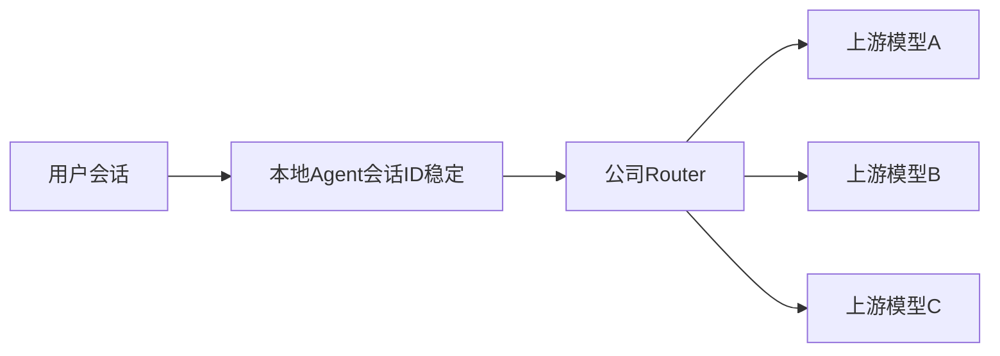

# OpenClaw_001：把 `GPT Codex CLI` 与 `OpenClaw` 拆到骨架

> 版本：2026-03-05  
> 读者画像：已经很熟 `Codex CLI`，但公司要求落地 `OpenClaw` 的工程师  
> 目标：把“本地 agent vs 远端模型”的关系、缓存/会话/路由机制，一次性彻底理清

---

## 0. 先给结论（先抓主干）

你现在的直觉 **70% 是对的**，但还差三刀：

1. **远端模型大多数时候只是“无记忆算力核”**，连续对话感来自本地/网关层对上下文的组织与重放。  
2. **Codex CLI 是强“单会话编排器”**；**OpenClaw 是“多入口控制平面 + 会话路由器 + 运行时编排器”**。  
3. 当 `OpenClaw` 以 `codex-cli/*` 运行时，实际上是 **“OpenClaw 外层会话 + Codex 内层会话”双层栈**，这正是你最容易混乱的点。

---

## 1. 统一心智模型：谁在“记忆”，谁在“推理”

先用一个总图，把你的疑惑压平。



### 1.1 一句公式

`最终提示词 = 当前输入 + 本地会话重建 + 工具结果 + 策略约束`  
`模型输出 = 远端模型(最终提示词)`

所以“我感觉一直在和同一个模型说话”，未必说明上游真是同一个模型；它可能只是被本地编排层“统一人格化”了。

---

## 2. `Codex CLI`：单体编排器的内部结构（源码级）

下面全部是你能在源码里对上的结构点。

### 2.1 启动壳层：`Node wrapper -> Rust binary`

- `@openai/codex/bin/codex.js` 负责按平台选择可执行文件并 `spawn`。  
- 真正核心逻辑在 Rust：`codex-rs/cli/src/main.rs`（如 `Exec`, `Resume` 等子命令分发）。

这意味着：**你看到的 `codex` 命令本质是双层启动**（JS壳 + 原生核心）。

### 2.2 配置叠层：不是单文件，而是“层叠决议”

`codex-rs/core/src/config_loader/mod.rs` 明确了配置层级（含约束层）：

- system  
- user（`$CODEX_HOME/config.toml`）  
- cwd  
- tree（逐级 `.codex/config.toml`）  
- repo  
- runtime（CLI 覆盖等）

这解释了你常见体验：同一个命令在不同目录行为不同，不是“玄学”，是层叠决议结果。

### 2.3 会话/回合分层：`ModelClient` vs `ModelClientSession`

`codex-rs/core/src/client.rs` 的设计非常关键：

- `ModelClient`：**会话级**，持有稳定信息（provider、auth、conversation/thread id 等）。  
- `ModelClientSession`：**回合级**，每 turn 新建，缓存该 turn 的 websocket / 请求增量状态。

它还处理这些关键机制：

- `x-codex-turn-state`（同一 turn 粘性路由）  
- websocket 预热与失败回退 HTTP  
- `prompt_cache_key = conversation_id`（给上游缓存提示）

#### 调用序列图（Codex）



### 2.4 `Codex` 的本地状态与缓存

#### 2.4.1 历史文件（JSONL）

`codex-rs/core/src/message_history.rs`：

- 默认路径：`~/.codex/history.jsonl`（受 `codex_home` 影响）  
- 每行一个 JSON 记录，支持 max bytes 截断  
- 可通过 `history.persistence` 控制是否落盘

#### 2.4.2 SQLite 状态库

- 配置键：`sqlite_home`，或环境变量 `CODEX_SQLITE_HOME`  
- 默认回落到 `CODEX_HOME`  
- 状态库版本化命名来自 `codex-rs/state/src/lib.rs` 与 `runtime.rs`，形如 `state_<version>.sqlite`（当前代码是 `state_5.sqlite`）

`migrations/0001_threads.sql`、`0002_logs.sql` 里能直接看到 `threads` / `logs` 表结构。

#### 2.4.3 模型目录缓存

`codex-rs/core/src/models_manager/manager.rs` + `cache.rs`：

- 缓存文件：`$CODEX_HOME/models_cache.json`  
- 含 `etag`、`client_version`、`fetched_at`  
- TTL 默认 300 秒（源码常量）

### 2.5 你该怎么理解 Codex 的“连续感”

Codex 的连续感来自三层叠加：

1. **本地持久层**：history + sqlite  
2. **会话标识**：`conversation_id/thread_id`  
3. **上游机会性缓存**：`prompt_cache_key` + provider缓存

其中第 1 层是最硬的；第 2、3 层会因 provider/router 差异而变化。

---

## 3. `OpenClaw`：控制平面化的多入口系统（源码级）

### 3.1 启动与运行时前置

`openclaw.mjs` + `src/entry.ts` 显示：

- Node 最低版本门槛（当前要求 22.12+）  
- 启动前处理 compile cache / warning filter / argv 规范化  
- 再进入 `runCli` 主流程

这是一套典型“控制平面 CLI”启动套路，不是单点推理工具。

### 3.2 OpenClaw 的核心不是“模型调用”，而是“会话路由 + 运行时选择”

`src/commands/agent.ts` 能看到两条主路径：

- `runEmbeddedPiAgent(...)`：走内嵌运行时  
- `runCliAgent(...)`：走外部 CLI backend（例如 `codex-cli`）

即：OpenClaw 是 **runtime orchestrator（运行时编排器）**。

### 3.3 会话体系：Gateway 拥有事实真相

文档 `docs/concepts/session.md` 明确：

- session 真相在 gateway 侧  
- `sessions.json` + transcript `jsonl` 落在 gateway host  
- 远程模式下，客户端 UI 不应直接读本地假状态

典型存储：

- `~/.openclaw/agents/<agentId>/sessions/sessions.json`  
- `~/.openclaw/agents/<agentId>/sessions/<SessionId>.jsonl`

### 3.4 历史窗口与维护策略

`src/agents/pi-embedded-runner/history.ts`：

- 按最近 N 个 user turn 截断，降低 token 占用  
- 可基于 session key（dm/group/channel）套不同 `historyLimit`

`docs/concepts/session.md` 还定义了：

- `session.maintenance`（prune/cap/rotate/disk budget）  
- `sessions cleanup` 主动维护命令

### 3.5 模型与鉴权 failover：OpenClaw 的高价值新增层

`src/agents/model-fallback.ts` + `docs/concepts/model-failover.md`：

- 支持 fallback candidate 链  
- auth profile 冷却 / 退避 /禁用  
- session stickiness（同 session 复用 profile，缓存友好）

这部分是 Codex CLI 默认不负责、但企业系统极需要的“调度层价值”。

### 3.6 工具总线与多通道

`src/agents/openclaw-tools.ts` 显示 OpenClaw 可挂大量工具域：

- browser、message、gateway、sessions、web search/fetch、subagents、plugins...

再叠加 channel 输入（IM/webhook/http），形成一个真正的“多入口控制平面”。

#### OpenClaw 总体架构图



---

## 4. 你最关心的点：`OpenClaw + gpt-5.3-codex` 到底怎么走

这是你当前学习阻力最大的核心，我直接给“二分法”。

### 4.1 路径A：OpenClaw 直接走 provider（embedded runtime）

- OpenClaw 自己组 prompt / 工具 / 会话  
- 直接打上游 provider（或公司 router）  
- 这时 `gpt-5.3-codex` 只是“模型名”

**上下文主权：OpenClaw 持有。**

### 4.2 路径B：OpenClaw 走 `codex-cli/*`（CLI backend）

`src/agents/cli-backends.ts` 默认 `codex-cli` 配置很明确：

- fresh：`codex exec --json ...`  
- resume：`codex exec resume {sessionId} ...`  
- `sessionIdFields: ["thread_id"]`  
- `output: "jsonl"`，`resumeOutput: "text"`

文档 `docs/gateway/cli-backends.md` 也写了限制：

- CLI backend 不接 OpenClaw tool calls  
- 无 streaming（由 CLI 收集后回传）  
- Codex resume 文本化输出结构性较弱

**上下文主权：外层在 OpenClaw，内层 turn/thread 在 Codex。**

#### 路径B序列图（你当前最该吃透）



---

## 5. “共有 / 新增 / 等效替代 / 融合”总表

### 5.1 共有能力（同构）

| 维度 | Codex CLI | OpenClaw | 判断 |
|---|---|---|---|
| 本地 agent 编排 | 有 | 有 | 同构 |
| 会话持久化 | 有（history+sqlite） | 有（sessions+transcripts） | 同构 |
| 配置驱动 | 有 | 有 | 同构 |
| 工具扩展（MCP/工具） | 有 | 有 | 同构 |
| 模型可替换 | 有（provider配置） | 有（provider/fallback） | 同构 |

### 5.2 OpenClaw 的新增层（你必须学它的理由）

| 新增层 | 价值 |
|---|---|
| Gateway 统一入口 | 把 CLI/IM/HTTP 统一进同一控制平面 |
| Session key 路由模型 | 解决多用户/多群/多渠道上下文隔离 |
| Model + Auth failover | 企业级高可用，不靠“手工切模型” |
| 多渠道发送策略 | 能直接做业务对外触达 |
| OpenAI兼容入口 | 让现有生态以最小改造接入 |

### 5.3 可等效但不等价（重点）

| 能力 | 表面上可替代 | 本质差异 |
|---|---|---|
| “都能聊天+工具” | 是 | OpenClaw 多了渠道路由和控制面策略 |
| “都能记住上下文” | 是 | Codex 偏单体会话；OpenClaw偏多实体会话治理 |
| “都能切模型” | 是 | OpenClaw有系统化fallback+profile冷却 |
| “都可接 gpt-5.3-codex” | 是 | OpenClaw 可直接调 provider，也可套 codex-cli 双层运行 |

---

## 6. 你提到的“第三方 router 每次可能换模型”到底怎么理解

你的观察（管理员看到相邻调用上游不同，用户无感）是完全合理的。

### 6.1 这是“上层身份稳定、下层算力漂移”



只要 router 做了模型兼容层，且输出风格经过约束，用户会感知为“同一个助手”。

### 6.2 你说“第三方不一定缓存”的判断也对

连续感来源排序（从硬到软）：

1. 本地重放（最可靠）  
2. 会话 ID / 线程 ID（依赖接口实现）  
3. provider 侧 prompt cache（最不稳定，最依赖厂商）

所以不要把“缓存机制”只理解成 provider 缓存；本地重构才是主轴。

---

## 7. 你当前混乱点的精准拆解（逐条判定）

### 7.1 “sessions 是不是只是缓存输入？”

答：**不只是**。  
它至少是三件事：

- 上下文索引键（找到历史）  
- 策略挂载点（模型、权限、路由覆盖）  
- 可观察实体（日志、统计、治理）

### 7.2 “远端模型一直在变，为什么体验稳定？”

答：因为稳定的是 **编排器人格 + 会话状态**，不是单一上游权重。

### 7.3 “OpenClaw是不是只是加了 IM 网关？”

答：不止。  
IM 网关只是入口，真正新增价值是：**会话路由、策略治理、故障转移、跨渠道一致性**。

---

## 8. 从源码接口看，两者最容易混淆的 4 组概念

| 你脑中的词 | Codex CLI 对应 | OpenClaw 对应 | 易混原因 |
|---|---|---|---|
| session | thread/conversation + local state | sessionKey + sessionId + agent store | 都叫session，但粒度不同 |
| history | `history.jsonl` + context manager | transcript jsonl + store + historyLimit | 都有jsonl，但用途不同 |
| model selection | provider/model in config | provider/model + fallback chain + auth profile | OpenClaw多一层调度 |
| tooling | MCP/本地工具 | gateway tool bus + plugins + channels | OpenClaw横向更宽 |

---

## 9. 实操：30 分钟把理解落地（建议你今天就跑）

> 目标：你不靠“感觉”，靠可观测证据验证体系。

### 9.1 实验A：验证 `OpenClaw -> codex-cli` 双层会话

1. 首次请求：

```bash
openclaw agent --message "hello" --model codex-cli/gpt-5.3-codex
```

2. 查看 `OpenClaw` session store，确认记录了 CLI session/thread id。  
3. 再发第二条，确认触发 resume 路径（不是 fresh exec）。

### 9.2 实验B：验证 OpenClaw OpenAI 兼容入口默认“无状态”

1. 开启 `gateway.http.endpoints.chatCompletions.enabled`。  
2. 连续两次不带 `user` 调 `POST /v1/chat/completions`，观察会话是否隔离。  
3. 带相同 `user` 再测，观察是否复用稳定 session key。

### 9.3 实验C：验证 failover 的“用户无感、管理员可见”

1. 配置两个可切换 profile/provider。  
2. 人工制造一个 profile 限流/不可用。  
3. 观察：用户回复不断流，但后台 provider 发生切换。

---

## 10. 你在公司视角下的融合方案（指挥官版）

### Phase 1：先稳基本盘（1周）

- 主路径：embedded runtime  
- 先把 session key 规范、日志字段、模型命名统一  
- 把“谁持有会话真相”文档化（gateway host）

### Phase 2：接入 `codex-cli` 作为 fallback/runtime 选项（1~2周）

- 明确 `codex-cli` 仅用于特定工单/模型族  
- 监控 `thread_id` 持续性与 resume 成功率  
- 记录 structured output 退化风险（resume 文本输出）

### Phase 3：做治理而不是堆功能（持续）

- 启用 profile cooldown/disable 策略  
- 做 session maintenance（防 sessions/transcripts 膨胀）  
- 建立“会话连续性异常”SOP（谁查、查哪层、怎么回滚）

---

## 11. 你现在应该形成的最终认知

1. **Codex CLI**：强单体、强本地、会话内编排深。  
2. **OpenClaw**：强控制面、强多入口、会话路由与治理强。  
3. 学 OpenClaw 不是重复学 Codex，而是补上“企业级编排与分发”的半边天。  
4. 你公司要的，正是这半边天。

---

## 12. 源码/文档索引（你可继续深挖）

### Codex CLI

- 仓库：<https://github.com/openai/codex>  
- 启动入口：`@openai/codex/bin/codex.js`  
- CLI 主命令：`codex-rs/cli/src/main.rs`  
- 模型客户端：`codex-rs/core/src/client.rs`  
- 配置层叠：`codex-rs/core/src/config_loader/mod.rs`  
- 配置定义：`codex-rs/core/src/config/mod.rs`、`codex-rs/core/src/config/types.rs`  
- 历史持久化：`codex-rs/core/src/message_history.rs`  
- 模型缓存：`codex-rs/core/src/models_manager/cache.rs`、`manager.rs`  
- 状态库：`codex-rs/state/src/lib.rs`、`runtime.rs`、`runtime/threads.rs`  
- 迁移：`codex-rs/state/migrations/0001_threads.sql`、`0002_logs.sql`

### OpenClaw

- 仓库：<https://github.com/openclaw/openclaw>  
- 文档：<https://docs.openclaw.ai>  
- 启动入口：`openclaw.mjs`、`src/entry.ts`  
- Agent 调度：`src/commands/agent.ts`  
- CLI backend：`src/agents/cli-backends.ts`  
- 历史裁剪：`src/agents/pi-embedded-runner/history.ts`  
- 工具总线：`src/agents/openclaw-tools.ts`  
- 模型 fallback：`src/agents/model-fallback.ts`  
- 协议入口：`src/gateway/protocol/schema.ts`  
- 关键文档：  
  - `docs/gateway/cli-backends.md`  
  - `docs/gateway/protocol.md`  
  - `docs/concepts/session.md`  
  - `docs/concepts/model-failover.md`  
  - `docs/gateway/openai-http-api.md`

---

## 13. 最后一句（给你“聚合的临在感”）

你不是在“两套工具里二选一”；你在搭一条链路：  
**Codex 负责深度回合执行，OpenClaw 负责跨入口的会话治理与业务编排。**  
这条链路一旦跑通，你的工程杠杆会明显上一个台阶。
