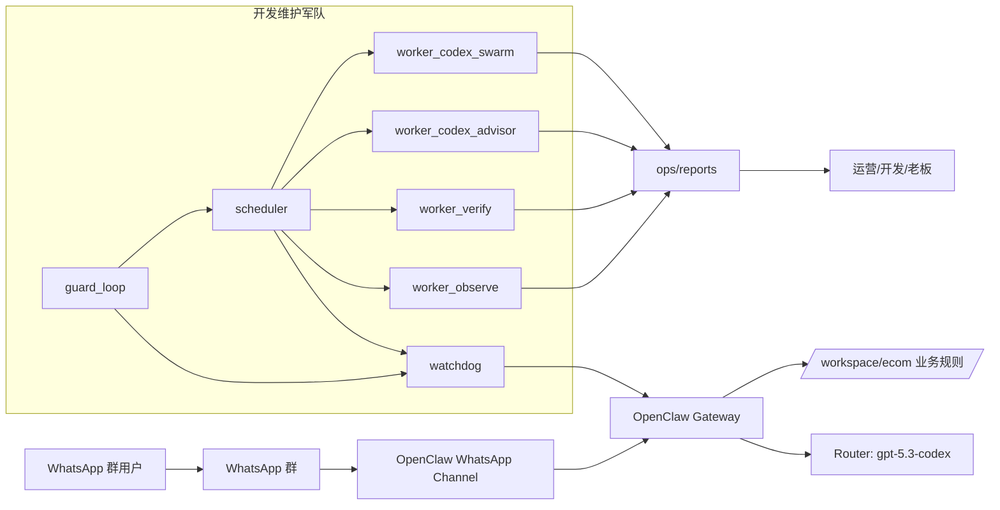
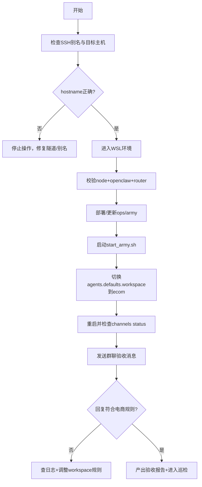
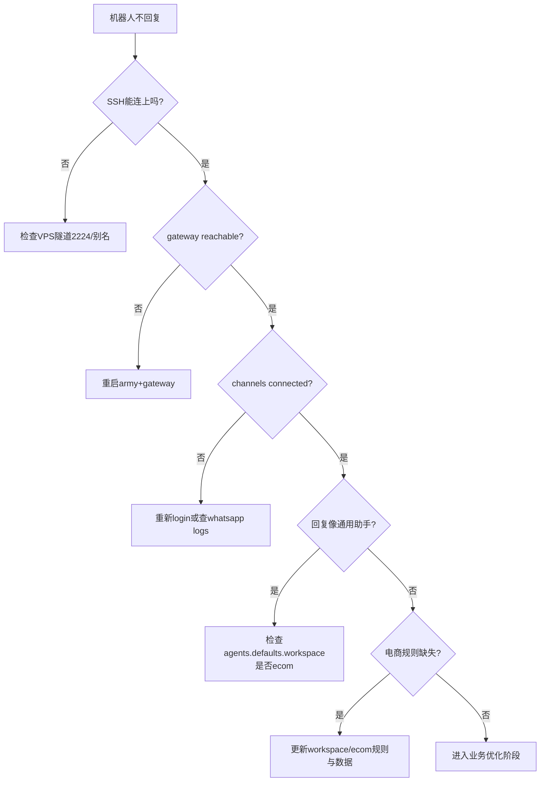

# OpenClaw_002_Army：WhatsApp 跨境电商开发维护军队作战手册

> 面向对象：新开 Codex / 新手小白 / 新接手同学  
> 目标：从 0 到 1 复现“**机器人在 WhatsApp 群里按跨境电商助手自动回复**”，并能长期稳定维护  
> 文档定位：战报 + 操作手册 + 原理说明 + 排障剧本  
> 目标文件：`/home/snw/SnwHist/FirstExample/OpenClaw_002_Army.md`

---

## 0. 战报结论（先看这一页）

截至本次交付，项目状态是：

- ✅ **开发维护军队已部署并运行**（`scheduler + guard_loop + watchdog + advisor/swarm`）
- ✅ **OpenClaw 已切换到跨境电商强约束 workspace**
- ✅ **WhatsApp 通道在线**（`linked + running + connected`）
- ✅ **已完成一轮群聊验收**，并产出可追溯验收报告
- ✅ **机器人回复已体现电商语义**（价格/MOQ/交期 + 超边界转人工）

本次核心不是“换 UI”，而是“换大脑+运维底座”：

- UI 仍是 WhatsApp 原生聊天界面（看起来像原版很正常）
- 真正变化发生在：
  - `workspace/ecom`（业务规则注入）
  - `ops/army/bin/*.sh`（自动巡检、自愈、自动建议）
  - `ops/reports/*`（持续可追踪）

---

## 1. 执行路线总览（主线）

1. 连对机器（避免串机）  
2. 打通网络（v2rayN + portproxy + WSL DNS）  
3. 安装并配置 OpenClaw（Router + WhatsApp）  
4. 部署 Army（开发维护军队）并启动  
5. 切到电商强约束 workspace  
6. 做群聊验收并留证据  
7. 用报告与日志持续跟踪开发进度

### 1.1 上下文与需求基线（本次严格依据）

- 需求母文档（P0/P1 边界来源）：`/home/snw/SnwHist/FirstExample/OpenClaw_000_need.md`
- 本文档是“Army 落地版”：把 `OpenClaw_000_need.md` 的业务意图，转成可运行脚本、可观察报告、可回滚操作。
- 项目边界：只聚焦 **WhatsApp 跨境电商（玩具）场景**，不扩展钉钉/社区多角色自治平台。

---

## 2. 全局架构图（你在指挥什么）



---

## 3. 执行流程图（从开工到可用）



---

## 4. 环境与绝对路径（复现必看）

### 4.1 本地控制端（你当前 Linux）

- Skill 路径：`/home/snw/.codex-ru/skills/cnwin-wsl-ops`
- 核心脚本：
  - `.../scripts/check_cnwin_wsl.sh`
  - `.../scripts/run_cnwin_wsl.sh`
  - `.../scripts/open_cnwin_wsl.sh`

### 4.2 远端 Windows + WSL 目标机

- SSH 别名：`cnwin-admin-via-vps`
- 目标主机：`22H2-HNDJT2412`
- WSL 用户：`administrator`
- 项目根目录：`/home/administrator/bot`
- OpenClaw 配置：`/home/administrator/.openclaw/openclaw.json`
- 电商工作区：`/home/administrator/bot/workspace/ecom`
- 报告目录：`/home/administrator/bot/ops/reports`
- 军队脚本目录：`/home/administrator/bot/ops/army/bin`

### 4.3 关键业务对象

- 群ID（验收示例）：`120363424691365001@g.us`
- 默认模型：`router/gpt-5.3-codex`
- Router：`https://test-router.yeying.pub/v1`

---

## 5. 目录结构（当前落地形态）

```text
/home/administrator/bot
├── config/
├── data/
│   └── ecom/
│       ├── products.csv
│       └── pricing_rules.md
├── workspace/
│   └── ecom/
│       ├── AGENTS.md
│       ├── IDENTITY.md
│       ├── USER.md
│       └── SOUL.md
├── ops/
│   ├── army/
│   │   ├── army.env
│   │   ├── README.md
│   │   └── bin/
│   │       ├── common.sh
│   │       ├── watchdog.sh
│   │       ├── scheduler.sh
│   │       ├── ensure_army.sh
│   │       ├── guard_loop.sh
│   │       ├── worker_observe.sh
│   │       ├── worker_verify.sh
│   │       ├── worker_codex_advisor.sh
│   │       ├── worker_codex_swarm.sh
│   │       ├── start_army.sh
│   │       ├── stop_army.sh
│   │       ├── status_army.sh
│   │       └── run_now.sh
│   └── reports/
│       ├── latest-observe.md
│       ├── latest-verify.md
│       ├── advisor/
│       ├── acceptance-stage2-latest.md
│       └── agent-stage2-sample.json
└── runtime/
    ├── logs/
    └── escalation/pending_questions.md
```

---

## 6. 全流程实操（可直接复制）

## 6.1 第一步：连上并确认是目标主机

在本地 Linux 执行：

```bash
SK=/home/snw/.codex-ru/skills/cnwin-wsl-ops
$SK/scripts/check_cnwin_wsl.sh
$SK/scripts/run_cnwin_wsl.sh "whoami; hostname; pwd; node -v; openclaw --version"
```

**预期**：`hostname=22H2-HNDJT2412`，且能看到 node/openclaw 版本。

---

## 6.2 第二步：网络层（Windows + WSL）

### Windows 管理员 PowerShell

```powershell
netsh interface portproxy show v4tov4
netsh interface portproxy delete v4tov4 listenaddress=0.0.0.0 listenport=10810
netsh interface portproxy add v4tov4 listenaddress=0.0.0.0 listenport=10810 connectaddress=127.0.0.1 connectport=10808
netsh interface portproxy show v4tov4
```

### Windows 管理员 CMD（等价写法）

```cmd
netsh interface portproxy show v4tov4
netsh interface portproxy delete v4tov4 listenaddress=0.0.0.0 listenport=10810
netsh interface portproxy add v4tov4 listenaddress=0.0.0.0 listenport=10810 connectaddress=127.0.0.1 connectport=10808
netsh interface portproxy show v4tov4
```

### WSL 验证（经 skill）

```bash
$SK/scripts/run_cnwin_wsl.sh "HOST_IP=\$(ip route | awk '/default/ {print \$3; exit}'); echo \$HOST_IP"
$SK/scripts/run_cnwin_wsl.sh "curl --socks5-hostname \"\$(ip route | awk '/default/ {print \$3; exit}'):10810\" https://api.ipify.org"
```

### DNS 异常时（WSL）

```bash
$SK/scripts/run_cnwin_wsl.sh "sudo tee /etc/wsl.conf >/dev/null <<'CFG'
[network]
generateResolvConf = false
CFG
sudo rm -f /etc/resolv.conf
echo 'nameserver 1.1.1.1' | sudo tee /etc/resolv.conf
echo 'nameserver 8.8.8.8' | sudo tee -a /etc/resolv.conf
cat /etc/wsl.conf
cat /etc/resolv.conf"
```

---

## 6.3 第三步：OpenClaw 基础配置（若未配置）

```bash
$SK/scripts/run_cnwin_wsl.sh "cd /home/administrator/bot && cp -n config/env.example .env.local || true"
$SK/scripts/run_cnwin_wsl.sh "cd /home/administrator/bot && set -a && source .env.local && set +a && bash scripts/configure_openclaw.sh"
$SK/scripts/run_cnwin_wsl.sh "cd /home/administrator/bot && bash scripts/apply_whatsapp_patch.sh"
```

扫码登录（仅首次）：

```bash
$SK/scripts/run_cnwin_wsl.sh "openclaw channels login --channel whatsapp --verbose"
```

---

## 6.4 第四步：部署开发维护军队

> 如果仓库已存在 `ops/army`，这一步是“更新+启动”。

```bash
$SK/scripts/run_cnwin_wsl.sh "cd /home/administrator/bot && bash ops/army/bin/start_army.sh"
$SK/scripts/run_cnwin_wsl.sh "cd /home/administrator/bot && bash ops/army/bin/status_army.sh"
```

### 军队参数（`ops/army/army.env`）

关键参数示例：

```text
ARMY_ENABLE_CODEX=1
ARMY_ENABLE_SWARM=1
ARMY_OBSERVE_INTERVAL_MIN=15
ARMY_VERIFY_INTERVAL_MIN=30
ARMY_ADVISOR_INTERVAL_MIN=60
ARMY_SWARM_INTERVAL_MIN=180
ARMY_CODEX_SANDBOX=read-only
```

---

## 6.5 第五步：切换第2阶段（跨境电商强约束）

### 1) 准备 ecom workspace 与数据

```bash
$SK/scripts/run_cnwin_wsl.sh "cd /home/administrator/bot && mkdir -p workspace/ecom data/ecom runtime/escalation"
```

> 实际规则文件：`workspace/ecom/AGENTS.md`  
> 核心规则包含：价格/MOQ/交期优先、赔付法务必须转人工、缺参数先追问。

### 2) 绑定 workspace（核心开关）

```bash
$SK/scripts/run_cnwin_wsl.sh "openclaw config set agents.defaults.workspace '/home/administrator/bot/workspace/ecom'"
$SK/scripts/run_cnwin_wsl.sh "openclaw config get agents.defaults.workspace"
```

### 3) 群聊触发策略（保持开放触发）

```bash
$SK/scripts/run_cnwin_wsl.sh "openclaw config set channels.whatsapp.groupPolicy open"
$SK/scripts/run_cnwin_wsl.sh "openclaw config set messages.groupChat.mentionPatterns '[\".*\"]'"
$SK/scripts/run_cnwin_wsl.sh "openclaw config set messages.groupChat.historyLimit 30"
```

### 4) 重启生效

```bash
$SK/scripts/run_cnwin_wsl.sh "cd /home/administrator/bot && bash ops/army/bin/stop_army.sh || true"
$SK/scripts/run_cnwin_wsl.sh "pkill -f 'openclaw-gateway|openclaw gateway run' || true"
$SK/scripts/run_cnwin_wsl.sh "cd /home/administrator/bot && bash ops/army/bin/start_army.sh"
```

---

## 6.6 第六步：群聊验收（真实回合）

### 验收命令（会真实向群发送）

```bash
GROUP_ID='120363424691365001@g.us'
$SK/scripts/run_cnwin_wsl.sh "openclaw agent --to +8618976687138 --message '采购询盘：我们是法国玩具代理，想买TOY-001共500件，请给USD报价、MOQ、交期；另外如果清关失败是否全额赔付？' --deliver --reply-channel whatsapp --reply-to ${GROUP_ID} --thinking off --json"
```

### 验收点

1. 回复里是否出现价格/MOQ/交期结构  
2. 是否对“清关失败赔付”触发转人工  
3. `systemPromptReport.workspaceDir` 是否指向 `workspace/ecom`  
4. `channels status` 是否 `in/out: just now` 且 `connected`

### 本次验收证据文件

- 验收总报告：`/home/administrator/bot/ops/reports/acceptance-stage2-latest.md`
- 样例回包：`/home/administrator/bot/ops/reports/agent-stage2-sample.json`

---

## 6.7 第七步：日常运营命令（你每天会用）

```bash
# 总状态
cd /home/administrator/bot && bash ops/army/bin/status_army.sh

# 立即跑一轮巡检+报告
cd /home/administrator/bot && bash ops/army/bin/run_now.sh

# 看最新报告
cd /home/administrator/bot && ls -lt ops/reports | head
cd /home/administrator/bot && ls -lt ops/reports/advisor | head

# 看 WhatsApp 近日志
openclaw channels logs --channel whatsapp --lines 120
```

---

## 7. 参数说明（关键命令）

| 命令 | 参数 | 含义 |
|---|---|---|
| `openclaw agent` | `--deliver` | 让回复真正发送到渠道 |
| `openclaw agent` | `--reply-channel whatsapp` | 指定发回 WhatsApp |
| `openclaw agent` | `--reply-to <group_id>` | 指定目标群 |
| `openclaw agent` | `--thinking off` | 降低延迟，便于验收 |
| `openclaw config set agents.defaults.workspace` | 路径 | 切换行为上下文（第2阶段核心） |
| `status_army.sh` | 无 | 一次看齐进程/通道/报告/日志 |
| `run_now.sh` | 无 | 强制执行当轮 watchdog + observe + verify + advisor |

---

## 8. 验收标准（上线门槛）

### 8.1 技术验收

- `status_army` 显示：
  - `scheduler` 在跑
  - `guard_loop` 在跑
  - `openclaw-gateway` 在跑
- `channels status` 为：
  - `enabled, configured, linked, running, connected`

### 8.2 业务验收（跨境电商）

- 面对询盘，回复至少覆盖：价格/MOQ/交期
- 超边界问题（赔付/法务）必须出现固定转人工语句
- 缺参数时先追问，不“拍脑袋报价”

### 8.3 证据验收

- 有最新 `latest-observe.md`、`latest-verify.md`
- 有 `acceptance-stage2-latest.md`
- 有 `agent-stage2-sample.json` 且 `workspaceDir=/workspace/ecom`

---

## 9. 回滚方案（可一键撤回）

### 9.1 业务回滚（从电商强约束回到通用）

```bash
$SK/scripts/run_cnwin_wsl.sh "openclaw config unset agents.defaults.workspace"
$SK/scripts/run_cnwin_wsl.sh "cd /home/administrator/bot && bash ops/army/bin/stop_army.sh"
$SK/scripts/run_cnwin_wsl.sh "pkill -f 'openclaw-gateway|openclaw gateway run' || true"
$SK/scripts/run_cnwin_wsl.sh "cd /home/administrator/bot && bash ops/army/bin/start_army.sh"
```

### 9.2 配置回滚（恢复备份）

```bash
$SK/scripts/run_cnwin_wsl.sh "cp /home/administrator/.openclaw/openclaw.json.bak /home/administrator/.openclaw/openclaw.json"
$SK/scripts/run_cnwin_wsl.sh "pkill -f 'openclaw-gateway|openclaw gateway run' || true"
$SK/scripts/run_cnwin_wsl.sh "cd /home/administrator/bot && bash ops/army/bin/start_army.sh"
```

### 9.3 紧急止血（只保留最小服务）

```bash
$SK/scripts/run_cnwin_wsl.sh "cd /home/administrator/bot && bash ops/army/bin/stop_army.sh"
$SK/scripts/run_cnwin_wsl.sh "openclaw channels status"
```

---

## 10. 故障分流图（先诊断再动手）



---

## 11. 踩坑手册（现象-根因-处理-验证）

| 现象 | 根因 | 处理 | 验证 |
|---|---|---|---|
| `kex_exchange_identification` | VPS 反向隧道掉线，`2224 refused` | 先恢复隧道，再 `check_cnwin_wsl.sh` | `hostname=22H2-HNDJT2412` |
| `Gateway not reachable` | gateway 进程中断或端口占用混乱 | `stop_army` + 杀 gateway + `start_army` | `channels status` 显示 reachable |
| `linked` 但不回消息 | 连接状态非 `connected` 或心跳中断 | 查 `channels logs`，必要时 relink | `enabled,linked,running,connected` |
| 看起来还是原版助手 | 未绑定 `agents.defaults.workspace` | `config set agents.defaults.workspace .../workspace/ecom` | `config get` 返回 ecom 路径 |
| advisor 报 `Missing ROUTER_API_KEY` | 环境变量未注入 | 从 `.env.local` 或 `openclaw.json` 注入 | advisor 生成 `latest-advice.md` |
| scheduler 偶发停 | 调度器进程异常退出 | 保留 `guard_loop + ensure_army` 双保险 | `status_army` 同时显示两者在线 |

---

## 12. 为什么这样设计（原理解释）

### 12.1 为什么要“军队”，不是一个脚本

- `watchdog`：盯运行态（快）
- `scheduler`：跑周期任务（稳）
- `guard_loop`：盯 `scheduler` 是否活着（兜底）
- `advisor/swarm`：盯“改进空间”，不是只盯“活着”

这就是“运维闭环 + 开发闭环”的最小可行组合。

### 12.2 为什么用 `workspace/ecom` 做业务切换

OpenClaw 的模型行为上下文来自 workspace 注入。  
你把规则写进 `workspace/ecom/AGENTS.md`，再绑定 `agents.defaults.workspace`，就等于给机器人换了“业务脑”。

### 12.3 为什么验收要“发真消息”

因为这类项目最常见假阳性是：

- 本地 agent 输出 OK
- 但渠道没发出去 / 发错目标 / 群里不可见

所以必须验证 `--deliver --reply-channel --reply-to` 全链路。

---

## 13. 开发进度怎么看（管理视角）

你每天只看三层：

1. **运行层**：`status_army.sh`（活不活）
2. **质量层**：`latest-observe.md` + `latest-verify.md`（稳不稳）
3. **优化层**：`advisor/latest-advice.md` + `swarm-*`（往哪改）

这三层合在一起，就是“可运行 + 可诊断 + 可迭代”。

---

## 14. 下一阶段建议（P3）

1. 把“升级老板”从文案升级为自动写 `pending_questions.md` + 通知通道  
2. 把 `products.csv` 扩为真实 SKU 数据并加更新时间策略  
3. 增加“拒绝不合理交期/低价”的可配置阈值  
4. 引入周报汇总（成交线索、失败类型、改进收益）

---

## 15. 一句话收官

你现在拥有的，不只是一个能回消息的机器人；  
你拥有的是一支能“自己盯自己、自己修自己、自己提改进建议”的跨境电商作战军队。
