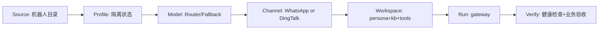
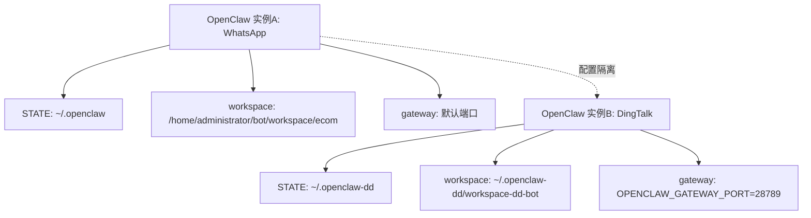
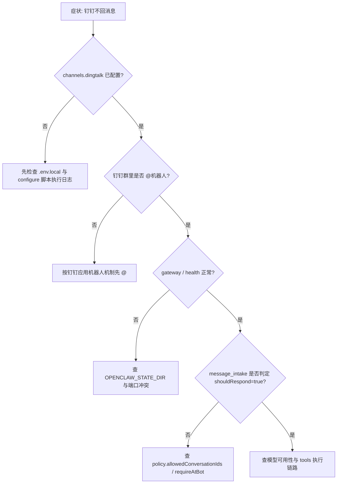

# OpenClaw 钉钉机器人差异学习与起机蓝图（003版）

> 文档路径：`/home/snw/SnwHist/FirstExample/OpenClaw_003_ding.md`
>
> 文档目标：让“新开 Codex / 新手小白”在不影响现有 WhatsApp 电商机器人的前提下，理解钉钉机器人怎么起来、和 WhatsApp 有什么区别、以及如何抽象出统一起机流程。
>
> 本文状态：**只读学习版（已 fetch + 对比 + 分析）**
>
> 执行边界（严格遵守）：
> - 已执行：`git fetch --prune origin`、差异对比、关键文件阅读
> - 未执行：`git merge`、启动钉钉机器人、改动线上 WhatsApp 运行配置

---

## 1. 战报结论（先看这个）

### 1.1 当前差异结论（本地 vs 远端）

在远端机器 `/home/administrator/bot`：

- 当前分支：`main`
- 本地状态：`behind 6`
- 真正新增的功能提交（非 merge commit）主要是 2 个：
  - `c0a1e93 feat(example-dd): add dingtalk bot workspace and local knowledge flow`
  - `133e6fb chore(example-dd): add committed env template`

新增核心目录：

- `example/example_dd/`（注意是单数 `example`，不是已有的 `examples`）

它不是一两个脚本，而是一整套钉钉机器人 MVP 工程：

- 配置模板（`.env.template`、`config/env.example`、`policy.example.json`）
- OpenClaw 配置脚本（`configure_openclaw_dingtalk.sh`）
- workspace 同步脚本（`sync_openclaw_workspace.sh`）
- 网关启动脚本（`run_openclaw_gateway.sh`）
- 验证脚本（grounding/drafts/tools/confirmation/group scenarios）
- hooks + tools + skills + docs_source（知识、策略、流程、模板）

### 1.2 核心判断

1. 钉钉机器人已经具备“可起机方案”，不是空壳。  
2. 它和 WhatsApp 电商机器人在“运行形态”上明显不同：钉钉是“知识+策略+外部写入闭环”的协作机器人，WhatsApp 当前是“对话+电商约束”的轻运营形态。  
3. **可以抽象出统一起机器人流程**。  
4. **可以并行独立运行**（推荐双实例隔离），做到钉钉与 WhatsApp 互不影响。

---

## 2. 现网画像（你现在站在哪里）

以下是本次只读检查到的现网事实：

- OpenClaw 当前默认 workspace：`/home/administrator/bot/workspace/ecom`
- 当前主模型：`router/gpt-5.3-codex`
- 当前已配置渠道：`channels.whatsapp`（已存在）
- 当前未配置：`channels.dingtalk`（查询报 `Config path not found`）
- 已加载插件里有 `whatsapp`，未见 `dingtalk` 已加载

这意味着：

- 现网目前是 WhatsApp 电商机器人主线
- 还没有把钉钉配置真正写入当前运行态
- 也正因为没写入，所以目前没影响 WhatsApp

---

## 3. 这次我是怎么“只学习差异”的（可复现命令）

> 目标：同步远端信息并学习，不合并、不上线。

### 3.1 从本机触发远端 WSL 只读探查

```bash
# 本机 Linux
/home/snw/.codex-ru/skills/cnwin-wsl-ops/scripts/check_cnwin_wsl.sh

/home/snw/.codex-ru/skills/cnwin-wsl-ops/scripts/run_cnwin_wsl.sh \
"cd /home/administrator/bot && \
 git fetch --prune origin && \
 git status -sb && \
 git log --oneline --left-right --cherry-pick HEAD...origin/main"
```

### 3.2 精确看“差异文件清单”

```bash
/home/snw/.codex-ru/skills/cnwin-wsl-ops/scripts/run_cnwin_wsl.sh \
"cd /home/administrator/bot && \
 git diff --name-status HEAD..origin/main"
```

### 3.3 精确看关键提交内容（不 merge）

```bash
/home/snw/.codex-ru/skills/cnwin-wsl-ops/scripts/run_cnwin_wsl.sh \
"cd /home/administrator/bot && \
 git show --stat --oneline c0a1e93 && \
 git show --stat --oneline 133e6fb"
```

### 3.4 精确读钉钉起机关键脚本（不执行）

```bash
/home/snw/.codex-ru/skills/cnwin-wsl-ops/scripts/run_cnwin_wsl.sh \
"cd /home/administrator/bot && \
 git show origin/main:example/example_dd/scripts/configure_openclaw_dingtalk.sh"

/home/snw/.codex-ru/skills/cnwin-wsl-ops/scripts/run_cnwin_wsl.sh \
"cd /home/administrator/bot && \
 git show origin/main:example/example_dd/scripts/sync_openclaw_workspace.sh"
```

---

## 4. 钉钉机器人怎么起来（基于远端新增方案拆解）

### 4.1 钉钉起机主线

`example/example_dd` 的官方推荐链路是：

1. 准备配置：`cp .env.template .env.local`
2. 写入关键密钥：
   - `ROUTER_API_KEY`
   - `DINGTALK_CLIENT_ID`
   - `DINGTALK_CLIENT_SECRET`
   - 可选 `DASHSCOPE_API_KEY`（fallback）
3. 执行配置脚本：`bash scripts/configure_openclaw_dingtalk.sh`
4. 启动网关：`bash scripts/run_openclaw_gateway.sh`
5. 跑验证脚本：`verify_openclaw_*.sh`

### 4.2 `configure_openclaw_dingtalk.sh` 实际做了什么

它不是简单 set 几个字段，而是做了 5 类事：

1. 同步工作区：把 `docs_source/ + workspace_assets` 同步到 `~/.openclaw/workspace-dd-bot`
2. 插件层：安装并允许 `@soimy/dingtalk`
3. 模型层：配置 `router` 主模型；可选配置 `dashscope` fallback
4. 渠道层：写入 `channels.dingtalk`（clientId/clientSecret/policy）
5. agent 层：把 `agents.defaults.workspace` 指向 DD workspace

### 4.3 钉钉路线的本质

钉钉不是“只会聊天”，而是“协作闭环机器人”：

- 知识检索（`knowledge_search/get/index`）
- 群消息意图抽取（`message_intake`）
- 外部写入预览（Issue/日程 preview）
- 确认闭环（pending action + confirmation hook）
- 审计日志（audit）

---

## 5. 和 WhatsApp 电商机器人的关键区别

| 维度 | WhatsApp 电商机器人（现网） | DingTalk 机器人（远端新增） |
|---|---|---|
| 入口目录 | `workspace/ecom` + `ops/army` + `scripts/` | `example/example_dd/` |
| 渠道接入 | `openclaw channels login --channel whatsapp` 扫码 | 通过 `DINGTALK_CLIENT_ID/SECRET` 应用配置 |
| 业务形态 | 对话约束+报价场景 | 协作流程+知识治理+外部系统写入 |
| workspace 管理 | 当前固定为 `/home/administrator/bot/workspace/ecom` | 脚本同步到 `~/.openclaw/workspace-dd-bot` |
| 风险点 | 主要是网络/扫码/连通性 | 主要是策略闭环/确认权限/工具执行边界 |
| 验证方式 | `doctor.sh + verify.sh` | 多脚本回归（grounding、draft、preview、confirmation） |
| 群消息机制 | WhatsApp 群策略可放开 | 钉钉应用机器人通常是 `@机器人` 触发为主 |

### 最重要的一句

`configure_openclaw_dingtalk.sh` 会改 `agents.defaults.workspace`。  
如果直接在现网默认状态目录执行，可能把 WhatsApp 的默认“脑子”从 ecom 切到 dd-bot。

---

## 6. 能不能抽象成统一起机器人流程？可以，而且建议这样做

## 6.1 统一流程（抽象层）

无论 WhatsApp 还是 DingTalk，本质都可以统一为 7 步：

1. `Source`：准备机器人目录（配置模板、知识、工具）
2. `Profile`：准备隔离状态目录/配置路径
3. `Model`：配置主模型与 fallback
4. `Channel`：配置渠道插件 + 认证凭据
5. `Workspace`：同步角色、知识、技能、工具
6. `Run`：启动 gateway
7. `Verify`：按机器人类型跑验收脚本



## 6.2 参数化而非硬编码（统一与独立的平衡点）

抽象共性时，把这些做成参数：

- `BOT_ID`（如 `wa-ecom` / `dd-rd`）
- `OPENCLAW_STATE_DIR`
- `OPENCLAW_CONFIG_PATH`
- `OPENCLAW_GATEWAY_PORT`
- `WORKSPACE_DIR`
- `CHANNEL_TYPE`
- `VERIFY_PROFILE`

这样统一的是“流程骨架”，独立的是“实例参数”。

---

## 7. 如何做到“同时起钉钉和 WhatsApp，互不影响”

## 7.1 推荐方案（本阶段）

**双实例隔离（推荐）**：

- WhatsApp 用现有实例（保持不动）
- DingTalk 用新状态目录 + 新端口 + 新workspace

为什么推荐：

- 不改现网 WhatsApp 配置
- DingTalk 任意调试都不会污染现网 ecom 会话/配置
- 回滚成本极低（停新实例即可）



## 7.2 反例提醒（不要这样做）

直接在现网默认环境执行：

```bash
cd /home/administrator/bot/example/example_dd
bash scripts/configure_openclaw_dingtalk.sh
```

风险：

- 会写默认 openclaw 配置
- 可能覆盖 `agents.defaults.workspace`
- 进而影响 WhatsApp 机器人行为

---

## 8. 从“当前本地仓库”到“可独立起钉钉”的执行路线（演练版，不落地）

> 注意：以下是你后续执行用的路线图，本次我没有执行这些启动动作。

### 8.1 第 0 段：只读同步（安全）

```bash
cd /home/administrator/bot
git fetch --prune origin
git log --oneline --left-right --cherry-pick HEAD...origin/main
git diff --name-status HEAD..origin/main
```

### 8.2 第 1 段：学习/评审（安全）

```bash
git show origin/main:example/example_dd/README.md
# 再看 scripts/configure_openclaw_dingtalk.sh
# 再看 scripts/sync_openclaw_workspace.sh
```

### 8.3 第 2 段：准备隔离运行环境（待执行）

```bash
# 仅示例：在真正执行窗口再操作
export OPENCLAW_STATE_DIR=/home/administrator/.openclaw-dd
export OPENCLAW_CONFIG_PATH=/home/administrator/.openclaw-dd/openclaw.json
export OPENCLAW_GATEWAY_PORT=28789
export OPENCLAW_DD_WORKSPACE=/home/administrator/.openclaw-dd/workspace-dd-bot
```

### 8.4 第 3 段：钉钉实例配置（待执行）

```bash
cd /home/administrator/bot/example/example_dd
cp .env.template .env.local
# 编辑 .env.local，填入 ROUTER_API_KEY / DINGTALK_CLIENT_ID / DINGTALK_CLIENT_SECRET
bash scripts/configure_openclaw_dingtalk.sh
```

### 8.5 第 4 段：钉钉实例启动与验收（待执行）

```bash
bash scripts/run_openclaw_gateway.sh
openclaw health
openclaw channels status
bash scripts/verify_openclaw_grounding.sh
bash scripts/verify_openclaw_drafts.sh
```

### 8.6 第 5 段：确认 WhatsApp 未受影响（待执行）

在 WhatsApp 现网实例中检查：

```bash
# 切回 WhatsApp 实例的环境变量（或新开不带 dd 环境变量的 shell）
openclaw config get agents.defaults.workspace
openclaw channels status
```

期望：

- 仍指向 `/home/administrator/bot/workspace/ecom`
- WhatsApp 状态不变

---

## 9. 统一流程的“教师版原理解释”

### 9.1 为什么二者可以共用一个“起机框架”

因为两者都是同一运行时 OpenClaw，只是：

- 渠道插件不同（whatsapp / dingtalk）
- 工作区内容不同（ecom / dd）
- 验证脚本不同（对话连通 / 协作闭环）

框架不变，参数替换即可。

### 9.2 为什么又必须强调隔离

OpenClaw 的配置、会话、workspace 默认在同一状态目录下。  
如果不隔离，任何一个机器人脚本都可能改到另一个机器人的默认行为。

所以“统一流程”不等于“共用一份状态”。

统一的是流程设计，隔离的是运行实例。

---

## 10. 故障分流图（先定位再动手）



---

## 11. 现象-根因-处理-验证（给新人直接抄）

### 11.1 现象：钉钉脚本跑完后，WhatsApp 说话风格变了

- 根因：`agents.defaults.workspace` 被改成 dd workspace
- 处理：恢复 WhatsApp 实例配置，或改用双实例隔离方案
- 验证：`openclaw config get agents.defaults.workspace` 返回 ecom 路径

### 11.2 现象：钉钉群里机器人不回复

- 根因：钉钉应用机器人通常只接收 `@机器人`
- 处理：群里明确 `@机器人` 发送测试消息
- 验证：`openclaw channels status` + 群内 `@` 测试通过

### 11.3 现象：写入动作（Issue/日程）直接执行，未确认

- 根因：确认桥接 hook/policy 未正确生效
- 处理：检查 `hooks/confirmation-bridge`、`policy/runtime-policy.json`
- 验证：先预览，再“确认执行”，再写入成功并群回执

### 11.4 现象：钉钉能回，但答案飘

- 根因：知识未同步或索引未更新
- 处理：执行 `sync_openclaw_workspace.sh`，重建知识索引
- 验证：`verify_openclaw_grounding.sh` 通过

---

## 12. 回滚策略（必须提前写好）

如果后续钉钉试运行异常，且你要 1 分钟内止损：

1. 停掉钉钉隔离实例进程（仅停 dd，不动 wa）
2. 保留 WhatsApp 实例进程不重启
3. 保留 `example/example_dd` 目录用于离线排障
4. 记录 dd 日志并复盘后再重开

回滚判断标准：

- WhatsApp 可继续收发
- ecom workspace 未被改写
- 线上用户无感知

---

## 13. 本次学习结论（最终版）

1. 远端新增钉钉方案是完整可执行工程，不是文档草稿。  
2. 钉钉和 WhatsApp 的核心区别在“渠道认证机制”和“业务闭环复杂度”。  
3. 两者完全可以抽象为统一起机流程。  
4. 要“同时独立运作”，当前阶段最稳是“**双实例隔离**”（不同 state/config/port/workspace）。  
5. 本次已完成差异学习与可行性分析，未合并、未执行上线动作，符合你的控制要求。

