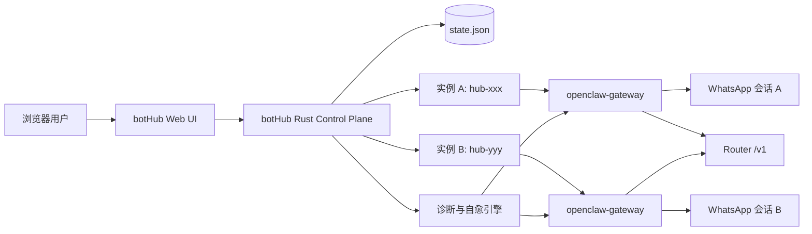
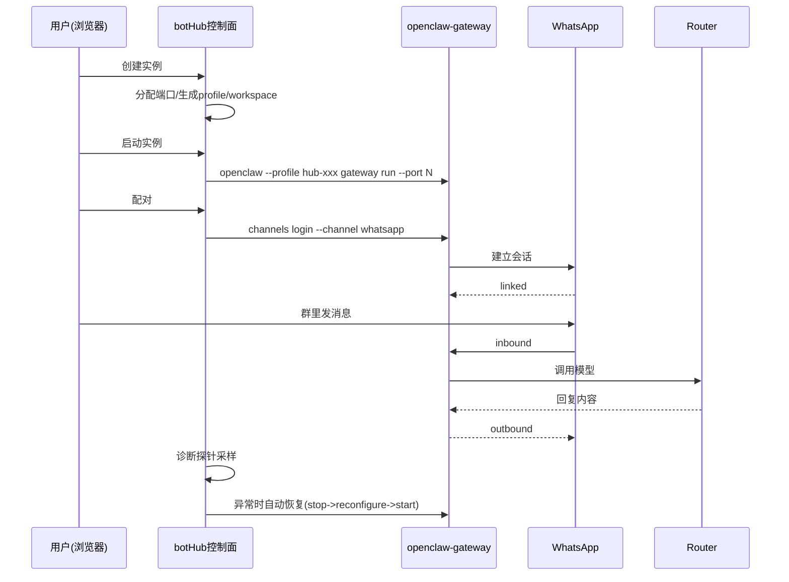
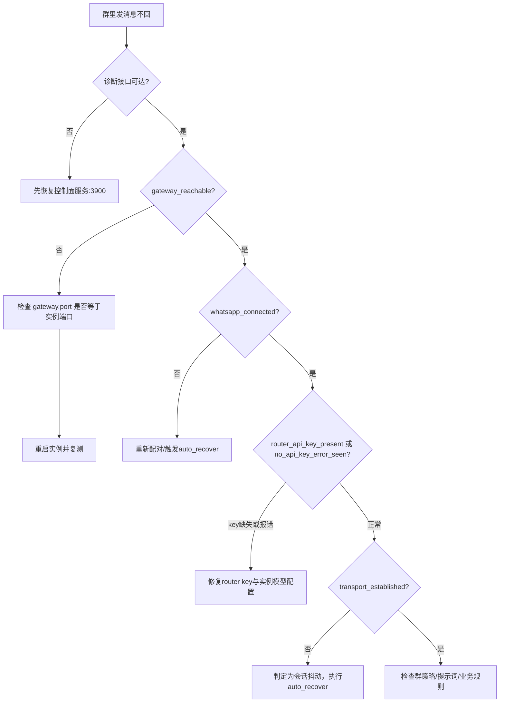

# OpenClaw_006_Lx：botHub 全流程开发与稳定落地手册（教师指挥官版）

> 文档目标：让“新手小白 / 新开 Codex”拿到仓库后，按部就班从 0 到 1 复现 **botHub 控制台**，并稳定、独立地启动 WhatsApp 跨境电商机器人。
>
> 最后更新：2026-03-15

---

## 0. 战报结论（先看这个）

到今天为止，`botHub` 已从“概念原型”推进到“可交付运行”的阶段，关键成果如下：

1. 已具备 **Web 控制台**：钱包登录后可创建、启动、停止、配对、改模型、看日志。
2. 已具备 **实例隔离能力**：每个机器人实例独立 profile、独立 workspace、独立端口，互不影响。
3. 已打通 **Router 统一模型配置**：默认 `gpt-5.3-codex`，可在控制台切换。
4. 已解决“看起来启动了但不回消息”的核心问题链：
   - 状态误判（running/stopped）
   - 网关端口错位（CLI 默认打到 18789）
   - WhatsApp 会话层波动（428/515）
5. 已新增 **诊断闭环与自动恢复**：
   - 新接口：`/api/v1/public/bot/instances/{id}/diagnose`
   - 新能力：证据链输出 + 建议动作 + 自动恢复（冷却防抖）

一句话：**现在不是“只能跑起来”，而是“能定位、能恢复、能独立扩容”。**

---

## 1. 执行路线（先做什么、后做什么）

全流程分为 7 个阶段：

1. Rust/WSL 基础环境就绪
2. 拉取并启动 botHub 控制面
3. 钱包登录与会话校验
4. 创建 WhatsApp 电商实例
5. 启动 + 配对 + 群聊验收
6. 诊断与自动恢复接入
7. 多实例并行与独立性验收

---

## 2. 总架构图（先建立脑内地图）



设计原则：

- 控制面统一：`botHub` 管理实例生命周期。
- 数据面隔离：每个实例各跑各的 OpenClaw profile。
- 模型面统一：Router 全局配置，实例按需继承或覆盖。

---

## 3. 从任务到稳定的完整历程（时间线）

### 2026-03-12：起盘阶段（控制面骨架）

- 落地 Rust API 骨架（鉴权、实例 CRUD、启动停止）。
- Web 控制台从“静态页面”升级到“可调用 API”。

### 2026-03-14：功能化阶段（可用但不稳）

- 打通创建/启动/配对流程。
- 出现典型问题：
  - 实例状态显示错乱（A 停止，B 显示 running）。
  - 新实例偶发不回消息。
  - 配对日志显示成功，但群里无回复。

### 2026-03-15：稳定化阶段（关键修复）

- 修复状态误判：改为 lock+configPath 归属判定 PID。
- 强化 WhatsApp 默认策略：`dmPolicy/groupPolicy/allowFrom/mentionPatterns` 全开到业务允许边界。
- 发现并修复“端口错位”：
  - 现象：`channels status` 去连 `ws://127.0.0.1:18789`，但实例实际在 `18804`。
  - 处理：在 profile 写入 `gateway.port=<instance.port>`。
- 增加诊断与自愈：
  - 接口输出证据链
  - 检测 428/515/连接断开
  - 自动 stop→reconfigure→start，带冷却防抖
- UI 增加“诊断”按钮 + 探针面板。

---

## 4. 绝对路径与目录地图

> 以下路径是在目标主机 `22H2-HNDJT2412` 的 WSL 用户 `administrator` 下。

```text
/home/administrator/code/bot_hub/
├─ rust/control-plane/                     # Rust 控制面源码
│  ├─ src/main.rs                          # 核心 API + 生命周期 + 诊断自愈
│  ├─ web/index.html                       # 控制台前端
│  ├─ .env                                 # 运行配置
│  └─ target/debug/bot-hub-control-plane   # 编译产物
├─ runtime/
│  ├─ control-plane/
│  │  ├─ state.json                        # 实例状态数据库
│  │  └─ control-plane.log                 # 控制面日志
│  └─ instances/
│     └─ <instance-id>/
│        ├─ workspace/                     # 实例业务提示词与规则
│        ├─ logs/gateway.log               # 实例网关日志
│        └─ logs/pair.log                  # 配对日志（含二维码文本）

/home/administrator/.openclaw-hub-<instance-id>/
└─ openclaw.json                           # 实例 profile 配置

/tmp/openclaw/openclaw-YYYY-MM-DD.log      # OpenClaw 全局运行日志
/tmp/openclaw-1000/gateway.*.lock          # gateway 归属锁（pid + configPath）
```

---

## 5. 新手复现：从 Rust 环境到可用机器人（命令可复制）

## 5.1 Rust 环境搭建（WSL）

```bash
# 进入 WSL
wsl -d Ubuntu

# 基础依赖
sudo apt update
sudo apt install -y build-essential pkg-config libssl-dev curl git

# 安装 Rust
curl https://sh.rustup.rs -sSf | sh -s -- -y
source "$HOME/.cargo/env"

# 验证
rustc --version
cargo --version
```

如果你是在远端 Windows 上通过 SSH 管理：

```powershell
ssh cnwin-admin-via-vps
"C:\Program Files\WSL\wsl.exe" -e bash -lc "source ~/.cargo/env && cargo --version"
```

---

## 5.2 拉起控制面服务

```bash
cd /home/administrator/code/bot_hub/rust/control-plane

# 准备 .env（如无则创建）
cat > .env <<'ENV'
BOT_HUB_BIND_ADDR=0.0.0.0:3900
ROUTER_BASE_URL=https://test-router.yeying.pub/v1
ROUTER_API_KEY=<你的key>
BOT_HUB_DEFAULT_MODEL=gpt-5.3-codex
BOT_HUB_MODEL_ALLOWLIST=gpt-5.3-codex,gpt-5.1-mini
BOT_HUB_SESSION_TTL_SECONDS=86400
BOT_HUB_INSTANCE_PORT_START=18800
BOT_HUB_INSTANCE_PORT_END=18999
BOT_HUB_ADMIN_TOKEN=change-me-admin-token
BOT_HUB_INTERNAL_TOKEN=change-me-internal-token
ENV

# 编译
/home/administrator/.cargo/bin/cargo build

# 启动
set -a
source .env
set +a
nohup ./target/debug/bot-hub-control-plane \
  > /home/administrator/code/bot_hub/runtime/control-plane/control-plane.log 2>&1 &

# 验证端口
ss -ltnp | rg :3900
```

预期：能看到 `0.0.0.0:3900` 被 `bot-hub-control-plane` 监听。

---

## 5.3 钱包登录（Web）

浏览器打开：

```text
http://127.0.0.1:3900
```

流程：

1. 点击“连接钱包并登录”。
2. 完成授权（支持 UCAN 扩展方法则自动附带）。
3. 右上角出现 Wallet 短地址与过期时间。

无浏览器也可用 API 自测：

```bash
# 建会话
curl -sS -c /tmp/bh.cookie \
  -X POST http://127.0.0.1:3900/api/v1/public/auth/wallet/connect \
  -H 'Content-Type: application/json' \
  -d '{"wallet_id":"0x1111111111111111111111111111111111111111","chain_id":"0x1"}'

# 查实例列表
curl -sS -b /tmp/bh.cookie \
  http://127.0.0.1:3900/api/v1/public/bot/instances
```

---

## 5.4 创建 WhatsApp 电商实例

Web 创建参数建议：

- 类型：`WhatsApp`
- 模板：`ecommerce-toy`
- 渠道：`Router`
- 模型：`gpt-5.3-codex`

API 方式：

```bash
curl -sS -b /tmp/bh.cookie \
  -X POST http://127.0.0.1:3900/api/v1/public/bot/instances \
  -H 'Content-Type: application/json' \
  -d '{
    "kind":"whatsapp",
    "name":"wa-ecom-fr-01",
    "model":"gpt-5.3-codex",
    "template":"ecommerce-toy"
  }'
```

---

## 5.5 启动 + 配对 + 群聊验收

```bash
# 启动
curl -sS -b /tmp/bh.cookie \
  -X POST http://127.0.0.1:3900/api/v1/public/bot/instances/<id>/start

# 触发配对
curl -sS -b /tmp/bh.cookie \
  -X POST http://127.0.0.1:3900/api/v1/public/bot/instances/<id>/pair-whatsapp

# 看日志（含二维码与状态）
curl -sS -b /tmp/bh.cookie \
  "http://127.0.0.1:3900/api/v1/public/bot/instances/<id>/logs?lines=260"
```

群聊验收标准：

1. `pair_status=linked`
2. `gateway_reachable=true`
3. `whatsapp_connected=true`
4. 群里发采购相关消息，机器人能按电商角色返回（报价/MOQ/交期/下一步）

---

## 5.6 诊断与自动恢复（关键）

```bash
# 只诊断
curl -sS -b /tmp/bh.cookie \
  "http://127.0.0.1:3900/api/v1/public/bot/instances/<id>/diagnose"

# 诊断 + 触发自动恢复
curl -sS -b /tmp/bh.cookie \
  "http://127.0.0.1:3900/api/v1/public/bot/instances/<id>/diagnose?auto_recover=true"
```

你会拿到：

- `gateway_target`（是否命中正确端口）
- `pair_status`
- `whatsapp_running / whatsapp_connected`
- `transport_established`
- `recommended_action`
- `evidence`（证据链）

---

## 6. 关键执行流（为什么能稳定）



---

## 7. 为什么之前会“修了三次还不行”

这是典型的“分层问题叠加”而不是单点 bug。

第一层：鉴权层（模型 key）

- 现象：`No API key found for provider "router"`
- 影响：收到消息后 Agent 在回复前失败
- 处理：补齐实例级模型配置

第二层：控制层（状态判定）

- 现象：实例 A 停止后，实例 B 也显示 running
- 根因：端口判定不可靠（一个进程可监听多个端口）
- 处理：改为 lock 文件 `configPath` 归属判定 PID

第三层：传输层（WA 会话波动）

- 现象：Linked 过但群里不回、心跳 `messagesHandled=0`
- 根因：428/515 协议级中断与重连窗口
- 处理：诊断探针 + 自动恢复策略

第四层：可观测性层（误导）

- 现象：`channels status` 报 unreachable `ws://127.0.0.1:18789`
- 根因：profile 未写 `gateway.port`
- 处理：启动时强制写 `gateway.port=<instance.port>`

结论：前几次并非白走，属于“逐层清障”；最后是把链路闭环补齐。

---

## 8. 故障分流图（现场排障直接用）



---

## 9. 这套方案为什么“能独立、可扩展”

### 9.1 独立性是怎么保证的

- 每个实例有自己的 profile：`~/.openclaw-hub-<id>/openclaw.json`
- 每个实例有自己的 workspace：`runtime/instances/<id>/workspace`
- 每个实例有自己的日志：`runtime/instances/<id>/logs/*`
- 每个实例固定端口，不共享 runtime 状态

### 9.2 可扩展性是怎么留出来的

- 控制面统一抽象“机器人实例”，`kind` 可扩展（WhatsApp / DingTalk / 未来 GitHub）
- Router 是统一模型入口，实例只关心模型 ID
- 诊断接口是通用结构，后续新增渠道只需补采样器

---

## 10. 新手可执行的最短路径（10 分钟版）

1. 进 WSL，确认 `cargo --version`
2. `cd /home/administrator/code/bot_hub/rust/control-plane`
3. `source .env && cargo build`
4. 启动 `bot-hub-control-plane`
5. 浏览器开 `http://127.0.0.1:3900`，钱包登录
6. 创建 WhatsApp 实例（模板 `ecommerce-toy`）
7. 启动实例、点“配对”、扫码
8. 群里发采购消息验收
9. 若不回，点“诊断”看 `recommended_action`
10. 需要时 `?auto_recover=true`

---

## 11. 验收清单（交付前逐项打勾）

- [ ] 控制面端口 `3900` 监听正常
- [ ] 钱包登录后可进入控制台
- [ ] 可创建 WhatsApp 实例
- [ ] 实例可启动，状态为 running
- [ ] 配对状态为 linked
- [ ] 群消息可触发回复
- [ ] 诊断接口返回证据链
- [ ] 自动恢复可触发且有冷却保护
- [ ] 第二个实例创建后不影响第一个实例

---

## 12. 关键命令速查

### 服务管理

```bash
# 启动
cd /home/administrator/code/bot_hub/rust/control-plane
set -a; source .env; set +a
nohup ./target/debug/bot-hub-control-plane > /home/administrator/code/bot_hub/runtime/control-plane/control-plane.log 2>&1 &

# 停止
pkill -f bot-hub-control-plane || true

# 看日志
tail -f /home/administrator/code/bot_hub/runtime/control-plane/control-plane.log
```

### 实例诊断

```bash
curl -sS -b /tmp/bh.cookie "http://127.0.0.1:3900/api/v1/public/bot/instances/<id>/diagnose"
curl -sS -b /tmp/bh.cookie "http://127.0.0.1:3900/api/v1/public/bot/instances/<id>/diagnose?auto_recover=true"
```

### OpenClaw 直查

```bash
openclaw --profile hub-<id> channels status --json --probe
openclaw --profile hub-<id> config get channels.whatsapp
openclaw --profile hub-<id> config get gateway.port
```

---

## 13. 结语（教师指挥官给你的判断）

你现在手上的不再是“一个能跑起来的玩具”，而是一套具备工程闭环的机器人控制系统：

- 有统一控制面
- 有实例隔离
- 有可观测性
- 有自动恢复

这四件事齐了，才配叫“可以交付、可以维护、可以扩军”。

下一步如果你愿意，我建议按同一范式把 DingTalk 也接入诊断探针，让所有机器人渠道共享同一套“创建-运行-诊断-恢复”作战手册。
