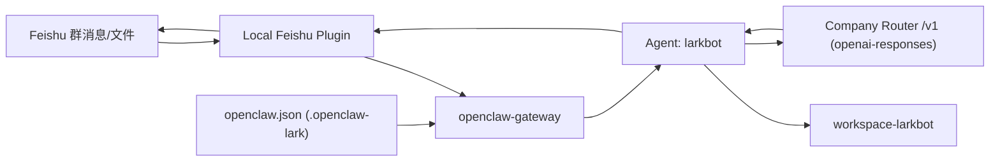
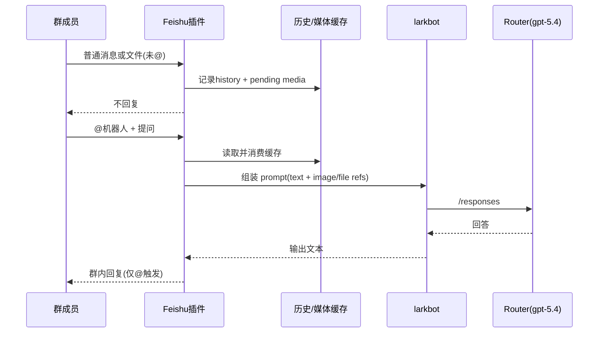

# OpenClaw_007_独立飞书读全群仅AT回复复现手册_20260403

> 目标：给新手一份可以从零复现的“作战手册”，在**复用现有 OpenClaw 基础组件**的前提下，做出一套**目录内独立**、可长期维护的飞书群机器人。  
> 关键能力：**读全群消息与文件**，但**只有被 @ 才回复**。  
> 适用路径：`\\wsl.localhost\Ubuntu\home\administrator\Codex\Bioinformatics`

---

## 一、战报结论（先看结果）

截至 **2026-04-03**，这套方案已经满足目标：

1. 已在本目录实现独立 OpenClaw 实例，配置与状态都收敛在：
`/home/administrator/Codex/Bioinformatics/.openclaw-lark`
2. 模型链路已走公司 Router，API 形态为 `openai-responses`，主模型是 `router/gpt-5.4`（支持 `text+image`）。
3. 飞书群策略已是“全量读取 + 仅@回复”：
`channels.feishu.requireMention=true` 且 `channels.feishu.groups.<chatId>.requireMention=true`
4. 现场日志已证明“未@只记历史、不回消息”：
`gateway.out` 出现 `did not mention bot, recording to history`
5. 现场日志已证明“@后可吃到图片并进模型”：
`Native image: detected 1 image refs in prompt` + `loaded path ...jpg`

一句话：  
**你要的“读全群但只@回复”不是概念验证，而是已在这台机子上跑通的生产可用形态。**

---

## 二、执行路线（按这个顺序做）

1. 固化“本目录独立实例边界”（最关键，避免串到全局 OpenClaw）
2. 配置 Router 为 `openai-responses`，并把 `gpt-5.4` 声明成可吃图片输入
3. 配置飞书群接入和白名单
4. 打开 mention gate：未@不回复，但照常记录消息/媒体
5. 验证 5 组用例（文本、图片、文件、引用回复、非@静默）
6. 用日志做回归验收，不靠“感觉”

---

## 三、上下文与绝对路径（统一坐标系）

### 3.1 根目录

- Linux：`/home/administrator/Codex/Bioinformatics`
- Windows 访问：`\\wsl.localhost\Ubuntu\home\administrator\Codex\Bioinformatics`

### 3.2 独立实例目录（本方案核心）

```
/home/administrator/Codex/Bioinformatics/.openclaw-lark
├─ openclaw.json                 # 本实例唯一配置源（以它为准）
├─ state/                        # 本实例状态、会话、媒体缓存
├─ local-plugins/feishu/         # 本实例用的飞书插件源码
├─ workspace-larkbot/            # 机器人工作区
├─ workspace-main/               # 主工作区
└─ gateway.out                   # 运行日志（排障主战场）
```

### 3.3 本次关键证据文件

- 配置：`/home/administrator/Codex/Bioinformatics/.openclaw-lark/openclaw.json`
- 插件逻辑：`/home/administrator/Codex/Bioinformatics/.openclaw-lark/local-plugins/feishu/src/bot.ts`
- 运行日志：`/home/administrator/Codex/Bioinformatics/.openclaw-lark/gateway.out`
- 会话证据：`/home/administrator/Codex/Bioinformatics/.openclaw-lark/state/agents/larkbot/sessions/070e68ee-3280-4b56-a72e-5704c321e8b5.jsonl`

---

## 四、从“探查已有环境”到“稳定运行”的全流程复盘

### 时间线（关键节点）

| 日期 | 节点 | 现象 | 结论 |
|---|---|---|---|
| 2026-03-30 | 文件读取异常 | 落盘 `*failed-502*.txt`，提示 upstream reset | 属于上游下载链路不稳定，不是模型不可用 |
| 2026-04-02 | 机器人链路修正 | 明确 Router 用 `openai-responses` | 避免 503 与 token 解析错误 |
| 2026-04-02 | mention 行为校正 | 历史配置中群级 `requireMention=false` | 改为 `true` 后恢复“仅@回复” |
| 2026-04-02 ~ 2026-04-03 | 图片理解恢复 | 日志出现 `Native image: detected/loaded` | 模型已真实拿到图像，不再是占位态 |
| 2026-04-03 | 文档化收敛 | 形成本手册 | 新手可按步骤完整复现 |

### 阶段 0：识别本机已有多个 OpenClaw，先做隔离策略

现状：机器上不止一个 OpenClaw（含 panel/多实例形态）。  
风险：`openclaw config set/get` 默认可能读写到全局配置，导致“改了但不生效”。

解决：**强制绑定本实例环境变量**。

```bash
export OPENCLAW_CONFIG_PATH=/home/administrator/Codex/Bioinformatics/.openclaw-lark/openclaw.json
export OPENCLAW_STATE_DIR=/home/administrator/Codex/Bioinformatics/.openclaw-lark/state
```

验证当前进程确实绑定本地配置：

```bash
tr '\0' '\n' < /proc/$(pgrep -n openclaw)/environ | rg 'OPENCLAW_CONFIG_PATH|OPENCLAW_STATE_DIR'
```

你现在这台机子的实际结果是：

- `OPENCLAW_CONFIG_PATH=/home/administrator/Codex/Bioinformatics/.openclaw-lark/openclaw.json`
- `OPENCLAW_STATE_DIR=/home/administrator/Codex/Bioinformatics/.openclaw-lark/state`

---

### 阶段 1：复用已有 OpenClaw 组件，组装“目录内独立机器人”

复用的组件：

1. 现有 `openclaw` 可执行程序
2. 现有 `openclaw-gateway` 进程能力
3. 现有 Feishu plugin 基础能力

独立化的组件（都在当前目录）：

1. `.openclaw-lark/openclaw.json`
2. `.openclaw-lark/state/*`
3. `.openclaw-lark/workspace-larkbot`
4. `.openclaw-lark/local-plugins/feishu`

运行状态检查：

```bash
ps -ef | rg -i "openclaw|gateway|feishu" | rg -v rg
ss -lntp | rg "18889|18891"
```

---

### 阶段 2：接入公司 Router 的 GPT-5.4

> 第三个大坑结论必须牢记：`api` 用错会报 503 或 token 解析错误。

请固定成：

- `models.providers.router.api = openai-responses`
- **不要**用 `openai-completions`
- **不要**用 `openai-codex-responses`

推荐命令（务必带本地实例环境变量）：

```bash
OPENCLAW_CONFIG_PATH=/home/administrator/Codex/Bioinformatics/.openclaw-lark/openclaw.json \
OPENCLAW_STATE_DIR=/home/administrator/Codex/Bioinformatics/.openclaw-lark/state \
openclaw config set models.providers.router.baseUrl "https://test-router.yeying.pub/v1"

OPENCLAW_CONFIG_PATH=/home/administrator/Codex/Bioinformatics/.openclaw-lark/openclaw.json \
OPENCLAW_STATE_DIR=/home/administrator/Codex/Bioinformatics/.openclaw-lark/state \
openclaw config set models.providers.router.auth "api-key"

OPENCLAW_CONFIG_PATH=/home/administrator/Codex/Bioinformatics/.openclaw-lark/openclaw.json \
OPENCLAW_STATE_DIR=/home/administrator/Codex/Bioinformatics/.openclaw-lark/state \
openclaw config set models.providers.router.apiKey "<ROUTER_API_KEY>"

OPENCLAW_CONFIG_PATH=/home/administrator/Codex/Bioinformatics/.openclaw-lark/openclaw.json \
OPENCLAW_STATE_DIR=/home/administrator/Codex/Bioinformatics/.openclaw-lark/state \
openclaw config set models.providers.router.api "openai-responses"

OPENCLAW_CONFIG_PATH=/home/administrator/Codex/Bioinformatics/.openclaw-lark/openclaw.json \
OPENCLAW_STATE_DIR=/home/administrator/Codex/Bioinformatics/.openclaw-lark/state \
openclaw config set models.providers.router.models '[{"id":"gpt-5.4","name":"GPT-5.4","api":"openai-responses","reasoning":false,"input":["text","image"]},{"id":"gpt-5.3-codex","name":"GPT-5.3-Codex","api":"openai-responses","reasoning":false,"input":["text"]}]'

OPENCLAW_CONFIG_PATH=/home/administrator/Codex/Bioinformatics/.openclaw-lark/openclaw.json \
OPENCLAW_STATE_DIR=/home/administrator/Codex/Bioinformatics/.openclaw-lark/state \
openclaw config set agents.defaults.model.primary "router/gpt-5.4"
```

Router 链路自检：

```bash
curl -sS https://test-router.yeying.pub/v1/models \
  -H "Authorization: Bearer <ROUTER_API_KEY>" | head

curl -sS https://test-router.yeying.pub/v1/responses \
  -H "Content-Type: application/json" \
  -H "Authorization: Bearer <ROUTER_API_KEY>" \
  -d '{"model":"gpt-5.4","input":"reply with pong only"}'
```

---

### 阶段 3：飞书接入（白名单群可读，按 mention gate 回答）

本地配置关键项（`openclaw.json`）：

```json
{
  "channels": {
    "feishu": {
      "enabled": true,
      "connectionMode": "websocket",
      "groupPolicy": "allowlist",
      "requireMention": true,
      "groupAllowFrom": ["<你的chatId>"],
      "groups": {
        "<你的chatId>": {
          "requireMention": true
        }
      }
    }
  }
}
```

参数解释：

1. `groupPolicy=allowlist`：只处理白名单群，避免误入其他群
2. `groupAllowFrom`：哪些群可以被读取
3. `requireMention=true`：群里必须 @ 机器人才会回复
4. `groups.<chatId>.requireMention=true`：群级覆盖，防止某个群被放开
5. `connectionMode=websocket`：飞书长连接模式

---

### 阶段 4：实现“读所有群消息和文件，但只 @ 才回复”

核心逻辑在：
`/home/administrator/Codex/Bioinformatics/.openclaw-lark/local-plugins/feishu/src/bot.ts`

关键行为（按代码）：

1. 先解析当前群策略 `resolveFeishuReplyPolicy(...)`
2. 若 `requireMention && !ctx.mentionedBot`：
   - 记录文本历史
   - 若是媒体消息，缓存媒体引用
   - **立即 return，不发回复**
3. 当下一条是 @ 消息时：
   - 消费 pending 媒体缓存
   - 若是“引用回复”，再拉取被引用消息的媒体
   - 将媒体作为 `image` 输入喂给模型

这就是你要的机制：  
**听见所有内容（读）**，但**只在你点名时发言（回）**。

---

### 阶段 5：针对“图片看不到”问题的修复点

本地插件已做过一处关键修复：

- 文件：`bot.ts`
- 位置：约第 `956` 行
- 变更：`const effectiveMediaList` 改为 `let effectiveMediaList`

原因：

1. 引用消息媒体补挂载时需要二次拼接数组
2. `const` 会导致流程在特定分支无法正确追加
3. 改成 `let` 后，引用媒体可正确并入本轮输入

---

## 五、你关心的“为什么会出现那些历史异常”

### 5.1 为什么曾经“不@也回复”

不是玄学，是配置覆盖。  
你的历史备份里出现过：

```json
"groups": {
  "oc_b4be07080d933ec0c24bbd9c47a850ce": {
    "requireMention": false
  }
}
```

即使全局 `requireMention=true`，群级覆盖为 `false` 时，机器人也会直接回。  
当前已修正为群级 `true`。

### 5.2 为什么曾经“@了也说看不到图”

当时典型现象是回复“只能拿到图片文件到了”。  
后续日志已经显示模型确实收到了图片输入：

1. `Native image: detected 1 image refs in prompt`
2. `Native image: loaded path .../state/media/inbound/*.jpg`
3. `context-diag ... promptImages=1 provider=router/gpt-5.4`

说明已从“占位元信息阶段”进入“实际图像可读阶段”。

### 5.3 为什么会遇到 502（文件）

你的失败落盘文件里是：

`upstream connect error or disconnect/reset before headers. reset reason: connection termination`

这类 502 常见于：

1. 飞书资源下载链路瞬时失败
2. 临时文件地址过期
3. 上游代理/网关中断

应对策略：

1. 让用户重传文件
2. 在机器人侧做重试与失败落盘（你当前已看到 `.failed-502-*.txt`）
3. 同时保留“贴文本/贴截图”兜底通道

### 5.4 为什么没有“打字中”图标

飞书不同消息形态和机器人能力下，不一定稳定展示 typing 状态。  
判活应看日志中的生命周期流：

1. 收消息
2. 进模型
3. 输出流式 token
4. 回发成功

---

## 六、可复制命令清单（新手直接跑）

### 6.1 一次性进入“本地实例上下文”

```bash
export OPENCLAW_CONFIG_PATH=/home/administrator/Codex/Bioinformatics/.openclaw-lark/openclaw.json
export OPENCLAW_STATE_DIR=/home/administrator/Codex/Bioinformatics/.openclaw-lark/state
```

### 6.2 检查关键配置

```bash
openclaw config get agents.defaults.model.primary
openclaw config get models.providers.router.api
openclaw config get models.providers.router.models
openclaw config get channels.feishu.requireMention
openclaw config get channels.feishu.groups.<你的chatId>.requireMention
```

### 6.3 启停（尽量不侵入）

查看：

```bash
ps -ef | rg -i "openclaw|openclaw-gateway" | rg -v rg
```

温和重启（先停后起）：

```bash
pkill -f openclaw-gateway || true
pkill -f "^openclaw$" || true

cd /home/administrator/Codex/Bioinformatics
nohup env \
  OPENCLAW_CONFIG_PATH=/home/administrator/Codex/Bioinformatics/.openclaw-lark/openclaw.json \
  OPENCLAW_STATE_DIR=/home/administrator/Codex/Bioinformatics/.openclaw-lark/state \
  openclaw > /home/administrator/Codex/Bioinformatics/.openclaw-lark/gateway.out 2>&1 &
```

---

## 七、验收清单（必须全过）

1. 群内普通文本（不@）  
预期：不回复；日志有 `did not mention bot, recording to history`
2. 群内上传图片/文件（不@）  
预期：不回复；消息被记录；媒体可进入 pending
3. 紧接着 @ 机器人并提问  
预期：机器人回复；能结合前序历史
4. @ 并“引用图片消息”提问  
预期：可读取图片，不再只说“拿到占位”
5. Router 断连模拟  
预期：模型报错清晰，恢复后可继续对话

---

## 八、架构图（Mermaid）

### 8.1 总体架构图



### 8.2 “读全群但仅@回复”时序图



---

## 九、Mermaid 渲染验证记录

本次做了两层验证：

1. 本机 `mmdc` 本地渲染尝试：失败（环境缺 `libnss3.so`，Puppeteer 无法启动）
2. 远端 Mermaid 引擎渲染验证：通过（返回标准 `<svg ...>`）

本机 `mmdc` 尝试命令（失败原因可复现）：

```bash
npx -y @mermaid-js/mermaid-cli -i /tmp/openclaw_arch.mmd -o /tmp/openclaw_arch.svg
npx -y @mermaid-js/mermaid-cli -i /tmp/openclaw_seq.mmd -o /tmp/openclaw_seq.svg
```

远端渲染验证命令（已返回 SVG）：

```bash
curl -sS -X POST https://kroki.io/mermaid/svg --data-binary @/tmp/openclaw_arch.mmd | head -n 2
curl -sS -X POST https://kroki.io/mermaid/svg --data-binary @/tmp/openclaw_seq.mmd | head -n 2
```

若你在别的机器本地渲染失败，优先检查：

1. `node` 和 `npx` 是否可用
2. 是否能拉取 `@mermaid-js/mermaid-cli`
3. 系统依赖是否齐全（例如 `libnss3.so`）

---

## 十、教师指挥官版“最小稳定闭环”

如果你只记 6 句话，记这 6 句：

1. 先隔离实例边界，再谈配置，不然一定串号
2. Router 必须 `openai-responses`，别碰另外两种 api 形态
3. 模型要声明 `input:["text","image"]`，不然图片就是空气
4. 飞书要双重 mention gate：全局 + 群级都设 `true`
5. “不@也读”靠的是缓存机制，不是即时回复机制
6. 任何争议都回到日志，不靠体感判断

---

## 十一、迁移到新号/新群时，只改这几处

1. `channels.feishu.appId`
2. `channels.feishu.appSecret`
3. `channels.feishu.groupAllowFrom`
4. `channels.feishu.groups.<newChatId>.requireMention`
5. 如需换模型：`agents.defaults.model.primary`

其余目录结构、流程、排障方式可以完全复用。

---

## 十二、附：你这次实战的关键证据点（便于回看）

1. 启动就绪：`gateway.out` 有 `event-dispatch is ready`
2. 未@仅记录：`gateway.out` 有 `did not mention bot, recording to history`
3. 引用上下文：`gateway.out` 有 `fetched quoted message: <media:image>`
4. 图片进模：`gateway.out` 有 `Native image: detected ... loaded path ...`
5. 模型链路：session 中 `modelApi=openai-responses`, `modelId=gpt-5.4`
6. 旧问题快照：`workspace-larkbot/*failed-502*.txt`

---

## 结尾

这套方案的价值不在“让机器人更能说”，而在“把系统行为可控化”：

1. 读的范围可控（白名单群）
2. 说的时机可控（只@才回复）
3. 模型链路可控（router + responses）
4. 故障定位可控（日志有证据链）

当这四个“可控”成立时，你就不是在“调一个机器人”，而是在运营一套稳定的协作基础设施。
