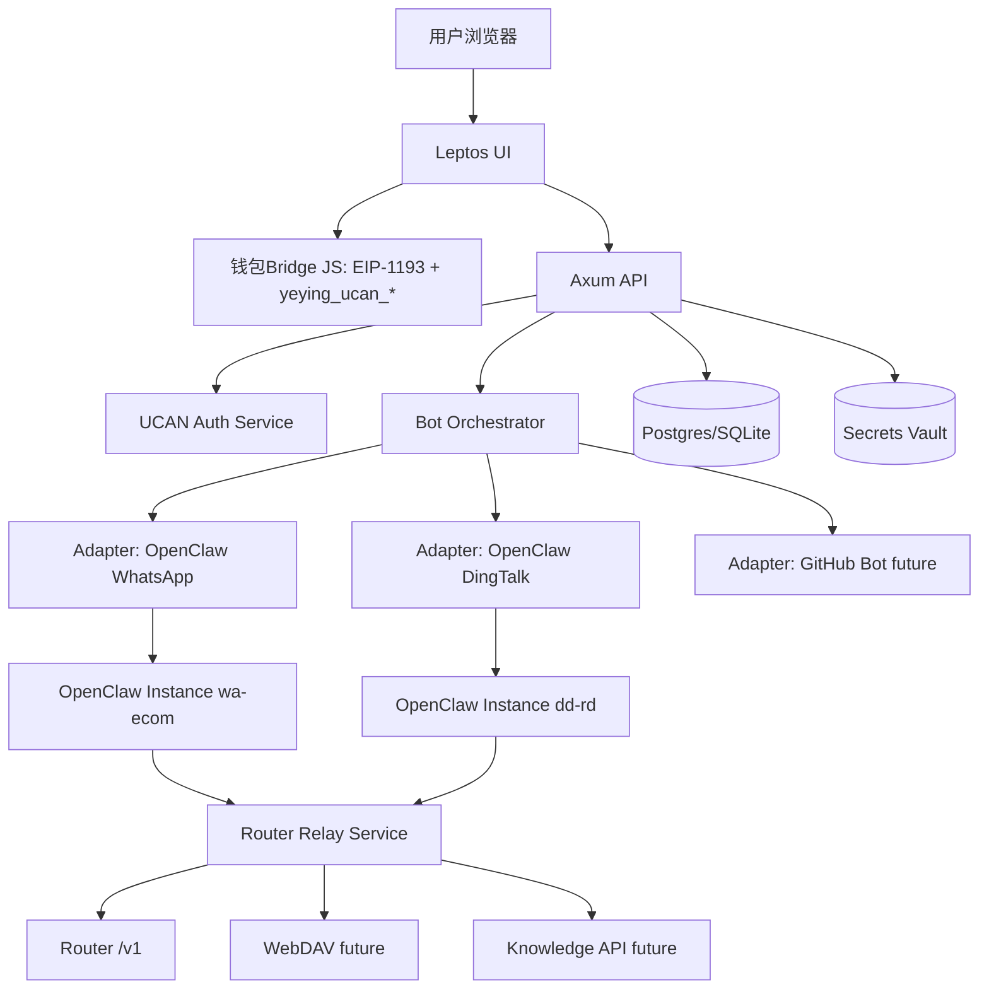
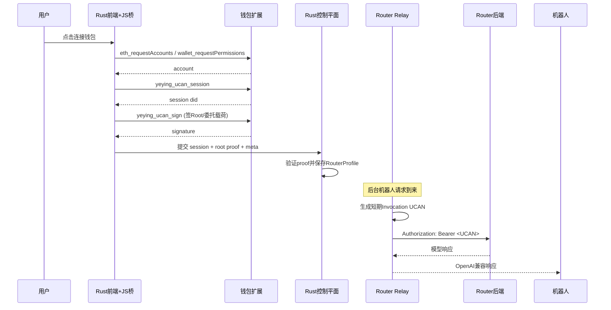
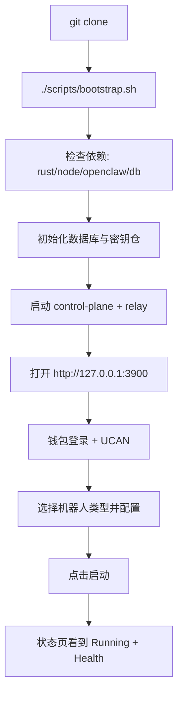

# OpenClow_004_Rust：Rust 统一起机器人控制平面（UCAN + Router + OpenClaw）

> 路径：`/home/snw/SnwHist/FirstExample/OpenClow_004_Rust.md`
>
> 目标：新手小白 `git clone` 后执行一个脚本，打开网页钱包登录一次，即可按页面配置起不同机器人（先 WhatsApp 电商 + 钉钉），并保持机器人互不影响、可持续扩展。

---

## 0. 战报结论（先看）

### 0.1 结论一句话

可落地，而且建议走“**Rust 控制平面 + 机器人适配器 + Router UCAN 统一中继**”路线。

### 0.2 这份方案解决了什么

1. 前后端都用 Rust（满足你的技术方向）。
2. 钱包 UCAN 登录后统一配置 Router（不把机器人业务耦死在钱包流程里）。
3. 先稳落地两类机器人：WhatsApp、钉钉。
4. 用统一流程起机器人，但每个机器人实例独立运行（状态/端口/配置隔离）。
5. 为后续 GitHub 机器人、知识库 API、WebDAV 等扩展留出标准接口。

### 0.3 本文边界

- 这是一份“严格调研后的规划与架构文档”，不是直接改代码提交。
- 聚焦“起机器人 + 配置 + Router 统一鉴权”这一层，机器人内部业务逻辑（电商话术、钉钉工作流）保持解耦。

---

## 1. 严格调研证据（你可以追溯到代码）

## 1.1 `chat` 仓库关键事实（`git@github.com:ShengNW/chat.git`）

### A) 钱包登录 + UCAN Root

- 文件：`app/plugins/wallet.ts`
- 关键点：
  - `connectWallet()` 后调用 `loginWithUcan()`。
  - 通过 `createRootUcan()` 生成 Root UCAN。
  - 本地缓存 `ucanRootExp / ucanRootIss / ucanRootCaps`。
  - 通过 `UCAN_AUTH_EVENT` 广播授权状态变化。

### B) Router 调用不是“普通 API Key”，而是 Invocation UCAN

- 文件：`app/client/platforms/openai.ts`
- 关键点：
  - 请求 Router 前会生成或复用 Invocation UCAN。
  - `Authorization: Bearer <UCAN>`。
  - audience 通过 Router URL 转 `did:web:<host>`。

### C) Root Capabilities 合并 Router + WebDAV

- 文件：`app/plugins/ucan.ts`
- 关键点：
  - Root capability 会统一包含 Router 与 WebDAV 所需能力。
  - `getRouterAudience()` / `getWebdavAudience()` 机制明确。

### D) Chat 文档已明确“双后端 UCAN 一次授权”目标

- 文件：`docs/router-webdav-integration-cn.md`
- 关键点：
  - 浏览器侧一次授权后，可分别访问 Router 与 WebDAV。
  - Invocation UCAN 按后端 audience 签发。

## 1.2 `wallet` 仓库关键事实（`git@github.com:ShengNW/wallet.git`）

### A) 自定义 RPC 方法

- 文件：`js/background/request-router.js`
- 方法：
  - `yeying_ucan_session`
  - `yeying_ucan_sign`
- 关键点：
  - 两个方法调用前必须 `ensureSiteAuthorized(origin)`。
  - 也就是先连接授权（`eth_requestAccounts` / `wallet_requestPermissions`）。

### B) 钱包侧 UCAN session 结构

- 文件：`js/background/ucan.js`
- 关键点：
  - `yeying_ucan_session` 返回 `id/did/createdAt/expiresAt`。
  - `yeying_ucan_sign` 用 session 私钥对 `signingInput` 签名返回 `signature`。

## 1.3 `web3-bs` SDK 关键事实（NPM: `@yeying-community/web3-bs@1.0.5`）

- 关键类型（`dist/auth/ucan.d.ts`）：
  - `UcanRootProof`、`UcanTokenPayload`、`createRootUcan`、`createInvocationUcan`。
- 关键实现（`dist/web3-bs.esm.js`）：
  - UCAN header: `{ alg: "EdDSA", typ: "UCAN" }`。
  - payload: `iss/aud/cap/exp/nbf/prf`。
  - Root proof 是 SIWE 证明链的一部分。

> 结论：你要的 Rust 方案不是“从零猜”，而是已有成熟机制可复刻。

---

## 2. 产品目标与非目标（防止跑偏）

## 2.1 产品目标（P0-P1）

1. 一键部署控制平面。
2. 网页钱包登录 + UCAN 一次鉴权。
3. 页面配置并启动 WhatsApp / 钉钉机器人。
4. 统一 Router 配置（默认 `gpt-5.3-codex`）。
5. 多机器人实例并行，互不影响。

## 2.2 非目标（本阶段）

1. 不重写 OpenClaw 本体。
2. 不重写已有 WhatsApp/钉钉业务流程逻辑。
3. 不先做“万能平台”再落地；先把两类机器人起稳。

---

## 3. 总体架构（Rust 主体 + 机器人解耦）



### 核心思想

- 控制平面只做：鉴权、配置、编排、监控。
- 机器人本体只做：自己的业务逻辑。
- Router 统一能力通过中继层抽象，不散落到每个机器人。

---

## 4. 为什么必须有 Router Relay（关键设计抉择）

你这个项目最难的一点在这里：

- 钱包 UCAN 是浏览器侧签名能力。
- 机器人在服务端独立运行，不能每次请求都弹钱包签名。

如果直接让机器人拿前端短期 Invocation token，会快速过期导致失效。  
所以建议引入 **Router Relay（Rust 服务）**：

1. 用户登录后，控制平面拿到 Root 证明链（可验证）。
2. 控制平面创建“服务端签名身份”（service DID + keypair）。
3. 通过受控授权把服务端身份绑定到用户授权上下文（委托链）。
4. 机器人只调用内网 Relay。
5. Relay 为每次请求签发短期 Invocation UCAN 并转发到 Router。

这样就同时满足：

- 钱包登录是统一入口。
- 机器人可后台持续运行。
- 鉴权集中治理、可审计、可撤销。

---

## 5. UCAN 鉴权链路（Rust 可实现版）



## 5.1 Rust 侧分工

### 前端（Leptos + wasm-bindgen）

- 只做钱包交互与授权操作。
- 通过 JS bridge 调用 `window.ethereum.request`。
- 把授权结果提交给后端。

### 后端（Axum）

- 验证 UCAN proof 合法性、过期时间、audience、capabilities。
- 维护用户 `RouterProfile`。
- 提供机器人编排 API。

### Relay（同一个 Axum 服务里的子路由也可）

- OpenAI-compatible 反向代理。
- 自动附加 UCAN Bearer。
- 处理 token 缓存、过期刷新、失败重试。

---

## 6. 机器人统一抽象（保持独立性）

## 6.1 统一接口：`BotAdapter`

```rust
trait BotAdapter {
    fn kind(&self) -> BotKind;
    async fn validate(&self, cfg: serde_json::Value) -> Result<()>;
    async fn plan(&self, cfg: serde_json::Value) -> Result<LaunchPlan>;
    async fn start(&self, instance: &InstanceSpec) -> Result<RunHandle>;
    async fn stop(&self, instance_id: &str) -> Result<()>;
    async fn status(&self, instance_id: &str) -> Result<InstanceStatus>;
    async fn health(&self, instance_id: &str) -> Result<HealthReport>;
}
```

## 6.2 实例隔离硬规则（必须）

每个实例独立：

- `OPENCLAW_STATE_DIR`
- `OPENCLAW_CONFIG_PATH`
- `OPENCLAW_GATEWAY_PORT`
- `WORKSPACE_DIR`
- `LOG_DIR`
- `INSTANCE_TOKEN`（控制平面到实例）

> 这是保证“钉钉和 WhatsApp 同时跑而不互相污染”的核心。

---

## 7. 两个现有机器人如何落地（具体到可执行）

## 7.1 WhatsApp 机器人适配器（OpenClaw）

- 复用你现有资产：
  - `ops/army/bin/start_army.sh`
  - `ops/army/bin/status_army.sh`
  - `ops/army/bin/stop_army.sh`
- 适配器职责：
  - 为实例渲染独立 `army.env`。
  - 注入 `ROUTER_BASE_URL=http://127.0.0.1:<relay_port>/v1`。
  - 负责启动、状态采集、日志回传。

### UI 需要的配置项

- `instance_name`
- `workspace_profile`（默认 ecom）
- `phone_account_label`
- `group_policy`
- `auto_recover`

## 7.2 钉钉机器人适配器（OpenClaw）

- 复用你已调研目录：`example/example_dd`
- 关键流程：
  - 生成 `.env.local`
  - 执行 `scripts/configure_openclaw_dingtalk.sh`
  - 执行 `scripts/run_openclaw_gateway.sh`
  - 可选运行 `verify_openclaw_*.sh`

### UI 需要的配置项

- `DINGTALK_CLIENT_ID`
- `DINGTALK_CLIENT_SECRET`
- `workspace_profile`（默认 dd）
- `policy_profile`
- `fallback_model`（可选）

---

## 8. 数据模型（让后续扩展不返工）

## 8.1 核心表

1. `users`
2. `wallet_identities`（address, did, origin）
3. `router_profiles`（user_id, audience, caps, delegation, status）
4. `bot_types`（whatsapp, dingtalk, github ...）
5. `bot_instances`（type, owner, status, adapter_version）
6. `bot_instance_configs`（加密存储）
7. `runtime_processes`（pid, ports, state_dir, started_at）
8. `audit_logs`

## 8.2 配置分层

- `GlobalConfig`：全局 Router、Relay、默认模型。
- `TypeConfig`：某类机器人默认模板。
- `InstanceConfig`：实例级配置覆盖。

---

## 9. 一键部署体验设计（新手视角）



## 9.1 `bootstrap.sh` 必做事项

1. 检查系统依赖（Rust toolchain、OpenClaw、Node、数据库）。
2. 初始化 `.env` 与 secrets key。
3. 执行数据库 migration。
4. 编译 Rust 服务。
5. 启动控制平面（后台）。
6. 打印访问地址与初始管理员说明。

---

## 10. API 设计草案（对前端和自动化友好）

## 10.1 鉴权与 Router

- `POST /api/auth/wallet/connect`
- `POST /api/auth/ucan/register`
- `GET  /api/router/profile`
- `POST /api/router/profile/refresh`
- `POST /relay/router/v1/*`（内部调用）

## 10.2 机器人编排

- `GET  /api/bot/types`
- `POST /api/bot/instances`
- `POST /api/bot/instances/:id/start`
- `POST /api/bot/instances/:id/stop`
- `GET  /api/bot/instances/:id/status`
- `GET  /api/bot/instances/:id/logs`
- `POST /api/bot/instances/:id/verify`

## 10.3 扩展能力（预留）

- `POST /api/providers/knowledge/test`
- `POST /api/providers/webdav/test`
- `POST /api/adapters/github/validate`

---

## 11. 技术选型（Rust）

## 11.1 推荐技术栈

- 后端：`axum` + `tokio` + `tower`
- 前端：`leptos`（SSR + hydrate）
- 数据库：`sqlx`（先 SQLite，后可切 PostgreSQL）
- 机密：`age` 或 `ring` + OS keyring
- 日志：`tracing` + `tracing-subscriber`
- 进程管理：`tokio::process::Command` + watchdog task

## 11.2 UCAN 相关 Rust 能力建议

- Ed25519 签名：`ed25519-dalek`
- Base64Url/JWS 拼装：`base64ct`
- SIWE 校验：`siwe` crate（或自定义严格校验）
- DID 处理：自定义最小实现（先支持 `did:web` + `did:pkh:eth`）

---

## 12. 扩展机制设计（未来功能不推倒重来）

## 12.1 GitHub 机器人

- 新增 `GitHubAdapter` 实现同一 `BotAdapter` trait。
- 不改控制平面主流程，只新增 schema + adapter。

## 12.2 钉钉知识库 API

- 在 `ProviderRegistry` 中新增 `KnowledgeProvider`。
- 钉钉适配器只绑定 provider ID，不耦合实现。

## 12.3 WebDAV 总体数据接入

- 抽象 `StorageProvider`。
- 控制平面统一管理凭据和连接状态。
- 机器人实例通过 provider 引用访问，避免硬编码地址。

---

## 13. 风险与化解

## 13.1 风险：钱包离线导致 UCAN续签失败

- 化解：
  - Relay 缓存短期 token + 过期前刷新。
  - 失败进入 `degraded` 状态并告警 UI。
  - 支持临时 API Key 兜底（可选开关）。

## 13.2 风险：实例间配置串写

- 化解：
  - 强制隔离目录 + 端口分配器 + 启动前冲突检查。

## 13.3 风险：后续功能无限膨胀

- 化解：
  - 所有扩展通过 Adapter/Provider 接口接入。
  - 控制平面只管理生命周期，不吞业务逻辑。

---

## 14. 分阶段落地计划（建议）

## Phase P0（2~3 周）

1. Rust 控制平面骨架（登录页/实例页/日志页）。
2. Wallet Bridge + UCAN register 打通。
3. Router Relay 打通并支持 `gpt-5.3-codex`。
4. WhatsApp Adapter 起停闭环。
5. DingTalk Adapter 起停闭环。

**验收标准：**

- 页面可登录。
- 可启动/停止两类机器人。
- 两实例并行互不影响。
- 模型请求统一经 Relay 成功返回。

## Phase P1（2 周）

1. 健康检查、告警、重试策略。
2. 配置模板市场（预置机器人配置）。
3. 一键验收流程（start + verify）。

## Phase P2（按需）

1. GitHub 机器人接入。
2. 知识库 API provider 接入。
3. WebDAV 数据接入统一化。

---

## 15. 新手操作剧本（你要的“照猫画虎能起”）

### 15.1 首次部署

```bash
git clone git@github.com:ShengNW/your-rust-control-plane.git
cd your-rust-control-plane
./scripts/bootstrap.sh
```

### 15.2 打开页面

- 浏览器访问：`http://127.0.0.1:3900`
- 点击“连接钱包并授权 UCAN”

### 15.3 起 WhatsApp 机器人

1. 新建实例 -> 选择 `WhatsApp`
2. 填基础配置 -> 保存
3. 点击启动
4. 在实例详情完成渠道登录（二维码/配对）
5. 看到 `Running + Healthy`

### 15.4 起钉钉机器人

1. 新建实例 -> 选择 `DingTalk`
2. 填 `clientId/clientSecret`
3. 点击启动
4. 执行自检
5. 看到 `Running + Healthy`

---

## 16. 你现在最该做的决策（指挥官清单）

1. 是否确认采用 **Router Relay** 作为统一 Router 接入层（强烈建议“是”）。
2. P0 是否接受“WhatsApp 首次仍需人工扫码”这条现实约束（建议“是”）。
3. 数据库 P0 先 SQLite 还是直接 PostgreSQL（建议先 SQLite，加速起步）。
4. UI 是否先做管理台简版（实例列表 + 配置 + 启停 + 日志）（建议“是”）。

---

## 17. 最终总结

你要的目标不是“再写一个机器人”，而是“做一个能可靠起机器人的产品”。  
这份 Rust 方案把关键矛盾拆开了：

- 钱包与 UCAN负责“可信身份与授权”。
- Relay 负责“统一 Router 调用与续签”。
- Orchestrator 负责“多机器人生命周期管理”。
- Adapter 负责“保留异构机器人独立性”。

先把 WhatsApp + 钉钉两条线跑稳，这个平台就有了真正的产品骨架。后续 GitHub 机器人、知识库、WebDAV 接入都可以“加模块”，而不是“推倒重来”。
