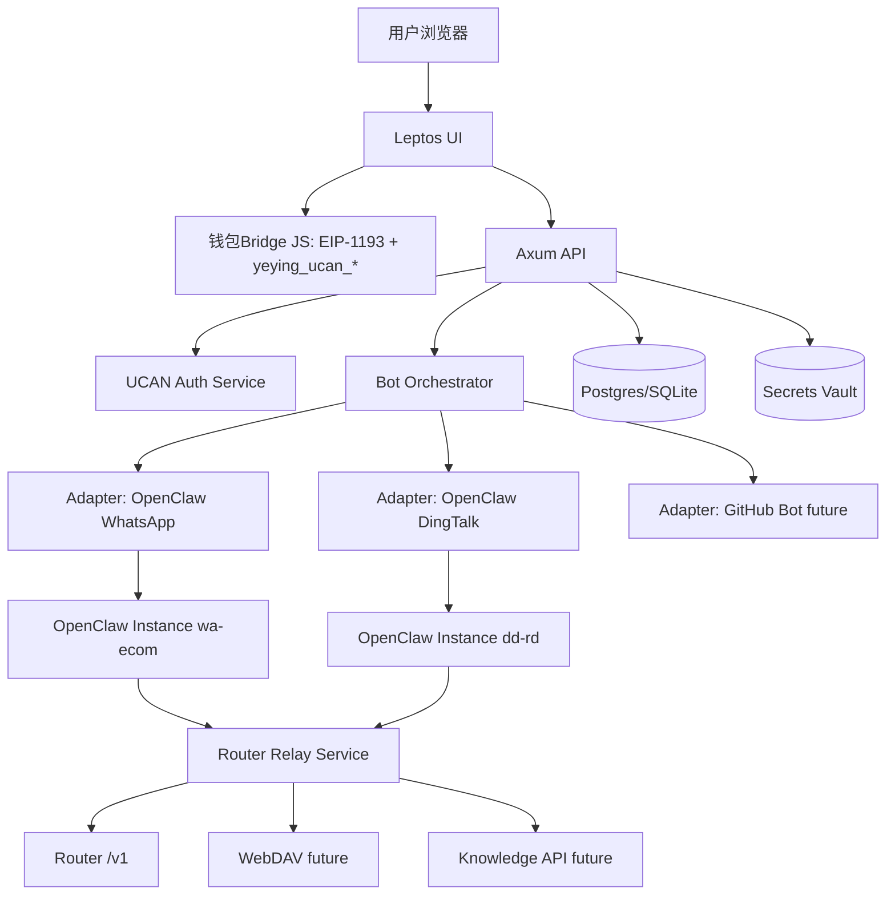
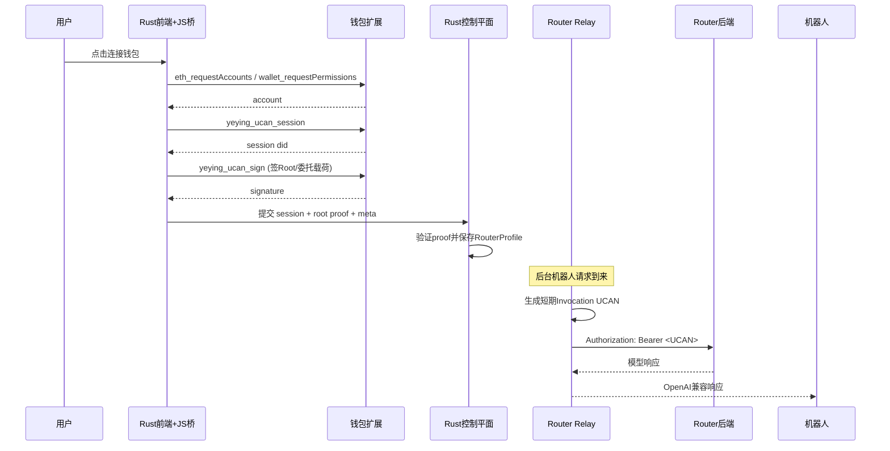
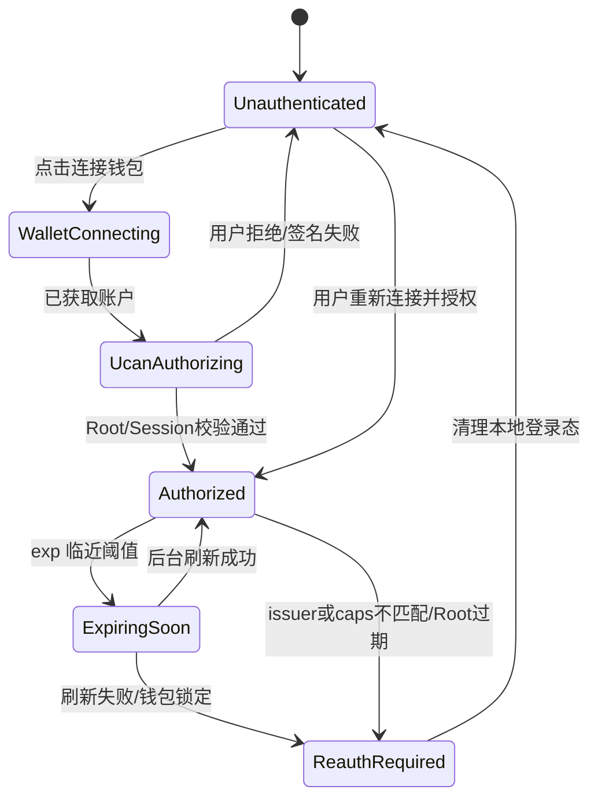
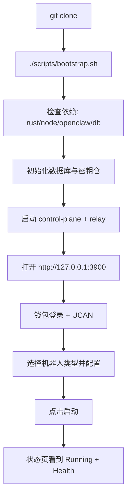
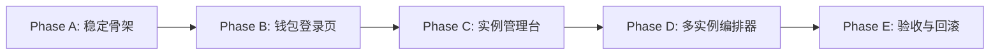
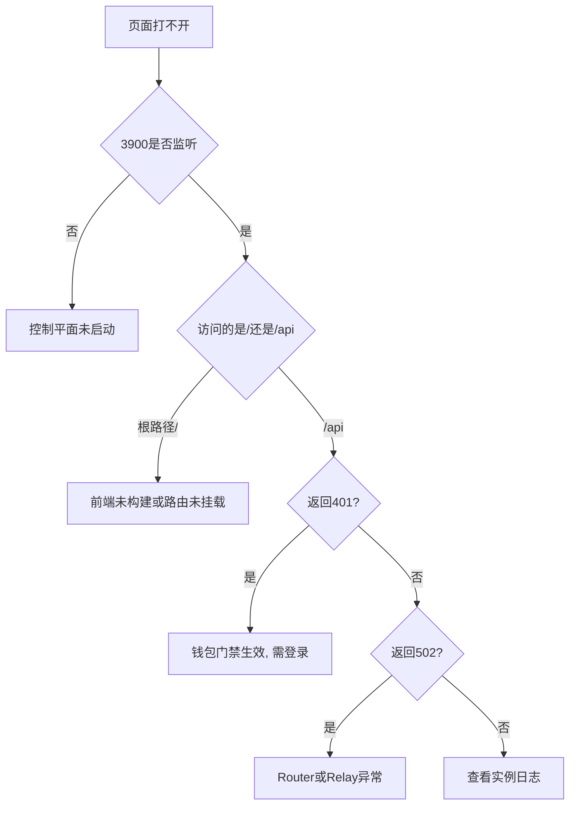

# OpenClow_004_Rust：Rust 统一起机器人控制平面（UCAN + Router + OpenClaw）

> 路径：`/home/snw/SnwHist/FirstExample/OpenClow_004_Rust.md`
>
> 目标：新手小白 `git clone` 后执行一个脚本，打开网页钱包登录一次，即可按页面配置起不同机器人（先 WhatsApp 电商 + 钉钉），并保持机器人互不影响、可持续扩展。

---

## 0. 战报结论（先看）

### 0.1 结论一句话

可落地，而且建议走“**Rust 控制平面 + 机器人适配器 + Router UCAN 统一中继**”路线。

### 0.2 这份方案解决了什么

1. 前后端都用 Rust（满足你的技术方向）。
2. 钱包 UCAN 登录后统一配置 Router（不把机器人业务耦死在钱包流程里）。
3. 先稳落地两类机器人：WhatsApp、钉钉。
4. 用统一流程起机器人，但每个机器人实例独立运行（状态/端口/配置隔离）。
5. 为后续 GitHub 机器人、知识库 API、WebDAV 等扩展留出标准接口。

### 0.3 本文边界

- 这是一份“规划 + 分阶段实装蓝图”文档，不是只讲概念。
- 当前已落地到 **Phase 1（控制平面 API 骨架）**，还没交付完整前端钱包登录管理台。
- 聚焦“起机器人 + 配置 + Router 统一鉴权”这一层，机器人内部业务逻辑（电商话术、钉钉工作流）保持解耦。

### 0.4 你刚才问题的直接回答（不绕弯）

1. `OpenClow_004_Rust.md` 不是“只有 API 骨架”的文档。  
2. 但目前代码落地确实只到 API 骨架阶段，这是事实。  
3. 先做 API 骨架的原因：  
   - 先验证 `public/admin/internal` 接口契约与模型切换策略。  
   - 先把运行时隔离（端口/目录/实例）打稳，避免影响已运行的 WhatsApp 生产链路。  
   - 先证明 Rust 服务、Router 联通、实例模型配置可闭环，再上钱包 UI 和编排台。  
4. 你要的“完整可用 Web 应用”不是被否定，而是下一阶段明确执行项，下面第 18~22 节给出逐步落地方案（含命令、目录、验收）。

### 0.5 什么叫“这份文档做完了”（完成定义）

只有满足以下项，才算你要的“真正做完”：

1. 打开 `http://127.0.0.1:3900` 能看到登录页（非 404/非纯 API JSON）。
2. 未连接钱包时不能进入实例管理页。
3. 连接钱包后能显示账户、复制地址、检测过期并自动要求重连。
4. 页面上能创建多个机器人实例（WhatsApp/钉钉混合）并独立运行。
5. 每个实例有独立 `state/config/log/workspace/port`，互不影响。
6. 每个实例可单独设置模型（默认 `gpt-5.3-codex` 但可改）。
7. 一条命令可拉起全套控制平面（脚本化），新手照文档可复现。

---

## 1. 严格调研证据（你可以追溯到代码）

## 1.1 `chat` 仓库关键事实（`git@github.com:ShengNW/chat.git`）

### A) 钱包登录 + UCAN Root

- 文件：`app/plugins/wallet.ts`
- 关键点：
  - `connectWallet()` 后调用 `loginWithUcan()`。
  - 通过 `createRootUcan()` 生成 Root UCAN。
  - 本地缓存 `ucanRootExp / ucanRootIss / ucanRootCaps`。
  - 通过 `UCAN_AUTH_EVENT` 广播授权状态变化。

### B) Router 调用不是“普通 API Key”，而是 Invocation UCAN

- 文件：`app/client/platforms/openai.ts`
- 关键点：
  - 请求 Router 前会生成或复用 Invocation UCAN。
  - `Authorization: Bearer <UCAN>`。
  - audience 通过 Router URL 转 `did:web:<host>`。

### C) Root Capabilities 合并 Router + WebDAV

- 文件：`app/plugins/ucan.ts`
- 关键点：
  - Root capability 会统一包含 Router 与 WebDAV 所需能力。
  - `getRouterAudience()` / `getWebdavAudience()` 机制明确。

### D) Chat 文档已明确“双后端 UCAN 一次授权”目标

- 文件：`docs/router-webdav-integration-cn.md`
- 关键点：
  - 浏览器侧一次授权后，可分别访问 Router 与 WebDAV。
  - Invocation UCAN 按后端 audience 签发。

## 1.2 `wallet` 仓库关键事实（`git@github.com:ShengNW/wallet.git`）

### A) 自定义 RPC 方法

- 文件：`js/background/request-router.js`
- 方法：
  - `yeying_ucan_session`
  - `yeying_ucan_sign`
- 关键点：
  - 两个方法调用前必须 `ensureSiteAuthorized(origin)`。
  - 也就是先连接授权（`eth_requestAccounts` / `wallet_requestPermissions`）。

### B) 钱包侧 UCAN session 结构

- 文件：`js/background/ucan.js`
- 关键点：
  - `yeying_ucan_session` 返回 `id/did/createdAt/expiresAt`。
  - `yeying_ucan_sign` 用 session 私钥对 `signingInput` 签名返回 `signature`。

## 1.3 `web3-bs` SDK 关键事实（NPM: `@yeying-community/web3-bs@1.0.5`）

- 关键类型（`dist/auth/ucan.d.ts`）：
  - `UcanRootProof`、`UcanTokenPayload`、`createRootUcan`、`createInvocationUcan`。
- 关键实现（`dist/web3-bs.esm.js`）：
  - UCAN header: `{ alg: "EdDSA", typ: "UCAN" }`。
  - payload: `iss/aud/cap/exp/nbf/prf`。
  - Root proof 是 SIWE 证明链的一部分。

> 结论：你要的 Rust 方案不是“从零猜”，而是已有成熟机制可复刻。

## 1.4 `chat` 登录页/钱包体验细节（补充映射，Rust实现）

你提到的“只参考登录和钱包相关部分”，这里明确补齐：

### A) 一进网页必须先完成钱包授权

- 参考实现：
  - `app/hooks/useAuth.ts`
  - `app/components/auth.tsx`
- 关键行为：
  - 未授权时阻止进入主页面（登录门禁）。
  - 监听 `UCAN_AUTH_EVENT` 与 `storage` 变化，实时刷新授权状态。

### B) 首次连接后账户显示/历史账户选择

- 参考实现：
  - `app/components/auth.tsx`
- 关键行为：
  - 保存并展示历史账户列表（本地缓存，去重，限制条数）。
  - 支持从历史账户中选择“期望账户”后发起连接。
  - 登录后在顶部区域显示当前账户（短地址展示 + 全地址 tooltip）。

### C) 账户复制与身份可见性

- 参考实现（UI交互层面）：
  - `auth.tsx` 的账户展示逻辑 + 现有 Chat 常用 copy 交互模式
- Rust 落地要求：
  - 账户展示组件必须内置复制按钮（复制完整地址）。
  - 复制成功/失败需要 toast 反馈。
  - 兼容移动端点击复制。

### D) 钱包过期与自动重连提示

- 参考实现：
  - `app/plugins/wallet.ts`（`isValidUcanAuthorization`、过期与 issuer/caps 校验）
  - `app/plugins/ucan-session.ts`（session 缓存与刷新）
- 关键行为：
  - Root 过期、issuer 不匹配、caps 不匹配时清理本地授权状态。
  - 自动切回登录态，并提示“需要重新连接钱包授权”。
  - 登录页保留上次账户记录，用户可一键重连。

### E) 登录页视觉识别（含 Logo）

- 参考实现：
  - `app/components/auth.tsx` 中 `Logo` 顶部展示逻辑
- Rust 落地要求：
  - 保留“品牌 Logo + 登录主按钮 + 钱包状态”三段式布局。
  - 保证移动端与桌面端视觉一致性，不弱化入口辨识度。

---

## 2. 产品目标与非目标（防止跑偏）

## 2.1 产品目标（P0-P1）

1. 一键部署控制平面。
2. 网页钱包登录 + UCAN 一次鉴权。
3. 页面配置并启动 WhatsApp / 钉钉机器人。
4. 统一 Router 配置（默认 `gpt-5.3-codex`，但可按策略改成其他模型）。
5. 多机器人实例并行，互不影响。

## 2.2 非目标（本阶段）

1. 不重写 OpenClaw 本体。
2. 不重写已有 WhatsApp/钉钉业务流程逻辑。
3. 不先做“万能平台”再落地；先把两类机器人起稳。

---

## 3. 总体架构（Rust 主体 + 机器人解耦）



### 核心思想

- 控制平面只做：鉴权、配置、编排、监控。
- 机器人本体只做：自己的业务逻辑。
- Router 统一能力通过中继层抽象，不散落到每个机器人。

---

## 4. 为什么必须有 Router Relay（关键设计抉择）

你这个项目最难的一点在这里：

- 钱包 UCAN 是浏览器侧签名能力。
- 机器人在服务端独立运行，不能每次请求都弹钱包签名。

如果直接让机器人拿前端短期 Invocation token，会快速过期导致失效。  
所以建议引入 **Router Relay（Rust 服务）**：

1. 用户登录后，控制平面拿到 Root 证明链（可验证）。
2. 控制平面创建“服务端签名身份”（service DID + keypair）。
3. 通过受控授权把服务端身份绑定到用户授权上下文（委托链）。
4. 机器人只调用内网 Relay。
5. Relay 为每次请求签发短期 Invocation UCAN 并转发到 Router。

这样就同时满足：

- 钱包登录是统一入口。
- 机器人可后台持续运行。
- 鉴权集中治理、可审计、可撤销。

---

## 5. UCAN 鉴权链路（Rust 可实现版）



## 5.1 Rust 侧分工

### 前端（Leptos + wasm-bindgen）

- 只做钱包交互与授权操作。
- 通过 JS bridge 调用 `window.ethereum.request`。
- 把授权结果提交给后端。

### 后端（Axum）

- 验证 UCAN proof 合法性、过期时间、audience、capabilities。
- 维护用户 `RouterProfile`。
- 提供机器人编排 API。

### Relay（同一个 Axum 服务里的子路由也可）

- OpenAI-compatible 反向代理。
- 自动附加 UCAN Bearer。
- 处理 token 缓存、过期刷新、失败重试。

## 5.2 登录门禁与过期重连状态机（对齐 `chat`，Rust实现）



落地规则：

1. 路由门禁：除登录页外，任何页面都需 `Authorized` 状态。  
2. 状态监听：前端持续监听 `UCAN_AUTH_EVENT`、`storage`、页面可见性恢复事件。  
3. 自动降级：过期或不一致时，立即降级到 `ReauthRequired`，不允许继续发起机器人控制操作。  
4. 友好恢复：登录页自动带出最近账户，支持“一键重连”。  
5. 风险控制：若签名在处理中（pending lock），UI 显示处理中状态，避免重复发起签名。  

---

## 6. 机器人统一抽象（保持独立性）

## 6.1 统一接口：`BotAdapter`

```rust
trait BotAdapter {
    fn kind(&self) -> BotKind;
    async fn validate(&self, cfg: serde_json::Value) -> Result<()>;
    async fn plan(&self, cfg: serde_json::Value) -> Result<LaunchPlan>;
    async fn start(&self, instance: &InstanceSpec) -> Result<RunHandle>;
    async fn stop(&self, instance_id: &str) -> Result<()>;
    async fn status(&self, instance_id: &str) -> Result<InstanceStatus>;
    async fn health(&self, instance_id: &str) -> Result<HealthReport>;
}
```

## 6.2 实例隔离硬规则（必须）

每个实例独立：

- `OPENCLAW_STATE_DIR`
- `OPENCLAW_CONFIG_PATH`
- `OPENCLAW_GATEWAY_PORT`
- `WORKSPACE_DIR`
- `LOG_DIR`
- `INSTANCE_TOKEN`（控制平面到实例）

> 这是保证“钉钉和 WhatsApp 同时跑而不互相污染”的核心。

---

## 7. 两个现有机器人如何落地（具体到可执行）

## 7.1 WhatsApp 机器人适配器（OpenClaw）

- 复用你现有资产：
  - `ops/army/bin/start_army.sh`
  - `ops/army/bin/status_army.sh`
  - `ops/army/bin/stop_army.sh`
- 适配器职责：
  - 为实例渲染独立 `army.env`。
  - 注入 `ROUTER_BASE_URL=http://127.0.0.1:<relay_port>/v1`。
  - 负责启动、状态采集、日志回传。

### UI 需要的配置项

- `instance_name`
- `workspace_profile`（默认 ecom）
- `phone_account_label`
- `group_policy`
- `auto_recover`

## 7.2 钉钉机器人适配器（OpenClaw）

- 复用你已调研目录：`example/example_dd`
- 关键流程：
  - 生成 `.env.local`
  - 执行 `scripts/configure_openclaw_dingtalk.sh`
  - 执行 `scripts/run_openclaw_gateway.sh`
  - 可选运行 `verify_openclaw_*.sh`

### UI 需要的配置项

- `DINGTALK_CLIENT_ID`
- `DINGTALK_CLIENT_SECRET`
- `workspace_profile`（默认 dd）
- `policy_profile`
- `fallback_model`（可选）

---

## 8. 数据模型（让后续扩展不返工）

## 8.1 核心表

1. `users`
2. `wallet_identities`（address, did, origin）
3. `router_profiles`（user_id, audience, caps, delegation, status）
4. `bot_types`（whatsapp, dingtalk, github ...）
5. `bot_instances`（type, owner, status, adapter_version）
6. `bot_instance_configs`（加密存储）
7. `runtime_processes`（pid, ports, state_dir, started_at）
8. `audit_logs`

## 8.2 配置分层

- `GlobalConfig`：全局 Router、Relay、默认模型。
- `TypeConfig`：某类机器人默认模板。
- `InstanceConfig`：实例级配置覆盖。

## 8.3 模型可变更方案（回答“默认 gpt-5.3-codex 能不能改”）

可以改，而且必须设计成“可控地改”。

### 优先级规则（高到低）

1. `InstanceConfig.model`（实例级）
2. `TypeConfig.default_model`（机器人类型级）
3. `GlobalConfig.default_model`（全局级，默认 `gpt-5.3-codex`）

### 变更策略

1. UI 提供模型下拉（来源 Router `/models`），允许切换。  
2. 切换时写入实例配置并触发“热更新或滚动重启”。  
3. 失败自动回滚到上一个可用模型。  
4. 审计日志记录“谁在何时把模型从 A 改到 B”。  

### 安全约束

1. 只有 `admin` 权限可改全局默认模型。  
2. 普通用户只可改自己实例（或租户范围内）模型。  
3. 可配置模型 allowlist，防止误选高风险/高成本模型。  

---

## 9. 一键部署体验设计（新手视角）



## 9.1 `bootstrap.sh` 必做事项

1. 检查系统依赖（Rust toolchain、OpenClaw、Node、数据库）。
2. 初始化 `.env` 与 secrets key。
3. 执行数据库 migration。
4. 编译 Rust 服务。
5. 启动控制平面（后台）。
6. 打印访问地址与初始管理员说明。

---

## 10. API 规范化设计（对齐 Interface 规范）

## 10.1 分类与路径（必须）

每个接口只属于一种分类：

1. `public`：外部开发者、前端、移动端调用。  
2. `admin`：运营/管理员调用。  
3. `internal`：服务间调用、任务系统调用。  

统一路径前缀：

1. `/api/v1/public/*`
2. `/api/v1/admin/*`
3. `/api/v1/internal/*`

冲突判定按你给的规范：

1. 覆盖 public 的归 public。  
2. 同时覆盖 admin/internal 的归 admin。  

## 10.2 接口定义存放（proto）

按规范放到 interface 仓库：

1. 公共能力接口：`yeying/api/common`（如 auth/health）  
2. 本服务专有接口：`yeying/api/bot_control_plane`（建议新建）  

建议流程：

1. 先写 proto（grpc + http option）。  
2. 再生成 Rust 代码（建议使用生成代码，不强制）。  
3. 控制平面与前端只消费生成的契约。  

## 10.3 v1 接口清单（首版草案）

### public（前端/移动端）

1. `POST /api/v1/public/auth/wallet:connect`  
2. `POST /api/v1/public/auth/ucan:register`  
3. `GET /api/v1/public/auth/me`  
4. `GET /api/v1/public/bot/types`  
5. `POST /api/v1/public/bot/instances`  
6. `GET /api/v1/public/bot/instances/{id}`  
7. `POST /api/v1/public/bot/instances/{id}:start`  
8. `POST /api/v1/public/bot/instances/{id}:stop`  
9. `GET /api/v1/public/bot/instances/{id}/logs`  
10. `POST /api/v1/public/bot/instances/{id}:verify`  
11. `GET /api/v1/public/router/models`（给模型下拉）  
12. `PATCH /api/v1/public/bot/instances/{id}/model`（实例级模型切换）  

### admin（运营/管理员）

1. `GET /api/v1/admin/bot/instances`（全量检索）  
2. `POST /api/v1/admin/bot/instances/{id}:restart`  
3. `PATCH /api/v1/admin/router/default-model`（改全局默认模型）  
4. `PATCH /api/v1/admin/router/model-allowlist`  
5. `POST /api/v1/admin/providers/knowledge:test`  
6. `POST /api/v1/admin/providers/webdav:test`  
7. `POST /api/v1/admin/adapters/github:validate`  
8. `POST /api/v1/admin/users/{id}:block`（预留）  

### internal（服务间/任务）

1. `POST /api/v1/internal/router:proxy`（Relay 内部入口）  
2. `POST /api/v1/internal/runtime/processes:reconcile`  
3. `POST /api/v1/internal/runtime/events:ingest`  
4. `POST /api/v1/internal/runtime/health:probe`  
5. `POST /api/v1/internal/audit:append`  

## 10.4 向下兼容策略（v1 -> v2 规则）

1. 能兼容就不改 `/api/v1/*`。  
2. 不兼容变更才升 `/api/v2/*`。  
3. v1 的字段新增遵循“可选新增，不删除不改语义”。  
4. 对外发布前做 proto 兼容检查（字段号、oneof、枚举扩展）。  

---

## 11. 技术选型（Rust）

## 11.1 推荐技术栈

- 后端：`axum` + `tokio` + `tower`
- 前端：`leptos`（SSR + hydrate）
- 数据库：`sqlx`（先 SQLite，后可切 PostgreSQL）
- 机密：`age` 或 `ring` + OS keyring
- 日志：`tracing` + `tracing-subscriber`
- 进程管理：`tokio::process::Command` + watchdog task

## 11.2 UCAN 相关 Rust 能力建议

- Ed25519 签名：`ed25519-dalek`
- Base64Url/JWS 拼装：`base64ct`
- SIWE 校验：`siwe` crate（或自定义严格校验）
- DID 处理：自定义最小实现（先支持 `did:web` + `did:pkh:eth`）

---

## 12. 扩展机制设计（未来功能不推倒重来）

## 12.1 GitHub 机器人

- 新增 `GitHubAdapter` 实现同一 `BotAdapter` trait。
- 不改控制平面主流程，只新增 schema + adapter。

## 12.2 钉钉知识库 API

- 在 `ProviderRegistry` 中新增 `KnowledgeProvider`。
- 钉钉适配器只绑定 provider ID，不耦合实现。

## 12.3 WebDAV 总体数据接入

- 抽象 `StorageProvider`。
- 控制平面统一管理凭据和连接状态。
- 机器人实例通过 provider 引用访问，避免硬编码地址。

---

## 13. 风险与化解

## 13.1 风险：钱包离线导致 UCAN续签失败

- 化解：
  - Relay 缓存短期 token + 过期前刷新。
  - 失败进入 `degraded` 状态并告警 UI。
  - 支持临时 API Key 兜底（可选开关）。

## 13.2 风险：实例间配置串写

- 化解：
  - 强制隔离目录 + 端口分配器 + 启动前冲突检查。

## 13.3 风险：后续功能无限膨胀

- 化解：
  - 所有扩展通过 Adapter/Provider 接口接入。
  - 控制平面只管理生命周期，不吞业务逻辑。

---

## 14. 分阶段落地计划（建议）

## Phase P0（2~3 周）

1. Rust 控制平面骨架（登录页/实例页/日志页）。
2. Wallet Bridge + UCAN register 打通。
3. Router Relay 打通并支持 `gpt-5.3-codex`。
4. WhatsApp Adapter 起停闭环。
5. DingTalk Adapter 起停闭环。

**验收标准：**

- 页面可登录。
- 可启动/停止两类机器人。
- 两实例并行互不影响。
- 模型请求统一经 Relay 成功返回。

## Phase P1（2 周）

1. 健康检查、告警、重试策略。
2. 配置模板市场（预置机器人配置）。
3. 一键验收流程（start + verify）。

## Phase P2（按需）

1. GitHub 机器人接入。
2. 知识库 API provider 接入。
3. WebDAV 数据接入统一化。

---

## 15. 新手操作剧本（你要的“照猫画虎能起”）

### 15.1 首次部署

```bash
git clone git@github.com:ShengNW/your-rust-control-plane.git
cd your-rust-control-plane
./scripts/bootstrap.sh
```

### 15.2 打开页面

- 浏览器访问：`http://127.0.0.1:3900`
- 点击“连接钱包并授权 UCAN”

### 15.3 起 WhatsApp 机器人

1. 新建实例 -> 选择 `WhatsApp`
2. 填基础配置 -> 保存
3. 点击启动
4. 在实例详情完成渠道登录（二维码/配对）
5. 看到 `Running + Healthy`

### 15.4 起钉钉机器人

1. 新建实例 -> 选择 `DingTalk`
2. 填 `clientId/clientSecret`
3. 点击启动
4. 执行自检
5. 看到 `Running + Healthy`

---

## 16. 你现在最该做的决策（指挥官清单）

1. 是否确认采用 **Router Relay** 作为统一 Router 接入层（强烈建议“是”）。
2. P0 是否接受“WhatsApp 首次仍需人工扫码”这条现实约束（建议“是”）。
3. 数据库 P0 先 SQLite 还是直接 PostgreSQL（建议先 SQLite，加速起步）。
4. UI 是否先做管理台简版（实例列表 + 配置 + 启停 + 日志）（建议“是”）。

---

## 17. 最终总结

你要的目标不是“再写一个机器人”，而是“做一个能可靠起机器人的产品”。  
这份 Rust 方案把关键矛盾拆开了：

- 钱包与 UCAN负责“可信身份与授权”。
- Relay 负责“统一 Router 调用与续签”。
- Orchestrator 负责“多机器人生命周期管理”。
- Adapter 负责“保留异构机器人独立性”。

先把 WhatsApp + 钉钉两条线跑稳，这个平台就有了真正的产品骨架。后续 GitHub 机器人、知识库、WebDAV 接入都可以“加模块”，而不是“推倒重来”。

---

## 18. 当前实装状态快照（截至 2026-03-12）

## 18.1 已经落地（代码层）

对应实机目录：`/home/administrator/code/bot_hub`

1. Rust 控制平面工程已创建：`rust/control-plane`
2. 关键接口已可跑（`public/admin/internal` 基础端点）
3. 模型默认值与实例级模型切换已可用（骨架级）
4. 启动脚本已具备：
   - `scripts/bootstrap_rust_control_plane.sh`
   - `scripts/run_control_plane_dev.sh`
5. `3900` 健康接口已验证可通：`/api/v1/public/health`

## 18.2 还未落地（你真正关心的缺口）

1. 登录页 UI 还没做出来（目前是 API 服务，不是可视化管理台）。
2. 钱包连接与 UCAN 前端交互未接入（`window.ethereum + yeying_ucan_*`）。
3. 实例管理页未实现（创建/编辑/启动/停止/日志流）。
4. 多实例编排器还未把 OpenClaw 完整接起来。
5. 端口分配、实例目录隔离、watchdog 自愈仍处于设计未全量实装。

## 18.3 所以你看到 `ERR_CONNECTION_REFUSED` 的真实含义

不是“方案错了”，是“服务没启动”或“访问了不存在的页面路由”：

1. 未启动时：`127.0.0.1:3900` 直接拒绝连接（`REFUSED`）。
2. 启动后访问根路径 `/`：当前可能是 `404`（因为还没前端页面）。
3. 启动后访问 API：`/api/v1/public/health` 返回正常 JSON。

---

## 19. 从 API 骨架到完整 Web 应用的落地总计划（可执行）

这部分是“按部就班照猫画虎可起”的执行蓝图，按阶段推进，不跳步。



## 19.1 绝对路径与目录约定（固定）

远端 WSL 根路径（开发主路径）：

1. `/home/administrator/code/bot_hub`（主仓）
2. `/home/administrator/code/bot_hub/rust/control-plane`（Rust 控制平面）
3. `/home/administrator/code/bot_hub/runtime`（运行态数据）
4. `/home/administrator/code/bot_hub/runtime/instances/<instance_id>`（实例隔离目录）

实例隔离目录统一结构：

```text
runtime/instances/<instance_id>/
  config/
    openclaw.json
    env.local
  state/
  workspace/
  logs/
    gateway.log
    orchestrator.log
  meta/
    ports.json
    pid.json
```

## 19.2 一键脚本总览（最终交付必须有）

必须新增并维护以下脚本（命名固定）：

1. `scripts/bootstrap_full_stack.sh`
2. `scripts/run_full_stack.sh`
3. `scripts/stop_full_stack.sh`
4. `scripts/status_full_stack.sh`
5. `scripts/doctor_full_stack.sh`

脚本职责：

1. `bootstrap_full_stack.sh`：安装依赖、初始化 DB、生成 `.env` 模板、编译 Rust。
2. `run_full_stack.sh`：启动控制平面 + 前端 + 编排器（后台守护）。
3. `stop_full_stack.sh`：按 PID 清理相关服务，不影响现网已标记“外部托管”的实例。
4. `status_full_stack.sh`：输出端口、进程、关键健康状态。
5. `doctor_full_stack.sh`：网络、Router、钱包桥、实例目录权限综合体检。

## 19.3 Phase A：稳固当前骨架（1 天）

目标：把“可跑 API”变成“可重复启动、可观察、可回收”的基础盘。

必做事项：

1. 增加 `Makefile`/脚本入口统一命令。
2. 把 `run_control_plane_dev.sh` 改为支持 PID 文件输出。
3. 增加 `/api/v1/public/version` 与 `/api/v1/internal/runtime/processes:reconcile`。
4. 增加 structured logs（实例 ID、请求 ID、route、latency）。

WSL 命令：

```bash
cd /home/administrator/code/bot_hub
bash scripts/bootstrap_rust_control_plane.sh
bash scripts/run_control_plane_dev.sh
curl -sS http://127.0.0.1:3900/api/v1/public/health
```

验收标准：

1. 重复执行启动脚本不会残留僵尸进程。
2. `status` 可打印控制平面 PID、监听端口、启动时长。

## 19.4 Phase B：钱包登录页与门禁（2~3 天）

目标：实现“未登录不能操作，登录后可见身份，过期自动回登录”。

前端页面最小集合：

1. `/login`：Logo + 连接钱包按钮 + 历史账户列表 + 复制地址
2. `/dashboard`：受保护页（未授权自动跳转 `/login`）

关键实现点：

1. JS bridge（`window.ethereum.request`）
2. 调用 `yeying_ucan_session`、`yeying_ucan_sign`
3. 本地状态机（Unauthenticated/Authorized/ReauthRequired）
4. 监听 `UCAN_AUTH_EVENT` 与 `storage` 变化
5. 过期后自动清理并重定向登录

建议目录：

```text
rust/control-plane/frontend/
  src/
    pages/login.rs
    pages/dashboard.rs
    components/account_badge.rs
    hooks/use_auth_state.rs
    wallet/bridge.rs
```

验收标准：

1. 不连钱包访问 `/dashboard` 会被拦截。
2. 登录后显示短地址，点击可复制全地址。
3. 模拟过期后自动回到 `/login`。

## 19.5 Phase C：实例管理台（2 天）

目标：在 UI 上完成“创建实例 -> 配置 -> 启动 -> 看日志 -> 停止”。

页面：

1. `实例列表页`：类型、状态、端口、模型、最近心跳
2. `实例配置页`：按类型渲染表单（WhatsApp/钉钉）
3. `实例详情页`：日志、健康、最近错误、重启按钮

API 最小闭环：

1. `POST /api/v1/public/bot/instances`
2. `POST /api/v1/public/bot/instances/{id}:start`
3. `POST /api/v1/public/bot/instances/{id}:stop`
4. `GET /api/v1/public/bot/instances/{id}`
5. `GET /api/v1/public/bot/instances/{id}/logs`

验收标准：

1. 页面不需要命令行即可新建和启动实例。
2. 实例错误能在页面被看见并定位。

## 19.6 Phase D：多实例独立编排器（3~4 天）

目标：同机并行多个 WhatsApp 电商机器人和钉钉机器人，互不影响。

端口分配策略（固定规则）：

1. 控制平面：`3900`
2. Relay（可内嵌）：`3901`（如单服务内嵌可省）
3. 实例网关池：`18800-18999`
4. 同一实例端口冲突时自动重试下一个空闲端口

实例隔离硬规则：

1. 每个实例唯一 `instance_id`
2. 每个实例唯一 `OPENCLAW_STATE_DIR`
3. 每个实例唯一 `OPENCLAW_CONFIG_PATH`
4. 每个实例唯一 `OPENCLAW_GATEWAY_PORT`
5. 每个实例唯一日志目录

Orchestrator 启停命令模板（WSL）：

```bash
INSTANCE_ID=wa-ecom-001
BASE=/home/administrator/code/bot_hub/runtime/instances/$INSTANCE_ID
mkdir -p "$BASE"/{config,state,workspace,logs,meta}

export OPENCLAW_STATE_DIR="$BASE/state"
export OPENCLAW_CONFIG_PATH="$BASE/config/openclaw.json"
export OPENCLAW_GATEWAY_PORT="18801"

nohup openclaw gateway run --allow-unconfigured \
  >"$BASE/logs/gateway.log" 2>&1 &
echo $! > "$BASE/meta/pid.json"
```

钉钉实例启动模板（示意）：

```bash
INSTANCE_ID=dd-rd-001
BASE=/home/administrator/code/bot_hub/runtime/instances/$INSTANCE_ID
mkdir -p "$BASE"/{config,state,workspace,logs,meta}

cp /home/administrator/code/bot_hub/example/example_dd/config/env.example "$BASE/config/env.local"
# 写入钉钉凭据后，交由 adapter 调用现有脚本
bash /home/administrator/code/bot_hub/example/example_dd/scripts/run_openclaw_gateway.sh
```

验收标准：

1. 同时运行 `wa-ecom-001`、`wa-ecom-002`、`dd-rd-001` 三实例互不影响。
2. 停掉一个实例不影响另外两个实例。
3. 任意实例可单独改模型，不影响其他实例。

## 19.7 Phase E：全链路验收与演示（1~2 天）

E2E 场景一（WhatsApp 电商）：

1. 登录 Web 管理台
2. 新建 `wa-ecom-001`，设置默认模型
3. 启动实例并完成扫码绑定
4. 在群聊发询价消息，机器人回复
5. 修改该实例模型，验证只影响该实例

E2E 场景二（钉钉）：

1. 新建 `dd-rd-001`
2. 配置钉钉凭据与策略
3. 启动并回显健康状态
4. 消息触发后完成预期工作流

---

## 20. Windows / WSL / SSH 三端命令手册（可直接复制）

## 20.1 Windows PowerShell（运维视角）

```powershell
# 检查 3900 接口
curl.exe -s http://127.0.0.1:3900/api/v1/public/health

# 远程进 WSL 快速查看
ssh cnwin-admin-via-vps "wsl.exe -e bash -lc 'ss -lntp | grep 3900 || true'"
```

## 20.2 WSL（开发视角）

```bash
cd /home/administrator/code/bot_hub
bash scripts/bootstrap_full_stack.sh
bash scripts/run_full_stack.sh
bash scripts/status_full_stack.sh
```

## 20.3 本地（通过技能脚本）

```bash
/home/snw/.codex-ru/skills/cnwin-wsl-ops/scripts/check_cnwin_wsl.sh
/home/snw/.codex-ru/skills/cnwin-wsl-ops/scripts/run_cnwin_wsl.sh \
  "cd /home/administrator/code/bot_hub && bash scripts/status_full_stack.sh"
```

---

## 21. 故障分流与排错（现象 -> 根因 -> 处理 -> 验证）



1. 现象：`ERR_CONNECTION_REFUSED`  
   - 根因：控制平面没启动，或端口未监听。  
   - 处理：`bash scripts/run_full_stack.sh`。  
   - 验证：`curl http://127.0.0.1:3900/api/v1/public/health` 返回 `ok:true`。  

2. 现象：打开 `http://127.0.0.1:3900/` 是 `404`  
   - 根因：前端页面未挂载，仅 API 可用。  
   - 处理：构建并启动前端路由。  
   - 验证：`/login` 可见钱包登录页。  

3. 现象：钱包已连但频繁掉线  
   - 根因：UCAN 过期或 issuer/caps 不匹配。  
   - 处理：清理本地授权缓存，重新连接钱包。  
   - 验证：`/api/v1/public/auth/me` 返回当前钱包地址。  

4. 现象：某个机器人启动后其他机器人异常  
   - 根因：实例目录或端口未隔离。  
   - 处理：检查 `runtime/instances/<id>/meta/ports.json` 与环境变量。  
   - 验证：多实例端口唯一、日志目录唯一。  

---

## 22. 回滚策略（必须可执行）

## 22.1 代码回滚

```bash
cd /home/administrator/code/bot_hub
git fetch --prune origin
git checkout main
git reset --hard origin/main
```

## 22.2 运行态回滚（不碰现网 WhatsApp 生产实例）

```bash
cd /home/administrator/code/bot_hub
bash scripts/stop_full_stack.sh
# 仅清理 control-plane 侧 runtime，不动既有 openclaw-env-army 路径
rm -rf /home/administrator/code/bot_hub/runtime/control-plane || true
```

## 22.3 数据回滚

1. DB 每次 migration 前做备份快照。
2. 配置文件按实例备份：`config/openclaw.json.bak.<time>`。
3. 回滚后先执行 `status_full_stack.sh`，再做 E2E 冒烟。

---

## 23. 给你的最终承诺（对齐你的要求）

1. 不再把“API 骨架”包装成“完整产品已交付”。
2. 以本文件第 0.5 条完成定义作为唯一验收线。
3. 后续每推进一个阶段，都回写本文件的“已完成/未完成清单”。
4. 在你确认 Phase B-D 完成前，不新开 `OpenClaw_005_plan.md` 分散焦点。
