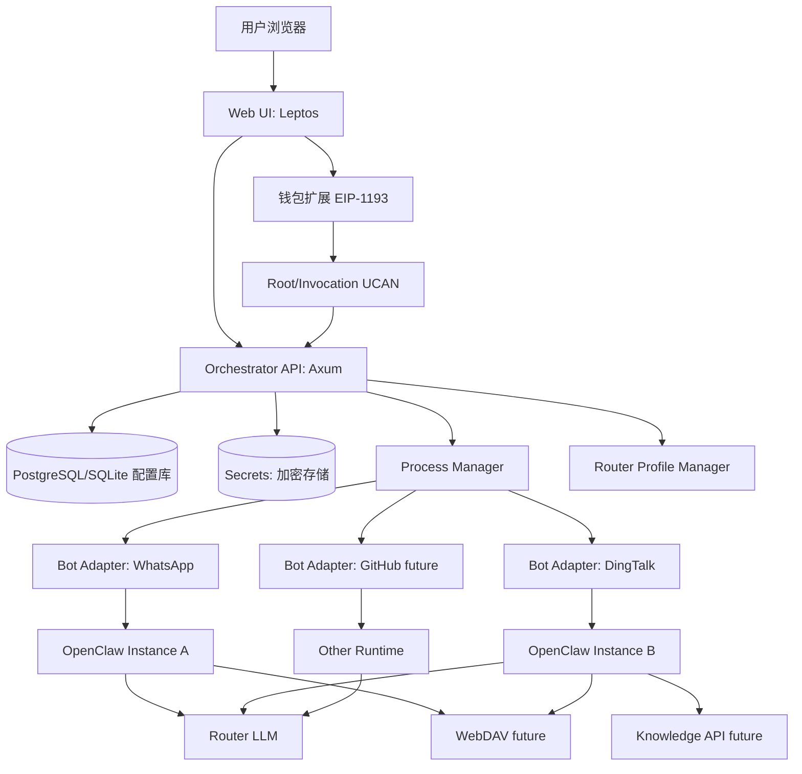
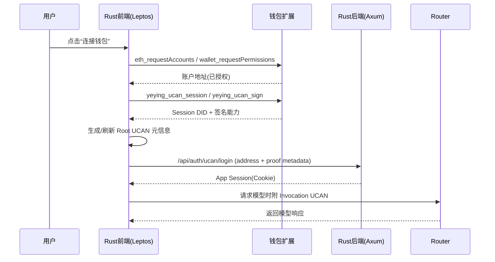
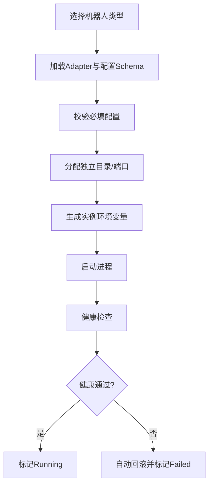
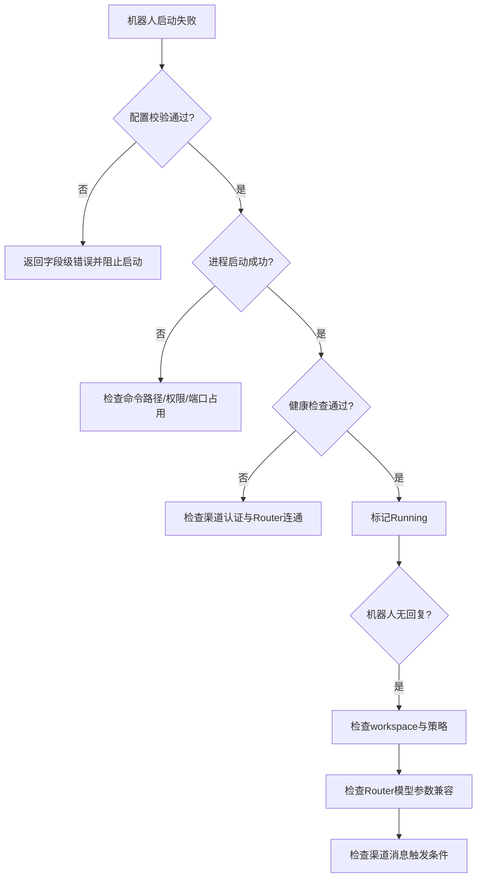

# OpenClow_004_Rust：Rust 统一起机器人中控应用总规划（UCAN + Router + OpenClaw）

> 文档路径：`/home/snw/SnwHist/FirstExample/OpenClow_004_Rust.md`
>
> 目标读者：老板、产品、技术负责人、新手小白、新开 Codex
>
> 目标一句话：**从 Git 拉代码后，一条命令起系统；用户钱包登录一次，页面上可配置并启动不同机器人（先支持 WhatsApp + 钉钉），互不影响，后续可扩展 GitHub 机器人、知识库与 WebDAV。**

---

## 0. 战报结论（先看这一页）

### 0.1 结论

这件事可以落地，而且可以做成你要的“新手可复现”形态：

1. **前后端都用 Rust**：采用 Rust 全栈（推荐 `Axum + Leptos`）实现统一中控应用。
2. **钱包登录 + UCAN 一次鉴权**：复用 `chat` 项目已经验证过的机制（Root UCAN + Invocation UCAN）。
3. **机器人起停与配置解耦**：做“机器人编排层（Orchestrator）”，不改机器人本体语言与业务逻辑。
4. **先聚焦两类机器人**：
   - WhatsApp 电商机器人（现网已运行）
   - 钉钉机器人（已调研出完整起机链路）
5. **一键部署可达成**：`git clone` + `./scripts/bootstrap.sh` 后即可打开网页登录并起机器人。

### 0.2 关键原则

- **统一的是“起机框架”与“Router/鉴权框架”，不是统一机器人内部业务实现。**
- **每个机器人独立运行（独立状态目录/端口/配置），互不影响。**
- **扩展靠插件接口（Bot Adapter / Knowledge Provider / Storage Provider），不是复制粘贴脚本。**

---

## 1. 严格调研摘要（依据来源）

## 1.1 `chat` 仓库（`git@github.com:ShengNW/chat.git`）得到的关键结论

### A) UCAN 根能力与 audience 推导

- `app/plugins/ucan.ts` 显示：
  - Router audience 按后端 URL 推导为 `did:web:<router-host>`。
  - Root capability 默认包含 `profile/read`，并可叠加 WebDAV app scope。

### B) 钱包登录状态机（登录/过期/切号）

- `app/plugins/wallet.ts` 显示：
  - `connectWallet()` + `loginWithUcan()` 是主流程。
  - 通过 `createRootUcan()` 生成 Root UCAN，缓存 `ucanRootExp/Iss/Caps`。
  - 发出 `UCAN_AUTH_EVENT` 给 UI 层刷新授权状态。

### C) Router 请求是“每次请求签 Invocation UCAN”

- `app/client/platforms/openai.ts` 显示：
  - Router 请求前构造 `Authorization: Bearer <UCAN>`。
  - Invocation token 有缓存和过期校验。

### D) GPT-5/Codex 路由兼容点

- 同文件可见：Router 侧 GPT-5 可能拒绝旧参数，需避免 `max_tokens/max_completion_tokens` 旧参数混用。

> 这条非常关键：你要的 `router/gpt-5.3-codex` 在统一层必须做“模型参数适配器”。

## 1.2 `wallet` 仓库（`git@github.com:ShengNW/wallet.git`）得到的关键结论

### A) UCAN 接口前提：站点必须先授权连接

- `js/background/request-router.js` 显示：
  - `yeying_ucan_session` / `yeying_ucan_sign` 会先 `ensureSiteAuthorized`。
  - 也就是先 `eth_requestAccounts` / `wallet_requestPermissions`，再 UCAN 才能走通。

### B) 钱包侧 UCAN 会话机制

- `js/background/ucan.js` 显示：
  - 钱包会维护 UCAN Session（默认 `sessionId=default`，有过期时间）。
  - 提供签名能力给 dApp。

## 1.3 你当前 OpenClaw 实战资产（FirstExample 已沉淀文档）

- `OpenClaw_002_Army.md`：WhatsApp 电商机器人已形成可运行维护体系。
- `OpenClaw_003_ding.md`：钉钉机器人起机脚本、配置链路、隔离运行方式已明确。

---

## 2. 产品定义（老板视角）

## 2.1 最终产品形态

用户看到的是一个网页应用：

1. 打开页面
2. 点击钱包登录（一次鉴权）
3. 选择要启动的机器人（WhatsApp / 钉钉 / 未来 GitHub）
4. 填配置（群/应用凭据/workspace/策略）
5. 点击“启动”
6. 页面看到状态、日志、健康检查、停止/重启按钮

## 2.2 非目标（本阶段明确不做）

- 不重写 WhatsApp/钉钉机器人内部业务逻辑。
- 不把所有机器人改成 Rust。
- 不先做“万能机器人平台”再落地；先把两类已知机器人起稳。

---

## 3. 统一架构蓝图（Rust 主体 + 机器人解耦）

## 3.1 总架构图（GitHub/Typora 可渲染）



## 3.2 关键分层

1. **Auth 层（钱包/UCAN）**：负责“你是谁、你能做什么”。
2. **Control 层（Rust Orchestrator）**：负责“起谁、停谁、配谁”。
3. **Runtime 层（机器人实例）**：负责“各自业务逻辑与渠道通信”。
4. **Provider 层（Router/WebDAV/KB）**：负责模型、存储、知识能力。

---

## 4. 钱包登录与 UCAN 一次鉴权设计（落地版）

## 4.1 登录流程（必须遵守钱包授权顺序）



## 4.2 与 `chat` 对齐的实现要点

1. **Audience 规则**：按 Router URL 推导 `did:web:<router-host>`。
2. **Root UCAN 元数据缓存**：记录 `exp/iss/caps`，用于快速判定是否需要重签。
3. **Invocation 短时令牌**：每次请求生成或短缓存，过期自动刷新。
4. **授权事件总线**：用 `ucan-auth-change` 通知 UI 页面状态更新。

## 4.3 Rust 里如何做（关键现实问题）

Rust 后端不能直接操作浏览器钱包，因此采用 **“前端签、后端控”**：

- 前端（Leptos + wasm/js-bridge）负责钱包交互与签名。
- 后端只接收“鉴权结果+会话状态”，不直接持有用户钱包私钥。
- 后端为机器人实例下发“可用的 Router Profile”（而非读取钱包私钥）。

---

## 5. 机器人独立性与可扩展性设计

## 5.1 Bot Adapter 抽象（统一流程，保留差异）

每种机器人实现同一接口：

- `validate(config) -> Result`
- `start(instance_id, config) -> pid`
- `stop(instance_id)`
- `status(instance_id)`
- `health(instance_id)`
- `tail_logs(instance_id, lines)`

## 5.2 实例隔离规范（强制）

每个机器人实例必须独立：

- `OPENCLAW_STATE_DIR`
- `OPENCLAW_CONFIG_PATH`
- `OPENCLAW_GATEWAY_PORT`
- `WORKSPACE_DIR`
- `LOG_DIR`

这样可以做到：同时运行 WhatsApp 与钉钉，互不覆盖配置。

## 5.3 统一起机流程图



---

## 6. 先落地两类机器人（具体、可执行）

## 6.1 WhatsApp Adapter（基于现有资产）

### 来源依据

- 现有运行资产：`/home/administrator/bot/ops/army/bin/*`
- 关键链路：`start_army.sh / status_army.sh / stop_army.sh`

### 统一配置项（UI 暴露）

- `group_id`
- `workspace_dir`（默认 `/home/administrator/bot/workspace/ecom`）
- `router_profile_id`
- `reply_policy`

### 启停命令（Adapter 内部封装）

- start: `bash ops/army/bin/start_army.sh`
- status: `bash ops/army/bin/status_army.sh`
- stop: `bash ops/army/bin/stop_army.sh`

## 6.2 DingTalk Adapter（基于已调研脚本）

### 来源依据

- 目录：`/home/administrator/bot/example/example_dd`
- 关键脚本：
  - `configure_openclaw_dingtalk.sh`
  - `run_openclaw_gateway.sh`
  - `verify_openclaw_*.sh`

### 统一配置项（UI 暴露）

- `dingtalk_client_id`
- `dingtalk_client_secret`
- `workspace_dd_dir`
- `router_profile_id`
- `fallback_model`（可选）

### 启停命令（Adapter 内部封装）

- configure: `bash scripts/configure_openclaw_dingtalk.sh`
- start: `bash scripts/run_openclaw_gateway.sh`
- verify: `bash scripts/verify_openclaw_*.sh`

---

## 7. Router 统一配置（Rust 抽象的核心）

## 7.1 统一 RouterProfile 模型

```yaml
router_profile:
  id: rp_default
  router_base_url: "https://test-router.yeying.pub/v1"
  model: "router/gpt-5.3-codex"
  auth_mode: "ucan"
  audience: "did:web:test-router.yeying.pub"
  compatibility:
    remove_legacy_max_tokens: true
```

## 7.2 为什么必须有兼容层

因为你已经碰到模型/Provider 差异问题：

- 某些 GPT-5 路由会拒绝旧参数。
- 不同机器人/SDK 对同一模型参数字段习惯不同。

所以要把“模型请求适配”放到统一层，而不是散落在每个机器人里。

---

## 8. 一键部署方案（给小白）

## 8.1 用户最终只需要两条命令

```bash
git clone <YOUR_NEW_RUST_APP_REPO>
cd <YOUR_NEW_RUST_APP_REPO>
./scripts/bootstrap.sh
```

启动后自动输出：

- Web 控制台地址（如 `http://127.0.0.1:7788`）
- 默认管理员初始化提示
- 环境检查结果（Rust/Node/OpenClaw/端口）

## 8.2 `bootstrap.sh` 负责什么

1. 检查依赖（Rust toolchain、OpenClaw CLI、Docker 可选）。
2. 初始化 `.env` 与本地密钥目录。
3. 执行数据库迁移。
4. 构建并启动 Rust 服务。
5. 生成演示实例模板（whatsapp/dingtalk）。

---

## 9. 建议目录结构（Rust 应用）

```text
openclaw-orchestrator/
├── Cargo.toml
├── scripts/
│   ├── bootstrap.sh
│   ├── doctor.sh
│   └── reset-dev.sh
├── crates/
│   ├── app-api/                 # Axum API
│   ├── app-web/                 # Leptos 前端
│   ├── app-auth/                # 钱包/UCAN会话桥接
│   ├── app-router/              # RouterProfile + 请求适配
│   ├── app-orchestrator/        # 进程编排核心
│   ├── bot-adapter-core/        # Adapter trait
│   ├── bot-adapter-whatsapp/    # WA 适配器
│   ├── bot-adapter-dingtalk/    # DingTalk 适配器
│   ├── plugin-knowledge/        # future: 知识库
│   └── plugin-storage-webdav/   # future: WebDAV
├── deploy/
│   ├── docker-compose.yml
│   └── systemd/
└── docs/
    ├── quickstart.md
    ├── ops-runbook.md
    └── api.md
```

---

## 10. API 与页面最小集合（首版）

## 10.1 API（MVP）

- `POST /api/auth/ucan/login`
- `POST /api/router-profiles`
- `GET /api/router-profiles`
- `POST /api/bots/instances`
- `POST /api/bots/instances/:id/start`
- `POST /api/bots/instances/:id/stop`
- `GET /api/bots/instances/:id/status`
- `GET /api/bots/instances/:id/logs?tail=200`

## 10.2 页面（MVP）

1. 登录页（钱包连接 + UCAN 状态）
2. 机器人列表页（实例卡片、状态灯）
3. 创建实例页（机器人类型 + 配置表单）
4. 实例详情页（启动/停止/日志/健康）

---

## 11. 扩展位设计（为未来留口）

## 11.1 未来 GitHub 机器人

只需要新增：

- `bot-adapter-github` crate
- 对应配置 schema
- 若干 UI 表单字段

不需要改 orchestrator 核心状态机。

## 11.2 钉钉知识库 API 接入

新增 `KnowledgeProvider` 插件接口：

- `index()`
- `search(query)`
- `refresh()`

由钉钉 Adapter 挂载使用。

## 11.3 WebDAV 统一接入

新增 `StorageProvider` 插件接口：

- `put/get/list`
- `quota`
- `sync`

可被所有机器人共享，而不是每个机器人重复实现。

---

## 12. 故障分流图（运维可落地）



---

## 13. 实施路线图（建议 4 期）

## P0（1~2 周）：MVP 可演示

- Rust API + Web 基础框架
- 钱包连接 + UCAN 登录状态
- WhatsApp Adapter 起停
- RouterProfile 基础配置

## P1（2~3 周）：双机器人稳定运行

- DingTalk Adapter 接入
- 实例隔离（state/config/port/workspace）
- 启停日志与健康检查
- 一键脚本 `bootstrap.sh`

## P2（2 周）：可运维与可扩展

- 权限与审计日志
- WebDAV 插件接入点
- 统一故障回滚按钮

## P3（后续）：平台化增强

- GitHub 机器人接入
- 多租户/团队空间
- 知识库可视化管理

---

## 14. 验收标准（老板可直接打勾）

1. 新机器 `git clone + ./scripts/bootstrap.sh` 后，10 分钟内可打开控制台。
2. 钱包登录后可自动完成 UCAN 授权并可访问 Router。
3. 页面可分别启动 WhatsApp 与钉钉机器人，二者互不影响。
4. 停止一个机器人不影响另一个机器人。
5. UI 可查看每个实例状态、日志、最近健康检查结果。
6. 新增第三种机器人时，不修改核心 orchestrator 代码即可接入。

---

## 15. 这份方案的落地重点（给你的最终建议）

你这次最关键的战略决策是对的：

- 不再让“每个机器人都自己搞一套起机和配置”。
- 用 Rust 做统一控制平面，把“鉴权、路由配置、实例编排”收敛。
- 机器人本体继续各自演进（Python/Node/OpenClaw/未来任意语言）。

这会把团队从“脚本拼装阶段”，推进到“平台化可复制阶段”。

如果你认可，我下一步可以直接给你：

1. `openclaw-orchestrator` 的仓库初始化脚手架（Rust workspace + crates）
2. `bootstrap.sh` 首版
3. WhatsApp / DingTalk 两个 Adapter 的 trait 与最小实现骨架
