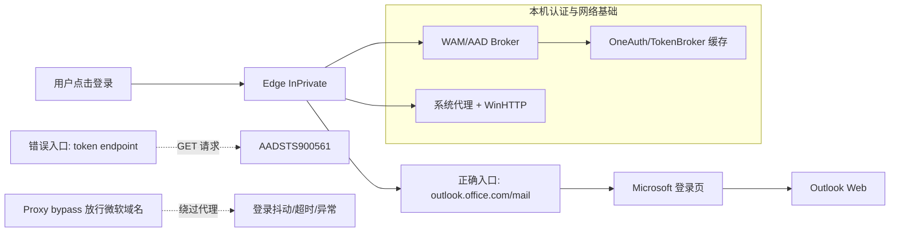
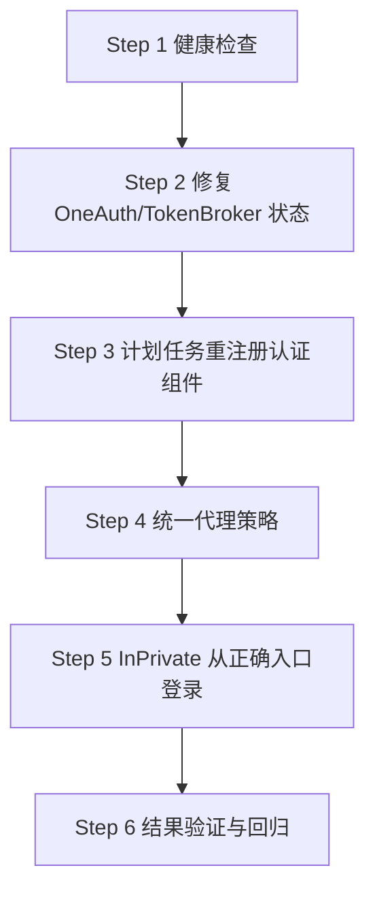
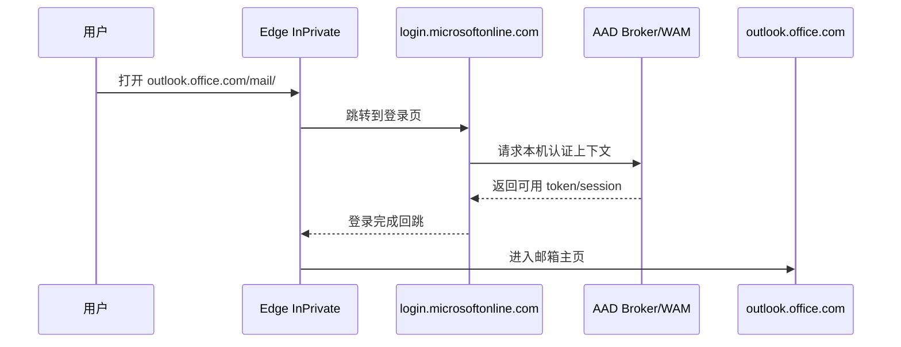

# Outlook 网页启用实战手册（0x80190001 / AADSTS900561）

> 教师 + 指挥官视角：这份文档不只是“能用”，而是让你和新开的 Codex 都能一眼看懂、一步复用。
>
> 目标：把“Outlook 原生报错 + 网页登录异常”变成一条稳定可复现的成功路径。

---

## 1) 这次到底解决了什么

我们处理的是两条并行故障线：

- 原生 Outlook 持续报错：`0x80190001`
- 网页登录异常：`AADSTS900561: The endpoint only accepts POST requests. Received a GET request.`

最终可用结果：

1. 登录组件链路已修复到可工作状态（AAD Broker/AccountsControl 重注册成功）
2. 通过 `Edge InPrivate + 正确入口 URL` 可稳定进入 Outlook Web 登录流程
3. 全流程可复用，已沉淀为标准 SOP（含命令、避坑、验证）

---

## 2) 先记住两句“真相”

- `0x80190001` 通常不是“邮箱密码错”，而是**本机认证栈（WAM/AAD/缓存/代理）**异常。
- `AADSTS900561` 本质是：你打开了一个只接受 `POST` 的 token 端点，却用浏览器 `GET` 去访问。

也就是说：

- 这不是“账号被封”
- 也不是“你不会登录”
- 是链路入口和本地状态被污染了

---

## 3) 整体架构图（先看地图再走路）



---

## 4) 这次故障证据（不是猜，是实锤）

| 观测点 | 实际证据 | 解释 |
|---|---|---|
| AAD 日志 | `Microsoft-Windows-AAD/Operational` Event `1098`, `0x80070002` | 认证组件尝试初始化应用数据目录失败 |
| WAM 状态 | `WamDefaultSet : ERROR (0x80070520)` | 默认 WAM 上下文异常（常见于缓存/用户上下文问题） |
| 本地目录 | `C:\Users\Administrator\AppData\Local\Microsoft\OneAuth` 曾缺失 | 认证材料目录不完整，影响 token 链路 |
| 代理配置 | 先前 `ProxyOverride` 包含 `*.microsoft*` 相关域名 | 关键登录流量被绕过代理，链路不稳定 |
| 网页报错 | `AADSTS900561` | 访问了错误的端点（token 端点不是给浏览器 GET 用的） |

---

## 5) 标准修复主线（可复用）



---

## 6) 一次可跑通的命令手册（新手直接用）

> 下面命令默认在 `m` 机（Windows 管理员 PowerShell）执行。  
> 如果你是通过 Codex 远程执行，保留逻辑不变即可。

### Step 1 - 基础检查

```powershell
# 1) Outlook 包版本
Get-AppxPackage -Name Microsoft.OutlookForWindows | Select Name, PackageFullName

# 2) 关键状态
dsregcmd /status | Select-String 'WamDefaultSet|AzureAdPrt|WorkplaceJoined'

# 3) 代理（用户 + WinHTTP）
Get-ItemProperty 'HKCU:\Software\Microsoft\Windows\CurrentVersion\Internet Settings' |
  Select ProxyEnable, ProxyServer, ProxyOverride
netsh winhttp show proxy
```

### Step 2 - 修复本地认证目录（OneAuth）

```powershell
$oneAuth = 'C:\Users\Administrator\AppData\Local\Microsoft\OneAuth'
if (!(Test-Path $oneAuth)) {
  New-Item -ItemType Directory -Path "$oneAuth\blobs" -Force | Out-Null
}

# 重启认证相关服务
'wlidsvc','TokenBroker','ClipSVC' | ForEach-Object {
  try { Restart-Service $_ -Force -ErrorAction Stop } catch {}
}
```

> 本次实战还做过“从备份恢复 OneAuth”以提高成功率。

### Step 3 - 用计划任务重注册认证组件（关键）

> 远程 SSH 直接 `Add-AppxPackage -Register` 容易出现 `ReadConsoleOutput 0x5`，  
> 用计划任务在本机上下文执行更稳。

```powershell
$script = @'
$ErrorActionPreference='Continue'
$names=@(
 'Microsoft.AAD.BrokerPlugin',
 'Microsoft.AccountsControl'
)
foreach($n in $names){
  $p=Get-AppxPackage -Name $n
  if($p){
    $m=Join-Path $p.InstallLocation 'AppxManifest.xml'
    Add-AppxPackage -DisableDevelopmentMode -Register $m
    Write-Host "OK $n"
  } else {
    Write-Host "MISS $n"
  }
}
'@

$path = "$env:USERPROFILE\Desktop\re_register_auth.ps1"
$script | Set-Content -Path $path -Encoding UTF8

schtasks /Delete /TN CodexAuthFix /F 2>$null | Out-Null
schtasks /Create /TN CodexAuthFix /SC ONCE /ST 23:59 /RU Administrator /RL HIGHEST /TR "powershell -NoProfile -ExecutionPolicy Bypass -File $path" /F
schtasks /Run /TN CodexAuthFix
```

### Step 4 - 统一代理策略（去掉微软域名 bypass）

```powershell
$ov = '<local>;localhost;127.*;10.*;172.16.*;172.17.*;172.18.*;172.19.*;172.20.*;172.21.*;172.22.*;172.23.*;172.24.*;172.25.*;172.26.*;172.27.*;172.28.*;172.29.*;172.30.*;172.31.*;192.168.*'
$reg='HKCU:\Software\Microsoft\Windows\CurrentVersion\Internet Settings'

Set-ItemProperty -Path $reg -Name ProxyEnable -Value 1
Set-ItemProperty -Path $reg -Name ProxyServer -Value '127.0.0.1:10808'
Set-ItemProperty -Path $reg -Name ProxyOverride -Value $ov

netsh winhttp set proxy proxy-server="127.0.0.1:10808" bypass-list="$ov"
ipconfig /flushdns
```

### Step 5 - 用正确入口启动网页登录

```powershell
# 推荐：无缓存干扰
Start-Process msedge.exe '--inprivate --new-window https://outlook.office.com/mail/'
```

> 重要：不要直接打开 `.../token` 端点，否则会触发 `AADSTS900561`。

### Step 6 - 验证

```powershell
# 看 AAD 是否还有新报错（重点看最近 10 分钟）
$t=(Get-Date).AddMinutes(-10)
Get-WinEvent -LogName 'Microsoft-Windows-AAD/Operational' -MaxEvents 100 |
  Where-Object { $_.TimeCreated -ge $t } |
  Select TimeCreated, Id, LevelDisplayName, Message
```

---

## 7) 时序图：一次成功登录应该长这样



---

## 8) 避坑指南（高频坑位）

### 坑 1：把微软域名写进 `ProxyOverride`

后果：登录链路绕过代理，表现为“时好时坏、莫名超时、网页登录异常”。

**正确做法**：`ProxyOverride` 只保留内网网段和 localhost。

### 坑 2：把 token endpoint 当网页入口

后果：`AADSTS900561`。

**正确做法**：总是从 `https://outlook.office.com/mail/` 起步。

### 坑 3：在 SSH 控制台直接重注册 Appx

后果：`ReadConsoleOutput 0x5`。

**正确做法**：用计划任务在本机上下文跑 `Add-AppxPackage -Register`。

### 坑 4：没备份就清理缓存

后果：排障失去可回滚点。

**正确做法**：先备份再改，至少保留这两个目录：

- `Outlook_Reset_Backup_20260302_231828`
- `Outlook_AuthReset_Backup_20260302_232812`

---

## 9) 给新开 Codex 的一键指令模板

> 直接复制这段给新 Codex，可快速接手。

```text
请连接 m 主机（alias: cnwin-admin-via-vps），按以下顺序执行并回报每步结果：
1) 读取 dsregcmd/WAM 状态 + AAD 日志近 30 条
2) 检查 OneAuth/TokenBroker 目录存在性
3) 通过计划任务重注册 Microsoft.AAD.BrokerPlugin 与 Microsoft.AccountsControl
4) 统一代理（127.0.0.1:10808，ProxyOverride 仅内网地址）
5) 启动 Edge InPrivate 打开 https://outlook.office.com/mail/
6) 输出验证结论（是否仍出现 0x80190001 / AADSTS900561）
要求：每步给“命令 + 结果 + 判断 + 下一步”。
```

---

## 10) 结论（最短复盘）

这次不是“账号问题”，而是“入口 + 认证栈 + 代理策略”三者叠加。  
真正让网页恢复的关键是：

- 入口改正（不用 token URL）
- AAD 认证组件重注册
- 代理 bypass 去掉微软域名
- 用 InPrivate 做无缓存验证

到这一步，你已经有一套可以给任何新同事/新 Codex复用的标准作业流了。
