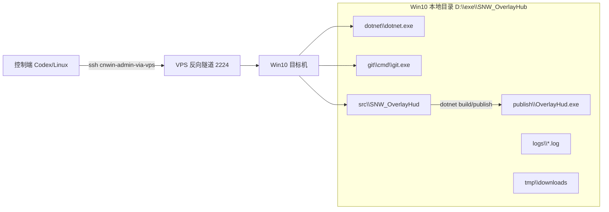
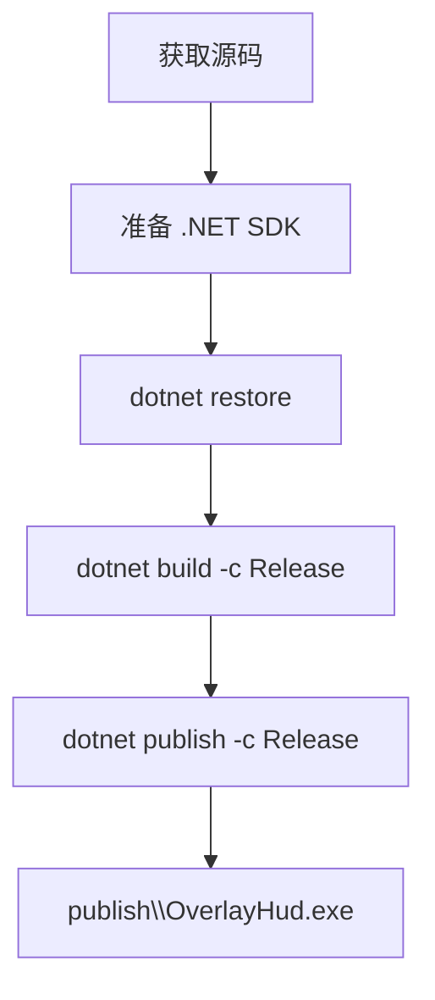
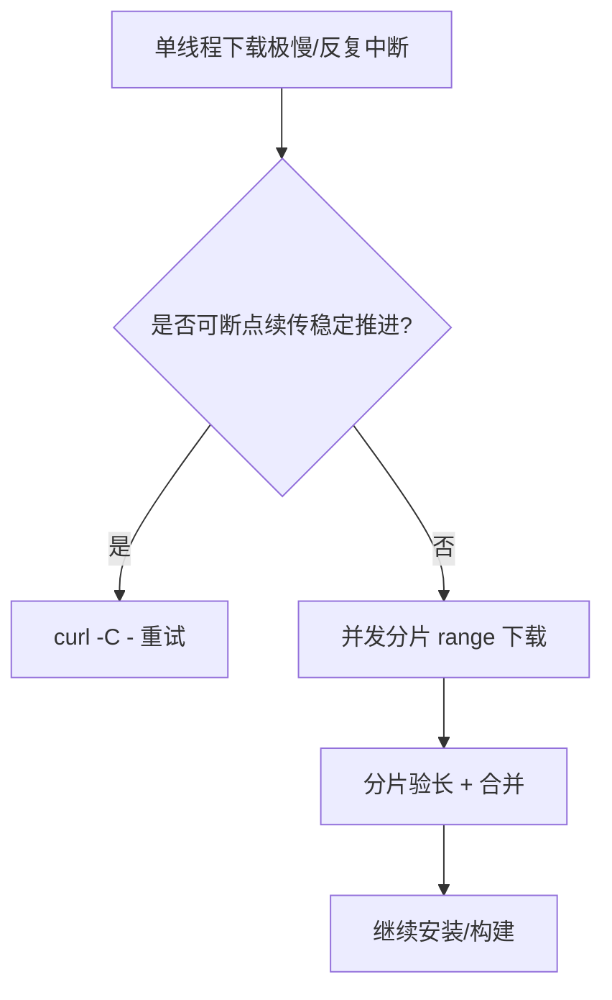

# OverlayHud_000：从拉源码到产出 EXE 的全流程部署手册（Win10 实战版）

> 角色定位：教师 + 指挥官。  
> 目标不是“讲一次会一次”，而是让你和任何新开的 Codex 都能**按图执行、稳定复现、知道为什么**。

---

## 0. 任务战报（先看结果，再看路径）

本次目标机器：`Windows 10 22H2 (10.0.19045)`，主机名 `22H2-HNDJT2412`。  
部署根目录统一为：`D:\exe\SNW_OverlayHub`。

已完成结果：

- `.NET SDK`：`8.0.418`（本地便携安装到 `D:\exe\SNW_OverlayHub\dotnet`）
- `Git`：`PortableGit 2.53.0.windows.1`（安装到 `D:\exe\SNW_OverlayHub\git`）
- 源码目录：`D:\exe\SNW_OverlayHub\src\SNW_OverlayHud`
- 仓库 HEAD：`897dfd863bec11faa1cab80e205adba1be2fc056`
- 构建发布通过：`dotnet build` + `dotnet publish`
- EXE 产物：`D:\exe\SNW_OverlayHub\publish\OverlayHud.exe`（151552 bytes）

一句话结论：**可在 Win10 正常部署，不依赖 Win11。**

---

## 1. 全局作战地图（先理解，再执行）



### 指挥官原则（这次成功的关键）

1. **目录统一**：工具、源码、日志、产物全部放进 `D:` 同一根目录，排障成本最低。  
2. **工具本地化**：不用依赖系统全局环境，避免“这台机可用，那台机不可用”。  
3. **先可用后优雅**：先保证 build/publish 成功，再讨论 SSH key、美化脚本。  
4. **低带宽场景优先容错**：单线程慢就改并发分片下载，别死扛。

---

## 2. 你到底在部署什么（概念层）

`SNW_OverlayHud` 是一个 .NET Windows 项目。  
从源码到 EXE，本质是这条链：



你可以把它理解为：

- `build`：编译并检查工程可构建
- `publish`：打包可运行产物
- `publish/OverlayHud.exe`：最终交付物

---

## 3. 一套标准目录（照抄即可）

```text
D:\exe\SNW_OverlayHub
├─ dotnet\                     # 本地 .NET SDK
├─ git\                        # 本地 PortableGit
├─ src\SNW_OverlayHud\        # 源码仓库
├─ publish\                    # 发布产物
├─ tmp\                        # 下载缓存
├─ logs\                       # 日志
└─ tools\                      # 自动化脚本
```

先建目录（PowerShell）：

```powershell
$root='D:\exe\SNW_OverlayHub'
New-Item -ItemType Directory -Path @(
  "$root\dotnet", "$root\git", "$root\src",
  "$root\publish", "$root\tmp", "$root\logs", "$root\tools"
) -Force | Out-Null
```

---

## 4. 全流程执行手册（新手按部就班）

## 4.1 环境体检（必须先做）

```powershell
hostname
[Environment]::OSVersion.VersionString
where.exe dotnet
where.exe git
```

判断逻辑：

- 没有系统 `dotnet`/`git` 没关系，我们会用本地便携版。
- 只要 Win10 能联网并可写 `D:`，这套流程就能跑。

---

## 4.2 安装 .NET SDK（本地便携，不污染系统）

下载目标：`.NET SDK 8.0.418`  
下载 URL：`https://dotnetcli.azureedge.net/dotnet/Sdk/8.0.418/dotnet-sdk-8.0.418-win-x64.zip`

### 常规下载（网络正常）

```powershell
$root='D:\exe\SNW_OverlayHub'
$zip="$root\tmp\dotnet-sdk-8.0.418-win-x64.zip"
$dotnetDir="$root\dotnet"
curl.exe -L -o $zip 'https://dotnetcli.azureedge.net/dotnet/Sdk/8.0.418/dotnet-sdk-8.0.418-win-x64.zip'
Expand-Archive -Path $zip -DestinationPath $dotnetDir -Force
& "$dotnetDir\dotnet.exe" --version
```

### 低带宽/易断线（本次实战场景）

当你看到速度只有 `10~40KB/s`、下载反复断时：

1. 采用断点续传：`curl -C -`
2. 仍太慢则使用并发分片（多个 range 同时拉）
3. 分片完成后按顺序合并，再校验字节数

本次实战最终产物字节数：`285953385`（必须一致）。

校验命令：

```powershell
(Get-Item 'D:\exe\SNW_OverlayHub\tmp\dotnet-sdk-8.0.418-win-x64.zip').Length
```

---

## 4.3 安装 PortableGit（本地便携）

下载目标：`PortableGit-2.53.0-64-bit.7z.exe`

```powershell
$root='D:\exe\SNW_OverlayHub'
$archive="$root\tmp\PortableGit-2.53.0-64-bit.7z.exe"
$gitDir="$root\git"

curl.exe -L -o $archive 'https://github.com/git-for-windows/git/releases/download/v2.53.0.windows.1/PortableGit-2.53.0-64-bit.7z.exe'
Start-Process -FilePath $archive -ArgumentList "-o$gitDir",'-y' -Wait -WindowStyle Hidden
& "$gitDir\cmd\git.exe" --version
```

本次实战字节数：`58256920`。

---

## 4.4 拉取源码（SSH 优先，HTTPS 兜底）

目标仓库：`git@github.com:ShengNW/SNW_OverlayHud.git`

### A. SSH 模式（推荐）

前提：目标机用户有可用私钥 + GitHub 授权。

```powershell
$git='D:\exe\SNW_OverlayHub\git\cmd\git.exe'
$dst='D:\exe\SNW_OverlayHub\src\SNW_OverlayHud'
& $git clone git@github.com:ShengNW/SNW_OverlayHud.git $dst
```

### B. HTTPS 兜底（本次实际采用）

当 SSH 报 `Host key verification failed` 或无私钥时，先保交付：

```powershell
$git='D:\exe\SNW_OverlayHub\git\cmd\git.exe'
$dst='D:\exe\SNW_OverlayHub\src\SNW_OverlayHud'
& $git clone https://github.com/ShengNW/SNW_OverlayHud.git $dst
& $git -C $dst rev-parse --short HEAD
```

后续再补 SSH key 即可，不影响构建链路。

---

## 4.5 构建与发布（核心）

```powershell
$root='D:\exe\SNW_OverlayHub'
$dotnet="$root\dotnet\dotnet.exe"
$proj="$root\src\SNW_OverlayHud\src\OverlayHud\OverlayHud.csproj"
$publish="$root\publish"

& $dotnet build $proj -c Release -v minimal
& $dotnet publish $proj -c Release -o $publish -v minimal

Get-Item "$publish\OverlayHud.exe" | Select FullName,Length,LastWriteTime
```

本次实战结果：

- `build`：`0 warning / 0 error`
- `publish`：成功
- EXE：`D:\exe\SNW_OverlayHub\publish\OverlayHud.exe`

---

## 4.6 启动验证（你最关心）

### PowerShell（源码 Debug 运行）

```powershell
Set-Location 'D:\exe\SNW_OverlayHub\src\SNW_OverlayHud'
& 'D:\exe\SNW_OverlayHub\dotnet\dotnet.exe' run --project '.\src\OverlayHud\OverlayHud.csproj' -c Debug
```

### CMD（源码 Debug 运行）

```cmd
cd /d D:\exe\SNW_OverlayHub\src\SNW_OverlayHud
D:\exe\SNW_OverlayHub\dotnet\dotnet.exe run --project .\src\OverlayHud\OverlayHud.csproj -c Debug
```

### 直接启动发布版 EXE（最快）

```powershell
& 'D:\exe\SNW_OverlayHub\publish\OverlayHud.exe'
```

---

## 5. 为什么这次会“卡住”，又是怎么突破的



### 关键经验

- **不要盲等**：看到长时间无增长就改策略。
- **日志先行**：每一步写 log，失败能定位。
- **字节校验必须做**：包体完整性比“看起来下载完了”更重要。

---

## 6. 新开 Codex 也能跑的“最小成功剧本”

> 如果你明天重开一个全新 Codex，会话没有记忆，直接按这个剧本执行。

1. 创建目录树 `D:\exe\SNW_OverlayHub\*`
2. 下载并解压 `.NET SDK 8.0.418` 到 `dotnet\`
3. 下载并解压 `PortableGit` 到 `git\`
4. `git clone` 拉源码到 `src\SNW_OverlayHud`
5. 运行 `dotnet build -c Release`
6. 运行 `dotnet publish -c Release -o publish`
7. 验证 `publish\OverlayHud.exe` 存在
8. 启动 EXE 验证进程可运行

### 验收清单（Checklist）

- [ ] `D:\exe\SNW_OverlayHub\dotnet\dotnet.exe --version` 输出 `8.0.418`
- [ ] `D:\exe\SNW_OverlayHub\git\cmd\git.exe --version` 输出 `2.53.0.windows.1`
- [ ] `D:\exe\SNW_OverlayHub\src\SNW_OverlayHud` 是有效 git 仓库
- [ ] `dotnet build` 返回 0
- [ ] `dotnet publish` 返回 0
- [ ] `D:\exe\SNW_OverlayHub\publish\OverlayHud.exe` 存在

---

## 7. 常见故障与处理矩阵

| 现象 | 根因 | 处理 |
|---|---|---|
| `git clone` SSH 失败 | 私钥缺失/host key 未建立 | 先 HTTPS clone 保进度；后续补 SSH key |
| `dotnet` 命令不存在 | 系统未装 SDK | 直接用 `D:\exe\SNW_OverlayHub\dotnet\dotnet.exe` |
| 下载极慢且中断 | 链路差 | 断点续传 + 并发分片 |
| `publish` 后没有 EXE | 项目路径错误或 publish 输出目录错误 | 检查 `OverlayHud.csproj` 绝对路径与 `-o` 目录 |
| 程序闪退 | 运行时依赖/配置缺失 | 先看控制台输出，再看 `logs`，再做单点排查 |

---

## 8. Rust 环境安装（可选，但建议预埋）

> 说明：`SNW_OverlayHud` 本次构建**不依赖 Rust**。  
> 但你明确希望文档包含“相关软件、Rust 等环境安装”，这里给你一套可复用模板。

### 8.1 安装 Rustup

```powershell
winget install -e --id Rustlang.Rustup
```

安装后重开终端并验证：

```powershell
rustc --version
cargo --version
rustup --version
```

### 8.2 建议工具链

```powershell
rustup default stable
rustup target add x86_64-pc-windows-msvc
```

### 8.3 与 OverlayHud 的关系

- 现在：OverlayHud 走 .NET，不吃 Rust。
- 未来：若你做系统层采集/高性能模块（如 ActivityWatch 二开插件），Rust 可作为扩展栈。

---

## 9. 给“未来你”的收官建议（指挥官视角）

1. **把“能跑”固化成脚本**：`build.ps1`、`publish.ps1`、`run.ps1`。  
2. **把“配置”固化到 D 盘**：避免机器漂移。  
3. **把“成功证据”写进文档**：版本、commit、产物路径、日志路径。  
4. **把“慢网应急”标准化**：分片下载脚本作为固定工具，避免重复踩坑。

---

## 10. 本次实战的关键绝对路径（可直接抄）

- 根目录：`D:\exe\SNW_OverlayHub`
- .NET：`D:\exe\SNW_OverlayHub\dotnet\dotnet.exe`
- Git：`D:\exe\SNW_OverlayHub\git\cmd\git.exe`
- 源码：`D:\exe\SNW_OverlayHub\src\SNW_OverlayHud`
- 项目文件：`D:\exe\SNW_OverlayHub\src\SNW_OverlayHud\src\OverlayHud\OverlayHud.csproj`
- 发布目录：`D:\exe\SNW_OverlayHub\publish`
- 最终 EXE：`D:\exe\SNW_OverlayHub\publish\OverlayHud.exe`
- 日志目录：`D:\exe\SNW_OverlayHub\logs`

---

## 附录 A：一键构建发布命令（PowerShell）

```powershell
$root='D:\exe\SNW_OverlayHub'
$dotnet="$root\dotnet\dotnet.exe"
$proj="$root\src\SNW_OverlayHud\src\OverlayHud\OverlayHud.csproj"
$publish="$root\publish"

& $dotnet build $proj -c Release -v minimal
if ($LASTEXITCODE -ne 0) { throw 'build failed' }

& $dotnet publish $proj -c Release -o $publish -v minimal
if ($LASTEXITCODE -ne 0) { throw 'publish failed' }

Write-Host "DONE => $publish\OverlayHud.exe"
```

## 附录 B：一键启动命令（PowerShell）

```powershell
& 'D:\exe\SNW_OverlayHub\publish\OverlayHud.exe'
```

---

如果你愿意，下一版我可以继续给你做 `OverlayHub_001_ops.md`：

- 开机自启（任务计划程序）
- 后台运行 + 日志轮转
- 一键更新（`git pull` + publish + 热切换）

这样就从“能部署”升级到“可运维”。
