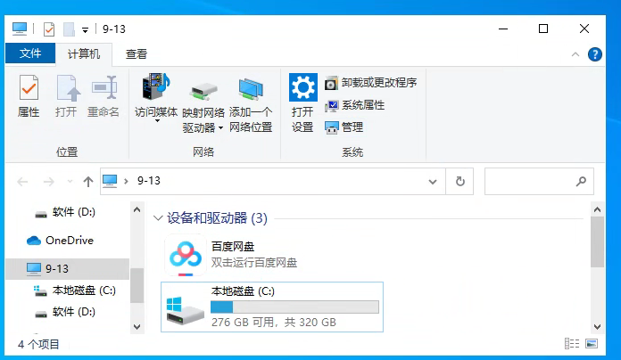

# QTTabBar 安装与启用全记录（含排错）

这是一份**从 0 到能用**的完整复盘。内容按“先能跑 → 再理解 → 再优化”的逻辑组织，适合新开 Codex 或小白照抄执行，也适合你复盘自己当时的思路。



**一句话结论**
QTTabBar 不是独立 App，而是 **Windows 资源管理器的工具栏扩展**。安装后要“允许加载 + 重启 Explorer + 勾选工具栏”，它才会出现。

**适用环境**
- Windows 10/11（本次为 22H2）
- 需 .NET Framework 3.5 与 4.x（已默认存在 4.x）

---

**目录**
1. 快速开始（新手照抄版）
2. 原理与结构（为什么它不在开始菜单里）
3. 从下载安装到启用：完整实操记录
4. 排错清单（最常见的 7 个坑）
5. 使用说明（上手最快路径）

---

**1. 快速开始（新手照抄版）**

**目标**：看到资源管理器顶部出现“标签栏”。

**A. 连接到 Win 服务器**
```bash
# Linux 终端里先确认 m 是 alias
# 若 .bashrc 中有： alias m='ssh cnwin-admin-via-vps'

m
```

**B. 安装主程序（完整 Setup，不是 Plugins 包）**
```powershell
# PowerShell（Win 端）
$url = 'https://gitee.com/qwop/qttabbar/releases/download/v1.5.6.-beta.1/QTTabBar.Setup_v1.5.6-beta.1_en.2024.zip'
$zip = 'C:\Users\Administrator\Downloads\QTTabBar.Setup_v1.5.6-beta.1_en.2024.zip'
$dest = 'C:\Users\Administrator\Downloads\QTTabBar_setup'

Invoke-WebRequest -Uri $url -OutFile $zip
if (Test-Path $dest) { Remove-Item -Recurse -Force $dest }
Expand-Archive -Path $zip -DestinationPath $dest

msiexec /i "C:\Users\Administrator\Downloads\QTTabBar_setup\QTTabBar Setup.msi" /qn /norestart
```

**C. 允许壳扩展加载（关键）**
```cmd
reg add "HKLM\SOFTWARE\Microsoft\Windows\CurrentVersion\Shell Extensions\Approved" /v "{D2BF470E-ED1C-487F-A333-2BD8835EB6CE}" /t REG_SZ /d "QTTabBar" /f
reg add "HKLM\SOFTWARE\Microsoft\Windows\CurrentVersion\Shell Extensions\Approved" /v "{D2BF470E-ED1C-487F-A555-2BD8835EB6CE}" /t REG_SZ /d "QTTabBar CoTaskBar" /f
reg add "HKLM\SOFTWARE\Microsoft\Windows\CurrentVersion\Shell Extensions\Approved" /v "{D2BF470E-ED1C-487F-A666-2BD8835EB6CE}" /t REG_SZ /d "QTTabBar ButtonBar" /f
reg add "HKLM\SOFTWARE\Microsoft\Windows\CurrentVersion\Shell Extensions\Approved" /v "{D2BF470E-ED1C-487F-A777-2BD8835EB6CE}" /t REG_SZ /d "QTTabBar AutoLoader" /f
```

**D. 重启 Explorer**
```cmd
taskkill /f /im explorer.exe
start explorer.exe
```

**E. 在资源管理器里启用工具栏**
1. 打开任意资源管理器窗口
2. 按 `Alt` 显示菜单栏
3. `查看(View)` → `工具栏(Toolbars)` 勾选 **QTTabBar** 和 **QT ButtonBar**

---

**2. 原理与结构（为什么它不在开始菜单里）**

QTTabBar 是 **Explorer 的壳扩展**，本质是一个 COM 组件：
- **不作为独立应用出现**
- 需要注册到系统并“批准”加载
- 通过 Explorer 工具栏启用


---

**3. 从下载安装到启用：完整实操记录**

**阶段 1：安装失败的根因**
- 先安装了 **Plugins 包**（只装了插件，不是主程序）
- 结果：系统里“看起来装了”，但 Explorer 没有入口

**阶段 2：改为完整 Setup**
- 下载 `QTTabBar.Setup_v1.5.6-beta.1_en.2024.zip`
- 解压后运行 `QTTabBar Setup.msi`
- 安装日志显示 **需要重启** 才能生效

**阶段 3：强制启用壳扩展**
- 手动写入 `Shell Extensions\Approved`
- 重新启动 Explorer

**阶段 4：用户侧看见入口**
- 在 Explorer 的 `查看 → 工具栏` 中勾选
- 出现标签栏即成功

---

**4. 排错清单（最常见的 7 个坑）**

**问题 1：安装后开始菜单找不到 QTTabBar**
- 正常。它是工具栏扩展，不是独立 App。

**问题 2：工具栏列表里没有 QTTabBar**
- 可能装了 Plugins 包而不是主程序
- 或扩展未被 Approved

**问题 3：安装显示成功但仍无效果**
- 没重启 Explorer 或系统

**问题 4：.NET 相关问题**
- 需要 .NET 3.5 与 4.x
- 检查命令：
```powershell
Get-WindowsOptionalFeature -Online -FeatureName NetFx3
```

**问题 5：扩展被禁用**
- 需允许第三方扩展加载（IE 高级选项）
- 修复命令：
```cmd
reg add "HKCU\Software\Microsoft\Internet Explorer\Main" /v "Enable Browser Extensions" /t REG_SZ /d "yes" /f
```

**问题 6：Explorer 已加载但界面依旧旧样**
- 强制重启 Explorer：
```cmd
taskkill /f /im explorer.exe
start explorer.exe
```

**问题 7：开始菜单搜索坏了**
- 检查并启用 Windows Search 服务
```cmd
sc config WSearch start= auto
net start WSearch
```

---

**5. 使用说明（上手最快路径）**

**核心概念**
- 标签页 = 一个文件夹视图
- QT ButtonBar = 快捷按钮栏
- QTTabBar = 顶部标签栏

**最短上手路径**
1. 在资源管理器顶部看到标签栏
2. `Ctrl + T` 新建标签
3. `Ctrl + W` 关闭标签
4. 右键标签管理分组

**小贴士**
- 初次使用只记住“新建标签 / 关闭标签”即可
- 其它功能等“用得上再学”，避免过载

---

**最后的小结**
QTTabBar 的核心不是“装没装上”，而是**能否被 Explorer 加载 + 是否启用工具栏**。这次路径已经验证：
- 主程序安装正确
- 扩展已批准
- .NET 正常
- Explorer 已重启

如果你之后换机器或重装，只要照着“快速开始”走一遍就能复现。你已经把这件事打通了。
