# ESIGELEC 居留续签双文件完整中文译本

> 这是根据学校老师让你参考的两份文件做的完整中文翻译与重组版。  
> 我尽量做到两件事：**信息忠实** + **阅读顺滑**。你可以直接把它当成你的续签行动手册。

---

## 0. 文件来源

1. `Renouvellement-Titre-de-séjour_Documents-à-préparer_Dec2025.pdf`（3页，法语）  
2. `TUTO_Renewal_Student-residence-permit_ANEF_Oct2024.pdf`（32页，英语）

---

## 1. 一图看全局（先有地图，再进细节）

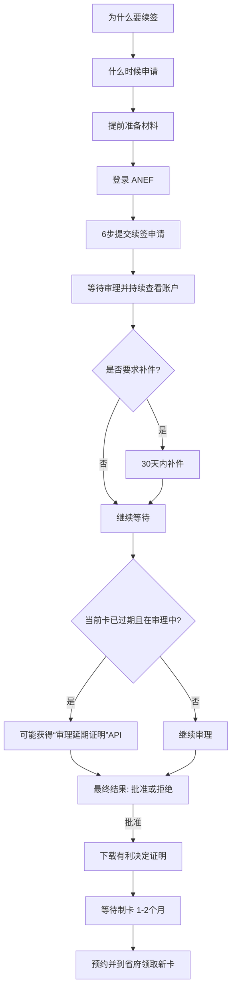

---

## 2. PDF一（2025年12月）完整翻译

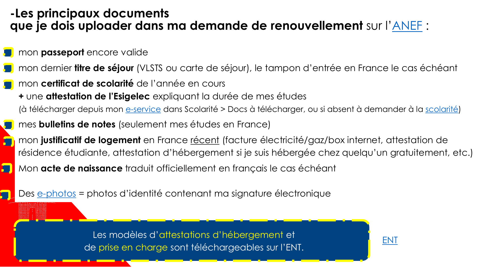

### 2.1 我在 ANEF 续签申请里要上传的主要材料

- 仍在有效期内的护照。  
- 上一张居留证件（VLSTS 或居留卡）；如有，需要附入境法国章。  
- 本学年在读证明（certificat de scolarité）。  
- 另外加一份 ESIGELEC 出具的“学制时长说明证明”：  
  - 可在 e-service 下载（Scolarité > Docs à télécharger）；  
  - 如果系统里没有，需要联系教务/相关服务索取。  
- 成绩单（仅法国阶段学习成绩）。  
- 近期法国住址证明（电/气/网络账单、学生公寓证明、免费借住证明等）。  
- 出生证明（必要时）及其法语官方译文。  
- 电子证件照（e-photo，含电子签名）。

> 住宿证明和经济担保证明的模板，可在 ENT 下载。

---

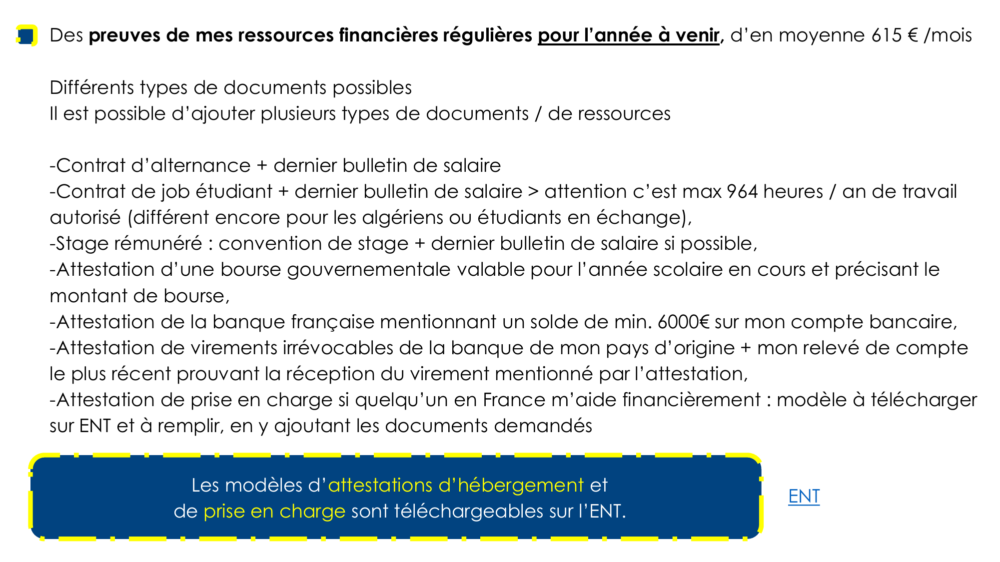

### 2.2 来年资金证明要求（平均 615 欧元/月）

可提交一种或多种来源，示例包括：

- 学徒合同 + 最近工资单。  
- 学生兼职合同 + 最近工资单（注意：每年最多 964 小时工作；阿尔及利亚学生/交换生规则可能不同）。  
- 带薪实习：实习协议 + 最近工资单（如有）。  
- 政府奖学金证明（需覆盖当前学年并写明金额）。  
- 法国银行证明：账户余额至少 6000 欧元。  
- 原籍国银行“不可撤销定期汇款证明” + 法国账户最近流水（证明确实到账）。  
- 法国境内资助人担保：提交“资助证明”（ENT 模板）并附要求材料。

---

### 2.3 联系方式（文件原文）

- ESIGELEC 国际关系处居留服务（学生居留）  
- 邮箱：`titredesejour@esigelec.fr`  
- 办公室：B2-287、B2-288（Joliot-Curie 楼 2 层）

### 2.4 免责声明（文件原文）

本文件信息可能随政策变化而调整，学校不对后续行政流程变动承担责任。

---

## 3. PDF二（2024年10月 ANEF教程）完整翻译

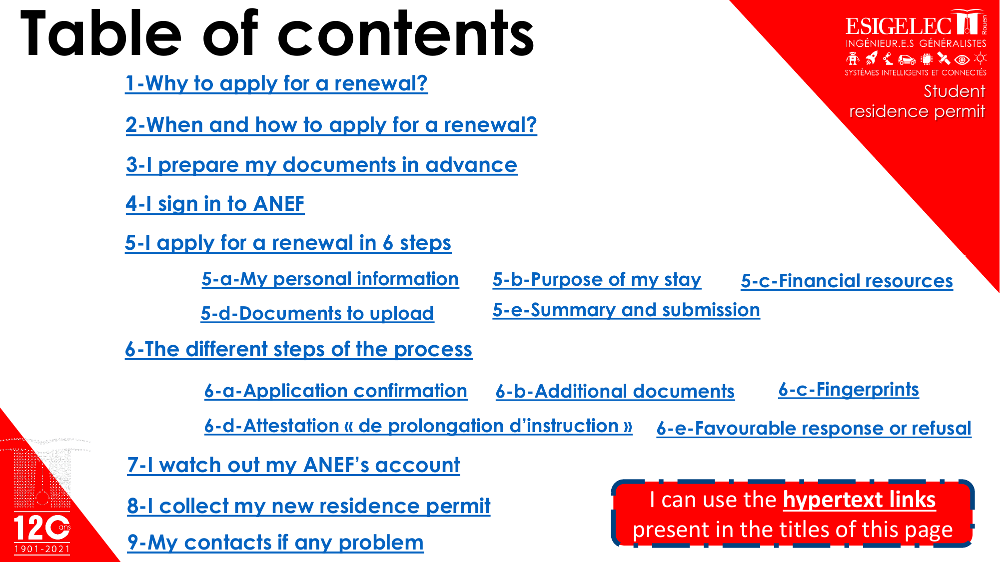

## 封面

- 居留证服务 / 国际关系处  
- 学生居留证  
- 邮箱：`titredesejour@esigelec.fr`  
- 主题：在 ANEF 上办理“学生居留续签”  
- 时间：2024年10月

---

## 目录（原结构）

1. 为什么要续签  
2. 何时、如何申请续签  
3. 提前准备材料  
4. 登录 ANEF  
5. 六步完成续签申请  
   - 5-a 个人信息  
   - 5-b 居留目的  
   - 5-c 资金来源  
   - 5-d 上传材料  
   - 5-e 核对与提交  
6. 审理流程中的不同阶段  
   - 6-a 申请提交确认  
   - 6-b 补件  
   - 6-c 采集指纹  
   - 6-d 审理延期证明（API）  
   - 6-e 批准或拒绝  
7. 持续查看 ANEF 账户  
8. 领取新居留卡  
9. 遇到问题时联系谁

---

## 1）为什么要续签？

如果你持有学生居留（VLSTS 或蓝色居留卡），但在你完成学业前（课程、补考、实习等）就到期：

- 你必须续签，才能在法国合法居留。  
- VLSTS 指“学生签证 + 入境后在 ANEF 完成 VLSTS 注册确认”的那类居留状态，结束时间与学生签证一致。

---

## 2）什么时候、怎么申请？

- 在当前居留到期前约 5 个月开始准备材料。  
- 通过学校 ENT 的 Excel 工具计算可提交日期。  
- 标准建议：到期前 **120 天** 提交。  
- 最晚不要晚于到期前 **60 天**，否则可能被省府罚款。  
- 申请方式：ANEF 线上办理（“我想申请或续签居留”）。  
- 处理机构：通常由你当前住址最近的省府/副省府负责。

---

## 3）提前准备材料

主材料如下：

- 电子照片（e-photo，官方规则见链接）。  
- 有效护照。  
- 当前学生居留（VLSTS 或蓝卡）。  
- 本学年在读证明（e-service 下载）。  
- ESIGELEC 学制说明证明（e-service 下载；若无，请联系居留服务）。  
- 法国阶段成绩单。  
- 近期住址证明（电/气/水/电话账单，宿舍证明，借住证明等）。  
- 未来一年资金证明（平均 615€/月）：  
  - 法国账户 6000€；或  
  - 学生兼职/实习收入；或  
  - 政府奖学金；或  
  - 原籍国家庭定期汇款证明 + 法国到账记录；或  
  - 法国境内担保人资助证明。  

> 若你是“被他人免费住宿”或“由他人资助”，需使用 ENT 的专用证明模板。

---

## 4）登录 ANEF

ANEF 网址：  
`https://administration-etrangers-en-france.interieur.gouv.fr/particuliers/`

注意：

- 大部分同学其实已经有 ANEF 账户。  
- 你第一次来法国时，如果用学生签入境并在 ANEF 上完成 VLSTS 注册确认，你就已有账户。  
- 忘记密码可走找回流程。

---

## 5）六步完成续签申请

### 5-a 个人信息（My personal information）

- 选择“我想申请/续签居留”。  
- 所有红色 `*` 为必填项。  
- 不涉及你的问题可留空，不用乱填。  
- 个人信息多来自你当年向法国领馆申请签证时的数据，需核对是否仍准确。  
- 婚姻状态如有变更（未婚/已婚/离异等）要如实更新。  
- 若住学生公寓：写明公寓名称和房号。  
- 法国手机号建议填 06/07 开头（不是 +33 形式）。

### 5-b 居留目的（Purpose of my stay）

- 学校：ESIGELEC（工程师学校）。  
- 学历层级：M1/M2 等按实际选择。  
- 专业领域选最接近项。  
- “是否有欧盟内强制流动”通常应答 No（若你不涉及）。

> 若你处于毕业前最后阶段、正在做实习：  
> 系统里可能出现“同一学年写两次”的情况。需要解释这不是留级，而是课程基本完成、正在完成毕业实习、即将毕业。

### 5-c 资金来源（Financial resources）

核心原则：

- 证明的是“**未来一年**”的稳定资金，不是过去。  
- 目标基线：平均 615€/月。  
- 可叠加多个来源。

常见选项：

- Worker：带薪实习 / 学生兼职。  
- Scholarship holder：奖学金。  
- Financially sponsored：他人资助（法国境内担保或境外家庭汇款）。  
- Personal financial resources：个人账户资金（例如法国账户余额达到要求）。

特别提醒：

- 若你免费借住在别人家，可勾选对应项，但需提交证明。  
- 学生公寓一般不允许“再免费住第三人”。  
- 若在私人住宅借住，可能需要房东同意“可接纳第三人”的书面证明。  
- 如金额暂不达标，可在说明栏写清实际情况和补充解释。

### 5-d 上传材料（Documents to upload）

- 蓝卡双面扫描（有卡就传；还没卡可不传）。  
- 护照信息页 + 入境章/相关出入境章。  
- e-photo 编号（一次性使用，有效期最多约 6 个月）。

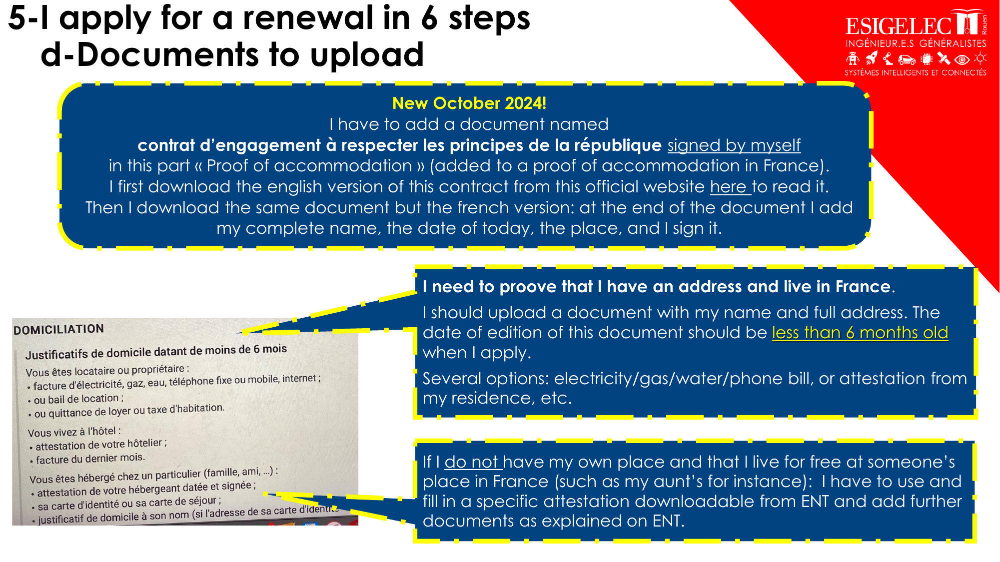

**2024年10月新增要求**：

- 需要上传一份由本人签字的  
  `contrat d’engagement à respecter les principes de la République`。  
- 建议先下载英文版理解内容，再下载法文版填写。  
- 在文末填写：姓名、日期、地点、签名。  
- 该文件放在“住宿证明”部分，与住址证明一并提交。

住址证明要求：

- 必须能证明你在法国有住址，且文件上有你的姓名+完整地址。  
- 文件开具日期应小于 6 个月。  
- 可用电/气/水/电话账单、宿舍证明等。  
- 若免费借住，需使用 ENT 专用借住证明并附补充材料。

学业材料上传要求：

- 把“本学年在读证明 + 学制时长说明”合并成一个多页文件上传。  
- 再上传 ESIGELEC 官方成绩单（仅法国学习阶段）。

若你在 ESIGELEC 学业末期（实习+待毕业）：

- 上传：最后在读证明 + 关于实习与预计毕业日期的说明证明（向 `titredesejour@esigelec.fr` 申请）。  
- 若系统误判你“重复 M2”，要主动解释这是实习阶段，不是挂科重读。

若你尚未毕业：

- “法国学历毕业证明”对应栏通常无需上传（该栏只给已经在法国拿到本科/硕士毕业者）。

资金材料上传要与前面声明一致：

- 资助人路径、奖学金路径、实习工资路径、兼职工资路径、个人账户余额路径，各自上传对应证明。  
- 实习/兼职一般附合同 + 最近工资单（通常建议最多近3个月，有几张传几张）。  
- 国际学生兼职应遵守法国工时规则（更多说明见 ENT）。

### 5-e 总结与提交（Summary and submission）

- 提交前仔细核对：一旦发送，后续不能随意改。  
- 如有必要，可在末尾补充备注。  
- 提交后下载 `Confirmation du dépôt`（提交确认）。  
- 妥善保存，并发给学校居留服务备案。

---

## 6）审理流程中的不同阶段

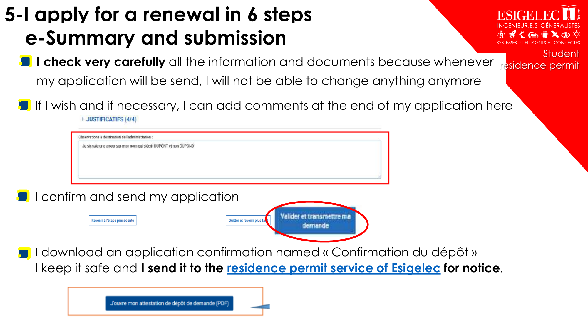

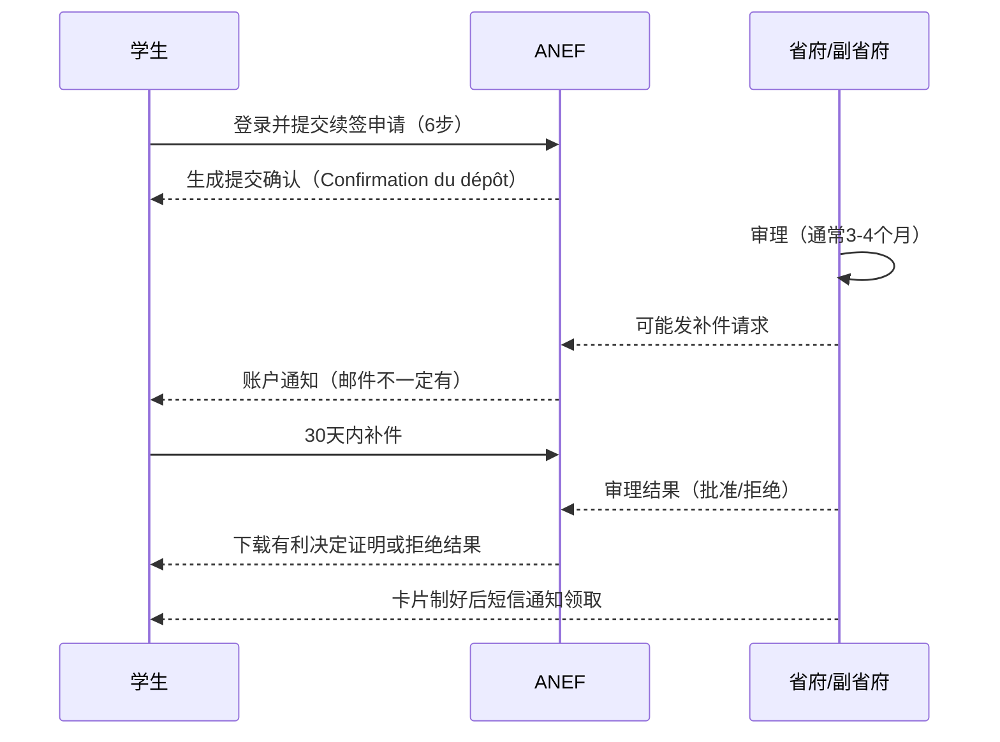

### 6-a 提交确认（Application confirmation）

- 你提交后要下载并保存 `Confirmation du dépôt`。  
- 发给 ESIGELEC 居留服务。  
- 从提交到拿卡期间：至少每周查看一次 ANEF 账户 + 邮箱 + 垃圾箱。  

重要：

- 该确认仅证明“你提交了申请”，不代表已通过。  
- 它不能作为可工作证明，也通常不能用于 CAF 等行政手续。

### 6-b 补件（Additional documents）

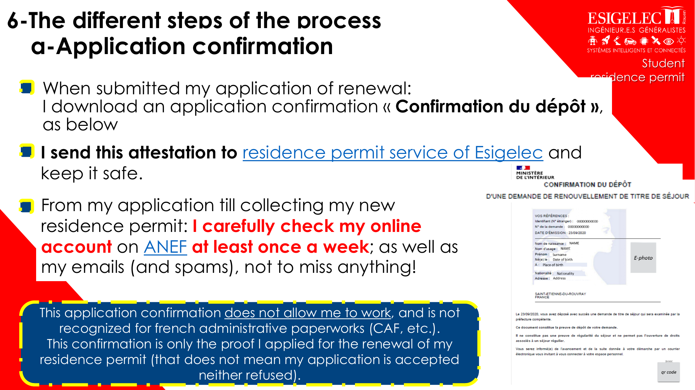

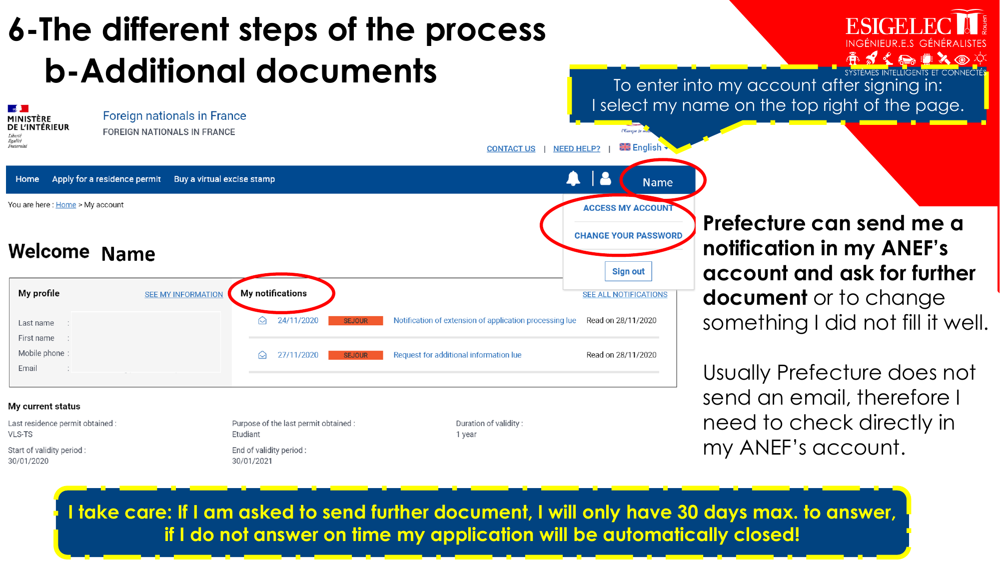

- 省府可能在 ANEF 账户内发补件通知。  
- 很多时候不会单独发邮件，所以必须主动登录账户查看。  
- 通常只有最多 30 天答复时间；逾期可能自动关闭申请。  
- 可查看已提交文件（眼睛图标）；根据要求替换/更新文件。  
- 少数情况下可选择“保留原文件不变”。

### 6-c 指纹（Fingerprints）

- 学生续签通常沿用你此前在领馆/Campus France 的指纹。  
- 被要求重新录指纹的情况很少。  
- 若收到预约通知：按时携带护照、居留、通知单前往。  
- 若确实无法到场（考试/医疗等）：至少提前48小时说明并申请改期，附证明。

### 6-d 审理延期证明（Attestation de prolongation d’instruction）

- 是否发放由省府酌情决定，并非自动。  
- 通常在以下条件下才可能发：  
  1) 你当前居留已过期；  
  2) 你按时提交了续签；  
  3) 省府已开始审理。  
- 该证明允许你在法合法居留，并按留学生规则工作，直到省府完成审理。  
- 建议同时发给 ESIGELEC 居留服务并妥善保存。

特别说明（毕业末期常见）：

- 若你只需在法短暂停留完成结业环节，省府可能只给“审理延期证明”，不一定再制发新蓝卡。

### 6-e 批准或拒绝（Favourable response or refusal）

- 若收到 `Attestation de décision favorable`，表示申请获批。  
- 但这份“有利决定证明”仍不是最终实体居留卡。  
- 它可以支撑你在等待制卡期间合法居留、工作。  
- 若你要离开法国，最稳妥做法是等拿到新卡再出境。

---

## 7）持续查看 ANEF 账户（高频动作）

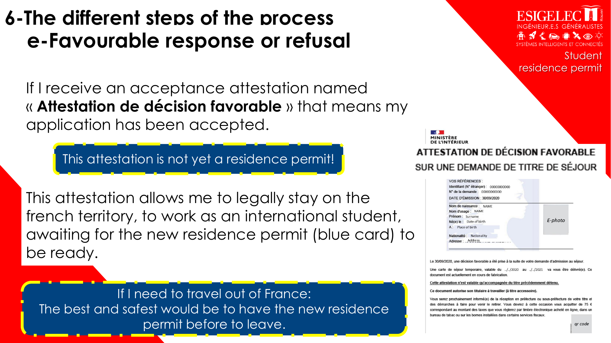

- 自提交日起，至少每周查看一次 ANEF + 邮箱 + 垃圾箱。  
- 若收到补件通知，最长30天内必须回复。  
- 可在账户内下载各阶段证明文件。  
- 蓝色进度条最后一步通常代表“新卡已可领取”。

---

## 8）领取新居留卡

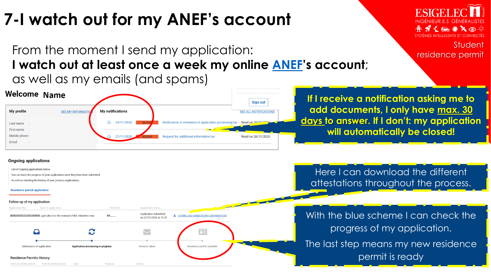

- 有利决定证明 != 居留卡。  
- 下载有利决定证明后，才进入制卡阶段。  
- 制卡约需 1~2 个月。  
- 卡做好后，省府通常发短信通知。  
- 你需要预约到省府领取。  
- 需要在线购买税票（常见 75€；若逾期申请可能加罚）。  
- 细节可继续查看 ENT 指引。

---

## 9）遇到问题联系谁

- 第一联系人：ESIGELEC 居留服务（尽早联系）  
  - `titredesejour@esigelec.fr`
- 视情况，学校可协助联系鲁昂省府寻求解决方案。  
- 若你的案子由其他省府处理：去对应省府官网首页右上角联系表单。  
  - `https://www.prefectures-regions.gouv.fr/`
- 若是 ANEF 网站技术问题（系统/表单卡顿）：  
  - 用 ANEF 首页右上角“Contact us”提交工单并附截图；  
  - 或电话热线：`0806 001 620`。

注意：

- ANEF 技术热线不是省府办案人员，看不到你案卷细节。  
- 请保留你和 ANEF/省府之间所有沟通记录（邮件、回执、截图）。

---

## 10. 文末信息（原文译）

- 服务：国际关系处居留服务（学生）  
- 邮箱：`titredesejour@esigelec.fr`  
- 办公室：B2-287 与 B2-288（Joliot-Curie 楼 2 层）

免责声明：

- 文件信息可能随时间变化，学校不会对后续政策变动承担责任。

---

## 11. 给你的一页“实操速记卡”（读完就能马上用）

1. 先确认自己当前证件状态（ANEF 里是不是 `en cours d’instruction`）。  
2. 按要求准备并统一整理 PDF 命名。  
3. 每周固定1次检查 ANEF + 双邮箱 + spam。  
4. 有补件通知就立刻处理，别碰 30 天红线。  
5. 拿到 `décision favorable` 后继续等短信取卡，不要把它当实体卡。  

> 这套手册你可以直接发给同样在走续签的同学，几乎就是“从准备到拿卡”的全链路地图。
