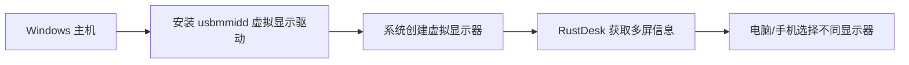

# RustDesk 虚拟双桌面实战记录（Windows）

你要的不是“概念”，而是能立刻让电脑和手机各占一个桌面的真方案。下面这份是我本次**从安装到启用虚拟双屏**的完整操作笔记，兼顾新手可抄、高手可调、复盘可用。

**一句话结论**
- RustDesk 自己并不是“显示器”，真正实现多屏的是**虚拟显示驱动**。
- 用 `usbmmidd_v2` 驱动能在 Windows 上凭空生成 2 个虚拟屏，然后 RustDesk 就能切换显示器。
- 本次最终稳定方案：**安装驱动 → 创建 2 个虚拟屏 → 扩展桌面**。

**本次环境（可对照）**
- Windows 10 22H2
- RustDesk 1.4.5+63（服务模式）
- 目标分辨率：`1920x1080`

---

**原理速览**
- RustDesk 读取系统的显示器列表。
- `usbmmidd_v2` 驱动让 Windows 以为“有新的显示器插入”。
- 显示器一旦存在，RustDesk 客户端就能按屏幕切换。



---

**准备清单**
- 管理员权限（必须）
- 已安装 RustDesk（服务运行）
- 目标分辨率明确（本次 `1920x1080`）

---

**步骤 1：确认 RustDesk 服务与路径**

```bat
sc qc rustdesk
```

这能确认 RustDesk 服务是否存在、可控，以及可执行文件路径。

---

**步骤 2：下载 usbmmidd_v2 驱动（官方包）**

```powershell
$dir=D:exeSnw_rustDeskusbmmidd_v2_dl
New-Item -Force -ItemType Directory $dir | Out-Null
$zip=Join-Path $dir usbmmidd_v2.zip
Invoke-WebRequest -Uri https://www.amyuni.com/downloads/usbmmidd_v2.zip -OutFile $zip
Expand-Archive -Force $zip -DestinationPath $dir
```

驱动包解压后目录中应包含：
- `deviceinstaller64.exe`
- `usbmmIdd.inf`
- `usbmmidd.bat`

---

**步骤 3：安装驱动**

```bat
cd /d D:\exe\Snw_rustDesk\usbmmidd_v2_dl\usbmmidd_v2
deviceinstaller64 install usbmmIdd.inf usbmmidd
```

看到 `Drivers installed successfully.` 即完成。

---

**步骤 4：创建 2 个虚拟显示器**

```bat
deviceinstaller64 enableidd 1
deviceinstaller64 enableidd 1
```

每执行一次，新增 1 个虚拟屏。本次执行 2 次。

---

**步骤 5：切到扩展模式**

```bat
displayswitch.exe /extend
```

这样系统就不是“复制屏”，而是“扩展桌面”。

---

**步骤 6：验证虚拟屏是否生效**

```powershell
Get-PnpDevice -Class Display | Select-Object Status,FriendlyName,InstanceId
```

应看到类似项：
- `USB Mobile Monitor Virtual Display`

还可以在 Windows「显示设置」里看到新增显示器。

---

**RustDesk 里怎么切屏？**
- 电脑端连接后，在顶部菜单选择 **显示器 1/2/3**
- 手机端连接时选择另一块屏幕
- 这样就实现“电脑一个桌面 + 手机另一个桌面”

---

**分辨率控制（默认就是 1920x1080）**

驱动默认支持的分辨率列表在注册表中，可按需调整（一般不必改）：

```bat
reg query "HKLM\SOFTWARE\Microsoft\Windows NT\CurrentVersion\WUDF\Services\usbmmIdd\Parameters\Monitors"
```

默认值 `(默认)` 就是当前默认分辨率，本次为 `1920,1080`。

---

**常见避坑指南**
- `deviceinstaller64.exe` 不存在：说明你没用官方驱动包，重新下载一次。
- 新显示器没出现：重新执行 `enableidd 1` 或重启 RustDesk 服务。
- 看到黑屏：确认 `displayswitch /extend` 已执行，或在显示设置里手动“识别”。
- 系统里已有其他虚拟显示驱动（如 Oray / GameViewer）：正常，不冲突。

---

**回滚 / 卸载**

```bat
deviceinstaller64 enableidd 0
```

如果需要彻底移除：

```bat
deviceinstaller64 stop usbmmidd
deviceinstaller64 remove usbmmidd
```

---

**命令速查（可直接抄）**

```bat
cd /d D:\exe\Snw_rustDesk\usbmmidd_v2_dl\usbmmidd_v2
deviceinstaller64 install usbmmIdd.inf usbmmidd
deviceinstaller64 enableidd 1
deviceinstaller64 enableidd 1
displayswitch.exe /extend
```

---

**建议配套截图（图文并茂）**
- `assets/rustdesk-display-settings.png`：显示设置里的多屏
- `assets/rustdesk-device-manager.png`：设备管理器里的虚拟显示器
- `assets/rustdesk-client-monitor.png`：RustDesk 客户端切换显示器

示例占位：


---

**一句话回顾**
你要的不是“多开”概念，而是“多屏事实”。这套流程把“事实”做到了。

