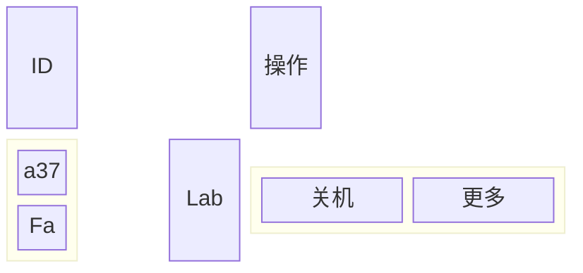
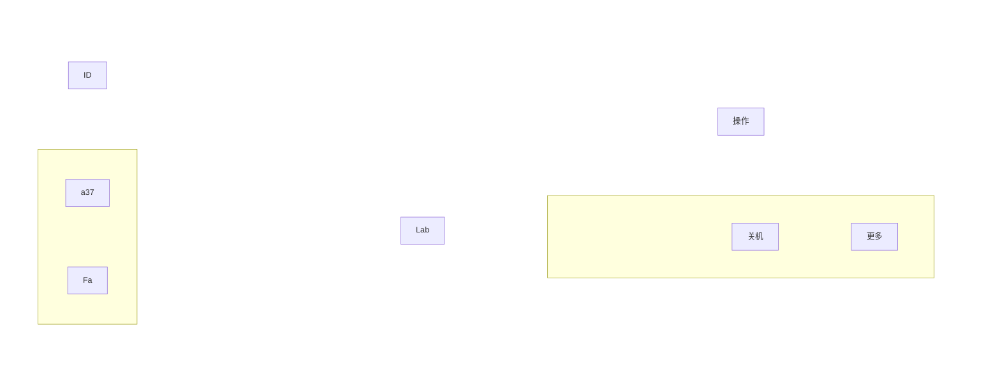
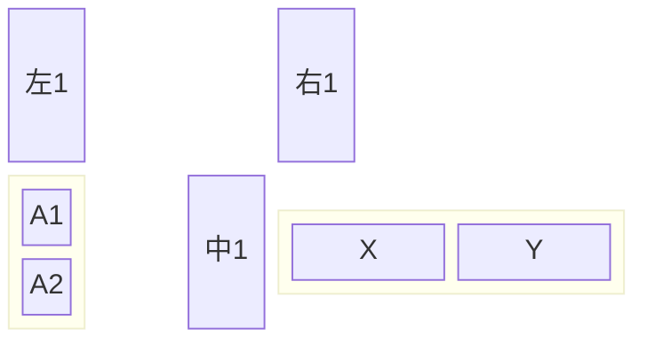
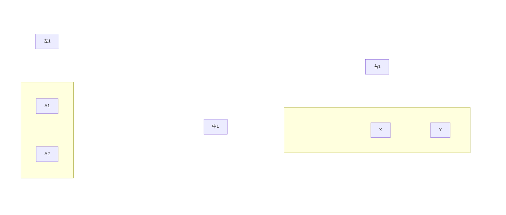

# UImaid: 两种 Mermaid 图的“同形原理”教程

目标：让你明白为什么这两段 Mermaid 代码在视觉上“像一个东西”，以及如何像拼积木一样搭出相似的布局。

---

## 一句话总览（像拼积木）
- **block 图**：像直接摆放“积木格子”。你告诉它“有几列、每列放啥”，它自动帮你排。
- **flowchart 图**：像用“骨架+隐形垫块”搭出同样的格子。你得用子图、方向、隐形节点和“不可见连线”把它撑开。

所以视觉相近的原因是：
**两者都在构造一个“4 列网格”，然后把相同的元素塞到对应列里。**

---

## 1) 你的 block 图：直接告诉“网格布局”

### 代码（原样示例）

### 直观理解（积木视角）
- `columns 4`：桌上画了 **4 列**。
- 第一行：`ID space space 操作`
  - 第1列放 **ID**
  - 第2、3列放 **空白**
  - 第4列放 **操作**
- `block:group1:1`：在第1列下面再放一个 **竖向小盒子**，里面两块：`a37`、`Fa`
- `Lab`：在第3列放一个 **Lab**
- `block:group2:4`：在第4列下面放一个 **横向小盒子**，里面两块：`关机`、`更多`

Block 的特点是“**你说哪列就是哪列**”，很省脑力。

---

## 2) 你的 flowchart 图：用“隐形结构”伪装成网格

### 代码（原样示例）

### 直观理解（积木视角）
Flowchart 本来是“流程线”思维，但你用了一套技巧把它变成 **格子布局**：

- **GRID 是大桌面**：`subgraph GRID` + `direction LR` → 让列横向排开。
- **COL1～COL4 是四列**：每个列内部 `direction TB` → 竖向排列。
- **`~~~` 是不可见的“撑杆”**：保证上下或左右保持间距。
- **ghost 节点 = 隐形垫块**：占位但不画出来（透明）。
- **nodeSpacing / rankSpacing**：全局控制列间距和行间距。

所以 flowchart 里虽然没有“columns 4”，但你用 **“子图 + 方向 + 隐形节点 + 隐形连线”** 拼出来了同样的网格。

---

## 3) 两种图的“同形映射”（对照表）

| 需求 | block 图写法 | flowchart 图写法 |
|---|---|---|
| 4 列网格 | `columns 4` | `subgraph GRID` + 4 个 `COL` 子图 + `direction LR` |
| 第一行放 ID 和 操作 | `ID space space 操作` | `COL1: ID`，`COL4: OP`，中间列用 ghost 占位 |
| 第1列放竖排 a37/Fa | `block:group1:1` + `columns 1` | `subgraph G1 direction TB` + `A ~~~ B` |
| 第4列放横排 关机/更多 | `block:group2:4` | `subgraph G2 direction LR` + `OFF ~~~ MORE` |
| 留空 | `space` | ghost 节点 + `~~~` |

核心：**block 是“直接说我要几列”，flowchart 是“我假装有几列”。**

---

## 4) 最小可改模板（复制就能用）

### 模板 A：block 版（改文字即可）

### 模板 B：flowchart 版（改节点文字即可）

---

## 5) 常见调参思路（像调积木间距）

- **列更宽** → 增大 `nodeSpacing`
- **行更高** → 增大 `rankSpacing`
- **空白更明显** → 给 ghost 节点更多 `.` 或更大的 padding
- **子块更紧凑** → 在子图里用 `A ~~~ B` 保持垂直/水平对齐

---

## 6) 记忆口诀（1 句话）

**Block 是“我说列数你排”；Flowchart 是“我画列数你猜”。**

---

如果你愿意，我可以根据你下一张图直接给你“block → flowchart”的自动转换模板。
