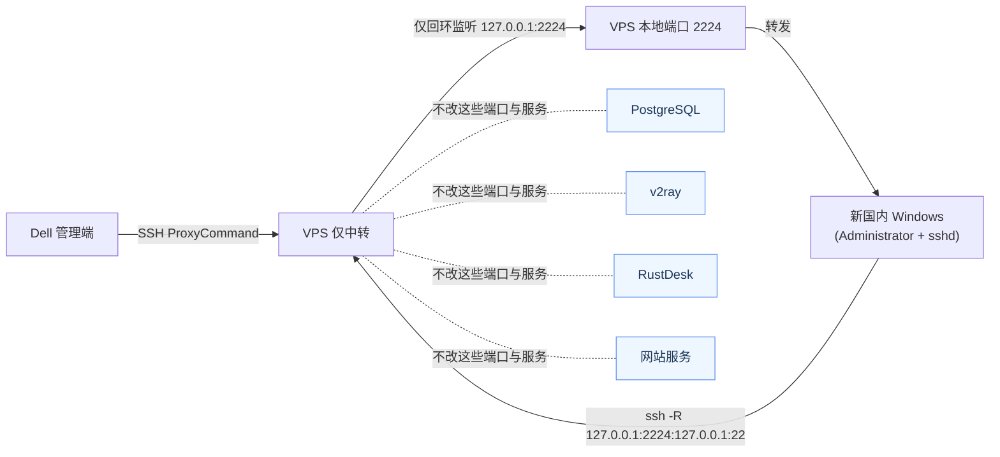
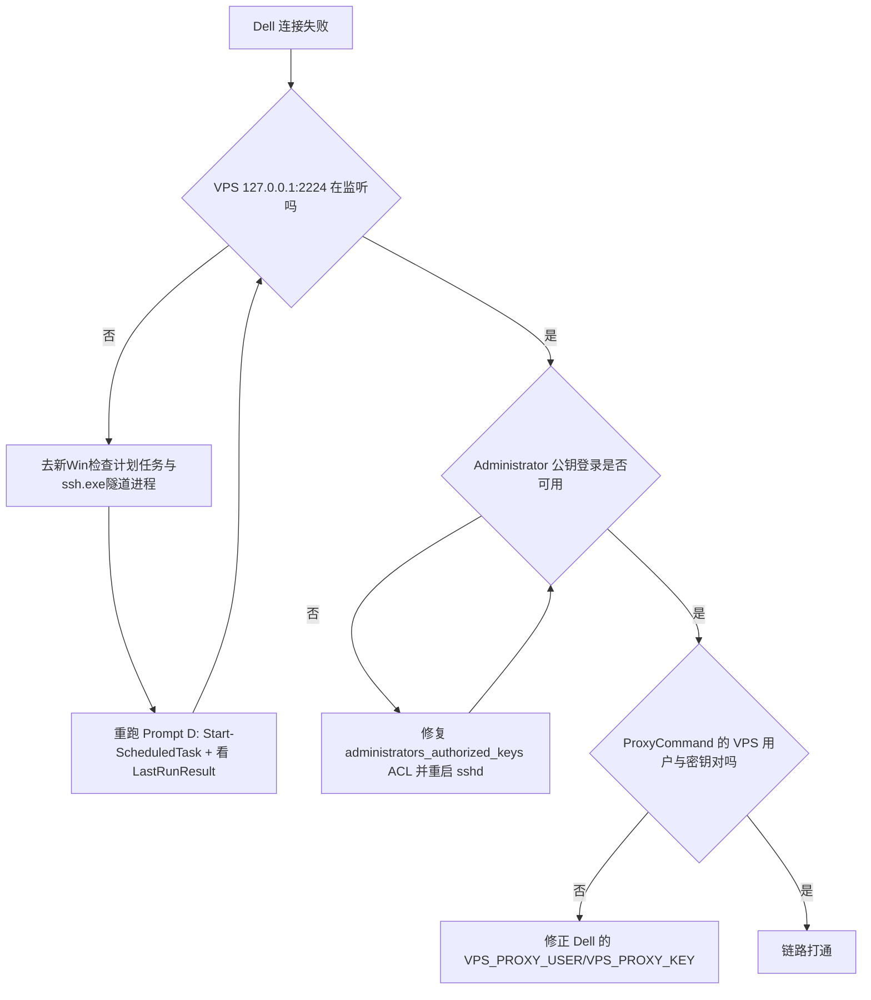

# Dell -> VPS -> 新国内 Windows(Admin) 反向隧道作战手册

这份文档是给“新开 Codex + 新手小白”直接用的：
- 你在 Dell（当前这台）发起管理连接。
- 新国内 Win 机器主动打反向隧道到 VPS。
- VPS 只做中转，不破坏现有服务（pg / v2ray / rustdesk / 现有 tunnel）。

我基于你现有两份经验文档抽象：
- `Codex_VPS/Tunnel/SurfaceTunnel.md`
- `Codex_SB2/Tunnel/Tunnel.md`

核心沿用：**专用 tunnel 用户 + 127.0.0.1 绑定 + Match User 限权 + 开机自启**。

---

## 1) 先看全局图（为什么不会影响现网）



---

## 2) 变量卡（先统一，不然后面会乱）

- `VPS_HOST`：`51.75.133.235`（Dell 侧登录用户为 `ubuntu`）
- `TUNNEL_USER`：`tunnel_cnwin`
- `TUNNEL_PORT`：`2224`（避开已用 `2222/2223`）
- `WIN_TUNNEL_KEY`：`C:\ProgramData\ssh\id_ed25519_tunnel_cnwin`
- `WIN_KNOWN_HOSTS`：`C:\ProgramData\ssh\known_hosts_tunnel_cnwin`
- `DELL_ADMIN_KEY`：`~/.ssh/id_ed25519_surface_admin`（默认复用现有，不新建）
- `DELL_ADMIN_PUB`：`~/.ssh/id_ed25519_surface_admin.pub`
- `VPS_PROXY_KEY_ON_DELL`：你在 Dell 上已经能登录 VPS 的那把 key（例如已有 tunnel/surface 用的）

---

## 3) Prompt 套装（按顺序执行）

> 你可以直接复制每个 `text` 代码块到对应机器的新 Codex 会话里执行。
> 说明：A/C/E 可在当前 Dell 与 VPS 侧完成；B/D 必须在“新Win的WSL Codex”执行，因为隧道建立前 Dell 还无法直达该机。

### Prompt A（Dell，必做）：复用现有管理员公钥（不新建 key）

```text
你在 Dell Linux 机器。目标：复用现有 key，把公钥导出给新Win使用，不新建任何 key。

请执行：
1) 检查以下文件必须存在：
   - ~/.ssh/id_ed25519_surface_admin
   - ~/.ssh/id_ed25519_surface_admin.pub
2) 输出公钥全文（单行），并用下面格式包裹：
   BEGIN_PUB_ADMIN_FROM_DELL
   ssh-ed25519 AAAAC3NzaC1lZDI1NTE5AAAAIHfMtxHuzkx0GTCU0m9zirLgl5ojD1TtlDBVkQHflYH0 dell->surface-admin
   END_PUB_ADMIN_FROM_DELL
3) 输出指纹：ssh-keygen -lf ~/.ssh/id_ed25519_surface_admin.pub
4) 不要新建 key，不要改 ~/.ssh/config，不要连接外部机器。

最后只输出：
- KEY_PATH(复用)
- PUB_FINGERPRINT
- BEGIN/END 包裹的公钥
```

---

### Prompt B（新国内 Win，第一段）：WSL 里跑 Codex，通过 PowerShell 操作 Win 本机

```text
你在“新国内 Windows 主机的 WSL 终端”里跑 Codex。目标：只做 Win 本机准备，不改 VPS。

必须满足：
- Codex 当前在 WSL；所有 Windows 改动必须通过 `powershell.exe` 或 `cmd.exe` 执行。
- 目标是 Windows sshd，不是 WSL sshd。
- 任何写文件先备份（若文件已存在）。
- 输出可读摘要。

请执行：
1) 在 WSL 里先生成临时脚本 `/tmp/cnwin_stage1.ps1`，再用下面方式调用：
   - `powershell.exe -NoProfile -ExecutionPolicy Bypass -File \"$(wslpath -w /tmp/cnwin_stage1.ps1)\"`
2) 脚本中确保 OpenSSH Client/Server 可用；若缺失则安装：
   - Add-WindowsCapability -Online -Name OpenSSH.Client~~~~0.0.1.0
   - Add-WindowsCapability -Online -Name OpenSSH.Server~~~~0.0.1.0
3) 启动并设置 sshd 开机自启：
   - Set-Service sshd -StartupType Automatic
   - Start-Service sshd
4) 生成隧道私钥（无口令）：
   - 路径 C:\ProgramData\ssh\id_ed25519_tunnel_cnwin
   - 若已存在，先备份到 *.bak_时间戳 再重建
5) 修复私钥 ACL（仅 SYSTEM + Administrators 可读写）
6) 输出公钥单行并包裹：
   BEGIN_PUB_TUNNEL_CNWIN
   ssh-ed25519 AAAAC3NzaC1lZDI1NTE5AAAAILDGXbKref8b9/I/iWyw6vl11URWNuwn2lby/v77Xp91 administrator@22H2-HNDJT2412
   END_PUB_TUNNEL_CNWIN
7) 测试出站 443 连通性（Test-NetConnection 51.75.133.235 -Port 443），这里只输出结果不做网络改动。

最后只输出：
- SSHD_STATUS
- TUNNEL_KEY_PATH
- TUNNEL_PUB_FINGERPRINT
- OUTBOUND_443_TEST
- BEGIN/END 包裹的 PUB_TUNNEL_CNWIN
```

---

### Prompt C（VPS）：创建专用 tunnel 用户与 2224 回环监听策略（不碰现网）

> 先把 Prompt B 输出的 `PUB_TUNNEL_CNWIN` 填进变量。

```text
你在 VPS Linux。目标：新增一个“新Win专用反向隧道”，不影响现有 2222/2223 和 pg/v2ray/rustdesk/web。

输入变量：
- VPS_HOST = 51.75.133.235
- TUNNEL_USER = tunnel_cnwin
- TUNNEL_PORT = 2224
- PUB_TUNNEL_CNWIN = ssh-ed25519 AAAAC3NzaC1lZDI1NTE5AAAAILDGXbKref8b9/I/iWyw6vl11URWNuwn2lby/v77Xp91 administrator@22H2-HNDJT2412

硬约束：
1) 绝不修改 nginx、postgresql、v2ray、rustdesk 配置。
2) 绝不改防火墙规则。
3) 仅允许监听 127.0.0.1:2224，不允许公网暴露。
4) 修改前备份，修改后验证并输出 diff 摘要。

请执行：
A. 变更前检查（只读输出）
- ss -ltnp | grep -E ':22|:443|:80|:5432|:2222|:2223|:2224' || true
- id tunnel_cnwin || true
- sshd -T | head -n 40

B. 用户与密钥
- 若 tunnel_cnwin 不存在则创建（有 home 目录）
- 确保 /home/tunnel_cnwin/.ssh 权限 700
- 确保 authorized_keys 存在；若已存在先备份
- 去重追加 PUB_TUNNEL_CNWIN
- authorized_keys 权限 600

C. 新增 drop-in（独立文件，避免改旧文件）
- 文件：/etc/ssh/sshd_config.d/03-tunnel-cnwin.conf
- 若已存在先备份
- 内容必须是：
  Match User tunnel_cnwin
      AllowTcpForwarding remote
      PermitListen 127.0.0.1:2224
      GatewayPorts no
      X11Forwarding no
      AllowAgentForwarding no
      PermitTTY no
      AllowStreamLocalForwarding no

D. 校验与生效
- sshd -t
- systemctl reload ssh || systemctl reload sshd
- sshd -T -C user=tunnel_cnwin,host=localhost,addr=127.0.0.1 | grep -E 'allowtcpforwarding|permitlisten|gatewayports|permittty|allowagentforwarding|allowstreamlocalforwarding|x11forwarding'

E. 输出摘要
- USER_CREATED_OR_EXISTING
- DROPIN_PATH
- AUTH_KEYS_LINE_COUNT
- TUNNEL_PORT_POLICY
- BEFORE_PORT_SNAPSHOT
- AFTER_PORT_SNAPSHOT

注意：如果发现 2224 已被占用，立即停止并只输出“PORT_CONFLICT + 建议新端口”，不要擅自改为别的端口。
```

---

### Prompt D（新国内 Win，第二段）：写入管理员公钥 + 建立开机自启反向隧道

> 先准备两个输入：
> - `PUB_ADMIN_FROM_DELL`（来自 Prompt A，默认是 `id_ed25519_surface_admin.pub`）
> - `VPS_HOST`（固定：`51.75.133.235`）

```text
你在“新国内 Windows 主机的 WSL 终端”里跑 Codex，并通过 `powershell.exe` 操作管理员上下文。目标：
1) 让 Dell 可通过密钥登录本机 Administrator（Windows sshd）。
2) 开机自动拉起 Win -> VPS 的 2224 反向隧道。

输入变量：
- VPS_HOST = 51.75.133.235
- TUNNEL_USER = tunnel_cnwin
- TUNNEL_PORT = 2224
- WIN_TUNNEL_KEY = C:\ProgramData\ssh\id_ed25519_tunnel_cnwin
- WIN_KNOWN_HOSTS = C:\ProgramData\ssh\known_hosts_tunnel_cnwin
- PUB_ADMIN_FROM_DELL = ssh-ed25519 AAAAC3NzaC1lZDI1NTE5AAAAIHfMtxHuzkx0GTCU0m9zirLgl5ojD1TtlDBVkQHflYH0 dell->surface-admin

硬约束：
- 修改前备份 administrators_authorized_keys。
- 修复 administrators_authorized_keys ACL 为 SYSTEM + Administrators。
- 仅新增计划任务，不动其他无关服务。

请执行：
A) 管理员登录公钥
1. 确保 C:\ProgramData\ssh\administrators_authorized_keys 存在（不存在则创建）。
2. 若文件存在先备份为 .bak_时间戳。
3. 去重追加 PUB_ADMIN_FROM_DELL。
4. 执行 ACL：
   - icacls administrators_authorized_keys /inheritance:r
   - grant SYSTEM:F 与 BUILTIN\Administrators:F
5. Restart-Service sshd

B) 反向隧道启动脚本
1. 写入 C:\ProgramData\ssh\start_cnwin_tunnel.ps1（若存在先备份），脚本逻辑：
   - 杀掉命令行包含 `-R 127.0.0.1:2224:127.0.0.1:22` 的旧 ssh.exe
   - 用 ssh.exe 启动新隧道：
     -NT -p 443
     -i "C:\ProgramData\ssh\id_ed25519_tunnel_cnwin"
     -o ExitOnForwardFailure=yes
     -o ServerAliveInterval=30
     -o ServerAliveCountMax=3
     -o StrictHostKeyChecking=accept-new
     -o UserKnownHostsFile="C:\ProgramData\ssh\known_hosts_tunnel_cnwin"
     -R 127.0.0.1:2224:127.0.0.1:22
     tunnel_cnwin@51.75.133.235

C) 开机自启计划任务
1. 任务名：Tunnel_CNWIN_2224
2. AtStartup 触发
3. 以 SYSTEM 最高权限运行
4. Action：
   powershell.exe -NoProfile -ExecutionPolicy Bypass -File "C:\ProgramData\ssh\start_cnwin_tunnel.ps1"
5. 失败自动重试：每 1 分钟，最多 999 次
6. 立即 Start-ScheduledTask 触发一次

D) 输出摘要
- SSHD_STATUS
- ADMIN_KEYS_LINE_COUNT
- TASK_EXISTS
- TASK_LAST_RUN_RESULT
- TUNNEL_PROCESS_CMDLINE
```

---

### Prompt E（Dell）：最终连通性验证（从 Dell 直达新 Win Administrator）

```text
你在 Dell Linux。目标：通过 VPS 中转，SSH 到新国内 Windows 的 Administrator。

输入变量：
- VPS_HOST = 51.75.133.235
- VPS_PROXY_USER = ubuntu
- VPS_PROXY_KEY = ~/.ssh/id_ed25519_vps_tunnel
- TUNNEL_PORT = 2224
- DELL_ADMIN_KEY = ~/.ssh/id_ed25519_surface_admin

请执行：
1) 先检查 VPS 回环端口是否已监听：
   ssh -i "$VPS_PROXY_KEY" -p 443 "$VPS_PROXY_USER@$VPS_HOST" "ss -ltn | grep '127.0.0.1:2224' || true"
2) 若监听存在，执行登录测试：
   ssh -i "$DELL_ADMIN_KEY" \
     -o StrictHostKeyChecking=accept-new \
     -o "ProxyCommand=ssh -i $VPS_PROXY_KEY -p 443 $VPS_PROXY_USER@$VPS_HOST 'nc 127.0.0.1 2224'" \
     Administrator@localhost "hostname"
3) 把可复用 alias 写入 ~/.ssh/config（先备份）：
   Host cnwin-admin-via-vps
     HostName localhost
     User Administrator
     Port 22
     IdentityFile ~/.ssh/id_ed25519_surface_admin
     StrictHostKeyChecking accept-new
     ProxyCommand ssh -i ~/.ssh/id_ed25519_vps_tunnel -p 443 ubuntu@51.75.133.235 'nc 127.0.0.1 2224'

最后输出：
- VPS_LOOPBACK_2224
- SSH_TEST_RESULT
- SSH_CONFIG_ALIAS_WRITTEN
```

---

## 4) 为什么这套不会把现网打挂

- **端口隔离**：新隧道只用 `127.0.0.1:2224`，不占公网端口，不碰 80/443 对外服务逻辑。
- **用户隔离**：专用 `tunnel_cnwin`，不复用现有 `tunnel` / `tunnel_surface`。
- **配置隔离**：新建 `03-tunnel-cnwin.conf`，不覆盖旧 drop-in。
- **流程隔离**：每一步都先备份，再 `sshd -t`，最后 `reload`（不是暴力重启整机）。
- **故障可回滚**：删用户 + 恢复 drop-in 备份 + 恢复 authorized_keys 备份即可。

---

## 5) 快排图（连不上时按图走）



---

## 6) 最小回滚剧本（只撤这条新隧道）

### VPS 回滚
- 删除 `/etc/ssh/sshd_config.d/03-tunnel-cnwin.conf`（或恢复备份）
- `sshd -t && systemctl reload ssh`
- `userdel -r tunnel_cnwin`（如果确认不再需要）

### 新 Win 回滚
- 删除计划任务 `Tunnel_CNWIN_2224`
- 删除 `C:\ProgramData\ssh\start_cnwin_tunnel.ps1`
- 从 `administrators_authorized_keys` 移除新增公钥（按备份恢复）

---

## 7) 你可以直接照着说的一句话（给新开 Codex）

- 在 VPS 说：
  - “按 `VPS.md` 的 Prompt C 执行，只创建 `tunnel_cnwin + 2224` 回环隧道策略，不改任何现网服务。”
- 在新 Win 说：
  - “按 `VPS.md` 的 Prompt B 和 D 执行，目标是 Windows Administrator 可被 Dell 经 VPS 访问，并且开机自启反向隧道。”

做到这里，你就拥有了第三条并行通道（Dell / Surface / 新国内Win），而且互不打架。
