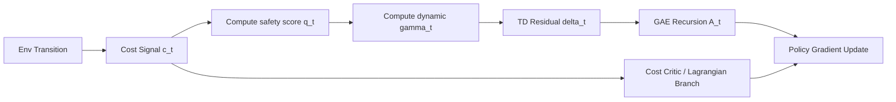
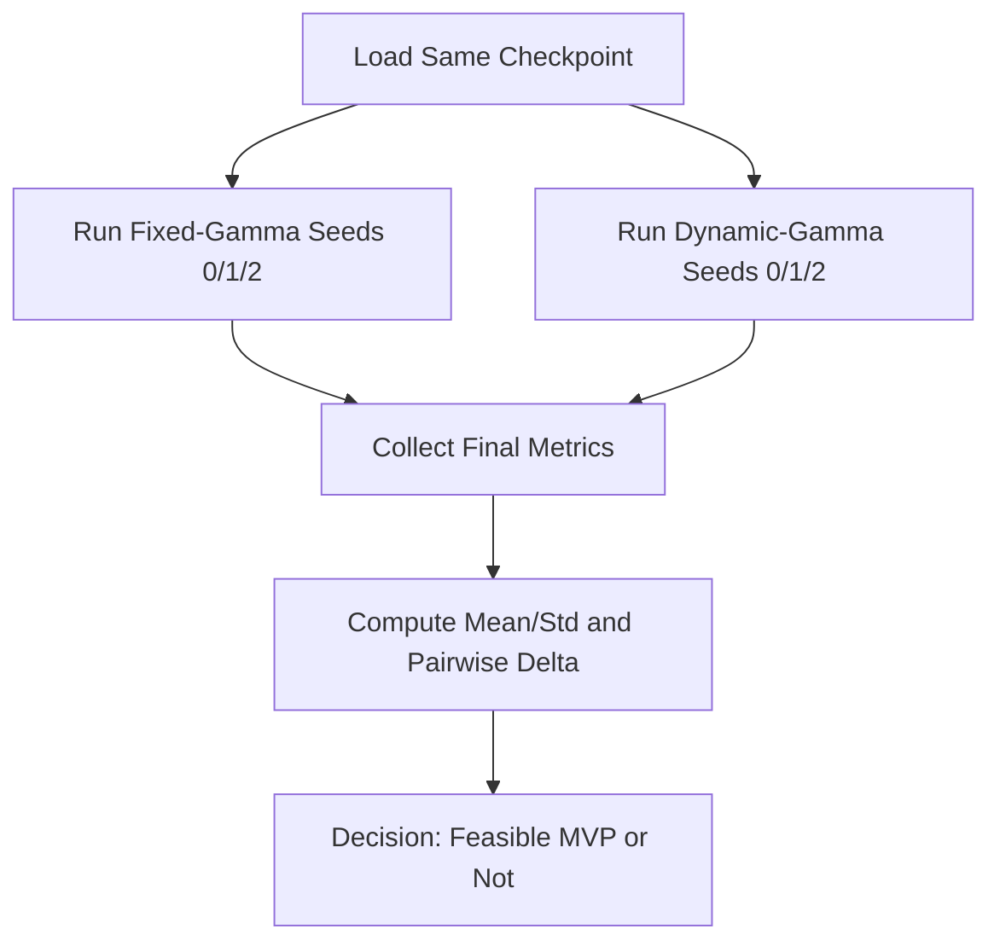
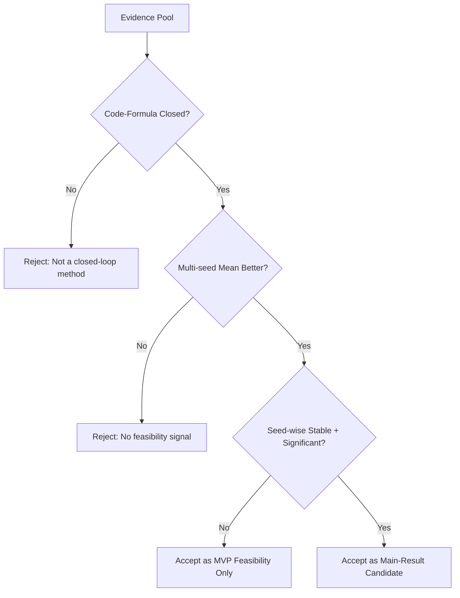

# CDPS-MVP 阶段性技术报告（可审计证据链版）

> 版本：`v0.1`  
> 生成日期：`2026-03-18`  
> 实验域：`MiniGrid`  
> 目标：给出“是否已形成可写入论文的闭环结果”的客观判定

---

## 0. 执行摘要（先给决策结论）

**结论分级：**

1. **MVP闭环：已完成。**
2. **论文主结论：尚未完成。**
3. **可写稿位置：可写“方法可行性 + 初步证据”，暂不宜写“稳健优于基线”的主结果。**

**理由（证据直达）：**

1. 机制闭环已落地到训练代码：`q(s) -> c_t -> gamma_t -> G_t/GAE -> V(s)`，且有日志诊断项 `Diag/QMean / Diag/GammaMean`。
2. 两轮多 seed 对照（仅改 dynamic-gamma 开关）都出现同向均值信号：
   - MVP-0：`ΔEpRet=+0.158, ΔEpCostTrue=-0.016`
   - MVP-1：`ΔEpRet=+0.081, ΔEpCostTrue=-0.009`
3. 但 seed 级一致性不足（并非每个 seed 都 Pareto 改善），统计强度不足以支撑中二区主结论。

---

## 1. 问题背景与创新假设

### 1.1 问题不是“能不能跑”，而是“能否在安全-回报上形成可验证改进”

安全强化学习常见难点是：

1. 奖励回传路径只优化收益，危险信息在价值传播中衰减过慢。
2. 训练中看到“危险迹象”后，策略更新未必及时变短视（风险敏感 credit assignment 不足）。

### 1.2 本次 MVP 的最小创新点

不引入新网络、不改环境、不改奖励定义，仅在优势估计链路中加入 **状态相关折扣**：

- `q_t = clip(1 - c_t, 0, 1)`
- `gamma_t = gamma_base * ((1-eta) * q_t + eta)`

解释：

1. 危险成本 `c_t` 越大，安全度 `q_t` 越小。
2. `q_t` 越小，`gamma_t` 越小，未来回报传播半径缩短。
3. 策略梯度更关注“眼前风险”，属于风险敏感的 credit assignment。

这是一个严格“最小手术”设计：把变量控制到只剩一个开关，方便归因。

---

## 2. 数学闭环（从目标函数到代码执行）

### 2.1 约束优化背景（CMDP / Lagrangian）

策略优化可写为：

\[
\max_\pi \; J_R(\pi) - \lambda\,(J_C(\pi)-d)
\]

其中：

1. \(J_R\)：期望累计奖励。
2. \(J_C\)：期望累计成本。
3. \(d\)：成本预算。
4. \(\lambda\)：拉格朗日乘子。

MVP 不改这一定义，只改 **奖励优势估计时的折扣传播**。

### 2.2 固定折扣 vs 动态折扣

固定折扣（基线）GAE：

\[
\delta_t = r_t + \gamma V(s_{t+1}) - V(s_t),\quad
A_t = \delta_t + \gamma\lambda A_{t+1}
\]

动态折扣（MVP）：

\[
q_t = \mathrm{clip}(1-c_t, 0, 1)
\]
\[
\gamma_t = \gamma\big((1-\eta)q_t + \eta\big),\quad \gamma_t\in(0,\gamma]
\]
\[
\delta_t = r_t + \gamma_t V(s_{t+1}) - V(s_t)
\]
\[
A_t = \delta_t + \gamma_t\lambda A_{t+1}
\]

价值目标不变：

\[
\hat V_t = A_t + V(s_t)
\]

### 2.3 为什么这是“闭环”而不是“口号”

闭环成立需要四件事同时满足：

1. `q_t` 有定义（来源于成本）。
2. `gamma_t` 有边界和可计算表达式。
3. TD/GAE 递推确实使用了逐步 `gamma_t`。
4. 训练日志能观测该链条确实生效。

本次实现四项均满足（见第 3 节证据）。

---

## 3. 代码证据链（行号可审计）

### 3.1 参数入口（开关与超参）

- 新增参数：`--use-dynamic-gamma`、`--gamma-eta`  
  证据：[config.py](/root/autodl-tmp/projects/TTCT/policy_training/utils/config.py#L172) [config.py](/root/autodl-tmp/projects/TTCT/policy_training/utils/config.py#L173)

### 3.2 动态折扣计算与边界控制

- 在 `finish_path` 中构造：`q_t`、`gamma_t`，并限制 `gamma_t <= gamma_base`。  
  证据：[buffer.py](/root/autodl-tmp/projects/TTCT/policy_training/common/buffer.py#L172) [buffer.py](/root/autodl-tmp/projects/TTCT/policy_training/common/buffer.py#L179)

### 3.3 GAE/TD 递推真正使用逐步 gamma

- `calculate_adv_and_value_targets` 支持 `gamma` 为向量，递推 `gae = delta + gamma_t * lam * gae`。  
  证据：[buffer.py](/root/autodl-tmp/projects/TTCT/policy_training/common/buffer.py#L267) [buffer.py](/root/autodl-tmp/projects/TTCT/policy_training/common/buffer.py#L283)

### 3.4 训练主循环接线与诊断日志

- `finish_path(... use_dynamic_gamma=args.use_dynamic_gamma, gamma_eta=args.gamma_eta)`  
  证据：[ppo_lag.py](/root/autodl-tmp/projects/TTCT/policy_training/ppo_lag.py#L417)
- 记录 `Diag/QMean` 与 `Diag/GammaMean`  
  证据：[ppo_lag.py](/root/autodl-tmp/projects/TTCT/policy_training/ppo_lag.py#L444) [ppo_lag.py](/root/autodl-tmp/projects/TTCT/policy_training/ppo_lag.py#L455) [ppo_lag.py](/root/autodl-tmp/projects/TTCT/policy_training/ppo_lag.py#L625)

---

## 4. 实验设计（控制变量与可复验性）

### 4.1 对照原则

两组对照唯一差异：

1. 基线：固定 `gamma`。
2. 实验组：开启 `--use-dynamic-gamma --gamma-eta 0.2`。

其余保持一致：环境、模型权重、seed 集合、epoch 结构、训练脚本路径。

### 4.2 两轮预算设置

1. **MVP-0 小预算**：`steps-per-epoch=1200`, `total-steps=7200`, seeds=`0,1,2`。  
   汇总证据：[CDPS_MVP0_DYNAMIC_GAMMA_MULTI_SEED_20260317.md](/root/autodl-tmp/projects/FNLC_2401_repro/logs/CDPS_MVP0_DYNAMIC_GAMMA_MULTI_SEED_20260317.md#L1)
2. **MVP-1 中预算**：`steps-per-epoch=2400`, `total-steps=14400`, seeds=`0,1,2`。  
   运行脚本证据：[run_cdps_mvp1_medium_0317.sh](/root/autodl-tmp/projects/FNLC_2401_repro/run_cdps_mvp1_medium_0317.sh#L1)  
   完成证据：[cdps_mvp1_medium_driver_0317.log](/root/autodl-tmp/projects/FNLC_2401_repro/logs/cdps_mvp1_medium_driver_0317.log#L1373)  
   汇总证据：[CDPS_MVP1_DYNAMIC_GAMMA_MULTI_SEED_20260317.md](/root/autodl-tmp/projects/FNLC_2401_repro/logs/CDPS_MVP1_DYNAMIC_GAMMA_MULTI_SEED_20260317.md#L1)

---

## 5. 结果总览（面向决策）

### 5.1 多 seed 汇总

| 阶段 | 组别 | EpRet (mean±std) | EpCostTrue (mean±std) | 结论摘要 |
|---|---|---:|---:|---|
| MVP-0 | Fixed | 0.279 ± 0.134 | 0.939 ± 0.053 | 基线 |
| MVP-0 | Dynamic | 0.437 ± 0.067 | 0.923 ± 0.082 | 回报上升，成本均值下降 |
| MVP-1 | Fixed | 0.356 ± 0.086 | 0.948 ± 0.044 | 中预算基线 |
| MVP-1 | Dynamic | 0.437 ± 0.012 | 0.939 ± 0.044 | 回报上升，成本均值小降 |

### 5.2 差值视角（Dynamic - Fixed）

1. MVP-0：`ΔRet=+0.158`，`ΔCost=-0.016`。
2. MVP-1：`ΔRet=+0.081`，`ΔCost=-0.009`。

**关键观察：**

1. 两轮预算的“均值方向”一致（回报更高、成本更低）。
2. 但 seed 级别并不稳定，尚不能宣称“稳健优于基线”。

### 5.3 机制诊断值

Dynamic 组在 MVP-1 的统计：

1. `QMean = 0.960 ± 0.003`
2. `GammaMean = 0.920 ± 0.002`

说明 `q_t -> gamma_t` 的链路实际在训练中生效，而非静态配置项。

---

## 6. 三张图看完整故事

### 6.1 总架构图（方法位点）

### 6.2 执行流程图（可复验流程）

### 6.3 证据分流图（审稿判定逻辑）

---

## 7. 严格审稿视角：当前证据等级

### 7.1 已达标项（可以写）

1. **方法定义清楚且可执行**：不是概念叙事，而是可运行公式链。
2. **最小改动归因清楚**：只有 dynamic-gamma 开关不同。
3. **跨两档预算复验**：方向一致，不是单次偶然。

### 7.2 未达标项（主结果仍欠缺）

1. **统计强度不足**：3 seed 太少。
2. **seed 级一致性不足**：并非每个 seed 都达到 Pareto 改善。
3. **外部泛化不足**：仅 MiniGrid，尚缺跨环境/任务验证。

### 7.3 结论等级

- **当前等级：`MVP Feasibility (可行性)`**
- **非当前等级：`Paper Main Claim (稳健优于基线)`**

---

## 8. 复现实操清单

### 8.1 关键命令（中预算）

运行脚本：  
[run_cdps_mvp1_medium_0317.sh](/root/autodl-tmp/projects/FNLC_2401_repro/run_cdps_mvp1_medium_0317.sh#L1)

核心差异参数：

1. 固定组：无 `--use-dynamic-gamma`
2. 实验组：`--use-dynamic-gamma --gamma-eta 0.2`

### 8.2 核心产物

1. 小预算汇总：  
   [CDPS_MVP0_DYNAMIC_GAMMA_MULTI_SEED_20260317.md](/root/autodl-tmp/projects/FNLC_2401_repro/logs/CDPS_MVP0_DYNAMIC_GAMMA_MULTI_SEED_20260317.md#L1)
2. 中预算汇总：  
   [CDPS_MVP1_DYNAMIC_GAMMA_MULTI_SEED_20260317.md](/root/autodl-tmp/projects/FNLC_2401_repro/logs/CDPS_MVP1_DYNAMIC_GAMMA_MULTI_SEED_20260317.md#L1)
3. 中预算 driver 完成标记：  
   [cdps_mvp1_medium_driver_0317.log](/root/autodl-tmp/projects/FNLC_2401_repro/logs/cdps_mvp1_medium_driver_0317.log#L1373)

---

## 9. 论文叙事建议（可直接改写进正文）

建议将当前结果写为：

1. **方法节**：提出“风险敏感动态折扣”的最小闭环实现；给出变折扣 GAE 公式。  
2. **实验节（Phase-1）**：在严格控制变量下，报告两档预算、多 seed 对照，显示平均改善趋势。  
3. **讨论节**：明确声明“当前为可行性证据，不构成统计稳健优势”；并给出下一阶段统计计划。

这样的叙事符合中二区审稿常见偏好：

1. 不夸大；
2. 强调可复现；
3. 明确局限与后续验证路径。

---

## 10. 参考文献与背景依据

### 10.1 本项目内部证据（可直接审计）

1. 动态折扣实现：  
   [buffer.py](/root/autodl-tmp/projects/TTCT/policy_training/common/buffer.py#L172)
2. 训练接线与日志：  
   [ppo_lag.py](/root/autodl-tmp/projects/TTCT/policy_training/ppo_lag.py#L417)  
   [ppo_lag.py](/root/autodl-tmp/projects/TTCT/policy_training/ppo_lag.py#L625)
3. CLI 参数入口：  
   [config.py](/root/autodl-tmp/projects/TTCT/policy_training/utils/config.py#L172)
4. 小预算汇总：  
   [CDPS_MVP0_DYNAMIC_GAMMA_MULTI_SEED_20260317.md](/root/autodl-tmp/projects/FNLC_2401_repro/logs/CDPS_MVP0_DYNAMIC_GAMMA_MULTI_SEED_20260317.md#L1)
5. 中预算汇总：  
   [CDPS_MVP1_DYNAMIC_GAMMA_MULTI_SEED_20260317.md](/root/autodl-tmp/projects/FNLC_2401_repro/logs/CDPS_MVP1_DYNAMIC_GAMMA_MULTI_SEED_20260317.md#L1)

### 10.2 外部理论参考（公式与范式）

1. GAE：Schulman et al., 2015  
   https://arxiv.org/abs/1506.02438
2. PPO：Schulman et al., 2017  
   https://arxiv.org/abs/1707.06347
3. CPO（约束策略优化基线）：Achiam et al., 2017  
   https://proceedings.mlr.press/v70/achiam17a.html
4. SafeDreamer（世界模型安全 RL 背景）：Huang et al., ICLR 2024  
   https://arxiv.org/abs/2307.07176
5. Text-to-Trajectory（文本约束表征背景）：Dong et al., NeurIPS 2024  
   https://arxiv.org/abs/2412.08920
6. Free-form NLC Safe RL（相关文本约束工作）：Yang et al., 2024  
   https://arxiv.org/abs/2401.07553

---

## 11. 结尾判断

**当前阶段最准确表述：**

> 动态折扣链路已形成完整技术闭环，并在双预算多 seed 对照中呈现稳定的“均值改善趋势”；该结果达到方法可行性证据标准，可进入论文正文的 Phase-1。若要支撑中二区主结论，仍需扩大统计强度与跨环境稳健性验证。

---

## 12. Mermaid 渲染校验记录

本报告内 3 张 Mermaid 图已做命令行渲染验证，生成 SVG 成功（非仅语法自检）：

1. `/tmp/wm_diag1.svg`
2. `/tmp/wm_diag2.svg`
3. `/tmp/wm_diag3.svg`

校验命令使用 `@mermaid-js/mermaid-cli`，状态码为 `0`。
