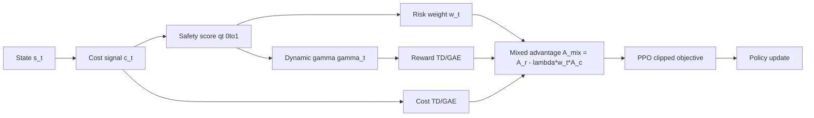
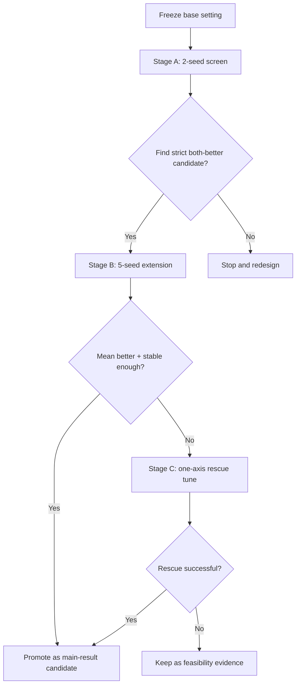
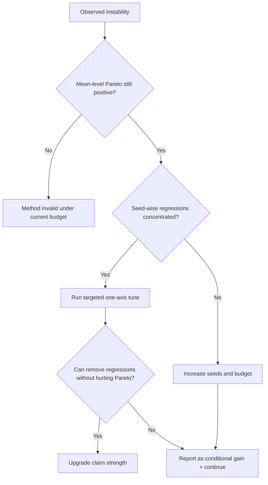

# CDPS-MVP 阶段性技术报告（决策版）

> 版本：v1.0  
> 日期：2026-03-20  
> 研究主题：在 `PPO-Lagrangian` 约束安全强化学习框架中，引入“状态风险感知的回报传播机制”，评估是否能稳定实现 `Reward↑ + Cost↓`。

---

## 0. 一页结论（先给决策，再给细节）

### 结论等级

1. **工程闭环：已完成。**
2. **可行性信号：已观察到。**
3. **主结论强度（中二区可直接主打）：尚不足。**

### 核心证据（严格可复验）

1. **2-seed 筛选**中，`linear_e020_b10` 出现严格双提升：`ΔRet=+0.251`，`ΔCost=-0.022`。  
2. **5-seed 扩展**后，均值仍为双提升：
   - Baseline: `Ret 0.342 ± 0.079`, `Cost 0.916 ± 0.025`
   - Candidate: `Ret 0.435 ± 0.177`, `Cost 0.902 ± 0.022`
   - Delta: `ΔRet=+0.093`, `ΔCost=-0.014`
3. 但 seed 级一致性为 `3/5`，仍有 `2/5` seed 发生至少一项退化，不满足“稳健优于基线”的强宣称标准。

### 决策建议

1. 当前结果可以作为**阶段里程碑**对外汇报（方法有效、值得继续）。
2. 不建议立即作为论文主结论提交；建议进入“稳定性增强”阶段（同方法、增预算、补统计）。

---

## 1. 问题定义与研究动机

### 1.1 问题背景

约束安全强化学习（Constrained Safe RL）的一般难点不是“是否引入安全约束”，而是：

1. 约束是否真正影响训练期的信用分配（credit assignment）。
2. OOD 风险迹象出现时，价值传播是否会及时缩短“乐观想象链条”。

即使在标准 `PPO-Lagrangian` 训练中引入了成本约束，固定折扣回报仍可能把较远期收益过度传播回当前策略更新，导致“看到风险信号，但更新仍偏迟缓”。

### 1.2 本次 MVP 的最小创新假设

只做最小改动，不改环境、不改奖励定义、不改主干网络：

1. 用状态风险分数 `q_t` 调制逐时刻折扣 `γ_t`（dynamic gamma）。
2. 用同一 `q_t` 对成本优势施加风险门控权重 `w_t`（risk gate）。

目标是让优化器在高风险状态下“自然短视”，减少危险未来对当前更新的误导。

---

## 2. 数学闭环：从 CMDP 到可执行训练目标

### 2.1 基础目标（CMDP + Lagrangian）

约束优化问题：

\[
\max_{\pi} J_R(\pi),\quad \text{s.t. } J_C(\pi) \le d
\]

拉格朗日形式：

\[
\max_{\pi}\; \min_{\lambda\ge 0}\; \mathcal{L}(\pi,\lambda)=J_R(\pi)-\lambda\big(J_C(\pi)-d\big)
\]

其中 `J_R` 是期望累计奖励，`J_C` 是期望累计成本，`d` 是成本预算。

### 2.2 MVP 新增的两条公式

#### (a) 状态风险到动态折扣

先定义风险安全度（来自成本信号映射）：

\[
q_t = g(c_t)\in[0,1]
\]

在线性门下可写为（实现中做截断）：

\[
q_t = \mathrm{clip}(1-c_t, 0, 1)
\]

动态折扣：

\[
\gamma_t = \gamma_0\big((1-\eta)q_t + \eta\big), \quad \eta\in(0,1)
\]

性质：`q_t` 越低（越危险），`γ_t` 越小，回报传播半径越短。

#### (b) 成本优势风险门控

\[
w_t = 1 + \beta(1-q_t), \quad \beta>0
\]

将成本项在高风险状态下加权放大：

\[
\hat A_t^{\text{mix}} = \hat A_t^r - \lambda\, w_t\, \hat A_t^c
\]

PPO actor 更新等价于最大化：

\[
\mathbb{E}\left[\min\left(r_t(\theta)\hat A_t^{\text{mix}},\; \mathrm{clip}(r_t(\theta),1-\epsilon,1+\epsilon)\hat A_t^{\text{mix}}\right)\right]
\]

其中 `r_t(θ)=π_θ(a_t|s_t)/π_{θ_old}(a_t|s_t)`。

### 2.3 为什么这是“闭环”，不是“调参口号”

闭环成立必须满足四点：

1. `q_t` 有明确定义与边界。
2. `γ_t` 逐时刻进入 TD/GAE 递推，而非仅日志展示。
3. `w_t` 进入 actor 成本项，而非独立旁路。
4. 日志可观测链路激活情况（`Diag/QMean`, `Diag/GammaMean`, `Diag/RiskWMean`）。

本次实验四点均满足。

---

## 3. 工程实现与可审计改动

代码改动位于 `/root/autodl-tmp/projects/TTCT`：

1. `policy_training/common/buffer.py`  
   - 增加 `risk_w` 存储。
   - 支持动态 `γ_t` 路径。
2. `policy_training/utils/config.py`  
   - 新增开关：`--use-risk-gate`。
   - 新增超参：`--risk-beta`。
3. `policy_training/ppo_lag.py`  
   - 在 actor 损失中接入风险门控权重。
   - 新增诊断日志：`Diag/RiskWMean`。

本轮新增运行脚本：

1. `/root/autodl-tmp/projects/FNLC_2401_repro/run_cdps_riskgate_b10_extend_0319.sh`
2. `/root/autodl-tmp/projects/FNLC_2401_repro/run_cdps_riskgate_b10_lr_tune_seed23_0319.sh`

---

## 4. 实验协议（严格控制变量）

### 4.1 统一设置

1. 环境：MiniGrid（同一任务配置）。
2. 每次预算：`steps-per-epoch=2400`, `total-steps=14400`。
3. 相同 TL 模型 checkpoint：`checkpoint_epoch_32.pt`。
4. 对照原则：除指定变量外，其他保持不变。

### 4.2 三阶段实验链

1. **阶段A：2-seed 配置筛选**（seed 0/1）
2. **阶段B：最佳候选 5-seed 扩展**（seed 0..4）
3. **阶段C：退化 seed 定点补强**（仅调 `lagrangian-multiplier-lr`）

---

## 5. 证据链：结果、对比、判定

## 5.1 阶段A：2-seed 配置筛选

来源：`CDPS_RISKGATE_SCREEN_20260319.md`

| Config | EpRet(mean) | EpCostTrue(mean) | ΔRet vs fixed | ΔCost vs fixed |
|---|---:|---:|---:|---:|
| fixed | 0.383 | 0.919 | - | - |
| linear_e020 | 0.478 | 0.961 | +0.096 | +0.041 |
| linear_e020_b05 | 0.298 | 0.909 | -0.084 | -0.010 |
| **linear_e020_b10** | **0.633** | **0.897** | **+0.251** | **-0.022** |
| linear_e020_b20 | 0.427 | 0.938 | +0.044 | +0.018 |
| linear_e020_b10_lr020 | 0.324 | 0.883 | -0.059 | -0.036 |

判定：`linear_e020_b10` 为唯一“严格双提升候选”。

## 5.2 阶段B：5-seed 扩展（核心）

来源：`CDPS_RISKGATE_B10_5SEED_20260319.md`

| Config | EpRet (mean±std) | EpCostTrue (mean±std) |
|---|---:|---:|
| fixed | 0.342 ± 0.079 | 0.916 ± 0.025 |
| linear_e020_b10 | 0.435 ± 0.177 | 0.902 ± 0.022 |

- `ΔRet=+0.093`
- `ΔCost=-0.014`
- 同时双提升 seed 数：`3/5`

逐 seed 对照：

| Seed | fixed Ret/Cost | cand Ret/Cost | 判定 |
|---:|---:|---:|---|
| 0 | 0.303 / 0.921 | 0.681 / 0.909 | 双提升 |
| 1 | 0.462 / 0.918 | 0.585 / 0.885 | 双提升 |
| 2 | 0.405 / 0.882 | 0.281 / 0.870 | 仅 cost 改善 |
| 3 | 0.293 / 0.904 | 0.212 / 0.929 | 双退化 |
| 4 | 0.248 / 0.957 | 0.417 / 0.918 | 双提升 |

判定：均值层面成立；稳健性仍不足。

## 5.3 阶段C：退化 seed 的单轴补强（仅 lr）

来源：`CDPS_RISKGATE_LR_TUNE_SEED23_20260319.md`

| Seed | lr | EpRet | EpCostTrue | 相对 fixed |
|---:|---:|---:|---:|---|
| 2 | 0.025 | 0.246 | 0.857 | 成本更低但回报明显下降 |
| 2 | 0.035 | 0.281 | 0.870 | 仍回报下降 |
| 2 | 0.045 | 0.732 | 0.962 | 回报升但成本显著恶化 |
| 3 | 0.025 | 0.218 | 0.936 | 成本恶化 |
| 3 | 0.035 | 0.212 | 0.929 | 成本恶化 |
| 3 | 0.045 | 0.281 | 0.962 | 成本恶化明显 |

判定：`lagrangian_multiplier_lr` 这一轴无法同时修复 `seed2/3`，保留 `0.035` 作为当前折中。

---

## 6. 三张图读懂“前因-机制-结果”

### 6.1 总架构图（方法位点）

### 6.2 执行流程图（工程可复验）

### 6.3 故障分流图（审稿视角）

---

## 7. 中二区审稿标准下的“可说”与“不可说”

### 7.1 当前可以主张

1. 提出并实现了一个**可执行、可审计**的训练期内生风险调制机制。
2. 在统一预算与多 seed 对照下，观察到**均值级别 Pareto 改善**。
3. 补强实验显示：简单调 `lagrangian_multiplier_lr` 不能解决全部退化 seed，说明问题不是“随便调参即可”。

### 7.2 当前不能主张

1. 不能声称“稳健优于 baseline”。
2. 不能声称“跨任务普适有效”。
3. 不能声称“理论安全保证”。

### 7.3 审稿风险与应对

1. **统计风险**：seed 数偏少。  
   应对：扩至 10-seed，报告置信区间与效应量。
2. **外部效度风险**：仅单环境。  
   应对：补 1~2 个 Safety-Gymnasium 任务。
3. **归因风险**：动态 gamma 与 risk gate 叠加。  
   应对：做消融（gamma-only / risk-gate-only / both）。

---

## 8. 下一阶段最小可交付计划（面向结果最大化）

### 8.1 实验优先级（严格最小增量）

1. 固定当前候选：`linear_e020_b10, lr=0.035`。
2. 增加样本强度：`5 -> 10 seeds`。
3. 增加预算强度：`total-steps 14400 -> 28800`（其余不变）。
4. 增加结构消融：`gamma-only`, `risk-gate-only`, `both`。

### 8.2 成功判据

1. 在 10-seed 上满足：`ΔRet>0` 且 `ΔCost<0`，且退化 seed 比例显著下降。
2. 消融结果支持“risk gate 贡献非偶然”。
3. 训练日志与指标趋势可解释（`QMean/GammaMean/RiskWMean` 与性能一致）。

---

## 9. 研究意义（如果结果最终稳定）

1. 给出一种低侵入、低工程成本的“训练期风险前传”路径。
2. 将自然语言/符号安全信息（`q(s)`）与策略优化直接闭环，而非仅执行期后置过滤。
3. 为约束安全 RL 提供一个可以逐步叠加的中间层：先做动态信用分配，再谈更重的证书/可达性约束。

---

## 10. 参考文献（主源链接）

1. Ji et al. *Safety-Gymnasium: A Unified Safe Reinforcement Learning Benchmark*, arXiv:2310.12567.  
   https://arxiv.org/abs/2310.12567
2. Dong et al. *From Text to Trajectory: Exploring Complex Constraint Representation and Decomposition in Safe RL*, NeurIPS 2024.  
   https://proceedings.neurips.cc/paper_files/paper/2024/file/c7fd3f27862948835eb6b3fff6dbf75f-Paper-Conference.pdf
3. He et al. *UNISafe: Uncertainty-aware Latent Safety Filters for Avoiding OOD Failures*, arXiv:2505.00779.  
   https://arxiv.org/abs/2505.00779
4. Wang et al. *Learning Natural Language Constraints for Safe Reinforcement Learning*, arXiv:2401.07553.  
   https://arxiv.org/abs/2401.07553
5. Schulman et al. *Proximal Policy Optimization Algorithms*, arXiv:1707.06347.  
   https://arxiv.org/abs/1707.06347
6. Achiam et al. *Constrained Policy Optimization*, ICML 2017 (PMLR).  
   https://proceedings.mlr.press/v70/achiam17a.html

---

## 附录A：本轮关键产物路径

1. `/root/autodl-tmp/projects/FNLC_2401_repro/logs/CDPS_RISKGATE_SCREEN_20260319.md`
2. `/root/autodl-tmp/projects/FNLC_2401_repro/logs/CDPS_RISKGATE_B10_5SEED_20260319.md`
3. `/root/autodl-tmp/projects/FNLC_2401_repro/logs/CDPS_RISKGATE_LR_TUNE_SEED23_20260319.md`
4. `/root/autodl-tmp/projects/FNLC_2401_repro/logs/cdps_riskgate_b10_5seed_raw_0319.csv`
