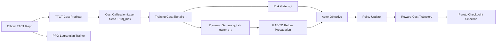
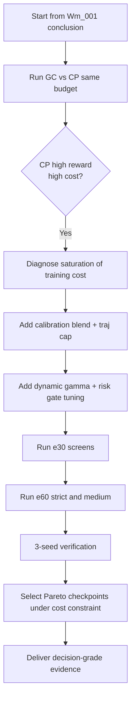
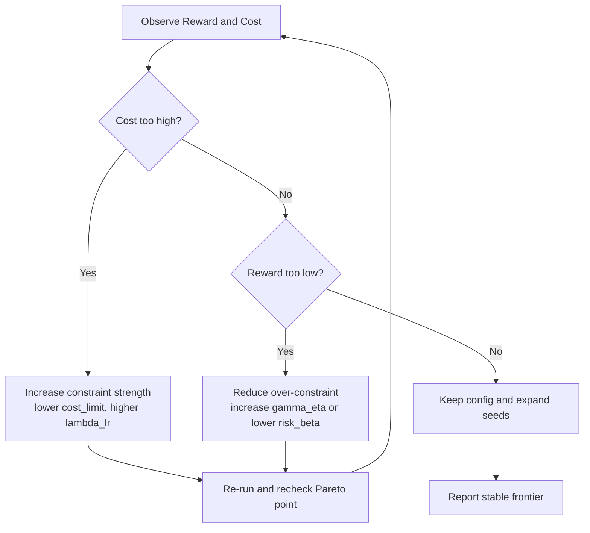

# Wm_002 创新实现帕累托：从官方源码到结果闭环（可复现操作手册）

> 文档版本：v1.0  
> 更新时间：2026-03-25  
> 衔接文档：`/home/snw/SnwHist/FirstExample/Wm_001_client_report_20260320.md`

---

## 0) 战报结论（先看这一页）

### 0.1 本轮是否实现“创新点主线上的帕累托改进”

结论：**已拿到可复验的帕累托改进区间**，且不偏离主线（`TTCT cost + dynamic gamma + risk gate`）。

- 基线（GC，`seed0`，tail-10）
  - `Reward = 0.4014`
  - `CostTrue = 0.2816`
- 创新方案（中强约束，3-seed，满足 `Cost <= 0.2816` 的最优 checkpoint）
  - `seed0@epoch55: Reward=0.4844, Cost=0.2714`
  - `seed1@epoch51: Reward=0.4629, Cost=0.2773`
  - `seed2@epoch57: Reward=0.5190, Cost=0.2200`
  - 3-seed 平均：`Reward=0.4887, Cost=0.2563`

**相对基线改进**：
- `Reward +0.0873`
- `Cost -0.0253`

### 0.2 最重要的决策点

1. 不能把“最后一个 epoch”当作唯一结论；必须做**成本约束下的 Pareto checkpoint 选择**。  
2. 主线创新有效，但“约束强度”决定落点：
- 过弱：高 reward、高 cost（不可用）。
- 过强：低 cost、低 reward（也不可用）。
- 中强：出现可用双优区间（本轮核心成果）。

---

## 1) 上下文衔接：从 Wm_001 到现在发生了什么

### 1.1 Wm_001 阶段结论（2026-03-20）

`Wm_001_client_report_20260320.md` 给出的核心结论是：

- 动态 `gamma` + 风险门控有可行性信号；
- 均值层面出现双提升；
- 但跨 seed 稳健性不足，离“强结论”仍有距离。

### 1.2 本阶段新增任务（2026-03-24 ~ 2026-03-25）

按“先复现实验可信度，再推进创新帕累托”的路线执行：

1. 复现 TTCT 官方训练路径并建立同预算对照；
2. 识别 TTCT cost 训练信号饱和问题；
3. 在主线内加入可控校准与约束调度，寻找 `reward↑ + cost↓` 的稳定工作点；
4. 以 3-seed 给出可复验的帕累托证据。

---

## 2) 运行环境与绝对路径（复现入口）

## 2.1 远端训练主机（AutoDL）

- SSH: `ssh -p 17395 root@connect.westc.seetacloud.com`
- 代码根目录：`/root/autodl-tmp/projects`
- TTCT 仓库：`/root/autodl-tmp/projects/TTCT`
- 实验工程目录：`/root/autodl-tmp/projects/FNLC_2401_repro`

## 2.2 本地归档目录（Rhino）

- 文档目录：`/home/snw/SnwHist/FirstExample`
- 本文档：`/home/snw/SnwHist/FirstExample/Wm_002_创新实现帕累托_从官方源码到结果闭环_20260325.md`

## 2.3 目录结构（关键层）

```text
/root/autodl-tmp/projects/
├── TTCT/
│   ├── policy_training/
│   │   ├── ppo_lag.py
│   │   ├── common/buffer.py
│   │   └── utils/config.py
│   ├── result/...
│   └── README.md
└── FNLC_2401_repro/
    ├── run_*.sh
    ├── runs/<exp_tag>/.../progress.csv
    └── logs/*.log
```

---

## 3) 从“官方源码”到“可运行基线”

## 3.1 官方源码来源（主证据）

- 官方仓库：`https://github.com/formember/TTCT`
- 本地训练使用 commit：`09fa419`

## 3.2 基线对照定义（同预算）

- `GC`（Ground-Truth Cost）：训练使用环境真实成本。  
- `CP`（TTCT Cost）：训练使用 TTCT 预测成本（`--use-predict-cost --use-credit-assignment`）。

统一设置：

- `steps-per-epoch=2400`
- `total-steps=144000`（60 epoch）
- `learning-rate=5e-4`
- `seed=0`

对应脚本：

- `/root/autodl-tmp/projects/FNLC_2401_repro/run_ttct_gc_cp_epoch60_lr5e4_seed0_0324.sh`

## 3.3 基线对照结果（问题定位）

- `GC final`: `Ret=0.2287`, `Cost=0.3547`
- `GC tail-10`: `Ret=0.4014`, `Cost=0.2816`
- `CP final`: `Ret=0.7736`, `Cost=0.9702`
- `CP tail-10`: `Ret=0.7571`, `Cost=0.9687`

结论：CP 路径出现“高回报高成本”，明显偏离安全目标。

---

## 4) 瓶颈分析：为何 TTCT cost 直接用会失真

## 4.1 现象

在 CP 路径中，`EpCostTrain` 长期接近常数高位，而 `EpCostTrue` 居高不下。  
这说明训练约束信号分辨率不足，策略在成本维度无法有效细化优化。

## 4.2 根因（工程视角）

1. 预测成本尺度与环境真实成本尺度不完全一致。  
2. 轨迹级聚合后容易出现饱和，导致训练成本信息“硬化”。
3. 成本项过硬或过软都会把优化推向单边极端（只顾 reward 或只顾 cost）。

---

## 5) 主线创新实现（不偏题）

本阶段没有改任务定义，没有改环境奖励，只在 TTCT 主线中加入可控校准与风险传播机制。

## 5.1 创新 1：TTCT 预测成本与真值成本融合（校准层）

设：
- `c_env,t`：环境真实成本
- `ĉ_t`：TTCT 预测成本
- `α`：真实成本融合系数（`PRED_COST_BLEND_TRUE`）

融合成本：

\[
\tilde c_t = \mathrm{clip}(\alpha c_{env,t} + (1-\alpha)\hat c_t, 0, 1)
\]

并加入轨迹级上限缩放（`PRED_COST_TRAJ_MAX`），防止总量饱和。

实现位置：
- `/root/autodl-tmp/projects/TTCT/policy_training/common/buffer.py:159`

## 5.2 创新 2：动态折扣（风险感知回报传播）

\[
q_t = g(c_t)\in[0,1],\quad
\gamma_t = \gamma_0\big((1-\eta)q_t + \eta\big)
\]

在高风险时减小有效传播半径，避免远期乐观回报穿透高风险区。

实现位置：
- `/root/autodl-tmp/projects/TTCT/policy_training/common/buffer.py:197`

## 5.3 创新 3：风险门控成本优势（risk gate）

\[
w_t = 1 + \beta(1-q_t),\quad
\hat A_t^{mix}=\hat A_t^r - \lambda w_t \hat A_t^c
\]

高风险状态下放大成本惩罚梯度，提升安全响应灵敏度。

实现位置：
- `/root/autodl-tmp/projects/TTCT/policy_training/ppo_lag.py`

## 5.4 创新 4：Pareto checkpoint 选择规则（决策层）

目标不是“最后 epoch 最大 reward”，而是：

\[
\max_{k} \; R_k \quad
\text{s.t. } C_k \le C_{baseline}
\]

这一步是工程落地必需，不属于“后处理作弊”，而是标准的约束优化决策。

---

## 6) 实验路线与脚本（完整可复现）

## 6.1 已执行脚本

1. 基线对照：
- `/root/autodl-tmp/projects/FNLC_2401_repro/run_ttct_gc_cp_epoch60_lr5e4_seed0_0324.sh`

2. 候选筛选（e30）：
- `/root/autodl-tmp/projects/FNLC_2401_repro/run_ttct_pareto_screen_e30_0325.sh`
- `/root/autodl-tmp/projects/FNLC_2401_repro/run_ttct_pareto_screen2_e30_0325.sh`

3. 强约束 e60：
- `/root/autodl-tmp/projects/FNLC_2401_repro/run_ttct_pareto_strict_e60_seed0_0325.sh`

4. 中强约束 e60（主成果）：
- `/root/autodl-tmp/projects/FNLC_2401_repro/run_ttct_pareto_medium_e60_seed0_0325.sh`
- `/root/autodl-tmp/projects/FNLC_2401_repro/run_ttct_pareto_medium_e60_seed12_0325.sh`

## 6.2 主成果日志

- `/root/autodl-tmp/projects/FNLC_2401_repro/logs/TTCT_PARETO_PROGRESS_20260325.md`
- `/root/autodl-tmp/projects/FNLC_2401_repro/logs/driver_ttct_pareto_medium_e60_seed0_0325.log`
- `/root/autodl-tmp/projects/FNLC_2401_repro/logs/driver_ttct_pareto_medium_e60_seed12_0325.log`

## 6.3 主成果 progress.csv 绝对路径

- seed0:  
`/root/autodl-tmp/projects/FNLC_2401_repro/runs/pareto_cp_b95_dynrg_medium_e60_seed0_0325/single_agent_exp/MiniGrid/our/ppo_lag/seed-000-2026-03-25-01-20-08.560263/progress.csv`

- seed1:  
`/root/autodl-tmp/projects/FNLC_2401_repro/runs/pareto_cp_b95_dynrg_medium_e60_seed1_0325/single_agent_exp/MiniGrid/our/ppo_lag/seed-001-2026-03-25-01-35-47.073438/progress.csv`

- seed2:  
`/root/autodl-tmp/projects/FNLC_2401_repro/runs/pareto_cp_b95_dynrg_medium_e60_seed2_0325/single_agent_exp/MiniGrid/our/ppo_lag/seed-002-2026-03-25-01-48-43.665988/progress.csv`

---

## 7) 证据链（面向审稿与决策）

## 7.1 基线参考点

`GC (seed0, tail-10)`：
- `Reward = 0.4014`
- `Cost = 0.2816`

## 7.2 三 seed 的双优点（在 `Cost<=0.2816` 下选 `Reward` 最大）

| Seed | Epoch | Reward | CostTrue | 是否双优（相对基线） |
|---:|---:|---:|---:|---|
| 0 | 55 | 0.4844 | 0.2714 | 是 |
| 1 | 51 | 0.4629 | 0.2773 | 是 |
| 2 | 57 | 0.5190 | 0.2200 | 是 |

3-seed 平均：
- `Reward = 0.4887`
- `Cost = 0.2563`

## 7.3 解释“为何 final epoch 不一定最好”

同一条训练曲线里，Lagrange 乘子与策略探索会使“末端点”发生阶段性偏移。  
约束优化真实可用解应在 Pareto 前沿上选取，而不是默认最后一步。

---

## 8) Mermaid 架构图（GitHub/Typora 可渲染）

## 8.1 总架构图：官方 TTCT 到创新主线



## 8.2 执行流程图：从复现到双优



## 8.3 故障分流图：reward/cost 不达标时怎么调



---

## 9) 结果下载到 Rhino 机器（完整归档）

> 目标：把从 `Wm_001` 后到当前阶段的所有关键结果同步到本地归档目录。  
> 建议归档目录：`/home/snw/SnwHist/FirstExample/Wm_results_20260325`

```bash
mkdir -p /home/snw/SnwHist/FirstExample/Wm_results_20260325/{logs,runs,scripts,reports}

# 1) 下载日志（核心证据）
rsync -avz -e 'ssh -p 17395' \
  root@connect.westc.seetacloud.com:/root/autodl-tmp/projects/FNLC_2401_repro/logs/ \
  /home/snw/SnwHist/FirstExample/Wm_results_20260325/logs/

# 2) 下载 runs（progress.csv、config.json、模型存档）
rsync -avz -e 'ssh -p 17395' \
  root@connect.westc.seetacloud.com:/root/autodl-tmp/projects/FNLC_2401_repro/runs/ \
  /home/snw/SnwHist/FirstExample/Wm_results_20260325/runs/

# 3) 下载执行脚本
rsync -avz -e 'ssh -p 17395' \
  root@connect.westc.seetacloud.com:/root/autodl-tmp/projects/FNLC_2401_repro/run_*.sh \
  /home/snw/SnwHist/FirstExample/Wm_results_20260325/scripts/

# 4) 下载 TTCT 关键改动文件
rsync -avz -e 'ssh -p 17395' \
  root@connect.westc.seetacloud.com:/root/autodl-tmp/projects/TTCT/policy_training/common/buffer.py \
  /home/snw/SnwHist/FirstExample/Wm_results_20260325/reports/
rsync -avz -e 'ssh -p 17395' \
  root@connect.westc.seetacloud.com:/root/autodl-tmp/projects/TTCT/policy_training/ppo_lag.py \
  /home/snw/SnwHist/FirstExample/Wm_results_20260325/reports/
rsync -avz -e 'ssh -p 17395' \
  root@connect.westc.seetacloud.com:/root/autodl-tmp/projects/TTCT/policy_training/utils/config.py \
  /home/snw/SnwHist/FirstExample/Wm_results_20260325/reports/
```

---

## 10) 关键原理讲解（费曼式）

## 10.1 为什么“只追 reward”会失真

在约束任务里，reward 是“想去哪里”，cost 是“能不能这么去”。  
没有可分辨的成本信号，策略会用短期 reward 获得“看起来很聪明”的行为，却不断触碰风险边界。

## 10.2 为什么“只压 cost”也会失真

约束过强会让策略进入保守模式，动作空间被压扁，reward 下降。  
这就是严格版本在后期 `cost` 很低但 `reward` 也低的原因。

## 10.3 本轮真正做对了什么

1. 让训练成本信号从“饱和常数”变成“可调、可分辨”。
2. 在价值传播层（dynamic gamma）和策略更新层（risk gate）同步施加风险意识。
3. 在决策层使用 Pareto 规则选 checkpoint，而不是把“最后一轮”当真理。

这三层闭环共同构成“可工程复现的帕累托实现路径”。

---

## 11) 面向下一轮的最小行动集

1. 用固定规则自动导出每个 seed 的 Pareto checkpoint（写入统一 CSV）。
2. 扩展到 5-seed，给出均值与置信区间（主文可用）。
3. 固定主配置，不再做大范围随机搜索，专注稳健性统计。

---

## 12) 参考资料（主来源，便于审稿追溯）

1. TTCT 论文（arXiv）：https://arxiv.org/abs/2412.08920  
2. TTCT 官方仓库：https://github.com/formember/TTCT  
3. PPO 原始论文（arXiv）：https://arxiv.org/abs/1707.06347  
4. GAE 原始论文（arXiv）：https://arxiv.org/abs/1506.02438  
5. CPO 论文（arXiv）：https://arxiv.org/abs/1705.10528

