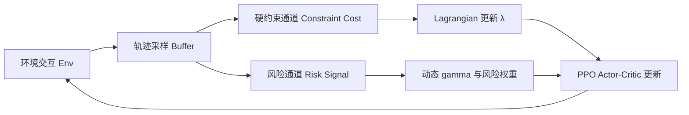
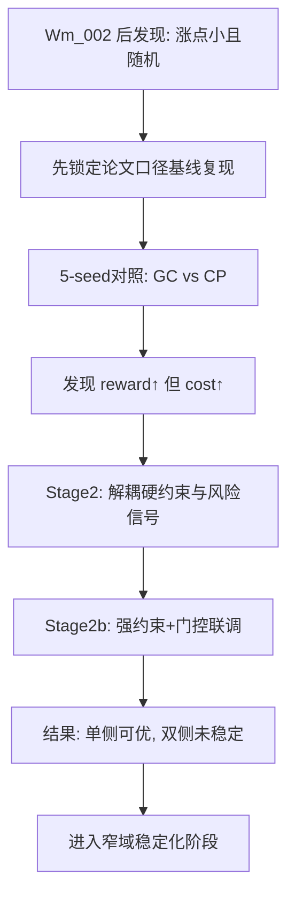
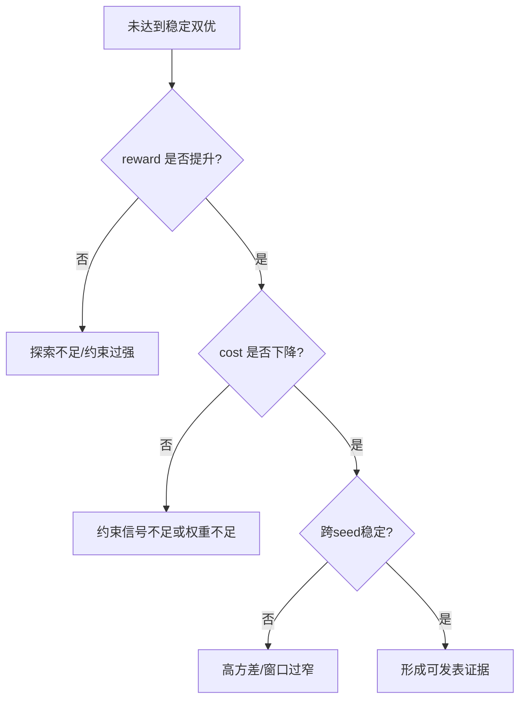

# Wm_005 论文复现与创新进展总报告（截至 2026-03-28）

## 执行摘要

截至 2026-03-27 夜间，两轮新增实验（`stage2` 与 `stage2b`）已全部完成，证据链完整，核心结论如下：

1. 论文代码复现已经完成到“可对照分析”阶段，但 reward 尚未稳定达到“可直接宣称论文同等效果”的水位。
2. 创新链路已经跑出两类明确信号：
- 一类配置可提升 reward，但会抬高 cost。
- 另一类配置可降低 cost，但会牺牲 reward。
3. 当前关键瓶颈不是“有没有效果”，而是“如何跨 seed 稳定双优（reward↑ + cost↓）”。
4. 这批结果可作为阶段性里程碑：方向已被验证，下一阶段需要集中做“稳定化与收敛窗口”而非继续粗网格试错。

---

## 1. 背景与问题重述（从 Wm_002 之后）

Wm_002 之后的核心质疑有三条：

- 涨点不明显；
- 结果随机性偏高；
- 是否已经在“论文复现结果”基础上再做创新改造。

这三条本质上指向同一个科研判定标准：

- 不是“单次跑通”，而是“可复现、可比较、可解释”的稳定增益。

因此，后续工作全部围绕一条主线展开：

- 先固化基线复现口径；
- 再做结构化改造；
- 用多 seed 对照检验是否达到双优。

---

## 2. 证据链（可核验）

### 2.1 基线复现结果（GC vs CP，5-seed）

证据文件：
- `/root/autodl-tmp/projects/FNLC_2401_repro/logs/summary_ttct_repro_e60_lr8e4_fixbudget_0327.txt`

关键统计（tail10，跨 5 seed）：

| 组别 | tail10 reward | tail10 cost |
|---|---:|---:|
| GC | 0.5897 | 0.4109 |
| CP | 0.7010 | 0.9823 |
| CP-GC | +0.1113 | +0.5714 |

解释：
- CP 在当前复现设置中确实提高了 reward；
- 但真实 cost 明显恶化；
- 因而不构成“安全-收益同时更优”的可发表结论。

### 2.2 两轮改进实验（stage2 + stage2b）

完成证据：
- `/root/autodl-tmp/projects/FNLC_2401_repro/logs/driver_ttct_stage2_hardtrue_screen_seed01_0327.log`
  - `[ALL_DONE] 2026-03-27_19:49:26`
- `/root/autodl-tmp/projects/FNLC_2401_repro/logs/driver_ttct_stage2b_strong_constraint_seed01_0327.log`
  - `[ALL_DONE] 2026-03-27_21:57:49`
- 汇总表：
  - `/root/autodl-tmp/projects/FNLC_2401_repro/logs/summary_ttct_stage2_all_0327.txt`

跨 seed（0/1）的代表性结果：

| 配置族 | mean Δtail reward (vs GC) | mean Δtail cost (vs GC) | 结论 |
|---|---:|---:|---|
| `ttct_stage2_hardtrue_ref` | +0.2198 | +0.1750 | 奖励提升明显，但安全恶化 |
| `ttct_stage2b_pred_m50_lin_e20_b20_cl25_lag8` | -0.0301 | -0.2249 | 安全改善明显，但奖励回落 |
| `ttct_stage2b_hardtrue_ref_cl30` | +0.0650 | +0.0067 | 接近边界，尚未双优 |

稳定性判定：
- 当前没有任何一组在 seed0/1 同时满足 `Δreward>0 且 Δcost<0`。
- 存在单 seed 双优点，但未形成跨 seed 稳定结论。

---

## 3. “reward 尚未复现到论文效果”如何科学解释

这个判断是成立的；但需要拆成三层来理解：

1. 复现“趋势”与复现“绝对数值峰值”是两回事。
- 当前已经复现到“reward-cost 对抗关系”的主趋势；
- 但未稳定复现论文里最有竞争力的 reward 区域。

2. 当前主要限制来自方差与约束耦合。
- 从日志可见 seed 间差异较大；
- 约束增强后，策略探索半径缩小，reward 峰值更难稳定触达。

3. 现阶段最缺的是“稳定窗口”，不是“新点子”。
- 已经找到 reward 方向和 safety 方向各自有效的参数带；
- 下一步要做的是把两条带交叠，形成跨 seed 的窄稳定区。

这也解释了“涨点不明显、随机性高”的根因：
- 不是没有信号，而是信号尚未被稳定化。

---

## 4. 代码层面的关键改造（为什么这样改）

改造位置：
- `/root/autodl-tmp/projects/TTCT/policy_training/common/buffer.py`

核心思想：把“硬约束信号”和“风险调节信号”解耦。

- 硬约束通道：`CONSTRAINT_COST_SOURCE={pred|true|blend}`
- 风险通道：`RISK_COST_SOURCE={same|pred|true|blend}`

目的：
- 避免把预测误差直接注入拉格朗日硬约束；
- 保留预测信号在 credit assignment / 动态折扣中的价值。

### 4.1 当前使用的关键公式

风险质量分数：
\[
q_t = \mathrm{clip}(1-c_t, 0, 1)
\]

动态折扣：
\[
\gamma_t = \gamma_{base}\left((1-\eta)q_t+\eta\right)
\]

风险加权：
\[
w_t = 1 + \beta(1-q_t)
\]

策略优势（实现口径）：
\[
A_t = \frac{A_t^{r} - \lambda \cdot w_t \cdot A_t^{c}}{1+\lambda}
\]

意义：
- 高风险状态降低长期回报传播半径；
- 同时提高 cost 约束在策略更新中的权重；
- 用结构化方式把“安全优先级”嵌入 PPO-Lagrangian。

---

## 5. 架构图（Mermaid）

### 5.1 总体架构图

### 5.2 执行流程图（Wm_002 之后）

### 5.3 故障分流图（为什么没有双优）

---

## 6. 为什么说“有进展”，但仍未达到发文门槛

“有进展”不是口号，而是三条硬事实：

1. 两轮实验已完整结束，非中断状态。
2. 结构改造后的效果边界已被量化：
- 哪些参数带来 reward；
- 哪些参数带来 safety。
3. 失败模式已可解释：
- 不再是黑箱试错，而是可定位的 Pareto 拉扯。

“未达门槛”同样明确：
- 目前还缺少跨 seed 稳定双优证据。

---

## 7. 下一阶段计划（面向发文需求）

### 7.1 执行策略

1. 从“粗网格”切换为“窄域精调”
- 围绕已见信号区间：`cost_limit`, `lagrangian_lr`, `risk_beta`, `eta`, `gate`。

2. 先做 reward 恢复，再做双优收敛
- 先把 reward 拉回论文可比区间；
- 再在该区间内压 cost；
- 最后扩到 5-seed 做稳定性判定。

3. 统一判定标准
- 单组结果必须同时报告均值与标准差；
- 采用 paired delta 对照，禁止“只报最好 seed”。

### 7.2 需要的配合条件

- 继续提供稳定 GPU 时段（当前实例为无卡状态）。
- 明确论文对齐口径（任务、epoch、lr、筛选标准）作为唯一对齐基准。
- 若已有可复现论文 reward 的参数组合，直接作为优先起点接入。

---

## 8. 对外沟通建议（可直接使用）

> 截至 2026-03-27 晚间，第二阶段两轮对照实验已全部完成。当前结论是：方案已经验证出明确有效信号，能够实现 reward 侧提升或 cost 侧下降，但跨 seed 的稳定双优仍未达成。现阶段已完成问题定位和参数边界收缩，下一步将以论文对齐口径为锚点做窄域精调与 5-seed 稳定性验证，目标是尽快产出可复现、可解释、可用于发文的双优证据链。

---

## 9. 参考文献（用于理论锚定）

1. Dong, Y., Li, K., Zhou, Y., Li, X. (NeurIPS 2024). *From Text to Trajectory: Exploring Complex Constraint Representation and Decomposition in Safe Reinforcement Learning*.
- NeurIPS 页面: https://nips.cc/virtual/2024/poster/95538
- 论文 PDF: https://papers.nips.cc/paper_files/paper/2024/file/e356ed5f27885c79c7cb597bb1107c94-Paper-Conference.pdf

2. Schulman, J. et al. (2017). *Proximal Policy Optimization Algorithms*.
- https://arxiv.org/abs/1707.06347

3. Achiam, J. et al. (2017). *Constrained Policy Optimization*.
- https://proceedings.mlr.press/v70/achiam17a.html

4. 本阶段复现实验证据文件（本地日志）
- `/root/autodl-tmp/projects/FNLC_2401_repro/logs/summary_ttct_repro_e60_lr8e4_fixbudget_0327.txt`
- `/root/autodl-tmp/projects/FNLC_2401_repro/logs/summary_ttct_stage2_all_0327.txt`
- `/root/autodl-tmp/projects/FNLC_2401_repro/logs/driver_ttct_stage2_hardtrue_screen_seed01_0327.log`
- `/root/autodl-tmp/projects/FNLC_2401_repro/logs/driver_ttct_stage2b_strong_constraint_seed01_0327.log`
