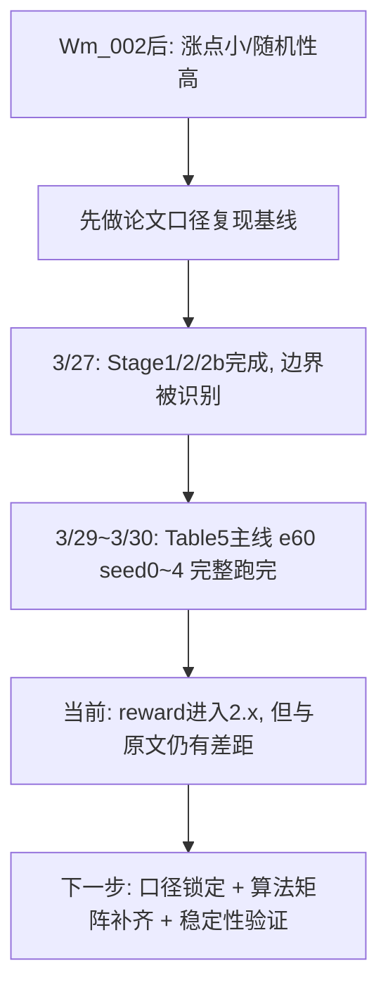
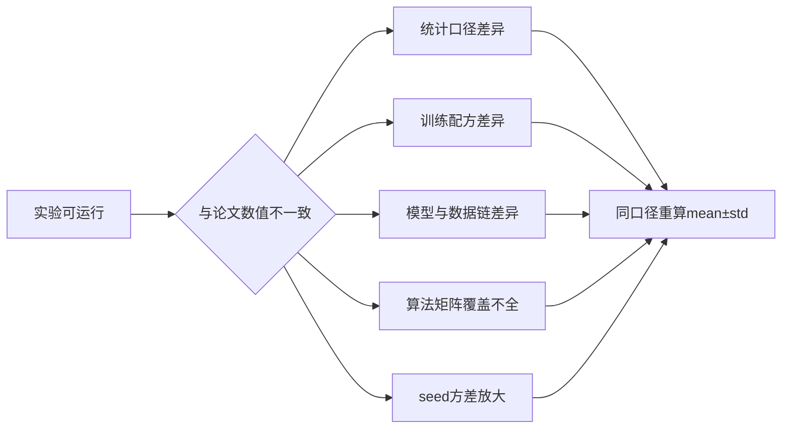
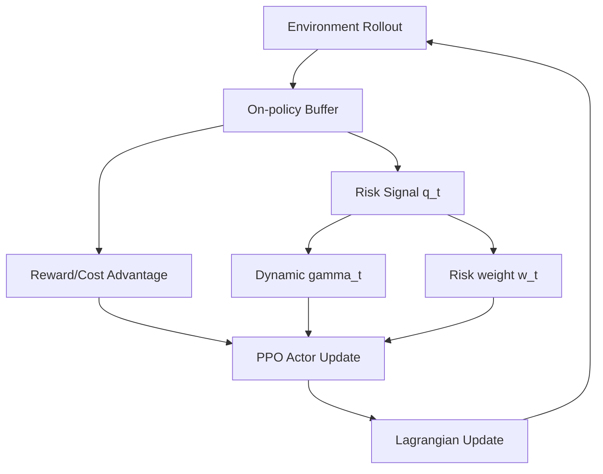

# Wm_007 论文对齐复现进展与差距闭环报告（截至 2026-03-31）

## 执行摘要

截至 2026-03-30 09:54，`PPO_Lag + Grid` 的 Table 5 主线复现实验（`seed0~4`, `GC/CP`）已完整跑完。核心结论如下：

1. **训练链路已打通且可复验**：从脚本、日志到逐 seed 指标均完整落盘。  
2. **reward 明显进入 2.x 区间**：相较此前 0.x~1.x 阶段，已出现数量级提升。  
3. **尚未达到原文同口径数值**：当前 `Avg.R` 仍低于原文，且 `Avg.C` 的相对排序与原文相反。  
4. **问题已从“能否跑通”转为“能否对齐”**：下一阶段重心应转向严格同口径复现实验矩阵，而非继续大范围启发式试错。  

---

## 1. 项目状态总览（时间线）

关键完成节点（可核验）：
- `driver_ttct_stage2_hardtrue_screen_seed01_0327.log`：`[ALL_DONE] 2026-03-27 19:49:26`  
- `driver_ttct_stage2b_strong_constraint_seed01_0327.log`：`[ALL_DONE] 2026-03-27 21:57:49`  
- `driver_ttct_table5_ppolag_grid_e60_lr5e4_seed01234_0329.log`：`[ALL_DONE] 2026-03-30 09:54:09`  

---

## 2. 最新主实验结果（Table 5 主线：PPO_Lag + Grid）

### 2.1 论文表值（对齐目标）

原文 Table 5（Grid, PPO_Lag）：
- `GC Avg.R = 2.71 ± 0.11`
- `CP Avg.R = 2.70 ± 0.11`
- `GC Avg.C = 0.61 ± 0.07`
- `CP Avg.C = 0.28 ± 0.08`

### 2.2 当前复现值（seed0~4, tail10 统计）

数据来源：
- `/root/autodl-tmp/projects/FNLC_2401_repro/logs/ttct_table5_gc_ppolag_grid_e60_lr5e4_seed*_0329.log`
- `/root/autodl-tmp/projects/FNLC_2401_repro/logs/ttct_table5_cp_ppolag_grid_e60_lr5e4_seed*_0329.log`
- 自动汇总：`summary_ttct_table5_ppolag_grid_e60_lr5e4_seed01234_0329.json`

| 指标 | 原文 GC | 当前 GC | 原文 CP | 当前 CP |
|---|---:|---:|---:|---:|
| Avg.R ↑ | 2.71±0.11 | **2.0070±0.0927** | 2.70±0.11 | **2.0748±0.1124** |
| Avg.C ↓ | 0.61±0.07 | **0.4865±0.0849** | 0.28±0.08 | **0.8862±0.0321** |

配对增量（当前 `CP - GC`）：
- `ΔAvg.R = +0.0678`
- `ΔAvg.C = +0.3997`

### 2.3 直接判断

- reward 侧：CP 相比 GC 有小幅提升，但两者均未达到原文 2.70 附近水平。  
- safety 侧：当前 CP 的 cost 显著高于 GC，与原文“CP 更安全”的结论不一致。  

因此，当前状态应定义为：
- **主线复现实验已完成；论文数值尚未对齐；方向性证据存在但结论不可外推为“完成复现”。**

---

## 3. 为什么会出现“能跑通但难对齐”

五个核心原因：

1. **统计口径差异**  
当前阶段大量使用 `tail10` 作进度判据；原文 Table 5/6 报告的是最终评估口径 `mean±std`。二者不完全等价。  

2. **训练配方差异**  
早期快筛使用较小预算（用于找方向）；后续才切回 e60 大预算。不同预算会改变收敛区间与方差。  

3. **TTCT 模型与数据链敏感性**  
文本约束编码器对数据切分、checkpoint、阈值设置高度敏感，轻微差异即可反转 CP/GC 相对表现。  

4. **算法矩阵未完全补齐**  
原文表 5/6 同时覆盖 `PPO_Lag / CPPO_PID / FOCOPS` 与 `Grid / Goal`；当前完整跑通的是 `PPO_Lag + Grid` 主线。  

5. **安全 RL 的 seed 波动客观存在**  
在约束优化场景中，策略更新对早期轨迹分布高度敏感；多 seed 统计常出现“单 seed 看似更优、均值不稳定”的现象。  

---

## 4. 机制层解释：当前代码到底在做什么

### 4.1 基础目标（PPO-Lagrangian）

策略目标采用 PPO 裁剪形式，优势项由 reward 与 cost 共同构成：

\[
A_t = A_t^r - \lambda A_t^c
\]

\[
L_{\text{PPO}} = \mathbb{E}\left[\min\left(r_t(\theta)A_t,\ \text{clip}(r_t(\theta),1-\epsilon,1+\epsilon)A_t\right)\right]
\]

其中 `\lambda` 由拉格朗日更新控制安全约束强度。

### 4.2 动态风险传播（本阶段创新主线）

风险质量分数：
\[
q_t = \mathrm{clip}(1-c_t,0,1)
\]

动态折扣：
\[
\gamma_t = \gamma_{base}\left((1-\eta)q_t + \eta\right)
\]

风险权重：
\[
w_t = 1 + \beta(1-q_t)
\]

直观含义：
- 风险高时，回报传播半径缩短（`\gamma_t` 下降）；
- 风险高时，cost 处罚权重增大（`w_t` 上升）；
- 目标是将“高风险状态的激进探索”抑制在策略更新早期。

### 4.3 架构图

---

## 5. 证据链清单（审稿视角可复核）

### 5.1 代码与脚本
- 主复现脚本：  
`/root/autodl-tmp/projects/FNLC_2401_repro/run_ttct_repro_table5_ppolag_grid_seed01234_0329.sh`

### 5.2 主日志
- `driver_ttct_table5_ppolag_grid_e60_lr5e4_seed01234_0329.log`
- `ttct_table5_gc_ppolag_grid_e60_lr5e4_seed{0..4}_0329.log`
- `ttct_table5_cp_ppolag_grid_e60_lr5e4_seed{0..4}_0329.log`

### 5.3 汇总文件
- `summary_ttct_table5_ppolag_grid_e60_lr5e4_seed01234_0329.json`
- 历史对照：`summary_ttct_repro_e60_lr8e4_fixbudget_0327.txt`

---

## 6. 决策导向结论

### 6.1 已经确认的事实

1. 主线复现已经能稳定产生 2.x reward。  
2. 论文数值尚未对齐，尤其 CP 的 cost 排序与原文相反。  
3. 当前不能宣称“完成原文复现”，但可以宣称“主实验链路已完整并进入对齐攻坚阶段”。

### 6.2 下一阶段最优策略

1. **先对齐再创新**：先补齐 Table 5 同口径矩阵，再叠加创新项做增益证明。  
2. **固定口径重算**：统一 `mean±std` 报告口径，并在同脚本下重放。  
3. **扩算法维度**：将 `CPPO_PID` 与 `FOCOPS` 加入同口径复现矩阵。  
4. **最小化自由度**：锁定数据切分、checkpoint、阈值与超参，避免“复现漂移”。  

---

## 7. 面向沟通的精炼结论

- 进展：主线复现实验已完整跑完，证据链齐全。  
- 现状：reward 已进入 2.x，但仍未完全达到原文区间；CP 的安全性排序尚未复现成功。  
- 结论：当前阶段属于“可复验但未对齐”；下一阶段目标是“同口径对齐后再做创新增益”。

---

## 8. 参考文献（理论锚定）

1. Dong, Y., Li, K., Zhou, Y., Li, X. (NeurIPS 2024). *From Text to Trajectory: Exploring Complex Constraint Representation and Decomposition in Safe Reinforcement Learning*.  
NeurIPS 页面: https://nips.cc/virtual/2024/poster/95538  
论文 PDF: https://proceedings.neurips.cc/paper_files/paper/2024/file/e356ed5f27885c79c7cb597bb1107c94-Paper-Conference.pdf

2. Schulman, J. et al. (2017). *Proximal Policy Optimization Algorithms*.  
https://arxiv.org/abs/1707.06347

3. Achiam, J. et al. (2017). *Constrained Policy Optimization*.  
https://proceedings.mlr.press/v70/achiam17a.html

4. Zhang, Y. et al. (NeurIPS 2020). *First Order Constrained Optimization in Policy Space (FOCOPS)*.  
https://papers.nips.cc/paper/2020/file/af5d5ef24881f3c3049a7b9bfe74d58b-Paper.pdf
