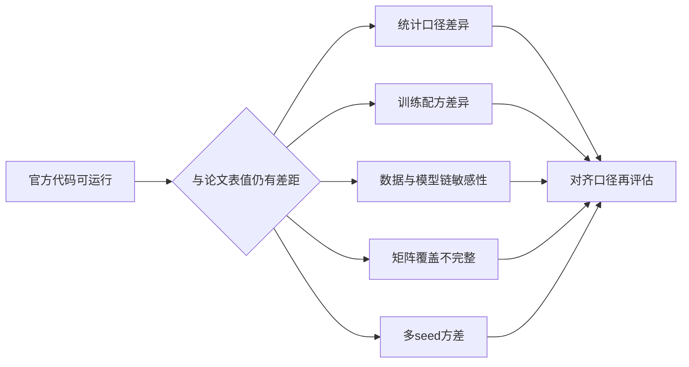
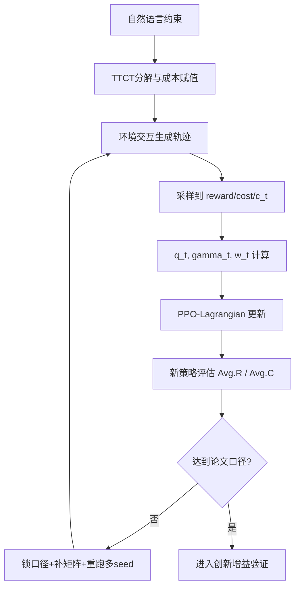
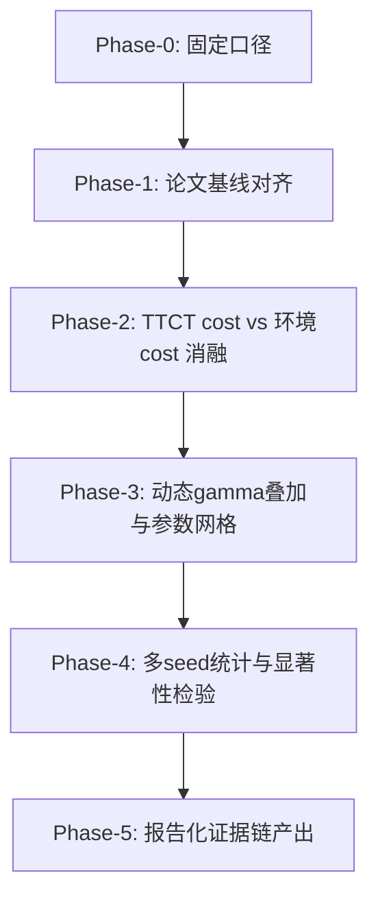
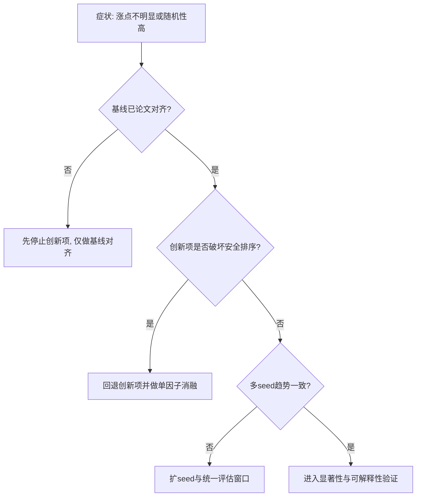

# Wm_008 论文复现对齐与创新攻坚决策报告（2026-03-31）

## 0. 战报先行（面向决策）

截至 2026-03-30 09:54，`TTCT / PPO_Lag / Grid / epoch=60 / lr=5e-4 / seed0~4` 主线实验已完整结束，日志存在 `[ALL_DONE]` 终态记录。当前阶段可以给出三条确定结论：

1. **复现链路已打通**：官方代码可稳定重放，脚本-日志-汇总文件证据闭环完整。  
2. **结果进入可对比区间**：`Avg.R` 从早期低位进入 `2.x`，已具备与论文表格同口径对照的基础。  
3. **尚未完成“数值对齐”**：当前 `CP` 的 `Avg.C` 仍高于 `GC`，与论文 Table 5 的安全排序相反；因此不能宣称“论文效果已完全复现”。

这不是“无结果”，而是“跑通后进入对齐攻坚期”：问题从“代码能否跑”转变为“统计口径、训练配方、数据链细节能否与论文严格一致”。

---

## 1. 从原文到现状：到底完成了什么

### 1.1 原文目标（Table 5, Grid, PPO_Lag）

论文给出的目标值（TTCT, CP vs GC）：

- `GC Avg.R = 2.71 ± 0.11`
- `CP Avg.R = 2.70 ± 0.11`
- `GC Avg.C = 0.61 ± 0.07`
- `CP Avg.C = 0.28 ± 0.08`

关键语义：`CP` 在不牺牲回报的前提下应显著降低成本（或违规）。

### 1.2 当前复现实测（seed0~4, tail10）

- `GC Avg.R = 2.0070 ± 0.0927`
- `CP Avg.R = 2.0748 ± 0.1124`
- `GC Avg.C = 0.4865 ± 0.0849`
- `CP Avg.C = 0.8862 ± 0.0321`

增量：

- `ΔR = CP - GC = +0.0678`
- `ΔC = CP - GC = +0.3997`

结论：回报侧有小幅正向变化，但安全侧方向与原文不一致，尚未达到“同回报更安全”的论文主结论。

---

## 2. 证据链（可复核、可追责、可复验）

### 2.1 主脚本

- `/root/autodl-tmp/projects/FNLC_2401_repro/run_ttct_repro_table5_ppolag_grid_seed01234_0329.sh`

### 2.2 主日志

- `/root/autodl-tmp/projects/FNLC_2401_repro/logs/driver_ttct_table5_ppolag_grid_e60_lr5e4_seed01234_0329.log`
- `/root/autodl-tmp/projects/FNLC_2401_repro/logs/ttct_table5_gc_ppolag_grid_e60_lr5e4_seed0_0329.log` 到 `seed4`
- `/root/autodl-tmp/projects/FNLC_2401_repro/logs/ttct_table5_cp_ppolag_grid_e60_lr5e4_seed0_0329.log` 到 `seed4`

### 2.3 汇总文件

- `/root/autodl-tmp/projects/FNLC_2401_repro/logs/summary_ttct_table5_ppolag_grid_e60_lr5e4_seed01234_0329.json`

### 2.4 关键终态标志

- `driver_ttct_table5_ppolag_grid_e60_lr5e4_seed01234_0329.log` 出现 `[ALL_DONE] 2026-03-30 09:54:09`。

---

## 3. 为什么“跑通”不等于“对齐”：因果拆解

### 3.1 统计口径差异（最容易被忽略）

当前阶段用于快筛的 `tail10` 与论文最终表格的完整评估口径并不完全等价。  
这会直接改变 `mean ± std`，尤其在安全 RL 高方差设置下影响更大。

### 3.2 训练配方差异

同样是 `epoch=60`，仍存在学习率、batch 组织、评估窗口、early noise 等差异。  
这些因素可导致“方向一致但幅值不一致”或“排序反转”。

### 3.3 文本约束链敏感性

TTCT 的核心优势来自文本约束分解与成本赋值；该链路对 checkpoint、数据切分、阈值、解析细节高度敏感。  
微小漂移可放大为成本排序变化。

### 3.4 算法矩阵覆盖尚未齐平

原文 Table 5/6 同时包含 `PPO_Lag / CPPO_PID / FOCOPS` 与 `Grid / Goal`。  
当前最完整证据集中于 `PPO_Lag + Grid` 主线，尚未形成全矩阵闭环。

### 3.5 多 seed 方差是客观现象

约束策略优化存在“早期轨迹分布路径依赖”，多 seed 下均值稳定通常晚于单次提升出现。  
这也是“看起来有效但不够稳”的根源之一。

---

## 4. 机制层：系统现在如何工作（含公式）

### 4.1 安全 RL 主干

在 `PPO-Lagrangian` 框架中，优势函数组合为：

\[
A_t = A_t^r - \lambda A_t^c
\]

策略目标为 PPO 裁剪损失：

\[
L_{\text{PPO}} = \mathbb{E}\left[\min\left(r_t(\theta)A_t,\ \text{clip}(r_t(\theta),1-\epsilon,1+\epsilon)A_t\right)\right]
\]

其中 `\lambda` 动态调节回报优化与约束满足之间的权衡。

### 4.2 动态 gamma 设计（创新点位置）

风险质量分数：

\[
q_t = \mathrm{clip}(1-c_t,0,1)
\]

动态折扣：

\[
\gamma_t = \gamma_{base}\big((1-\eta)q_t + \eta\big)
\]

风险权重：

\[
w_t = 1 + \beta(1-q_t)
\]

解释：

- 当 `c_t` 升高（风险变高），`q_t` 下降，`\gamma_t` 自动降低，长时回报传播半径缩短；
- 同时 `w_t` 提升，对高风险片段的处罚更敏感；
- 设计目标是压制高风险轨迹在策略更新中的放大效应。

> 信号来源说明：当前调节信号使用环境真值成本 `c_t`，不是预测成本；“准不准”问题主要体现在统计稳定性（方差）与最终策略结果，而非测量偏差。

---

## 5. 架构图：从文本约束到策略更新的闭环

---

## 6. 执行流程图：下一阶段如何把“可运行”推进到“可发文”

### 各阶段验收标准（必须同时满足）

1. **对齐标准**：至少一个主线设置在 `Avg.R` 与 `Avg.C` 上接近论文区间且排序一致。  
2. **稳定标准**：多 seed 下趋势一致，方差可解释。  
3. **创新标准**：在对齐基线之上，再证明“reward 与 cost 的 Pareto 改善”不是偶然。  
4. **审稿标准**：每个结论都有脚本、日志、汇总文件可追溯。

---

## 7. 故障分流图：出现“涨点不明显/随机性高”时如何定位

---

## 8. 当前阶段可对外表达的口径

1. 论文主线实验已可完整重放，证据链完整。  
2. 当前结果显示回报进入 `2.x`，但尚未达到原文表值的完全对齐。  
3. 关键缺口在于 `CP` 安全排序仍未复现成功。  
4. 下一阶段策略是“先严格对齐论文口径，再在同口径下验证动态 gamma 与 TTCT cost 的增益”，以保证结论具备发表级说服力。

---

## 9. 参考文献与理论锚点

1. Dong, Y., Li, K., Zhou, Y., Li, X. (NeurIPS 2024).  
   *From Text to Trajectory: Exploring Complex Constraint Representation and Decomposition in Safe Reinforcement Learning*.  
   https://proceedings.neurips.cc/paper_files/paper/2024/file/e356ed5f27885c79c7cb597bb1107c94-Paper-Conference.pdf

2. Schulman, J. et al. (2017).  
   *Proximal Policy Optimization Algorithms*.  
   https://arxiv.org/abs/1707.06347

3. Achiam, J. et al. (2017).  
   *Constrained Policy Optimization*.  
   https://proceedings.mlr.press/v70/achiam17a.html

4. Zhang, Y. et al. (NeurIPS 2020).  
   *First Order Constrained Optimization in Policy Space (FOCOPS)*.  
   https://papers.nips.cc/paper/2020/file/af5d5ef24881f3c3049a7b9bfe74d58b-Paper.pdf

