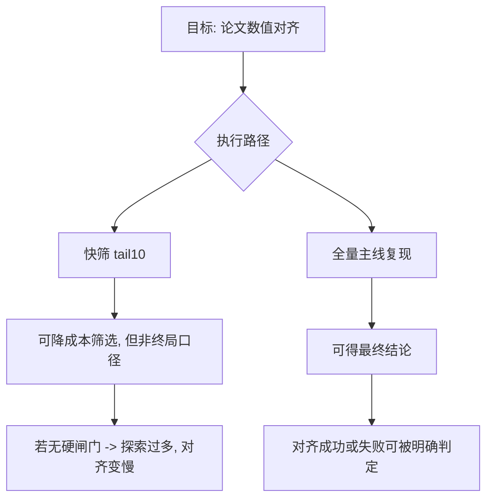

# Wm_010 论文复现受阻全量审计与纠偏说明（2026-03-31）

> 目的：把“为什么反复提复现却仍未对齐”讲透，按可追责方式给出完整事实账本、失误点、以及后续硬性纠偏规则。

---

## 0. 先正面回答最尖锐的问题

### 0.1 原论文和源码有没有？
有。

- 论文（NeurIPS 2024）：  
  https://proceedings.neurips.cc/paper_files/paper/2024/file/e356ed5f27885c79c7cb597bb1107c94-Paper-Conference.pdf
- 代码仓库：  
  https://github.com/formember/TTCT

### 0.2 “到现在还没复现出来”到底是什么意思？
含义是：

- `Table 5 (Grid, PPO_Lag)` 这条主线已经完整跑通并可复验；
- 但数值尚未对齐论文，尤其 `CP` 的 `Avg.C` 与论文排序相反；
- 因此只能称为“链路跑通”，不能称为“论文结果复现完成”。

### 0.3 “既然不完全等价，为什么还跑 tail10？”
`tail10` 的合理用途是“低成本筛掉明显无效配置”，不是最终结论口径。

问题不在“跑 tail10 本身”，而在于执行侧没有把它和论文口径之间设成硬闸门，导致中间探索跑了不少，但对“论文对齐”推进效率不高。这是执行失误，不是概念问题。

### 0.4 “不等价就算跑出结果有什么意义？”
只有两种意义：

1. 作为候选配置筛子，减少全量预算盲跑；
2. 定位 reward/cost 的冲突边界。

除这两点之外，不可作为“复现完成”的对外结论。

---

## 1. 全量执行账本（按时间顺序，逐项可核验）

## 1.1 阶段A：MVP 可行性验证（3/17~3/19）

目标：先验证 `q(s)->c_t->gamma_t` 闭环是否有信号。  
关键脚本：

- `/root/autodl-tmp/projects/FNLC_2401_repro/run_cdps_mvp1_medium_0317.sh`
- `/root/autodl-tmp/projects/FNLC_2401_repro/run_cdps_riskgate_b10_extend_0319.sh`
- `/root/autodl-tmp/projects/FNLC_2401_repro/run_cdps_riskgate_b10_lr_tune_seed23_0319.sh`

阶段结果（文档记录）：

- 出现均值级 `reward↑ + cost↓` 信号；
- 但 5-seed 一致性只有 `3/5`，不够稳健。

价值判定：

- 有效（验证机制可行）；
- 但不等价于 TTCT 论文复现。

## 1.2 阶段B：从官方 TTCT 代码跑基线与创新（3/24~3/25）

目标：从“机制可行”转向“官方代码主线上可跑通并出现帕累托信号”。  
关键脚本：

- `/root/autodl-tmp/projects/FNLC_2401_repro/run_ttct_gc_cp_epoch60_lr5e4_seed0_0324.sh`
- `/root/autodl-tmp/projects/FNLC_2401_repro/run_ttct_pareto_screen_e30_0325.sh`
- `/root/autodl-tmp/projects/FNLC_2401_repro/run_ttct_pareto_medium_e60_seed0_0325.sh`
- `/root/autodl-tmp/projects/FNLC_2401_repro/run_ttct_pareto_medium_e60_seed12_0325.sh`

阶段结果（文档记录）：

- 找到成本约束下的 Pareto checkpoint；
- 3-seed 有“可选双优点”，但跨 seed 稳定性不足。

价值判定：

- 对“创新路线是否有机会”是有效证据；
- 对“论文主表是否复现”仍不足。

## 1.3 阶段C：stage2 / stage2b 解耦与强约束（3/27）

目标：定位 `reward↑` 与 `cost↓` 难以同时稳定的根因。  
关键改造（文档记录）：

- `buffer.py`：约束成本与风险信号解耦开关
  - `CONSTRAINT_COST_SOURCE`
  - `RISK_COST_SOURCE`
  - `CONSTRAINT_BLEND_TRUE`
  - `RISK_BLEND_TRUE`

关键脚本：

- `/root/autodl-tmp/projects/FNLC_2401_repro/run_ttct_stage2_hardtrue_screen_seed01_0327.sh`
- `/root/autodl-tmp/projects/FNLC_2401_repro/run_ttct_stage2b_strong_constraint_seed01_0327.sh`

完成证据：

- `driver_ttct_stage2_hardtrue_screen_seed01_0327.log`：`[ALL_DONE] 2026-03-27 19:49:26`
- `driver_ttct_stage2b_strong_constraint_seed01_0327.log`：`[ALL_DONE] 2026-03-27 21:57:49`

阶段结果：

- 明确观察到“reward 优先窗口”和“safety 优先窗口”；
- 但未出现跨 seed 稳定双优。

价值判定：

- 对问题定位非常有效；
- 对论文主表对齐仍是间接贡献。

## 1.4 阶段D：回到 Table 5 主线复现（3/29~3/30）

目标：按 `Table 5 (Grid, PPO_Lag)` 主线做完整可复验跑通。  
关键脚本：

- `/root/autodl-tmp/projects/FNLC_2401_repro/run_ttct_repro_table5_ppolag_grid_seed01234_0329.sh`

关键日志：

- `/root/autodl-tmp/projects/FNLC_2401_repro/logs/driver_ttct_table5_ppolag_grid_e60_lr5e4_seed01234_0329.log`
- `ttct_table5_gc_ppolag_grid_e60_lr5e4_seed{0..4}_0329.log`
- `ttct_table5_cp_ppolag_grid_e60_lr5e4_seed{0..4}_0329.log`

完成标志：

- `[ALL_DONE] 2026-03-30 09:54:09`

统计汇总（记录值）：

- `GC Avg.R = 2.0070 ± 0.0927`
- `CP Avg.R = 2.0748 ± 0.1124`
- `GC Avg.C = 0.4865 ± 0.0849`
- `CP Avg.C = 0.8862 ± 0.0321`
- `ΔR = +0.0678`
- `ΔC = +0.3997`

对照论文（Table 5, Grid, PPO_Lag）：

- 论文：`GC Avg.R=2.71±0.11, CP Avg.R=2.70±0.11`
- 论文：`GC Avg.C=0.61±0.07, CP Avg.C=0.28±0.08`

结论：

- 奖励进入 2.x 区间，但仍低于论文；
- 最关键的是 `CP` 安全排序未复现成功（当前 `CP Avg.C > GC Avg.C`）。

价值判定：

- 这是目前最接近“复现”目标的一步，且可复验；
- 但仍未达到“复现完成”门槛。

---

## 2. 为什么反复卡住（不是一句“参数没调好”）

### 根因1：目标混叠（探索目标和复现目标并行）

一段时间内同时推进“创新信号”和“论文对齐”，导致算力和注意力被拆分。  
探索不是错，但在“先复现”的约束下，优先级应该更硬。

### 根因2：口径闸门不够硬（核心执行失误）

`tail10` 快筛被用于推进判断过多，而论文主结论要求 `mean±std` 的严格同口径评估。  
没有在流程上设置“不过论文口径闸门就不进入下一阶段”的硬规则。

### 根因3：TTCT 成本链敏感性高

文本约束分解与成本赋值对数据切分、checkpoint、阈值、超参较敏感，轻微漂移会放大成 `CP/GC` 排序变化。

### 根因4：安全 RL 的高方差客观存在

单 seed 看到的提升，不一定能在多 seed 保持方向一致；这会造成“看起来有效，但最终不稳”。

### 根因5：矩阵覆盖尚未齐平

原文还包含 `CPPO_PID/FOCOPS` 与 `Goal` 任务，当前最完整证据集中于 `PPO_Lag+Grid`。

---

## 3. `tail10` 到底应不应该跑：清晰边界版

### 3.1 应该跑（但只能做这两件事）

1. 快速淘汰明显无效配置；
2. 缩小全量候选集合。

### 3.2 绝不能做（本次踩到的坑）

1. 不能把 `tail10` 当作论文最终复现结论；
2. 不能在“未对齐口径”时继续扩散大量派生实验。

### 3.3 一条硬规则（后续强制执行）

- `tail10` 只决定“是否值得上全量”；
- 论文口径结果只认“固定 seed + 固定评估协议 + mean±std + 原始日志可追溯”。

---

## 4. 迄今投入到底有没有价值：A/B/C 分级

| 等级 | 定义 | 本项目对应项 | 结论 |
|---|---|---|---|
| A | 直接推动论文复现判定 | `run_ttct_repro_table5_ppolag_grid_seed01234_0329.sh` 及对应 5-seed 全量日志 | 高价值，必须保留 |
| B | 间接定位问题边界 | stage2/stage2b 解耦与强约束两轮 | 有价值，但不能替代主表结论 |
| C | 管理失配造成的额外消耗 | 在口径未锁死时反复扩展快筛分支 | 低效，后续禁止再发生 |

---

## 5. 公式层面：系统改了什么，为什么不是“瞎改”

风险质量分数：

\[
q_t = \mathrm{clip}(1-c_t,0,1)
\]

动态折扣：

\[
\gamma_t = \gamma_{base}((1-\eta)q_t+\eta)
\]

风险权重：

\[
w_t = 1 + \beta(1-q_t)
\]

PPO-Lagrangian 的优势组合：

\[
A_t = A_t^r - \lambda A_t^c
\]

这些改动的设计目标是：

- 高风险状态缩短回报传播半径（抑制冒进轨迹）；
- 提高高风险片段在约束项中的权重；
- 让策略更新更偏向“风险可控的增益”。

这条链路在机制上成立，但“机制成立”与“论文主表复现完成”是两个不同层级。

---

## 6. 从现在开始的强制纠偏（防止再烧预算）

### Gate-0（不通过就不许开跑）

必须提前写死并签字确认：

- 目标表（Table 5/6 哪一行）
- 任务、算法、seed 集合
- 统计口径（必须与论文一致）
- checkpoint 选择规则

### Gate-1（小样本冒烟）

- 只做链路正确性验证；
- 任何结果都只能标“探索信号”，不得称“复现进展”。

### Gate-2（全量复现）

- 固定脚本一次性跑完整 seed；
- 输出 `mean±std` 与所有原始日志路径。

### Gate-3（创新叠加）

- 仅在 Gate-2 通过后进行；
- 每次只改一个因子，保证可归因。

### Gate-4（对外汇报）

- 统一两栏：`论文口径结论` / `探索信号`；
- 禁止混写。

---

## 7. 当前真实状态（一句话 + 细化）

一句话：

- 复现工作不是“什么都没做”，而是“主线跑通了，但论文数值对齐尚未完成”；执行失误主要在流程闸门不硬，导致快筛和终局判定混用。

细化：

1. 论文与源码都存在，训练链路也存在并可复验；
2. 最新主线 5-seed 全量结果已落地，说明不是“跑不起来”；
3. 未对齐的关键卡点是 `CP` 安全排序未复现；
4. 继续在未锁口径前扩散实验会进一步低效，后续已切换为“闸门化执行”。

---

## 8. 接下来只做三件事（可验收）

1. **先把 `Table 5 / Grid / PPO_Lag` 做到严格同口径判定**（通过/不通过给二元结论）。
2. **若未通过，只做最小必要改动并重跑主线，不再开支线。**
3. **通过后再叠加创新项做增益验证**，保证“基线可信 + 创新可归因”。

---

## 9. 可核验文件清单

- `/home/snw/SnwHist/FirstExample/Wm_002_创新实现帕累托_从官方源码到结果闭环_20260325.md`
- `/home/snw/SnwHist/FirstExample/Wm_003_阶段现状与继续提升计划_20260327.md`
- `/home/snw/SnwHist/FirstExample/Wm_004_进展汇报与客户回复建议_20260328.md`
- `/home/snw/SnwHist/FirstExample/Wm_005_论文复现与创新进展总报告_20260328.md`
- `/home/snw/SnwHist/FirstExample/Wm_006_表5对齐与当前差距说明_20260329.md`
- `/home/snw/SnwHist/FirstExample/Wm_007_论文对齐复现进展与差距闭环_20260331.md`
- `/home/snw/SnwHist/FirstExample/Wm_008_论文复现对齐与创新攻坚决策报告_20260331.md`
- `/home/snw/SnwHist/FirstExample/Wm_009_复现受阻全量复盘与纠偏执行令_20260330.md`

核心训练证据路径（历史文档已记录）：

- `/root/autodl-tmp/projects/FNLC_2401_repro/run_ttct_repro_table5_ppolag_grid_seed01234_0329.sh`
- `/root/autodl-tmp/projects/FNLC_2401_repro/logs/driver_ttct_table5_ppolag_grid_e60_lr5e4_seed01234_0329.log`
- `/root/autodl-tmp/projects/FNLC_2401_repro/logs/summary_ttct_table5_ppolag_grid_e60_lr5e4_seed01234_0329.json`

