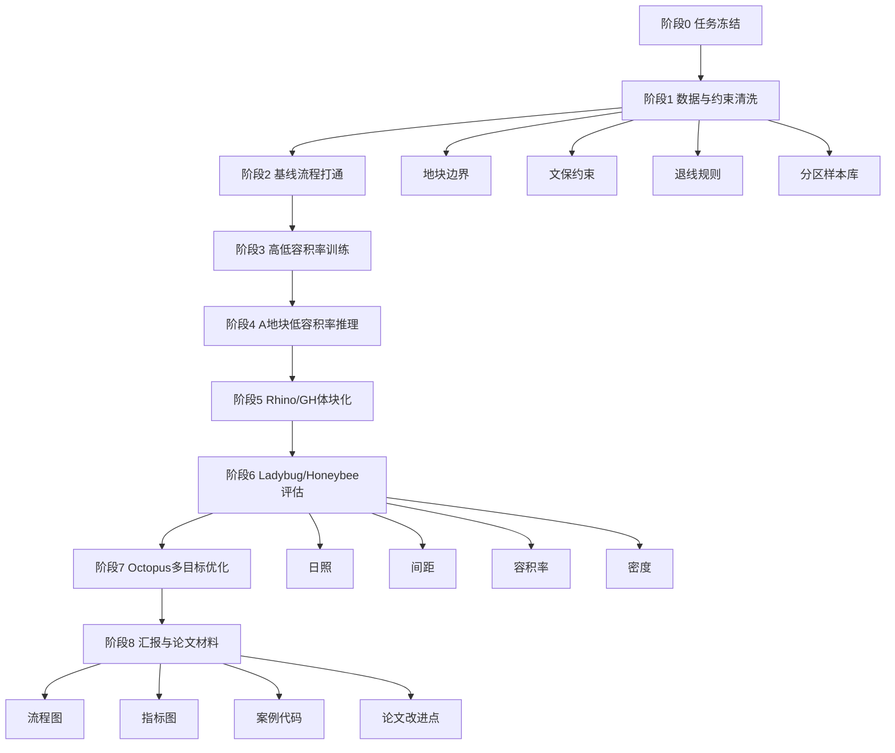

# 01 项目总流程

```mermaid
flowchart TD
    A[阶段0 任务冻结] --> B[阶段1 数据与约束清洗]
    B --> C[阶段2 基线流程打通]
    C --> D[阶段3 高低容积率训练]
    D --> E[阶段4 A地块低容积率推理]
    E --> F[阶段5 Rhino/GH体块化]
    F --> G[阶段6 Ladybug/Honeybee评估]
    G --> H[阶段7 Octopus多目标优化]
    H --> I[阶段8 汇报与论文材料]

    B --> B1[地块边界]
    B --> B2[文保约束]
    B --> B3[退线规则]
    B --> B4[分区样本库]

    G --> G1[日照]
    G --> G2[间距]
    G --> G3[容积率]
    G --> G4[密度]

    I --> I1[流程图]
    I --> I2[指标图]
    I --> I3[案例代码]
    I --> I4[论文改进点]
```
