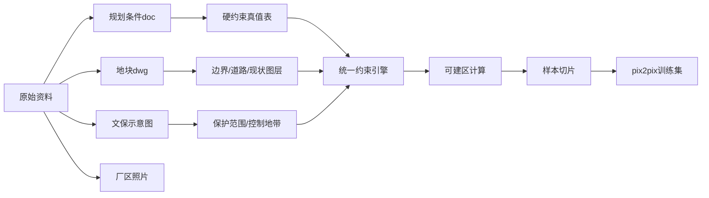

# 02 数据与约束映射

```mermaid
flowchart LR
    A[原始资料] --> A1[规划条件doc]
    A --> A2[地块dwg]
    A --> A3[文保示意图]
    A --> A4[厂区照片]

    A1 --> B[硬约束真值表]
    A2 --> C[边界/道路/现状图层]
    A3 --> D[保护范围/控制地带]

    B --> E[统一约束引擎]
    C --> E
    D --> E

    E --> F[可建区计算]
    F --> G[样本切片]
    G --> H[pix2pix训练集]
```
