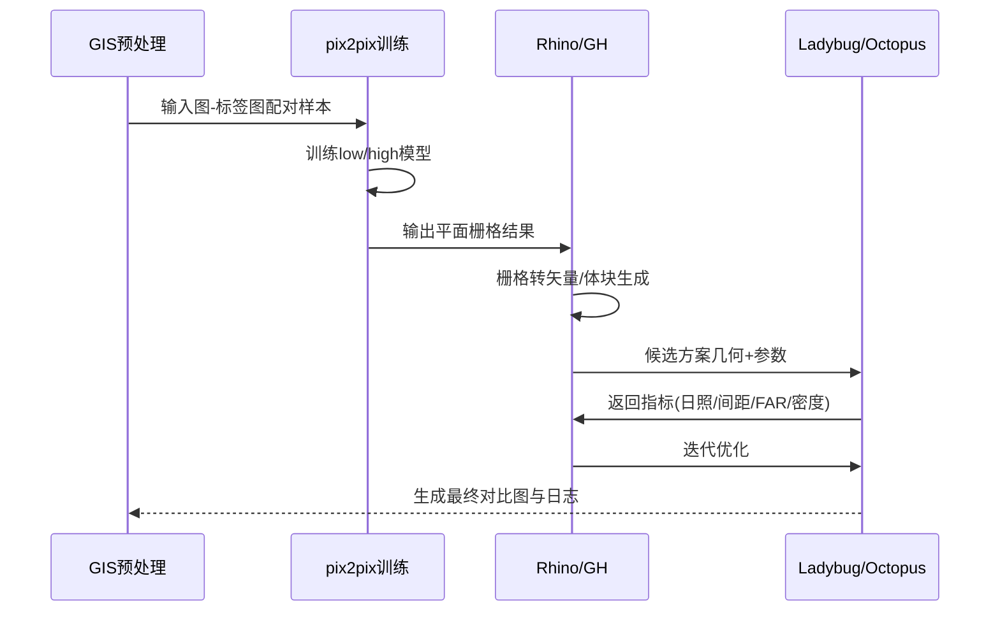

# 03 训练评估闭环

```mermaid
sequenceDiagram
    participant GIS as GIS预处理
    participant ML as pix2pix训练
    participant Rhino as Rhino/GH
    participant Eval as Ladybug/Octopus

    GIS->>ML: 输入图-标签图配对样本
    ML->>ML: 训练low/high模型
    ML->>Rhino: 输出平面栅格结果
    Rhino->>Rhino: 栅格转矢量/体块生成
    Rhino->>Eval: 候选方案几何+参数
    Eval->>Rhino: 返回指标(日照/间距/FAR/密度)
    Rhino->>Eval: 迭代优化
    Eval-->>GIS: 生成最终对比图与日志
```
