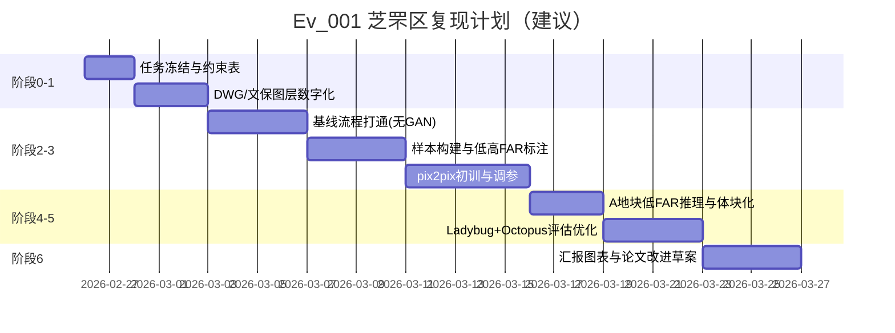

# 04 里程碑甘特

```mermaid
gantt
    title Ev_001 芝罘区复现计划（建议）
    dateFormat  YYYY-MM-DD
    section 阶段0-1
    任务冻结与约束表        :a1, 2026-02-26, 2d
    DWG/文保图层数字化       :a2, after a1, 3d
    section 阶段2-3
    基线流程打通(无GAN)      :b1, after a2, 4d
    样本构建与低高FAR标注    :b2, after b1, 4d
    pix2pix初训与调参         :b3, after b2, 5d
    section 阶段4-5
    A地块低FAR推理与体块化    :c1, after b3, 3d
    Ladybug+Octopus评估优化   :c2, after c1, 4d
    section 阶段6
    汇报图表与论文改进草案    :d1, after c2, 4d
```
