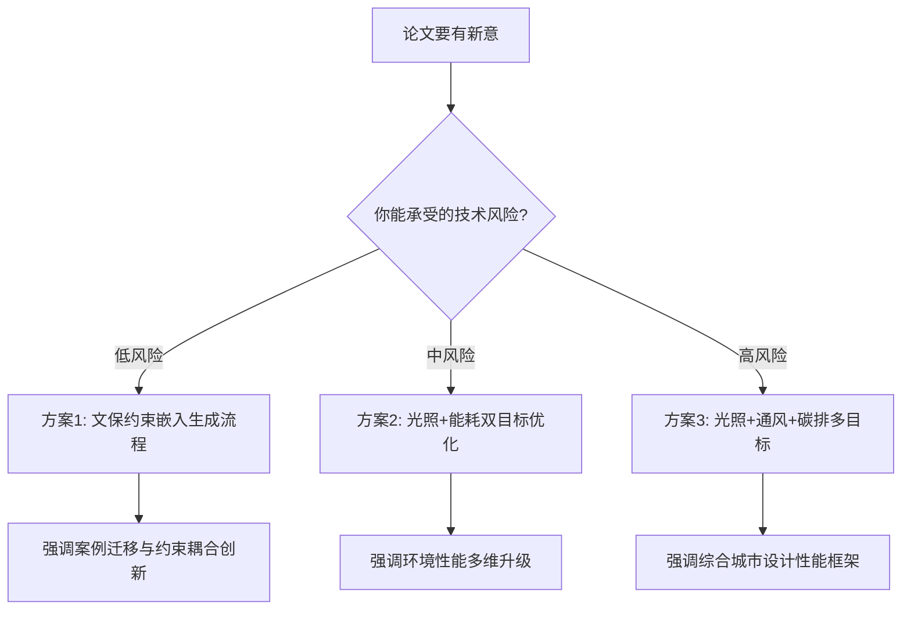

# 05 论文改进决策树

```mermaid
flowchart TD
    A[论文要有新意] --> B{你能承受的技术风险?}
    B -->|低风险| C[方案1: 文保约束嵌入生成流程]
    B -->|中风险| D[方案2: 光照+能耗双目标优化]
    B -->|高风险| E[方案3: 光照+通风+碳排多目标]

    C --> C1[强调案例迁移与约束耦合创新]
    D --> D1[强调环境性能多维升级]
    E --> E1[强调综合城市设计性能框架]
```
