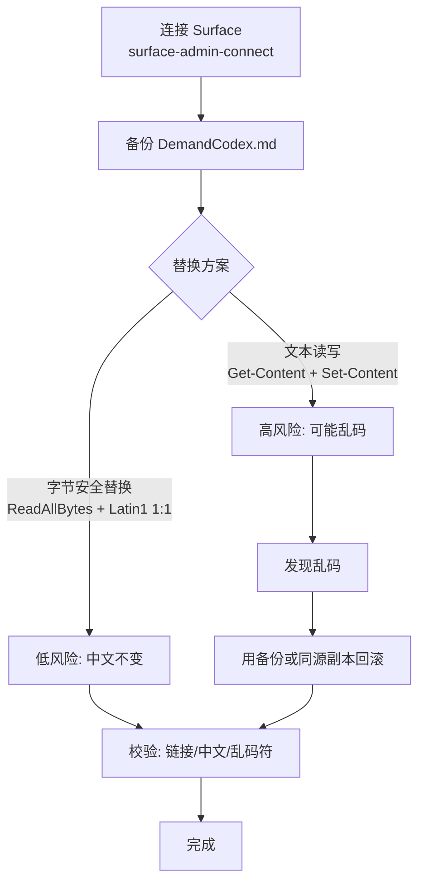

# replaceImage 复盘：远程改图片链接时如何避免中文乱码

## 目标
在 Surface 远程环境中，把 `DemandCodex.md` 里指定的 3 个 `file:///...` 图片链接改为相对路径 `./graphs/...`，且**不破坏中文内容**。

## 这次踩坑（失败过程）
1. 一开始使用了“文本读写”方案：
   - `Get-Content -Raw`
   - `.Replace(...)`
   - `Set-Content -Encoding UTF8`
2. 结果：链接改成功了，但中文出现乱码（典型表现：`壮壮妈` 变成异常字符）。
3. 额外现象：交互式 PowerShell 里 PSReadLine 会干扰长命令输入（命令回显错位/重复），增加误操作风险。

## 根因（核心）
- 问题不在“替换逻辑”，而在**编码重解释 + 重写**：
  - 原文件字节被按错误编码解释后，再以 UTF-8 写回，导致中文字节不可逆损坏。
- 这类文档中中文较多，而替换目标是纯 ASCII 链接；如果整文件按“文本编码转换”处理，风险很高。

## 回退怎么做的
1. 先确认目标目录不是 git 仓库（无法 `git restore`）。
2. 使用同级可用副本覆盖回退：
   - `F:\CODE\social\JianZhi\X\X_Web\X_000\DemandCodex.md`
   - 覆盖到：`F:\CODE\social\JianZhi\X\X_Web\X_000\Demand_X\DemandCodex.md`
3. 回退后校验：中文关键词恢复正常，乱码替代符 `�` 为 0。

## 最终成功方案（安全替换）
### 思路
只替换 ASCII 链接文本，**不做中文编码转换**：
- 先按字节读文件；
- 用单字节编码（ISO-8859-1）做“1:1 字节映射”为字符串；
- 替换 ASCII 片段；
- 再按同样单字节编码写回字节。

因为被替换的内容是 ASCII，且非 ASCII 字节完全不被解释/变换，所以中文可保持不变。

### 可复用命令（PowerShell 5.1）
```powershell
$path='F:\CODE\social\JianZhi\X\X_Web\X_000\Demand_X\DemandCodex.md'
$ts=Get-Date -Format 'yyyyMMdd_HHmmss'
$bak="$path.bak_$ts"
Copy-Item -LiteralPath $path -Destination $bak -Force

$latin1=[System.Text.Encoding]::GetEncoding(28591)
$text=$latin1.GetString([System.IO.File]::ReadAllBytes($path))

$text2=$text.Replace(
  'file:///C:/Users/surface/Documents/WXWork/1688855174725294/Cache/Image/2026-02/386273b0-f458-4e51-bec7-52cdd2e006a9.png',
  './graphs/386273b0-f458-4e51-bec7-52cdd2e006a9.png'
).Replace(
  'file:///C:/Users/surface/Documents/WXWork/1688855174725294/Cache/Image/2026-02/44aff83d-1241-4ba5-b9c5-706a698fc755.png',
  './graphs/44aff83d-1241-4ba5-b9c5-706a698fc755.png'
).Replace(
  'file:///C:/Users/surface/Documents/WXWork/1688855174725294/Cache/Image/2026-02/66479d24-4d4c-4c13-b9f7-fe14bd5144da.jpg',
  './graphs/66479d24-4d4c-4c13-b9f7-fe14bd5144da.jpg'
)

[System.IO.File]::WriteAllBytes($path,$latin1.GetBytes($text2))
```

## 验证清单（每次都做）
1. 目标 3 行是否变成 `./graphs/...`。
2. 中文关键词计数是否正常（如 `壮壮妈`）。
3. `�` 计数是否为 0。
4. 是否只改了指定 3 处（避免误替换其他 `file:///`）。
5. 备份文件是否存在（可秒回滚）。

## 执行流程图（Mermaid）


## 给后续 Codex 的一句话建议
- **改 ASCII 片段但文件含中文时，优先“字节级替换 + 先备份 + 计数校验”，不要直接整文件重编码写回。**
