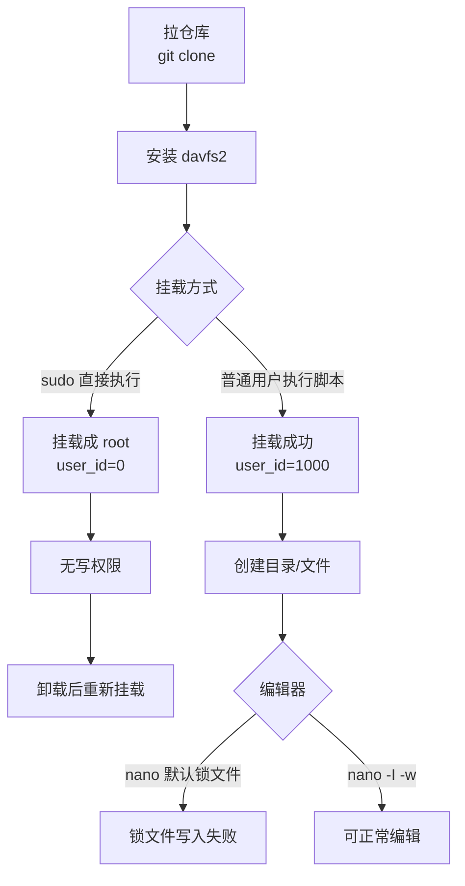

# WebDAV 挂载与编辑全流程（Ubuntu + davfs2）

> 目标：在 Ubuntu 本地**直接使用公司现成的 WebDAV 服务**（`https://webdav.yeying.pub/dav`），把远端目录挂到 `/mnt/webdav`，并能稳定读写、编辑文件。本文按“教师指挥官”视角全局统筹：**先讲框架，再给可执行步骤，最后给排错路径**。新手照抄也能一路通关。

---

## 0. 一分钟速通版（你只想跑起来）

```bash
# 1) 拉仓库（脚本在里面）
cd /home/snw/Codex/webdav

# 如果目录为空：
git clone git@github.com:ShengNW/webdav.git .

# 2) 安装 davfs2（Ubuntu）
sudo apt-get update
sudo apt-get install -y davfs2

# 3) 挂载（注意：**不要用 sudo 直接执行脚本**）
# 推荐不把密码写进命令行，脚本会交互式读取
bash scripts/mount_davfs.sh mount https://webdav.yeying.pub/dav /mnt/webdav SNW

# 4) 验证 uid/gid 是否是你的用户（应为 1000/1000）
findmnt -no OPTIONS /mnt/webdav

# 5) 创建目录与文件
mkdir -p /mnt/webdav/personal/prompt

# 6) 使用 nano 编辑（临时关闭锁文件与自动换行）
nano -I -w /mnt/webdav/personal/prompt/prompt.csv
```

---

## 1. 框架理解：我们到底在做什么？

**WebDAV** 是一种基于 HTTP 的文件访问协议；**davfs2** 是 Linux 下的客户端，它把远端 WebDAV “伪装成”一个本地磁盘目录。挂载后的 `/mnt/webdav` 就像你本地硬盘一样能读写，但底层是走网络。

关键概念：
- **挂载点（mount point）**：本地目录（这里是 `/mnt/webdav`）。
- **认证**：账号/密码写入 `/etc/davfs2/secrets`，权限 `600`，只有 root 可读。
- **权限映射**：挂载时会把远端文件映射成某个本地 UID/GID。必须是你的 UID/GID，否则会出现“看得到写不了”。
- **编辑器锁文件**：nano 会创建锁文件（如 `.prompt.csv.swp`）。某些 WebDAV 服务器会拒绝这种“隐藏锁文件”命名，导致保存失败。

---

## 2. 全流程实操（从拉仓库到可写可编辑）

### 2.1 拉仓库（脚本来源）

```bash
cd /home/snw/Codex/webdav

# 如果当前目录是空的，用 SSH 拉
# （SSH 已配置好）
git clone git@github.com:ShengNW/webdav.git .
```

脚本核心：`scripts/mount_davfs.sh`。

---

### 2.2 安装 davfs2

```bash
sudo apt-get update
sudo apt-get install -y davfs2
```

安装过程中可能会弹出提示：
> Should unprivileged users be allowed to mount WebDAV resources?

我的选择是**“否”**：这样只有 root 可以挂载，但脚本会用 `sudo`，不会影响实际使用。

---

### 2.3 正确挂载（避免 root 误挂导致无写权限）

**关键原则：脚本要用普通用户执行，不能前面加 `sudo`。**

正确方式：
```bash
# 密码建议交互输入，不落入 history
bash scripts/mount_davfs.sh mount https://webdav.yeying.pub/dav /mnt/webdav SNW
```

为什么？
- 脚本内部会用 `id -u` / `id -g` 写入挂载参数。
- 如果你 `sudo bash ...`，这些值会变成 0，导致文件属主是 root，你就无法写入。

---

### 2.4 验证挂载是否“可写”

```bash
findmnt -no OPTIONS /mnt/webdav
```

你要看到类似：
```
... user_id=1000,group_id=1000 ...
```

这说明本地权限映射到了你的用户（通常 UID/GID 都是 1000）。

---

### 2.5 创建目录与文件

```bash
mkdir -p /mnt/webdav/personal/prompt

# 创建文件
printf '' > /mnt/webdav/personal/prompt/prompt.csv
```

---

### 2.6 用 nano 正常编辑（避开锁文件问题）

**问题现象**：
```
[ 写入锁文件 ./.prompt.csv.swp 出错：权限不够 ]
```

**原因**：远端 WebDAV 服务器拒绝创建某些隐藏锁文件（`.prompt.csv.swp` 这种命名）。

**临时解决（推荐）**：
```bash
nano -I -w /mnt/webdav/personal/prompt/prompt.csv
```

参数说明：
- `-I`：忽略 `nanorc`，避免启用 `set locking` 造成锁文件写入失败。
- `-w`：关闭自动换行（你已实测这样配合更稳定）。

> 你反馈 `-I -w` 配合 **Alt+Shift+4** 可以正常编辑。这里记录为“你的键盘习惯”，如键位不同请以你实际为准。

---

## 3. 全局流程图（Mermaid）



---

## 4. 排错清单（踩过的坑 + 解决方法）

### 4.1 “无法写入目录 / 文件”

**症状**：目录属主是 root，普通用户不能写。  
**原因**：用 `sudo bash scripts/mount_davfs.sh ...` 导致 `uid/gid=0`。  
**解决**：卸载后用普通用户重新挂载。

```bash
sudo umount /mnt/webdav
bash scripts/mount_davfs.sh mount https://webdav.yeying.pub/dav /mnt/webdav SNW
```

---

### 4.2 “sudo: a terminal is required to read the password”

**原因**：脚本内部用 `sudo`，需要 TTY 交互输入密码。  
**解决**：在交互终端执行脚本，别用非交互管道。

---

### 4.3 nano 写锁文件失败（`.prompt.csv.swp`）

**原因**：远端 WebDAV 服务器不允许该命名的隐藏锁文件。  
**解决**：临时关闭锁文件机制。

```bash
nano -I -w /mnt/webdav/personal/prompt/prompt.csv
```

---

## 5. 常用命令备忘

### 5.1 卸载
```bash
sudo umount /mnt/webdav
```

### 5.2 配置开机自动挂载（可选）
```bash
bash scripts/mount_davfs.sh install-fstab https://webdav.yeying.pub/dav /mnt/webdav SNW
```

### 5.3 取消开机自动挂载
```bash
bash scripts/mount_davfs.sh remove-fstab /mnt/webdav
```

---

## 6. 一句话总结（指挥官版）

**挂载成功的关键不是“能挂上”，而是“挂上后 UID/GID 映射正确 + 编辑器不写锁文件”。**

按本文流程走，你在任何新机器上都能从零拉起：
1. 拉仓库
2. 装 davfs2
3. 普通用户执行脚本挂载
4. 用 `nano -I -w` 编辑

— 完 —
