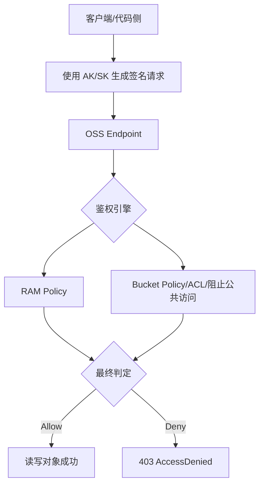
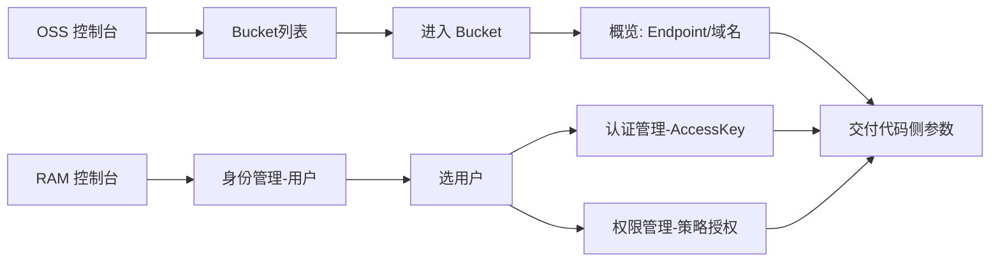
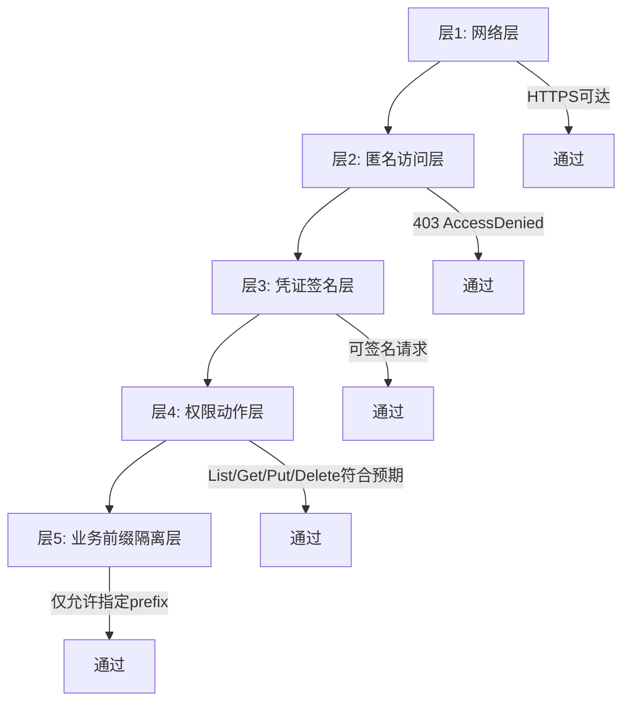

# OSS 连接全流程实战手册（先打通 OSS，不含挂载）

> 文档目标：先把 **“OSS 账户、桶、权限、鉴权、连通性验证”** 彻底打通，确保后续代码侧接入与 rclone 挂载都不会卡在基础信息和权限上。
>
> 当前版本：v1.0（2026-03-04）

---

## 0. 先给结论（基于你已提供信息）

你现在提供的信息已经覆盖了 **80% 关键字段**，但要完成“可鉴权访问”的最终验证，还缺 1 个关键件：

- ✅ 已有：
  - Bucket：`sheng-n-w`
  - Region：`eu-central-1`（德国法兰克福）
  - 公网 Endpoint：`oss-eu-central-1.aliyuncs.com`
  - Bucket 域名：`sheng-n-w.oss-eu-central-1.aliyuncs.com`
  - RAM 用户：`dell@1129703751867574.onaliyun.com`
  - AccessKey ID：已存在（你页面可见）
- ❗仍缺：
  - **AccessKey Secret（创建时一次性显示）**

没有 Secret，最多只能做网络连通验证；不能完成签名鉴权验证。

---

## 1. 我已做的本地实测（不改配置，只读验证）

### 1.1 DNS 与 HTTPS 可达性

对以下地址进行了本地访问验证：

- `https://oss-eu-central-1.aliyuncs.com`
- `https://sheng-n-w.oss-eu-central-1.aliyuncs.com`

结果：

- DNS 解析正常。
- HTTPS 可达。
- 返回码均为 `403`，错误为 `AccessDenied`（匿名无权）。

这说明：

1. 网络路径是通的；
2. Endpoint 是对的；
3. Bucket 域名是活的；
4. 当前桶策略不是匿名开放（这是好事，安全默认正确）。

### 1.2 为什么 403 反而是“正确现象”

因为你在做的是私有 OSS。匿名请求返回 `AccessDenied` 正常。
真正通过标准是：**带签名凭证后可以 `List/Get/Put`**。

---

## 2. 全局架构认知（先理解，再配置）



关键点：

- Endpoint 对了，只代表“路通”。
- 能不能访问，取决于：`签名 + RAM 权限 + Bucket 策略` 的综合结果。

---

## 3. 你在控制台要拿齐的“代码交付卡”

后续给代码/Agent 时，必须一次性交付这些字段：

| 字段 | 示例 | 备注 |
|---|---|---|
| provider | Alibaba OSS | 固定 |
| bucket | `sheng-n-w` | 必填 |
| region | `eu-central-1` | 必填 |
| endpoint | `oss-eu-central-1.aliyuncs.com` | 必填（公网） |
| bucket_host | `sheng-n-w.oss-eu-central-1.aliyuncs.com` | 推荐提供 |
| access_key_id | `LTAI...` | 必填 |
| access_key_secret | `******` | 必填，且仅安全传递 |
| prefix | 例如 `mcp-hot/` | 强烈建议，便于隔离 |
| permission_scope | 例如 `List/Get/Put/Delete on sheng-n-w/mcp-hot/*` | 建议显式说明 |

---

## 4. 控制台操作全流程（已有 vs 新建）

## 4.1 路径总图



## 4.2 情况 A：你这种“已有 Bucket + 已有 RAM 用户”

### A-1 在 OSS 控制台确认桶信息

1. 进入 OSS 控制台。
2. 左侧 `Bucket 列表`。
3. 点击 `sheng-n-w`。
4. 在桶内左侧菜单点击 `概览`（你现在在“文件列表”，要切到“概览”）。
5. 记录：
   - Bucket 名称：`sheng-n-w`
   - 地域：德国（法兰克福）/ `eu-central-1`
   - 外网 Endpoint：`oss-eu-central-1.aliyuncs.com`
   - Bucket 域名：`sheng-n-w.oss-eu-central-1.aliyuncs.com`

### A-2 在 RAM 控制台确认用户与密钥

1. 进入 RAM 控制台。
2. 左侧 `身份管理 > 用户`。
3. 点击 `dell@1129703751867574.onaliyun.com`。
4. 进入 `认证管理 > AccessKey`。
5. 确认 AK 处于“已启用”。
6. 如果 **没有 Secret 留存**：
   - 新建一个 AccessKey（保存 Secret），
   - 验证通过后再回收旧 AK（做平滑轮换）。

### A-3 在 RAM 用户上配置最小权限

进入该用户 `权限管理`，建议挂一个“最小可用”自定义策略（仅指定桶 + 指定前缀）。

示例（将 `mcp-hot/*` 改成你的前缀）：

```json
{
  "Version": "1",
  "Statement": [
    {
      "Effect": "Allow",
      "Action": [
        "oss:ListObjects"
      ],
      "Resource": [
        "acs:oss:*:*:sheng-n-w"
      ],
      "Condition": {
        "StringLike": {
          "oss:Prefix": [
            "mcp-hot/*"
          ]
        }
      }
    },
    {
      "Effect": "Allow",
      "Action": [
        "oss:GetObject",
        "oss:PutObject",
        "oss:DeleteObject"
      ],
      "Resource": [
        "acs:oss:*:*:sheng-n-w/mcp-hot/*"
      ]
    }
  ]
}
```

> 如果你要让它管理整个桶，把 `mcp-hot/*` 换成 `*`，但不建议一上来就全桶放开。

---

## 4.3 情况 B：新建 Bucket + 新建 RAM 用户（完整起步）

1. OSS：创建 Bucket（区域选离主要访问方最近，当前你在法国优先法兰克福）。
2. RAM：创建用户（仅 OpenAPI Access）。
3. RAM：创建 AccessKey（只显示一次 Secret，立即保存）。
4. RAM：给用户授权（系统策略先跑通，再收敛到自定义最小权限）。
5. OSS：确认 Endpoint 与 Bucket 域名。
6. 交付“代码交付卡”（见第 3 节）。

---

## 5. 不含挂载的“验收测试”标准（必须过）

## 5.1 验收分层



## 5.2 你现在已经通过的

- ✅ 层1（网络）
- ✅ 层2（匿名受限，返回 403）

## 5.3 还需要你补齐后才能测的

- ❗层3/4/5：需要 `AccessKey Secret`。

---

## 6. 代码侧应该怎么“吃”这些信息（先定义接口，不谈挂载）

建议统一一个配置对象（示例）：

```json
{
  "provider": "alibaba_oss",
  "bucket": "sheng-n-w",
  "region": "eu-central-1",
  "endpoint": "oss-eu-central-1.aliyuncs.com",
  "access_key_id": "LTAI...",
  "access_key_secret": "***",
  "prefix": "mcp-hot/"
}
```

以及对象路径规范：

- `object_key = <prefix>/<yyyy>/<mm>/<dd>/<frame_id>.png`
- 业务返回不要塞大 base64，返回：
  - `bucket`
  - `key`
  - `etag`
  - `size`
  - `content_type`

---

## 7. 常见坑位（这部分最关键）

1. **把 Endpoint 和 Bucket 域名混用**
   - SDK/工具通常填 endpoint；对象级访问常用 bucket 域名。
2. **只有 AK ID 没有 AK Secret**
   - 这是最常见断点。没有 Secret 不可能完成签名鉴权。
3. **RAM 有用户但无有效策略**
   - 会出现“能签名但仍 403”。
4. **权限过宽**
   - 先跑通可宽一点，再收敛到指定前缀。
5. **把内网 Endpoint 用在公网主机**
   - `-internal` 端点通常用于同地域阿里云内网，不适合公网机器。
6. **把“匿名 403”误判为网络故障**
   - 对私有桶来说，匿名 403 正常且安全。

---

## 8. 安全与运维基线（上线前就该做）

- 使用 RAM 用户，不用主账号 AK。
- 每个应用一套独立 AK（便于审计/吊销）。
- 开启密钥轮换（建议 30~90 天）。
- Secret 只进密钥管理，不进 Git、不写死代码。
- 以 prefix 做租户/应用隔离（例如 `mcp-hot/`、`archive/`）。

---

## 9. 你下一步只需要做这 3 件事

1. 在 RAM 用户页确认是否掌握 `AccessKey Secret`；如果没有，创建新 AK 并保存。
2. 给该用户挂最小权限策略（建议先 `sheng-n-w/mcp-hot/*`）。
3. 把“代码交付卡”7个字段交给执行端（含 Secret）。

完成后即可进入“带签名的真实性验证”，再进入挂载阶段。

---

## 10. 本文依据（官方文档）

- OSS 控制台快速入门（含 Bucket/对象入口路径）  
  https://www.alibabacloud.com/help/en/oss/user-guide/console-quick-start
- OSS 地域与 Endpoint（含法兰克福 `oss-eu-central-1.aliyuncs.com`）  
  https://www.alibabacloud.com/help/en/oss/choose-an-oss-region
- 中文：地域和 Endpoint（法兰克福外网/内网）  
  https://help.aliyun.com/zh/oss/user-guide/regions-and-endpoints
- RAM 创建 AccessKey（认证管理页面路径）  
  https://www.alibabacloud.com/help/en/ram/user-guide/create-an-accesskey-pair
- RAM 为用户授权（权限管理路径）  
  https://www.alibabacloud.com/help/en/ram/user-guide/grant-permissions-to-the-ram-user
- OSS Bucket Policy（图形化授权路径与策略语义）  
  https://www.alibabacloud.com/help/en/oss/user-guide/use-bucket-policy-to-grant-permission-to-access-oss/
- rclone S3/Alibaba OSS provider 配置参考（后续挂载阶段会用）  
  https://rclone.org/s3/

