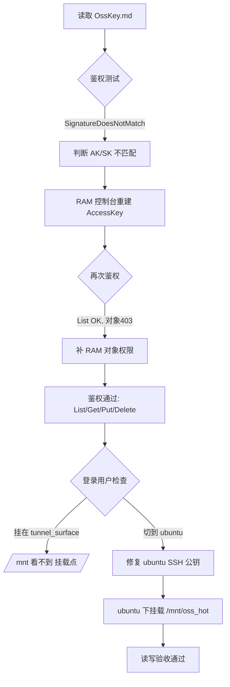
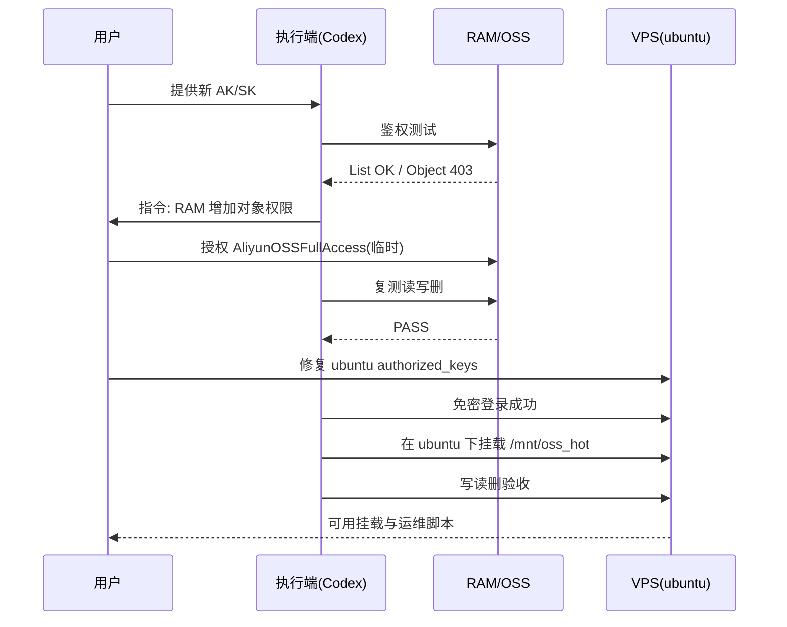

# webdav_001_OSS：从“权限未打通”到“ubuntu 挂载成功”的增量实战手册

> 这是 `webdav_000_aliyun.md` 的续篇。  
> 本文不重复前文的基础概念（Bucket/Endpoint 基础识别、匿名 403 含义等），只覆盖 **前文未解决的权限与落地问题**，一直写到 **VPS `ubuntu` 用户挂载成功**。

---

## 0. 本文定位（先讲清边界）

### 已由 `webdav_000` 覆盖
- OSS 基础字段如何获取。
- RAM 用户与 AK/SK 的基础概念。
- “网络可达但鉴权未通过”的判断方法。

### 本文新增覆盖（核心增量）
1. 为什么会出现 `SignatureDoesNotMatch`，如何确认是“AK/SK 不匹配”。
2. 为什么 `List` 能过但 `Get/Put` 仍 403，如何在 RAM 页面补权限。
3. 为什么“挂载成功但你在 `/mnt` 看不到”——用户上下文不一致导致。
4. 如何把登录入口切换回 `ubuntu` 并在 `ubuntu` 下挂载到 `/mnt/oss_hot`。
5. 可直接运维的脚本目录、绝对路径、回滚命令与验收标准。

---

## 1. 需求描述（给新开 Codex / 新同学的任务定义）

### 目标
在 `vps-47db6a55.vps.ovh.net` 上，以 **ubuntu 用户** 将阿里云 OSS 前缀 `sheng-n-w/mcp-hot` 挂载到本地目录 `/mnt/oss_hot`，并可稳定执行读/写/删。

### 输入条件
- OSS：
  - Bucket：`sheng-n-w`
  - Region：`eu-central-1`
  - Endpoint：`oss-eu-central-1.aliyuncs.com`
  - Prefix：`mcp-hot`
- 凭据来源（本地）：`/home/snw/Codex/SSH/OssKey.md`
- 服务器：
  - Host: `51.75.133.235`
  - User: `ubuntu`

### 验收标准（必须全部通过）
- `ssh` 公钥可登录 `ubuntu`。
- `mountpoint -q /mnt/oss_hot` 返回 mounted。
- 在 `/mnt/oss_hot` 内创建文件、读回内容、删除文件均成功。
- 有可执行的启动/停止/状态脚本。

---

## 2. 全流程全局图（本次真实路径）



---

## 3. 关键坑位与根因（按时间线）

## 3.1 坑位一：`SignatureDoesNotMatch`

### 现象
`rclone lsd` 报错：`SignatureDoesNotMatch`。

### 根因
旧 `AccessKey ID` 与 `OssKey.md` 中的 `Secret` 不是同一对（或 Secret 已变更/过期）。

### 修复动作（阿里云 RAM）
在 RAM 用户页面创建新 AccessKey（轮转），并立即保存 Secret。

### RAM 页面点击路径（你已实际走通）
1. `RAM 控制台 -> 用户 -> dell@... -> 认证管理 -> AccessKey -> 创建 AccessKey`
2. 在“确认当前 AccessKey 用于轮转”页面：
   - 选择 `CLI`
   - 勾选 `我确认必须创建 AccessKey`
   - 点击 `继续创建`
3. 完成校验后，复制并保存：
   - `AccessKey ID`
   - `AccessKey Secret`（只显示一次）

---

## 3.2 坑位二：`List` 成功但读写 403

### 现象
- `lsd` 能列目录（如 `Rehearsal`、`mcp-hot`）。
- 但 `HeadObject/GetObject/PutObject` 返回 `403 Forbidden`。

### 根因
RAM 仅有桶级或有限动作权限，缺少对象级读写权限。

### 现场修复策略
- 快速排障：先授 `AliyunOSSFullAccess` 验证链路。
- 通过后再收敛为最小权限（只允许 `sheng-n-w/mcp-hot/*`）。

### 阿里云控制台点击路径（RAM 授权）
1. `RAM 控制台 -> 用户 -> dell@... -> 权限管理`
2. `新增权限`
3. 先选系统策略：`AliyunOSSFullAccess`（临时验证）
4. 链路验证通过后，改为最小自定义策略（见附录）。

---

## 3.3 坑位三：挂载“成功了”但 `/mnt` 看不到

### 现象
你在 `ubuntu` 里 `ls /mnt` 为空，怀疑没挂载。

### 根因
当时挂载执行在 `tunnel_surface` 用户上下文，挂载点在该用户目录：
- `/home/tunnel_surface/mnt/oss_hot`

而你检查的是 `ubuntu` 看到的：
- `/mnt`

用户上下文不同 + 挂载点不同，导致“看起来像失败”。

### 结论
必须统一到目标运行用户（本项目是 `ubuntu`）下落地。

---

## 4. 目录与绝对路径（最终落地版）

## 4.1 本地（操作者机器）
- 凭据文件：`/home/snw/Codex/SSH/OssKey.md`
- Prompt 历史：`/home/snw/SNWcode/Replicant/Role/ENFP/PromptHist.md`

## 4.2 VPS（最终使用 ubuntu）
- 挂载点：`/mnt/oss_hot`
- rclone 配置：`/home/ubuntu/.config/rclone/rclone.conf`
- 缓存目录：`/home/ubuntu/.cache/rclone/oss_hot`
- 日志目录：`/home/ubuntu/.local/state/rclone/oss_hot_mount.log`
- 脚本目录：`/home/ubuntu/bin`
  - `oss_hot_mount_start.sh`
  - `oss_hot_mount_stop.sh`
  - `oss_hot_mount_status.sh`
- SSH 公钥文件：`/home/ubuntu/.ssh/authorized_keys`
- SSH 备份文件示例：`/home/ubuntu/.ssh/authorized_keys.bak_2026-03-04_194001`

---

## 5. 权限与登录修复（ubuntu 维度）

## 5.1 问题现状
虽然你提供了 `ubuntu` 密码，但自动化测试中密码登录仍返回 `Permission denied`，不能依赖密码流程。

## 5.2 可控修复路线
使用 `ubuntu` 已有会话手动追加公钥（先备份再加），确保后续可稳定免密登录。

执行模板（已验证有效）：

```bash
set -e
mkdir -p ~/.ssh && chmod 700 ~/.ssh
[ -f ~/.ssh/authorized_keys ] && cp -a ~/.ssh/authorized_keys ~/.ssh/authorized_keys.bak_$(date +%F_%H%M%S)
echo 'ssh-ed25519 AAAAC3NzaC1lZDI1NTE5AAAAICokrW9kLNTbyrJSm0BME7e8969K2qmWyu21BIGai63h snw@snw-Inspiron-3458' >> ~/.ssh/authorized_keys
chmod 600 ~/.ssh/authorized_keys
```

验证：

```bash
ssh -i ~/.ssh/id_ed25519_vps_tunnel ubuntu@51.75.133.235 'echo LOGIN_OK && whoami'
```

---

## 6. ubuntu 用户下挂载：标准执行步骤

## 6.1 创建挂载点与目录

```bash
sudo mkdir -p /mnt/oss_hot
sudo chown ubuntu:ubuntu /mnt/oss_hot
mkdir -p ~/.config/rclone ~/.cache/rclone/oss_hot ~/.local/state/rclone ~/bin
chmod 700 ~/.config/rclone
```

## 6.2 创建 rclone remote

```bash
rclone config create ossfr_hot s3 \
  provider Alibaba \
  env_auth false \
  access_key_id '<你的AK>' \
  secret_access_key '<你的SK>' \
  endpoint oss-eu-central-1.aliyuncs.com \
  region eu-central-1 \
  no_check_bucket true \
  acl private

chmod 600 ~/.config/rclone/rclone.conf
```

## 6.3 写入启动脚本（`/home/ubuntu/bin/oss_hot_mount_start.sh`）

```bash
#!/usr/bin/env bash
set -euo pipefail
REMOTE_NAME="ossfr_hot"
BUCKET_PATH="sheng-n-w/mcp-hot"
MOUNT_DIR="/mnt/oss_hot"
CACHE_DIR="$HOME/.cache/rclone/oss_hot"
STATE_DIR="$HOME/.local/state/rclone"
LOG_FILE="$STATE_DIR/oss_hot_mount.log"
mkdir -p "$CACHE_DIR" "$STATE_DIR"
if mountpoint -q "$MOUNT_DIR"; then
  echo "already_mounted:$MOUNT_DIR"
  exit 0
fi
rclone mount "${REMOTE_NAME}:${BUCKET_PATH}" "$MOUNT_DIR" \
  --vfs-cache-mode full \
  --cache-dir "$CACHE_DIR" \
  --vfs-cache-max-size 12G \
  --vfs-cache-min-free-space 25G \
  --vfs-cache-max-age 24h \
  --vfs-write-back 10s \
  --dir-cache-time 5m \
  --transfers 4 --checkers 8 \
  --buffer-size 8M \
  --log-file "$LOG_FILE" --log-level INFO \
  --daemon
sleep 2
mountpoint -q "$MOUNT_DIR"
echo "mounted:$MOUNT_DIR"
```

## 6.4 写入停止脚本（`/home/ubuntu/bin/oss_hot_mount_stop.sh`）

```bash
#!/usr/bin/env bash
set -euo pipefail
MOUNT_DIR="/mnt/oss_hot"
if mountpoint -q "$MOUNT_DIR"; then
  fusermount3 -u "$MOUNT_DIR"
  echo "unmounted:$MOUNT_DIR"
else
  echo "not_mounted:$MOUNT_DIR"
fi
```

## 6.5 写入状态脚本（`/home/ubuntu/bin/oss_hot_mount_status.sh`）

```bash
#!/usr/bin/env bash
set -euo pipefail
REMOTE_NAME="ossfr_hot"
BUCKET_PATH="sheng-n-w/mcp-hot"
MOUNT_DIR="/mnt/oss_hot"
LOG_FILE="$HOME/.local/state/rclone/oss_hot_mount.log"
if mountpoint -q "$MOUNT_DIR"; then
  echo "status:mounted"
else
  echo "status:unmounted"
fi
rclone lsf "${REMOTE_NAME}:${BUCKET_PATH}" --max-depth 1 | sed -n '1,20p' || true
[ -f "$LOG_FILE" ] && tail -n 20 "$LOG_FILE" || true
```

赋予执行权限：

```bash
chmod +x ~/bin/oss_hot_mount_start.sh ~/bin/oss_hot_mount_stop.sh ~/bin/oss_hot_mount_status.sh
```

---

## 7. 验收闭环（真实通过标准）

## 7.1 操作顺序

```bash
~/bin/oss_hot_mount_stop.sh || true
~/bin/oss_hot_mount_start.sh
mount | grep ' /mnt/oss_hot '

TF=/mnt/oss_hot/_mount_verify_$(date +%s).txt
echo "mount-check $(date -Is)" > "$TF"
cat "$TF"
rm -f "$TF"

~/bin/oss_hot_mount_status.sh
```

## 7.2 本次实际结果摘要
- `mounted:/mnt/oss_hot`
- `mount-check ...` 可读回
- 删除测试文件成功
- `status:mounted`
- 日志仅出现常见提示：`poll-interval is not supported by this remote`（可忽略）

---

## 8. 你最关心的问题：为什么这次终于成功？



本质上是三个门依次打开：
1. **密钥配对正确**（解决签名错）
2. **RAM 权限到对象级**（解决 403）
3. **执行用户与挂载用户一致**（解决“看不见挂载”）

---

## 9. 新开 Codex 的接手模板（可直接复用）

### 9.1 先确认上下文
- 目标用户是否是 `ubuntu`？
- 目标挂载点是否是 `/mnt/oss_hot`？
- `OssKey.md` 是否是最新 AK/SK 对？

### 9.2 五条快检命令

```bash
ssh -i ~/.ssh/id_ed25519_vps_tunnel ubuntu@51.75.133.235 'whoami && hostname'
ssh -i ~/.ssh/id_ed25519_vps_tunnel ubuntu@51.75.133.235 'rclone listremotes'
ssh -i ~/.ssh/id_ed25519_vps_tunnel ubuntu@51.75.133.235 'mountpoint -q /mnt/oss_hot && echo mounted || echo unmounted'
ssh -i ~/.ssh/id_ed25519_vps_tunnel ubuntu@51.75.133.235 '~/bin/oss_hot_mount_status.sh | sed -n "1,30p"'
ssh -i ~/.ssh/id_ed25519_vps_tunnel ubuntu@51.75.133.235 'ls -la /mnt /mnt/oss_hot | sed -n "1,40p"'
```

---

## 10. 运行参数为什么这样定（工程解释）

- `--vfs-cache-mode full`：避免常见随机读写兼容问题。
- `--vfs-cache-max-size 12G`：在当前 VPS 空间下稳健，不抢占系统盘太多。
- `--vfs-cache-min-free-space 25G`：保留系统/服务安全水位，避免把 DB、Docker 挤爆。
- `--vfs-write-back 10s`：写入延迟提交，平衡性能和一致性。
- `--dir-cache-time 5m`：减轻频繁列目录压力。

---

## 11. 安全收敛建议（当前是“可用优先”）

当前为了快速验证链路，曾使用过较宽权限策略。上线前建议收敛：

1. 将 RAM 策略改为仅 `sheng-n-w/mcp-hot/*`。
2. 保留一把备用 AK，定期轮换。
3. 将 `OssKey.md` 改成加密存储（例如密码库/密钥管理），避免明文长期留存。

---

## 12. 与 `webdav_000` 的衔接关系（一句话总结）

- `webdav_000` 解决“如何识别字段、如何过基础鉴权思维”。
- `webdav_001` 解决“真实生产中最容易卡住的三道门：密钥配对、对象权限、执行用户上下文”。

两篇连起来，已经足够让新手从 0 到 1 把 OSS 挂载跑通。

---

## 13. 附录：最小权限策略（建议最终态）

> 下述策略示例用于收敛权限，只允许前缀 `mcp-hot/*`。

```json
{
  "Version": "1",
  "Statement": [
    {
      "Effect": "Allow",
      "Action": [
        "oss:ListObjects"
      ],
      "Resource": [
        "acs:oss:*:*:sheng-n-w"
      ],
      "Condition": {
        "StringLike": {
          "oss:Prefix": [
            "mcp-hot/*"
          ]
        }
      }
    },
    {
      "Effect": "Allow",
      "Action": [
        "oss:GetObject",
        "oss:PutObject",
        "oss:DeleteObject"
      ],
      "Resource": [
        "acs:oss:*:*:sheng-n-w/mcp-hot/*"
      ]
    }
  ]
}
```

---

## 14. 官方参考（本篇用到的关键条目）

- RAM 创建 AccessKey（含轮转提示页）  
  https://help.aliyun.com/zh/ram/user-guide/create-an-accesskey-pair
- RAM 给用户授权  
  https://www.alibabacloud.com/help/en/ram/user-guide/grant-permissions-to-the-ram-user
- OSS Bucket Policy  
  https://www.alibabacloud.com/help/en/oss/user-guide/oss-bucket-policy/
- OSS 区域与 Endpoint  
  https://help.aliyun.com/zh/oss/user-guide/regions-and-endpoints
- rclone S3/Alibaba provider  
  https://rclone.org/s3/
- rclone mount 参数说明  
  https://rclone.org/commands/rclone_mount/

