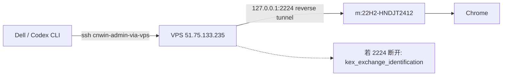
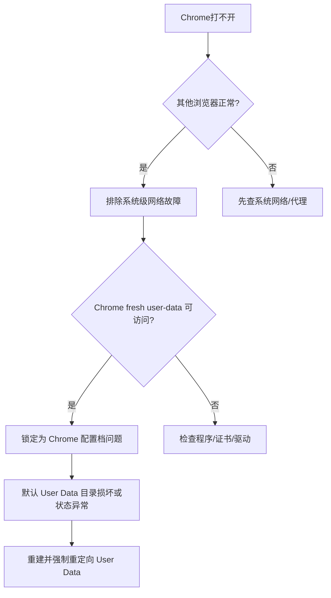
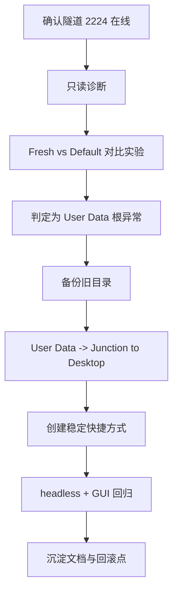

# Win_000｜Chrome 全站打不开故障复盘与标准修复手册

> 角色定位：教师 + 指挥官。  
> 目标：让新开的 Codex 或零基础同学，只看这一篇就能**理解原理、复现实验、按步骤修好**。

---

## 0. 一句话结论（先给答案）

这次问题不是“系统网络坏了”，也不是“Chrome 程序损坏”。  
**根因是 Chrome 默认用户数据目录（`User Data`）异常**，导致 Network Service/GPU 子进程异常退出，页面加载链路断裂。  

最终稳定方案：

1. 把 Chrome 默认 `User Data` 强制改为**目录联接（Junction）**；
2. 联接到桌面的稳定目录：`C:\Users\Administrator\Desktop\Chrome_UserData_Stable`；
3. 创建显式快捷方式，避免再次回到坏目录；
4. headless 验证通过（`EXIT=0`，可正常抓取 Google DOM）。

---

## 1. 上下文与作战地图

### 1.1 环境身份

- 目标机（m）：`22H2-HNDJT2412`
- 远程用户：`22h2-hndjt2412\administrator`
- Chrome 主程序：`C:\Program Files\Google\Chrome\Application\chrome.exe`
- 连接链路：Dell → VPS(443) → 回环 2224 → m

### 1.2 远程链路架构



---

## 2. 错误现象（用户视角 + 机器证据）

### 2.1 用户视角

- Chrome 国内外网站都打不开；
- 其他浏览器正常访问（尤其 Google 正常）；
- Chrome “前端新建 profile”也无效。

### 2.2 机器证据（关键）

- Chrome 进程存在、版本正常：`145.0.7632.117`；
- 无企业策略强控（Chrome policy 注册表为空）；
- 系统代理配置正常（`127.0.0.1:10808`）；
- `hosts` 未见 Google 相关污染（仅 Rhino 条目）；
- **同机同网下：**
  - `--user-data-dir=桌面临时目录` 可以正常抓取网页 DOM；
  - `--user-data-dir=默认 User Data` 出现卡死/无输出；
- 错误日志出现：
  - `Network service crashed or was terminated`
  - `GPU process exited unexpectedly`

---

## 3. 根因推断逻辑（为什么不是网络问题）



核心点：

- 若“fresh profile 成功 + default profile 失败”，说明程序和网络本身可用；
- 差异只剩用户数据状态（缓存、配置、扩展状态、数据库锁、历史异常状态）。

---

## 4. 排错全过程（含失败分支）

### 4.1 首轮诊断

做了这些只读检查：

- 程序路径/版本；
- 运行命令行参数；
- Policy 注册表；
- 代理与 hosts；
- User Data 基本结构。

### 4.2 对比实验（最关键）

- 用桌面临时 profile：成功返回 Google HTML；
- 用默认 profile：挂起/输出空或异常。

这一步决定了后续策略：**不再纠结网络层，直接转配置档修复**。

### 4.3 中间修复尝试

- 备份 Default 并重建；
- 备份整个 User Data 后重建；
- 前端新建 profile。

但你指出了关键事实：

> 前端新建 profile 仍在旧 `User Data` 根目录。

这就是为什么“看似新建”，本质仍可能落在异常根路径上。

---

## 5. 最终落地方案（稳定版）

## 5.1 方案原理

把 Chrome 默认数据根：

- `C:\Users\Administrator\AppData\Local\Google\Chrome\User Data`

改成目录联接（Junction）指向：

- `C:\Users\Administrator\Desktop\Chrome_UserData_Stable`

这样无论前端“新建 profile”还是默认启动，都走桌面稳定目录。

### 5.2 最终目录状态

- `User Data`（Junction）✅
- `User Data_bad_20260303_065300`（备份）
- `User Data_pre_junction_20260303_172310`（备份）
- `User Data_pre_junction_fix_20260303_172459`（备份）

---

## 6. 标准执行手册（小白可直接复制）

> 在 m 机管理员 PowerShell 执行。

### Step A｜停 Chrome

```powershell
Get-Process chrome -ErrorAction SilentlyContinue | Stop-Process -Force -ErrorAction SilentlyContinue
```

### Step B｜准备稳定目录

```powershell
$chromeRoot='C:\Users\Administrator\AppData\Local\Google\Chrome'
$ud=Join-Path $chromeRoot 'User Data'
$stable='C:\Users\Administrator\Desktop\Chrome_UserData_Stable'
$ts=Get-Date -Format 'yyyyMMdd_HHmmss'
$bak=Join-Path $chromeRoot ("User Data_pre_junction_fix_"+$ts)

New-Item -ItemType Directory -Path $stable -Force | Out-Null
```

### Step C｜备份旧 User Data 并创建 Junction

```powershell
if(Test-Path $ud){
  $item=Get-Item $ud -Force
  if($item.Attributes -band [IO.FileAttributes]::ReparsePoint){
    Remove-Item $ud -Force
  } else {
    Move-Item $ud $bak -Force
  }
}

New-Item -ItemType Junction -Path $ud -Target $stable | Out-Null
(Get-Item $ud -Force).Attributes
```

期望输出包含：`ReparsePoint`。

### Step D｜验证联接真的生效

```powershell
$markerStable=Join-Path $stable '.__junction_probe__'
'probe' | Set-Content -Path $markerStable -Encoding ASCII
Test-Path (Join-Path $ud '.__junction_probe__')
```

期望：`True`。

### Step E｜创建稳定启动快捷方式

```powershell
$chrome='C:\Program Files\Google\Chrome\Application\chrome.exe'
$desktop=[Environment]::GetFolderPath('Desktop')
$lnk=Join-Path $desktop 'Chrome (Stable Profile).lnk'
$shell=New-Object -ComObject WScript.Shell
$sc=$shell.CreateShortcut($lnk)
$sc.TargetPath=$chrome
$sc.Arguments='--user-data-dir="C:\Users\Administrator\Desktop\Chrome_UserData_Stable"'
$sc.WorkingDirectory='C:\Program Files\Google\Chrome\Application'
$sc.IconLocation=$chrome+',0'
$sc.Save()
```

### Step F｜回归验证（可选但推荐）

```powershell
$diag='C:\Users\Administrator\Desktop\chrome_diag'
New-Item -ItemType Directory -Path $diag -Force | Out-Null
$o=Join-Path $diag 'final_default_google.out'
$e=Join-Path $diag 'final_default_google.err'

Start-Process -FilePath $chrome -ArgumentList '--headless=new --disable-gpu --dump-dom https://www.google.com' -RedirectStandardOutput $o -RedirectStandardError $e -Wait -PassThru
(Get-Item $o).Length
```

本次实测：`OUTLEN=260052`（成功）。

---

## 7. 操作节奏图（指挥版）



---

## 8. 常见坑与避坑清单

### 坑 1：前端新建 profile 不等于切目录

- 前端“新增个人资料”只是在当前 `User Data` 下加子目录；
- 如果 `User Data` 根本身坏了，新增 profile 也可能继续受污染。

### 坑 2：`mklink` 在远程脚本里易受转义影响

- 本次就遇到过“语法看起来没错但实际未创建”。
- 推荐直接用 PowerShell：`New-Item -ItemType Junction`，更稳定。

### 坑 3：不做备份直接删目录

- 必须保留回滚点（至少一个完整 `User Data_*` 备份目录）。

### 坑 4：隧道掉线误判为修复失败

- 若看到 `kex_exchange_identification: Connection closed by remote host`，先修隧道再谈应用。

---

## 9. 回滚方案（万一要撤）

```powershell
$chromeRoot='C:\Users\Administrator\AppData\Local\Google\Chrome'
$ud=Join-Path $chromeRoot 'User Data'
$rollback='C:\Users\Administrator\AppData\Local\Google\Chrome\User Data_pre_junction_fix_20260303_172459'

Get-Process chrome -ErrorAction SilentlyContinue | Stop-Process -Force -ErrorAction SilentlyContinue
if((Get-Item $ud -Force).Attributes -match 'ReparsePoint'){ Remove-Item $ud -Force }
Move-Item $rollback $ud -Force
```

---

## 10. 给新开 Codex 的接管 Prompt（可直接复制）

```text
请连接 m 主机（alias: cnwin-admin-via-vps），按以下顺序执行：
1) 先验证隧道与主机身份（hostname/whoami）
2) 验证 Chrome 默认 user-data 与 fresh user-data 对比可用性
3) 若判定为 profile 根异常：备份 User Data 后改为 Junction 指向 C:\Users\Administrator\Desktop\Chrome_UserData_Stable
4) 创建桌面快捷方式 Chrome (Stable Profile).lnk（带 --user-data-dir）
5) headless + GUI 双验证
6) 输出：命令、结果、结论、备份路径、回滚命令
要求：任何写操作前必须先备份；不要改动其他业务服务。
```

---

## 11. 最后复盘（给未来的你）

这次最值钱的经验不是“某条命令”，而是排障方法：

- 用“对照实验”快速切分问题层级（系统网络 vs 应用配置）；
- 不在噪声层（代理、浏览器重装）反复打转；
- 先保底备份，再做可回滚重构；
- 最后把修复固化为结构化路径（Junction + 专用快捷方式 + 文档）。

这就是可复用、可交接、可扩展的工程化修复。
