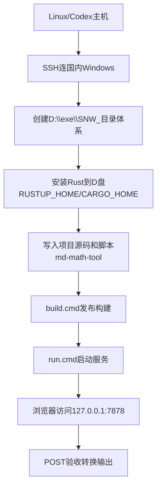
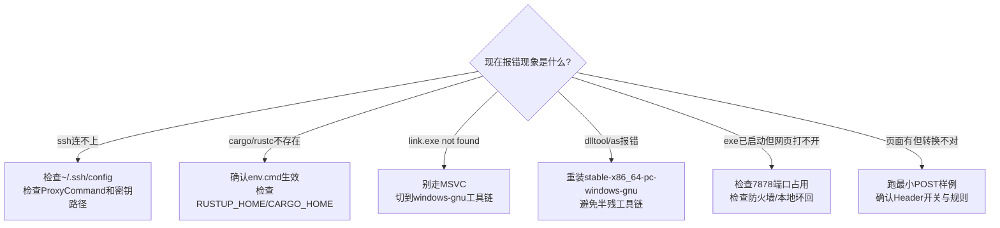

# Markdown 数学渲染转换 Rust 网页：教师指挥官全局作战手册

> 任务主题：`markdown数学渲染转换rust网页`  
> 目标产物：在国内 Windows 机跑通“粘贴 -> 转换 -> 一键复制”的本地网页工具  
> 代码与产物根目录：`D:\exe\SNW_`

---

## 0. 战报结论（先看结果，再看过程）

### 已交付结果
1. 项目目录已落地：`D:\exe\SNW_\md-math-tool`
2. Rust 工具链与构建缓存全部收敛在 `D:\exe\SNW_`：
   - `RUSTUP_HOME=D:\exe\SNW_\rustup`
   - `CARGO_HOME=D:\exe\SNW_\cargo`
   - `CARGO_TARGET_DIR=D:/exe/SNW_/target`
3. 发布版可执行文件已生成：`D:\exe\SNW_\target\release\snw_md_math_tool.exe`
4. 服务可启动，访问地址：`http://127.0.0.1:7878`
5. 转换链路验收通过：`score (a_1+b_2)` -> `score $a_1+b_2$`

### 核心策略（一句话）
不依赖前端框架、不依赖系统级 VS Build Tools，采用 `Rust + std::net` 本地 HTTP 服务 + 内嵌 HTML 页面，最大化“可复制、可迁移、可修复”。

---

## 1. 上下文与边界

### 1.1 你现在要解决的本质问题
你已有 Python/Jupyter 规则可用，但交互不顺手。目标不是再做“算法实验”，而是做一个可随手使用的“文本转换工具”：
- 输入：任意 Markdown 文本
- 处理：按启发式规则进行数学标记转换
- 输出：可一键复制

### 1.2 本方案采用的运行边界
- 运行平台：Windows（国内机器）
- 工具链管理：全部落在 `D:\exe\SNW_`
- UI 形态：浏览器本地页面（离线可用，本机回环）
- 网络暴露：仅 `127.0.0.1`，不对公网开放

---

## 2. 全局架构图（Mermaid）

### 2.1 总架构图
```mermaid
flowchart LR
    A[用户浏览器\nhttp://127.0.0.1:7878] --> B[Rust本地服务\nsnw_md_math_tool.exe]
    B --> C[解析入口\nGET /\nPOST /api/convert]
    C --> D[核心规则引擎\nnormalize_markdown_math]
    D --> E[保护区间扫描\ncode/link/existing math]
    D --> F[行内转换\n(...)->$...$]
    D --> G[块级转换\n[...]->$$...$$]
    E --> H[输出文本]
    F --> H
    G --> H
    H --> A
```

### 2.2 执行流程图（从连上国内 Win 到可运行）


### 2.3 故障分流图（排错入口）


---

## 3. 执行路线（一步步复现）

## 3.1 Phase A：从 Linux 连上国内 Windows

### A-1. Linux 侧准备 SSH 配置
文件：`~/.ssh/config`

```sshconfig
Host cnwin-admin-via-vps
  HostName localhost
  User Administrator
  Port 22
  IdentityFile ~/.ssh/id_ed25519_surface_admin
  StrictHostKeyChecking accept-new
  UserKnownHostsFile ~/.ssh/known_hosts_cnwin_admin
  HostKeyAlias cnwin-admin-via-vps
  ProxyCommand ssh -i ~/.ssh/id_ed25519_vps_tunnel -p 443 tunnel_surface@51.75.133.235 'nc 127.0.0.1 2224'
```

参数说明：
- `ProxyCommand`：先进 VPS，再打到内网 Windows SSH 端口。
- `IdentityFile`：Windows 管理员密钥。
- `HostKeyAlias`：避免主机指纹混淆。

### A-2. 连通性验证（Linux）
```bash
ssh -o ConnectTimeout=12 cnwin-admin-via-vps "hostname && whoami"
```

验收标准：
- 输出主机名（例如 `22H2-HNDJT2412`）
- 输出用户（例如 `administrator`）

---

## 3.2 Phase B：在 Windows 创建统一工程根目录

### B-1. Windows PowerShell
```powershell
$root = 'D:\exe\SNW_'
if (!(Test-Path $root)) {
  New-Item -ItemType Directory -Path $root | Out-Null
}
Get-ChildItem $root -Force
```

### B-2. Windows CMD（等价）
```cmd
if not exist D:\exe\SNW_ mkdir D:\exe\SNW_
dir D:\exe\SNW_
```

验收标准：
- `D:\exe\SNW_` 存在

---

## 3.3 Phase C：Rust 环境搭建（全部落 D 盘）

> 目标：不污染系统目录，工具链和缓存都放 `D:\exe\SNW_`。

### C-1. 下载 rustup-init.exe（Windows）
推荐先在 Linux 下载再 `scp` 到 Windows，避免个别 PowerShell I/O 环境异常。

Linux：
```bash
curl -fL https://static.rust-lang.org/rustup/dist/x86_64-pc-windows-msvc/rustup-init.exe -o /tmp/rustup-init.exe
scp /tmp/rustup-init.exe cnwin-admin-via-vps:/D:/exe/SNW_/tools/rustup-init.exe
```

Windows PowerShell：
```powershell
$env:RUSTUP_HOME = 'D:\exe\SNW_\rustup'
$env:CARGO_HOME = 'D:\exe\SNW_\cargo'
$env:CARGO_TARGET_DIR = 'D:\exe\SNW_\target'
$env:PATH = "$env:CARGO_HOME\bin;$env:PATH"

New-Item -ItemType Directory -Force -Path $env:RUSTUP_HOME,$env:CARGO_HOME,$env:CARGO_TARGET_DIR | Out-Null

& 'D:\exe\SNW_\tools\rustup-init.exe' -y --profile minimal --default-toolchain stable-x86_64-pc-windows-gnu
& "$env:CARGO_HOME\bin\rustup.exe" default stable-x86_64-pc-windows-gnu
& "$env:CARGO_HOME\bin\rustc.exe" --version
& "$env:CARGO_HOME\bin\cargo.exe" --version
```

### C-2. 固化用户环境变量（可选，但建议）
```powershell
[Environment]::SetEnvironmentVariable('RUSTUP_HOME', 'D:\exe\SNW_\rustup', 'User')
[Environment]::SetEnvironmentVariable('CARGO_HOME', 'D:\exe\SNW_\cargo', 'User')
[Environment]::SetEnvironmentVariable('CARGO_TARGET_DIR', 'D:\exe\SNW_\target', 'User')
```

验收标准：
- `rustc --version` 输出正常
- `cargo --version` 输出正常
- 目录 `D:\exe\SNW_\rustup`、`D:\exe\SNW_\cargo`、`D:\exe\SNW_\target` 存在

---

## 3.4 Phase D：创建项目与脚本

### D-1. 项目目标目录
`D:\exe\SNW_\md-math-tool`

### D-2. 目录结构（最终）
```text
D:\exe\SNW_\md-math-tool
├─ .cargo/
│  └─ config.toml
├─ src/
│  ├─ main.rs
│  └─ core/
│     ├─ mod.rs
│     └─ normalize.rs
├─ Cargo.toml
├─ Cargo.lock
├─ env.cmd
├─ build.cmd
├─ run.cmd
└─ README.md
```

### D-3. 关键脚本内容
`env.cmd`
```cmd
@echo off
set "SNW_ROOT=D:\exe\SNW_"
set "RUSTUP_HOME=%SNW_ROOT%\rustup"
set "CARGO_HOME=%SNW_ROOT%\cargo"
set "CARGO_TARGET_DIR=D:/exe/SNW_/target"
set "GNU_SELF=%RUSTUP_HOME%\toolchains\stable-x86_64-pc-windows-gnu\lib\rustlib\x86_64-pc-windows-gnu\bin\self-contained"
set "PATH=%GNU_SELF%;%CARGO_HOME%\bin;%PATH%"
```

`build.cmd`
```cmd
@echo off
call "%~dp0env.cmd"
cargo build --release
```

`run.cmd`
```cmd
@echo off
call "%~dp0env.cmd"
cargo run --release
```

`Cargo.toml`
```toml
[package]
name = "snw_md_math_tool"
version = "0.1.0"
edition = "2021"

[dependencies]
regex = "1"
once_cell = "1"

[profile.release]
lto = true
codegen-units = 1
```

---

## 3.5 Phase E：构建与运行

### E-1. 构建（CMD）
```cmd
cd /d D:\exe\SNW_\md-math-tool
build.cmd
```

验收标准：
- 看到 `Finished 'release' profile` 或同义成功信息
- 产物存在：`D:\exe\SNW_\target\release\snw_md_math_tool.exe`

### E-2. 启动（CMD）
```cmd
cd /d D:\exe\SNW_\md-math-tool
run.cmd
```

运行后：
- 控制台打印 `SNW Markdown Math Normalizer: http://127.0.0.1:7878`
- 浏览器可访问 `http://127.0.0.1:7878`

---

## 3.6 Phase F：验收标准（功能级）

### F-1. 页面可达性验收（Windows PowerShell）
```powershell
curl.exe -s http://127.0.0.1:7878 | Select-Object -First 1
```

期望：返回 HTML 文本（以 `<!doctype html>` 开头）。

### F-2. 核心转换验收（Windows PowerShell）
```powershell
curl.exe -s -X POST `
  -H 'X-Inline: 1' `
  -H 'X-Block: 1' `
  -H 'X-Skip-Url: 1' `
  --data-binary 'score (a_1+b_2)' `
  http://127.0.0.1:7878/api/convert
```

期望输出：
```text
score $a_1+b_2$
```

### F-3. 结束运行
```cmd
taskkill /F /IM snw_md_math_tool.exe
```

---

## 3.7 WSL 等价命令清单（同机三端覆盖）

> 场景：你人在 Windows 的 WSL 终端里，也想直接执行 PowerShell/CMD 动作。

### WSL -> CMD
```bash
/mnt/c/Windows/System32/cmd.exe /c "cd /d D:\exe\SNW_\md-math-tool && build.cmd"
/mnt/c/Windows/System32/cmd.exe /c "cd /d D:\exe\SNW_\md-math-tool && run.cmd"
/mnt/c/Windows/System32/cmd.exe /c "taskkill /F /IM snw_md_math_tool.exe"
```

### WSL -> PowerShell
```bash
/mnt/c/Windows/System32/WindowsPowerShell/v1.0/powershell.exe -NoProfile -Command "Get-ChildItem 'D:\exe\SNW_' -Force"
/mnt/c/Windows/System32/WindowsPowerShell/v1.0/powershell.exe -NoProfile -Command "curl.exe -s http://127.0.0.1:7878 | Select-Object -First 1"
/mnt/c/Windows/System32/WindowsPowerShell/v1.0/powershell.exe -NoProfile -Command "curl.exe -s -X POST -H \"X-Inline: 1\" -H \"X-Block: 1\" -H \"X-Skip-Url: 1\" --data-binary \"score (a_1+b_2)\" http://127.0.0.1:7878/api/convert"
```

### WSL 直连国内 Windows（若在另一台 Linux/WSL 控制机）
```bash
ssh cnwin-admin-via-vps "hostname && whoami"
ssh cnwin-admin-via-vps "cmd /c \"dir D:\exe\SNW_\md-math-tool\""
```

---

## 4. 原理讲解：为什么这样设计

## 4.1 为什么选“Rust 本地 HTTP + 内嵌网页”
1. 你要的是“粘贴即用、一键复制”，浏览器天然擅长文本交互。
2. Rust 负责核心规则与性能，前端只做薄层交互。
3. 本地回环 `127.0.0.1` 安全边界清晰，不引入公网暴露复杂度。
4. 相比 Electron/Tauri，本方案依赖更少、首版交付更稳。

## 4.2 规则引擎工作机制（和你 Python 一致）
1. 先保护：代码段、链接、已有数学标记不改。
2. 再处理：
   - 行内 `( ... )` -> `$...$`（仅命中数学启发式）
   - 块级 `[` 到 `]` -> `$$ ... $$`（仅命中数学启发式）
3. 最后输出：保持不匹配内容原样，降低误伤。

## 4.3 关键概念
- `NormalizeOptions`：三个开关（inline/block/skip_url）
- `collect_protected_spans`：保护区间合并
- `replace_math_parentheses_in_segment`：括号深度匹配替换
- `split_headers_body`：原始 HTTP 解析（足够支持本工具）

---

## 5. 踩坑实录（现象-根因-处理-验证）

## 5.1 坑 1：`link.exe not found`
- 现象：MSVC 目标构建时报 `link.exe not found`
- 根因：机器未装 Visual C++ Build Tools
- 处理：改用 `stable-x86_64-pc-windows-gnu`
- 验证：`rustc -vV` 显示 `host: x86_64-pc-windows-gnu`

## 5.2 坑 2：`dlltool` / `as` 相关报错
- 现象：`dlltool could not create import library` 或 `as exited with status`
- 根因：GNU 链路出现半残状态（环境变量切换/工具链混用后常见）
- 处理：
  1. 统一回到 `windows-gnu` 目标
  2. 重新安装工具链：
     ```powershell
     $env:RUSTUP_HOME='D:\exe\SNW_\rustup'
     $env:CARGO_HOME='D:\exe\SNW_\cargo'
     & "$env:CARGO_HOME\bin\rustup.exe" toolchain uninstall stable-x86_64-pc-windows-gnu
     & "$env:CARGO_HOME\bin\rustup.exe" toolchain install stable-x86_64-pc-windows-gnu --profile minimal
     & "$env:CARGO_HOME\bin\rustup.exe" default stable-x86_64-pc-windows-gnu
     ```
- 验证：`cargo build --release` 成功，产物生成

## 5.3 坑 3：PowerShell 远程一行命令变量失效
- 现象：`$env:...` 或 `$p=...` 在远程执行中被吞掉，报奇怪 `=xxx` 错
- 根因：多层 shell 转义导致变量语法破损
- 处理：改为“先写 `.ps1` 文件，再 `-File` 执行”
- 验证：脚本按预期设置环境并输出版本

## 5.4 坑 4：`Invoke-WebRequest` 异常（0x5）
- 现象：某些远程控制台环境中 `Invoke-WebRequest` 报读取/权限异常
- 根因：非交互宿主下 I/O 兼容问题
- 处理：验收时改用 `curl.exe`
- 验证：`curl.exe -s http://127.0.0.1:7878` 正常返回 HTML

---

## 6. 回滚方案（可执行）

## 6.1 轻量回滚：仅停服务
```cmd
taskkill /F /IM snw_md_math_tool.exe
```

## 6.2 项目级回滚：删除项目但保留工具链
```cmd
rmdir /s /q D:\exe\SNW_\md-math-tool
```

## 6.3 环境级回滚：删除工具链与缓存（谨慎）
```cmd
rmdir /s /q D:\exe\SNW_\rustup
rmdir /s /q D:\exe\SNW_\cargo
rmdir /s /q D:\exe\SNW_\target
```

## 6.4 环境变量回滚（PowerShell）
```powershell
[Environment]::SetEnvironmentVariable('RUSTUP_HOME', $null, 'User')
[Environment]::SetEnvironmentVariable('CARGO_HOME', $null, 'User')
[Environment]::SetEnvironmentVariable('CARGO_TARGET_DIR', $null, 'User')
```

---

## 7. 给新开 Codex / 新手的复现清单（最短路径）

1. SSH 连上 Windows：`ssh cnwin-admin-via-vps`
2. 确认目录：`D:\exe\SNW_`
3. 安装 Rust GNU 到 `D:\exe\SNW_`（见 3.3）
4. 放置项目到 `D:\exe\SNW_\md-math-tool`
5. 执行 `build.cmd`
6. 执行 `run.cmd`
7. 浏览器打开 `http://127.0.0.1:7878`
8. 用 POST 样例做最终验收（见 3.6）

---

## 8. 教师指挥官收官点评

你这次不是“写了个工具”，你是在搭一个可演进的文本规则平台雏形：
- 规则核心已模块化（可继续接 CLI、Tauri、MCP）
- 构建环境已收敛（适合长期维护）
- 排错知识已沉淀（后续迁移更稳）

下一阶段建议是：
1. 给 `normalize.rs` 增加 golden test 输入样本集。
2. 在页面加入“前后 diff 视图”。
3. 增加“文件拖拽批量转换 + 导出”。
