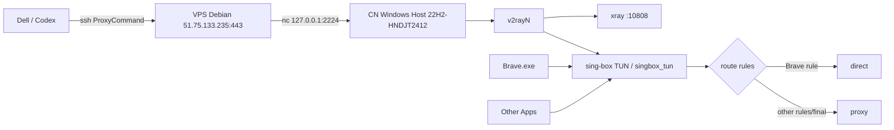
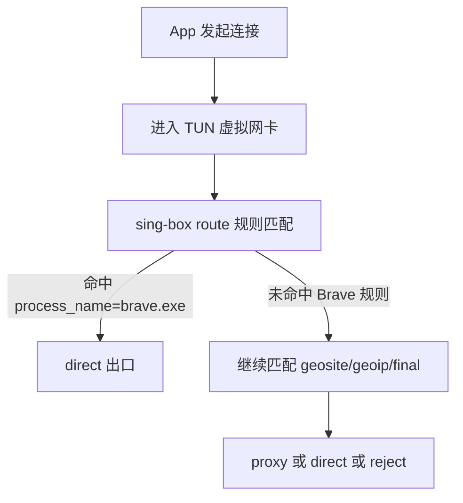
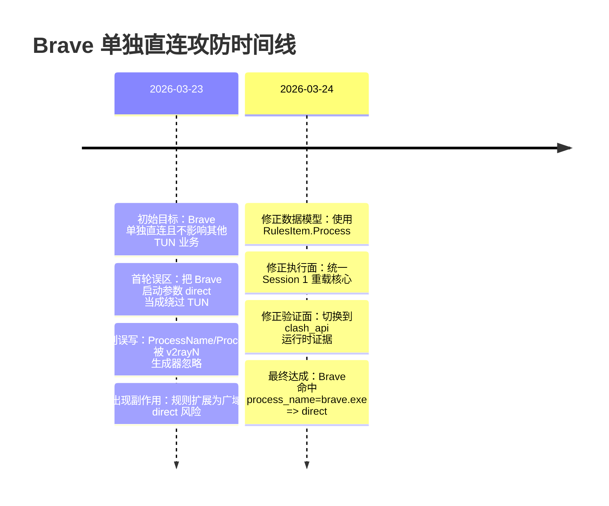
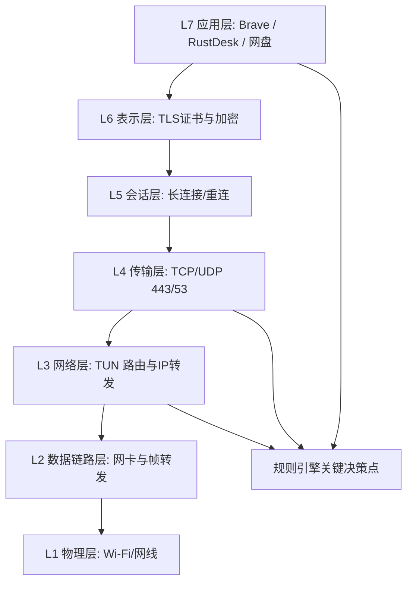
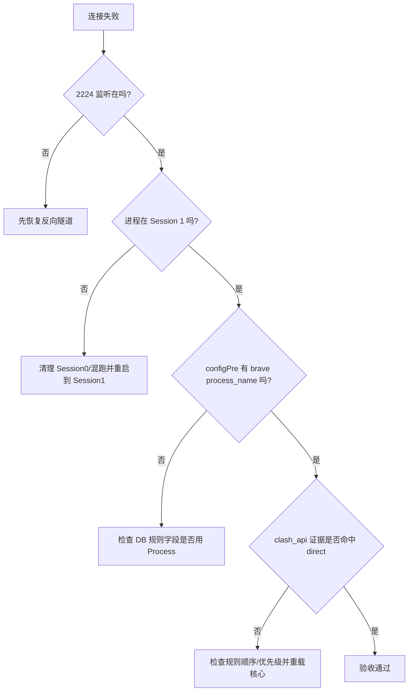

# Brave 单独直连作战手册（不影响 v2rayN/TUN 其他业务）

> 教师与指挥官版。目标是：**让 Brave 单独走 direct，其他应用继续走原来的 v2rayN + TUN 体系**。
> 
> 适用场景：Windows + v2rayN + sing-box TUN，远程运维通过 Dell → VPS → 反向隧道进目标机。

---

## 0. 战报结论（先看这个）

### 最终是否达成
**达成。**

### 达成标准（全部满足）
1. `v2rayN/xray/sing-box` 均运行在 **Session 1（交互桌面会话）**。
2. 默认路由仍由 `singbox_tun` 接管（说明 TUN 主体系还在）。
3. 激活路由中存在 `Codex-Brave-Direct` 且字段是 `Process: ["brave.exe"]`（不是 `ProcessName`）。
4. 生成的 `binConfigs/configPre.json` 中出现：
   - `process_name: ["brave.exe"]`
   - 对应 `outbound: "direct"`。
5. `clash_api` 连接证据显示：Brave 访问 Google 时命中规则
   - `process_name=brave.exe => route(direct)`。
6. 同时其他进程仍可出现 `chains=proxy`（说明其他业务未被“拖下水”变全直连）。

### 一句话复盘
这次真正成功的关键，不是“给 Brave 加启动参数”，而是**把 v2rayN 路由规则写成它真正识别的数据结构，再让核心在正确会话重载生效**。

---

## 1. 全局作战地图

### 1.1 运维链路拓扑



### 1.2 数据面逻辑（你真正要掌握的）



---

## 2. 任务定义与硬约束

### 2.1 任务主题
不影响现有 v2rayN / TUN 业务的情况下，单独把 Brave 调成直连。

### 2.2 不可破坏项
1. 不允许把全局 TUN 关闭。
2. 不允许把全局代理改成直连。
3. 不允许影响 RustDesk、网盘、其他业务进程的既有行为。
4. 只动 Brave 目标策略。

---

## 3. 从“原始状态”到“成功状态”的完整路线

### 3.0 时间线总览（含 `019d1a80-927d-7083-82ac-72a520509563`）



## 3.1 Phase A：基线确认（未改 Brave 前）

### 必查项
1. 远端连通：`2224` 在 VPS 上监听。
2. 主机正确：`22H2-HNDJT2412`。
3. 当前活跃路由模板。
4. 当前默认路由是否走 `singbox_tun`。

### 命令（Dell 上执行）

```bash
/home/snw/.codex-ru/skills/cnwin-wsl-ops/scripts/check_cnwin_wsl.sh
```

```bash
ssh -i ~/.ssh/id_ed25519_vps_tunnel -p 443 tunnel_surface@51.75.133.235 \
  "ss -ltn | grep 127.0.0.1:2224 || true"
```

```bash
ssh cnwin-admin-via-vps "powershell -NoProfile -Command \
\"Get-NetRoute -AddressFamily IPv4 -DestinationPrefix 0.0.0.0/0 | \
Sort-Object RouteMetric,InterfaceMetric | \
Select-Object ifIndex,InterfaceAlias,NextHop,RouteMetric,InterfaceMetric | Format-Table -AutoSize\""
```

---

## 3.2 Phase B：会话 `019d1a80-927d-7083-82ac-72a520509563` 的关键坑（必须吸收）

> 这段是成败分水岭。你以后新开 Codex，先读这一节再动手。

### 坑 1：误以为 `--proxy-server=direct://` 就是“绕过 TUN”
- 现象：Brave 加了 `direct` 参数仍能访问 Google。
- 误判：以为 Brave 直连成功。
- 真相：如果系统默认路由仍是 `singbox_tun`，Brave 仍会被 TUN 接管。
- 证据：Brave 连接 `LocalAddress` 出现在 `172.18.0.1`（TUN 网段）。

### 坑 2：写错规则字段（`ProcessName`/`ProcessPath`）
- 现象：看似写了 Brave 专属规则，但生成后的 `configPre.json` 变成：
  - `network=[tcp udp]`
  - `port_range=1:65535`
  - **没有** `process_name`
- 后果：变成“广域规则”，可能把大量流量拉成 direct。
- 根因：v2rayN 的 `RulesItem` 识别字段是 `Process`，不是 `ProcessName`。

### 坑 3：Session 0 / Session 1 混跑
- 现象：进程在跑，但路由不按预期，或 TUN 默认路由消失。
- 根因：核心进程跑在服务会话（Session 0）而非交互会话（Session 1）。
- 修复：统一清理后只在 Session 1 重启 `v2rayN/xray/sing-box`。

### 坑 4：WSL + PowerShell 引号与 `$` 展开
- 现象：PowerShell 里的 `$var` 被 bash 提前吃掉，脚本变形。
- 修复：
  1. 通过 here-doc 或 `.ps1` 文件执行。
  2. 避免复杂一行命令里混多层引号。

### 坑 5：隧道易掉，验证中断
- 现象：`kex_exchange_identification: Connection closed by remote host`。
- 根因：2224 监听掉线。
- 修复：先恢复隧道再继续，不要在“半连接状态”做配置结论。

---

## 3.3 Phase C：正确实施（可复现）

## Step 1：备份（先备份再动刀）

```bash
ssh cnwin-admin-via-vps '"C:\Program Files\WSL\wsl.exe" -e bash -s' <<'BASH'
set -euo pipefail
python3 - <<'PY'
import shutil, time
base='/mnt/d/exe/Snw_vwRayN/v2rayN-windows-64'
db=base+'/guiConfigs/guiNDB.db'
cp=base+'/binConfigs/configPre.json'
ts=time.strftime('%Y%m%d_%H%M%S')
shutil.copy2(db, db+f'.bak_{ts}')
shutil.copy2(cp, cp+f'.bak_{ts}')
print('backup done:', ts)
PY
BASH
```

## Step 2：向激活路由插入 Brave 专属规则（注意字段名）

> 核心点：用 `Process: ["brave.exe"]`。

```bash
ssh cnwin-admin-via-vps '"C:\Program Files\WSL\wsl.exe" -e bash -s' <<'BASH'
set -euo pipefail
python3 - <<'PY'
import sqlite3, json, time
p='/mnt/d/exe/Snw_vwRayN/v2rayN-windows-64/guiConfigs/guiNDB.db'
con=sqlite3.connect(p)
cur=con.cursor()
rid,rem,rs=cur.execute("select Id,Remarks,RuleSet from RoutingItem where IsActive=1 limit 1").fetchone()
rules=json.loads(rs) if rs else []

# 清理旧的 Codex-Brave-Direct，避免重复
clean=[]
for r in rules:
    txt=json.dumps(r,ensure_ascii=False).lower()
    if 'codex-brave-direct' in txt:
        continue
    clean.append(r)

rule={
  'Id': str(int(time.time()*1000000)),
  'OutboundTag': 'direct',
  'Process': ['brave.exe'],
  'Enabled': True,
  'Remarks': 'Codex-Brave-Direct',
  'Port': '1-65535',
  'Network': 'tcp,udp'
}

# 放在 geosite:google 代理规则之前
idx=None
for i,r in enumerate(clean):
    if r.get('OutboundTag')=='proxy' and isinstance(r.get('Domain'),list) and any(str(d).lower()=='geosite:google' for d in r.get('Domain',[])):
        idx=i; break
if idx is None:
    clean.append(rule)
else:
    clean.insert(idx, rule)

cur.execute("update RoutingItem set RuleSet=?, RuleNum=? where Id=?", (json.dumps(clean,ensure_ascii=False), len(clean), rid))
con.commit(); con.close()
print('patched active route:', rid, rem)
PY
BASH
```

## Step 3：在交互会话统一重启核心（Session 1）

```powershell
# 在目标 Windows PowerShell 执行（管理员）
Get-Process sing-box,xray,v2rayN -ErrorAction SilentlyContinue |
  Where-Object { $_.SessionId -eq 1 } |
  Stop-Process -Force -ErrorAction SilentlyContinue

Start-Sleep -Seconds 2
Start-Process "D:\exe\Snw_vwRayN\v2rayN-windows-64\v2rayN.exe"
Start-Sleep -Seconds 8

Get-Process sing-box,xray,v2rayN -ErrorAction SilentlyContinue |
  Select-Object Id,ProcessName,SessionId,StartTime | Format-Table -AutoSize
```

## Step 4：确认生成配置确实包含 `process_name=brave.exe`

```powershell
Select-String -Path "D:\exe\Snw_vwRayN\v2rayN-windows-64\binConfigs\configPre.json" \
  -Pattern 'process_name','brave.exe' |
  Select-Object LineNumber,Line | Format-Table -AutoSize
```

## Step 5：确认 TUN 主体系没被破坏

```powershell
Get-NetRoute -AddressFamily IPv4 -DestinationPrefix 0.0.0.0/0 |
  Sort-Object RouteMetric,InterfaceMetric |
  Select-Object ifIndex,InterfaceAlias,NextHop,RouteMetric,InterfaceMetric |
  Format-Table -AutoSize
```

你应看到 `singbox_tun` 在默认路由里存在。

---

## 3.4 Phase D：验收（证据化，不靠感觉）

## 验收脚本（查看 sing-box clash_api）

```powershell
$api='http://127.0.0.1:10814/connections'
$r = Invoke-RestMethod -Uri $api -Method GET -TimeoutSec 8

# 观察 Brave 连接
$r.connections |
  Where-Object { $_.metadata.processPath -match 'Brave-Browser\\Application\\brave.exe' } |
  Select-Object -First 20 chains,rule,metadata |
  Format-List
```

### 成功判据
1. `chains` 包含 `direct`。
2. `rule` 显示包含 `process_name=brave.exe => route(direct)`。

### 同时检查“其他应用不受影响”
- 观察其他进程连接（如 RustDesk/网盘）是否仍有 `chains=proxy` 或按原规则行为。
- 不要求“所有其他流量都一定 proxy”，因为原路由里本来就有 `geoip:cn/geosite:cn => direct`。
- 你要看的是：**没有被 Brave 规则误伤成“全局都按 Brave 规则走”**。

---

## 4. 为什么这次能成（原理讲透）

## 4.1 v2rayN 路由模型与字段映射

你在 DB 写的是 `RoutingItem.RuleSet`（JSON）。v2rayN 会读取 `RulesItem` 再生成 sing-box 规则。

关键是 `RulesItem` 的字段：
- `Process`（正确）
- 没有 `ProcessName` 这个字段。

错误写法（`ProcessName`）会被忽略，导致只剩下 `port/network` 这类条件，被扩展成广域规则。

## 4.2 为什么 Brave 启动参数不够

`--proxy-server=direct://` 只影响浏览器“应用层代理选择”。

但 TUN 在系统网络层（L3/L4）拦截：
- 应用仍把流量交给系统网络栈。
- 系统默认路由若指向 `singbox_tun`，就先被 TUN接管。
- 所以单靠浏览器参数，不能保证“绕过 TUN”。

## 4.3 OSI 视角（把抽象落地）

| OSI 层 | 本任务中的关键对象 | 你该关注什么 |
|---|---|---|
| L7 应用层 | Brave、RustDesk、网盘、HTTP(S) 请求 | 进程名、域名、URL |
| L6 表示层 | TLS/HTTPS 加密 | SNI/证书握手，内容不可见但目标可判 |
| L5 会话层 | 连接保持/重连 | 长连接与短连接行为 |
| L4 传输层 | TCP/UDP、端口 | 443/53、`port_range` 规则 |
| L3 网络层 | TUN 虚拟网卡、路由表 | 默认路由是否走 `singbox_tun` |
| L2 数据链路层 | 网卡驱动 | 一般无需改 |
| L1 物理层 | 网线/Wi-Fi | 一般无需改 |

---

## 5. 扩展理解：浏览器、v2ray、VPS、Debian、TLS、Nginx

## 5.1 浏览器层
- Brave 发 HTTPS 请求时，目标可能是 `www.google.com`、`brave-core-ext.s3.brave.com` 等。
- 你在 `clash_api` 里看到的 `metadata.host` 和 `processPath` 就是应用层证据。

## 5.2 v2rayN / xray / sing-box 分工
- `v2rayN`：配置编排器（GUI + 生成配置）。
- `xray`：通常承担代理出口（本例监听 `127.0.0.1:10808`）。
- `sing-box`：TUN 接管 + 规则匹配（本例 `127.0.0.1:10814` 提供 `clash_api`）。

## 5.3 VPS Debian 与反向隧道
- 运维链路里，你是通过 VPS 的 `127.0.0.1:2224` 转发到目标 Windows `22`。
- 一旦这个监听掉线，就会出现 `kex_exchange_identification`。

## 5.4 HTTPS / TLS / Nginx 的位置
- HTTPS/TLS 是业务流量加密层，决定你看不到应用数据正文。
- 代理/路由系统依据进程、域名、IP、端口等元数据决策。
- 如果 VPS 上用 Nginx stream 代理 443，也是在传输通道层转发，不改变你本地 TUN 规则逻辑。

## 5.5 路由器/NAT 在这个问题里的真实作用

你家里或办公室路由器做的是：
1. 内网私网地址（比如 `192.168.x.x`）到公网地址的 NAT 转换。
2. 出口带宽与连接状态维护。
3.（可选）DNS 转发/劫持、QoS、分流。

但这次问题的主战场不在“路由器把哪个包放行”，而在：
- 目标 Windows 主机本地的 TUN 接管与规则匹配。
- v2rayN 生成规则是否正确绑定到 `brave.exe` 进程。

换句话说：路由器决定“你能不能出去”，而 v2rayN/sing-box 决定“谁从哪个门出去”。

## 5.6 域名、DNS、SNI、证书链在本问题中的位置

### 域名路径
1. Brave 要访问 `www.google.com`。
2. DNS 解析得到 IP（如 `142.251.x.x`）。
3. TLS ClientHello 带 SNI（仍是 `www.google.com`）。
4. 服务器返回证书链，浏览器验签通过后建立 HTTPS。

### 你能观察到什么
- 你看不到 HTTPS 明文内容。
- 你可以看到目标域名/目标 IP/端口/进程路径（规则决策足够用了）。

### 为什么要强调 geosite/geoip
- `geosite:google`、`geoip:cn` 这类规则通常是域名/IP 维度。
- 进程规则（`process_name=brave.exe`）优先后，可覆盖同一连接的出口选择。

## 5.7 Debian VPS 的职责边界（避免“背锅”）

本链路里 Debian VPS 的职责主要是运维入口与转发中继：
- 你通过 `ssh -p 443 tunnel_surface@VPS` 进入 VPS。
- 再 `nc 127.0.0.1 2224` 跳到目标 Windows SSH。

VPS 是否装了 Docker/Nginx/其他服务，不会自动决定 Brave 是 direct 还是 proxy。
它只影响“你能否远程管到那台机器”，不直接替代本机路由决策。

## 5.8 Nginx 的两种常见模式（和本案关系）

1. `http` 反代：
- 看 Host、URL 路径，适合 Web 站点层转发。

2. `stream` 四层转发：
- 只看 TCP/UDP，常用于 TLS 透传、SSH over 443 等。

本案即便 VPS 前面有 Nginx stream，也只是“把连接转到哪里”；并不参与 Windows 本机 `process_name` 规则判断。

## 5.9 TLS 与代理策略的关系（常见误解澄清）

误解：HTTPS 加密了，所以代理规则无法区分应用。

澄清：
- 进程维度规则看的是本机进程元数据（`processPath/process_name`），与明文内容无关。
- 域名维度规则可基于 DNS/SNI/规则库匹配，也不需要解密正文。

所以“Brave 单独直连”与“HTTPS 是否可解密”是两个正交问题。

## 5.10 OSI 七层映射图（工程视角）



---

## 6. 典型故障到处置（现场手册）



### 常见错误对照
1. `kex_exchange_identification: Connection closed by remote host`
- 含义：不是配置逻辑错误，通常是隧道断。

2. `LastTaskResult: 2147942667`
- 常见原因：计划任务参数引号错误。

3. “看起来成功但其实没生效”
- 常见原因：改了 DB 但核心没在正确会话重载。

---

## 7. 一键回滚策略（保命）

## 7.1 回滚 DB
把 `guiConfigs/guiNDB.db` 替换成改动前备份（例如 `.bak_时间戳`）。

## 7.2 回滚 configPre
把 `binConfigs/configPre.json` 替换成备份。

## 7.3 重启核心
只在 Session 1 重启 v2rayN 栈，确认默认路由恢复到你的目标状态。

---

## 8. 这次实战的关键认知（教师总结）

1. **“应用代理”与“系统 TUN 路由”是两回事。**
2. **配置是否生效，必须看运行时证据（clash_api/连接链路），不能靠主观体感。**
3. **规则字段必须符合上游程序的数据模型。**
4. **会话上下文（Session 0/1）本身就是网络问题的一部分。**
5. **先备份、后修改、再验证、最后收尾，才是可复现工程流程。**

---

## 9. 本次成功版最小检查清单（给新开 Codex）

```text
[ ] 2224 在 VPS 上监听
[ ] check_cnwin_wsl.sh 通过，主机名正确
[ ] Session 1 有 v2rayN/xray/sing-box
[ ] 默认路由含 singbox_tun
[ ] DB 激活路由含 Codex-Brave-Direct 且 Process=[brave.exe]
[ ] configPre.json 含 process_name=brave.exe direct 规则
[ ] clash_api 证据：Brave -> direct
[ ] clash_api 证据：其他进程仍存在 proxy/final/原路由行为
```

---

## 10. 附：本次关键证据摘要（可追溯）

- 激活路由：`V4-绕过大陆(Whitelist)`。
- 成功写入规则：
  - `Remarks=Codex-Brave-Direct`
  - `Process=["brave.exe"]`
  - `OutboundTag=direct`
- 生成配置命中：`process_name: ["brave.exe"]`。
- 运行证据样例：
  - `proc=...\brave.exe host=www.google.com chains=direct`
  - `rule=network=[tcp udp] port_range=1:65535 process_name=brave.exe => route(direct)`

---

如果你下一步要把“某个应用单独直连”推广成模板（例如 `chrome.exe`、`WeChat.exe`、`Code.exe`），唯一需要替换的是 `Process` 列表与规则顺序，其余方法论完全相同。
