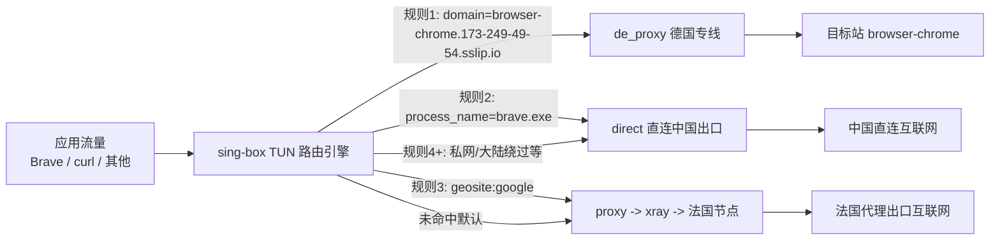
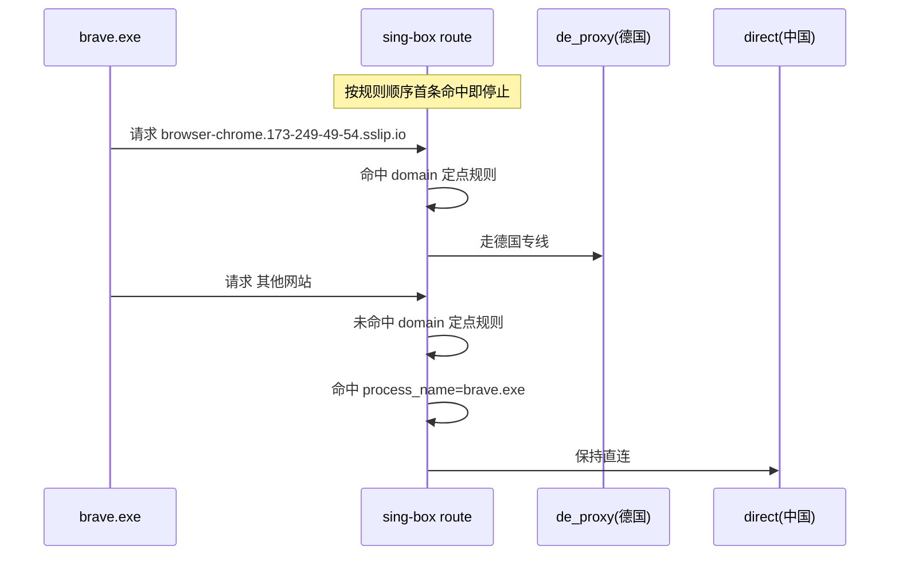

# Win v2ray 德国专线定点分流实战手册（教师指挥官版）

> 主题：`v2ray德国专线配置`
>
> 任务目标：把 `https://browser-chrome.173-249-49-54.sslip.io/` **固定走德国专线**，并保证其它流量行为不变。

---

## 0. 战报结论（先看这个）

### 0.1 任务已达成

当前配置已经实现：

1. 只有 `browser-chrome.173-249-49-54.sslip.io` 这个域名走德国专线。
2. 你原来的 `brave.exe -> 直连` 规则仍生效。
3. 普通代理流量仍走法国节点。
4. 绕过大陆、TUN 模式等原有结构不受破坏。

### 0.2 现网状态快照

- `brave.exe` 出口仍是青岛（直连）。
- 普通 `curl.exe` 出口仍是法国（代理）。
- `sing-box` 已建立到德国节点端口 `32699` 的连接。
- `configPre.json` 中已存在规则：
  - `outbound: de_proxy`
  - `domain: browser-chrome.173-249-49-54.sslip.io`
  - 该规则位于 `brave.exe` 直连规则之前（这是关键）。

---

## 1. 任务背景与起点

你最初的状态是：

1. 已有法国节点（活动）。
2. 已开 `TUN`，并有“绕过大陆”规则。
3. 已导入德国专线节点，但不是活动节点。
4. 已单独给 `brave.exe` 做过“本机直连”规则。

你的目标不是切换全局节点，而是做“**外科手术式分流**”：

- 只改一个域名的去向。
- 其它所有流量保持原策略。

这就是“定点分流”任务。

---

## 2. 目录与绝对路径（作战地图）

你的 v2rayN 主目录：

- `D:\exe\Snw_vwRayN\v2rayN-windows-64`

在 WSL 中对应路径：

- `/mnt/d/exe/Snw_vwRayN/v2rayN-windows-64`

关键文件结构：

```text
/mnt/d/exe/Snw_vwRayN/v2rayN-windows-64/
├─ guiConfigs/
│  ├─ guiNConfig.json
│  └─ guiNDB.db                # v2rayN数据库（规则、节点、模板）
├─ binConfigs/
│  ├─ config.json              # xray运行时配置
│  └─ configPre.json           # sing-box运行时配置（TUN核心）
└─ bin/
   ├─ xray/xray.exe
   └─ sing_box/sing-box.exe
```

本次操作生成的数据库备份：

- `/mnt/d/exe/Snw_vwRayN/v2rayN-windows-64/guiConfigs/guiNDB.db.bak_codex_de_domain_20260326_004133`

---

## 3. 指挥官执行路线（新手可复现）

## 3.1 总体策略

路线分 5 步：

1. 备份数据库。
2. 在 `sing-box` 模板里新增德国专线出站 `de_proxy`。
3. 插入“目标域名 -> de_proxy”规则，并放在 `brave.exe` 直连规则之前。
4. 校验 `sing-box` 配置语法。
5. 重启核心并验证出口。

---

## 3.2 一次性复现脚本（WSL 执行）

> 说明：下面脚本是“从你的当前环境复现到当前成果”的标准版本。

```bash
python3 - <<'PY'
import sqlite3, json, shutil, time

base = '/mnt/d/exe/Snw_vwRayN/v2rayN-windows-64'
db = f'{base}/guiConfigs/guiNDB.db'
config_pre = f'{base}/binConfigs/configPre.json'

# 1) 备份
ts = time.strftime('%Y%m%d_%H%M%S')
backup = f'{db}.bak_win_de_route_{ts}'
shutil.copy2(db, backup)
print('backup =>', backup)

# 2) 读现有sing-box运行配置（作为模板骨架）
with open(config_pre, 'r', encoding='utf-8') as f:
    cfg = json.load(f)

# 3) 新增德国专线出站（精简字段，避免版本不兼容）
outbounds = [o for o in cfg.get('outbounds', []) if o.get('tag') != 'de_proxy']
outbounds.insert(0, {
    'type': 'vless',
    'tag': 'de_proxy',
    'server': 'kjzx.kuajngdsp.com',
    'server_port': 32699,
    'uuid': '49948769-b9f3-4460-b576-f979efa7eda0'
})
cfg['outbounds'] = outbounds

# 4) 插入域名规则，且放在 brave 直连规则之前
rules = cfg.setdefault('route', {}).setdefault('rules', [])
rules = [r for r in rules if not (r.get('outbound') == 'de_proxy' and 'browser-chrome.173-249-49-54.sslip.io' in (r.get('domain') or []))]

new_rule = {
    'outbound': 'de_proxy',
    'domain': ['browser-chrome.173-249-49-54.sslip.io']
}

insert_idx = 0
for i, r in enumerate(rules):
    p = r.get('process_name') or []
    if isinstance(p, list) and any(str(x).lower() == 'brave.exe' for x in p):
        insert_idx = i
        break
rules.insert(insert_idx, new_rule)
cfg['route']['rules'] = rules

# 5) 写回运行配置（便于立即检查）
with open(config_pre, 'w', encoding='utf-8') as f:
    json.dump(cfg, f, ensure_ascii=False, indent=2)

# 6) 持久化到v2rayN数据库模板（CoreType=24 => sing-box）
con = sqlite3.connect(db)
cur = con.cursor()
cur.execute(
    'UPDATE FullConfigTemplateItem SET Enabled=1, TunConfig=?, AddProxyOnly=0 WHERE CoreType=24',
    (json.dumps(cfg, ensure_ascii=False, indent=2),)
)
con.commit()
con.close()

print('done: template updated and enabled')
PY
```

---

## 3.3 语法检查（必须做）

```powershell
powershell.exe -NoProfile -Command "& 'D:\exe\Snw_vwRayN\v2rayN-windows-64\bin\sing_box\sing-box.exe' check -c 'D:\exe\Snw_vwRayN\v2rayN-windows-64\binConfigs\configPre.json'"
```

期望结果：无 FATAL 输出。

---

## 3.4 重启核心

```powershell
powershell.exe -NoProfile -Command "Get-Process v2rayN,xray,sing-box -ErrorAction SilentlyContinue | Stop-Process -Force -ErrorAction SilentlyContinue"

# 然后手动启动 v2rayN，或命令启动
powershell.exe -NoProfile -Command "Start-Process -FilePath 'D:\exe\Snw_vwRayN\v2rayN-windows-64\v2rayN.exe'"
```

检查核心进程：

```powershell
powershell.exe -NoProfile -Command "Get-Process v2rayN,xray,sing-box -ErrorAction SilentlyContinue | Select-Object Name,Id,Path | Format-Table -AutoSize"
```

---

## 3.5 验证“只这个网站走德国，其他不变”

### 验证 A：`brave` 其它流量仍直连青岛

```powershell
powershell.exe -NoProfile -Command "$tmp='$env:TEMP\brave.exe'; if(!(Test-Path $tmp)){Copy-Item -Force '$env:SystemRoot\System32\curl.exe' $tmp}; & $tmp -sS --max-time 12 https://ipinfo.io/json"
```

期望：`country=CN`、青岛出口。

### 验证 B：普通流量仍走法国代理

```powershell
powershell.exe -NoProfile -Command "& curl.exe -sS --max-time 12 https://ipinfo.io/json"
```

期望：`country=FR`。

### 验证 C：访问目标站时德国专线有连接

```powershell
powershell.exe -NoProfile -Command "(Get-Process sing-box).Id"
powershell.exe -NoProfile -Command "Get-NetTCPConnection -OwningProcess <上一步PID> -ErrorAction SilentlyContinue | Where-Object RemotePort -eq 32699 | Select-Object State,LocalAddress,LocalPort,RemoteAddress,RemotePort | Format-Table -AutoSize"
```

期望：出现到 `*:32699` 的已建立连接。

---

## 4. 规则架构图（Mermaid）

## 4.1 全局流量分发图



## 4.2 为什么“只它走德国”



---

## 5. 核心原理（为什么这样设计）

### 5.1 URL 与路由匹配的本质

你写的是：

- `https://browser-chrome.173-249-49-54.sslip.io/`

但路由系统匹配的是：

- `domain = browser-chrome.173-249-49-54.sslip.io`
- （可选）`port = 443`

不是匹配完整 URL 字符串。

### 5.2 first-match 原则

路由是“从上到下”，第一条命中即生效。

所以必须把“目标域名 -> 德国”的规则放在 `brave.exe -> direct` 之前；否则会被 `brave.exe` 规则抢先命中。

### 5.3 为什么不是直接切换活动节点

切全局节点会影响所有流量，不符合你的目标。

你要的是：

- 全局策略不动。
- 只对一个域名定点改道。

这就是“最小影响面”的工程策略。

### 5.4 为什么保留法国代理与中国直连

因为它们各自有用途：

1. 法国代理承担默认代理路径。
2. 中国直连（`brave.exe`）保证你原有本地路径策略。
3. 德国专线只承担这个单域名。

三者并行，职责清晰，不互相污染。

---

## 6. 参数字典（小白版）

| 参数 | 所在层 | 作用 | 本次值 |
|---|---|---|---|
| `tag` | outbound | 出站通道名字 | `de_proxy` |
| `type` | outbound | 通道协议 | `vless` |
| `server` | outbound | 节点域名/IP | `kjzx.kuajngdsp.com` |
| `server_port` | outbound | 节点端口 | `32699` |
| `uuid` | outbound | 节点身份ID | `49948769-b9f3-4460-b576-f979efa7eda0` |
| `domain` | route rule | 要匹配的目标域名 | `browser-chrome.173-249-49-54.sslip.io` |
| `outbound` | route rule | 命中后走哪个通道 | `de_proxy` |
| `process_name` | route rule | 按进程匹配 | `brave.exe` |

---

## 7. 常见故障与排障

### 7.1 `sing-box check` 报 transport 相关错误

原因：写了版本不支持的字段（比如错误的 `transport.type`）。

修复：先用本文的精简 `vless` 出站格式，保证可启动。

### 7.2 规则加了但没生效

按这个顺序检查：

1. 是否重启核心。
2. `domain -> de_proxy` 规则是否在 `brave.exe` 规则之前。
3. `configPre.json` 中是否能看到 `de_proxy` 与目标域名规则。
4. `Get-NetTCPConnection` 是否出现 `:32699` 连接。

### 7.3 德国节点到期

你当前德国节点备注含“到期日 2026-03-28”。到期后只会影响目标域名，其他流量仍按原策略走。

---

## 8. 一键回滚（安全撤退）

如果你要回到改动前：

```bash
cp /mnt/d/exe/Snw_vwRayN/v2rayN-windows-64/guiConfigs/guiNDB.db.bak_codex_de_domain_20260326_004133 \
   /mnt/d/exe/Snw_vwRayN/v2rayN-windows-64/guiConfigs/guiNDB.db
```

然后重启 v2rayN。

---

## 9. 指挥官总结

你这次不是“换节点”，而是建立了一个完整的“多路径战术网络”：

1. 默认代理：法国。
2. 进程直连：Brave 其它流量。
3. 单域名专线：目标站走德国。

这是一种可扩展架构。后续你想给第二个站点走日本、第三个站点走香港，只需要复制“域名规则 + 专用出站”这套模板即可。

