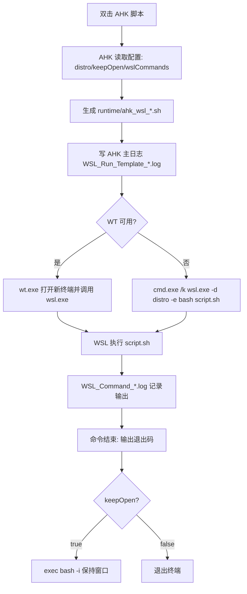
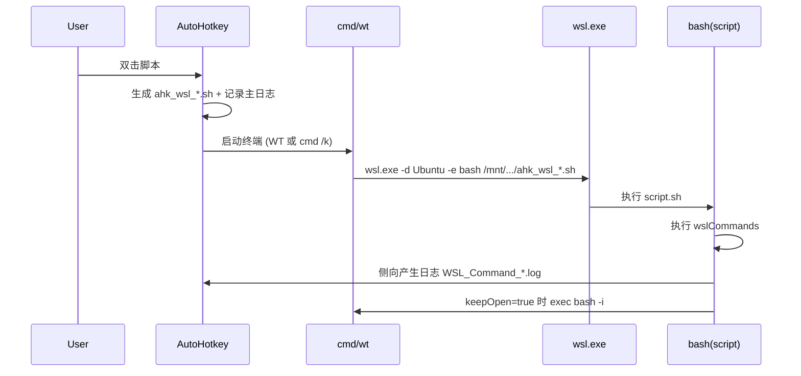

# 【win】AHK 自动化 WSL：从单目录安装到稳定双击执行

## 0. 战报结论（先看结果）
- 已实现目标：在 Windows 上双击 AHK 脚本即可稳定打开 WSL 并执行指定一行/多行命令。
- 已完成闭环：从 `【ahk单目录安装】` 到 `【稳定双击执行wsl命令】` 的全流程跑通。
- 已做稳定化：
  - 解决 AHK v2 语法坑（多行字符串、转义符、变量名）。
  - 解决路径坑（Windows 路径到 WSL 路径转换）。
  - 解决启动坑（文件名空格、cmd 引号拆分、`WSL_E_DISTRO_NOT_FOUND`）。
  - 解决可观测性坑（新增 AHK 主日志 + WSL 执行日志 + runtime 脚本落盘）。
- 当前推荐双击入口：
  - `D:\exe\Snw_AHK\WSL_Run_Template_000_snwSFTP.ahk`
- 关键证据日志：
  - `D:\exe\Snw_AHK\logs\WSL_Run_Template_*.log`
  - `D:\exe\Snw_AHK\logs\WSL_Command_*.log`

## 1. 执行路线（按步骤复现）

### 1.1 上下文与绝对路径（先统一坐标系）
- AHK 安装目录：`D:\exe\Snw_AHK\AutoHotkey\v2\AutoHotkey64.exe`
- AHK 脚本目录：`D:\exe\Snw_AHK\`
- 运行时脚本目录：`D:\exe\Snw_AHK\runtime\`
- 运行日志目录：`D:\exe\Snw_AHK\logs\`
- WSL 发行版：`Ubuntu`

目录结构建议如下：

```text
D:\exe\Snw_AHK
├─ AutoHotkey\v2\AutoHotkey64.exe
├─ downloads\AutoHotkey_2.0.23_setup.exe
├─ WSL_Run_Template.ahk
├─ WSL_Run_Template_000_snwSFTP.ahk
├─ WSL_Run_Template _000_snwSFTP.ahk   # 兼容跳转包装器
├─ logs\
│  ├─ WSL_Run_Template_*.log
│  └─ WSL_Command_*.log
└─ runtime\
   └─ ahk_wsl_*.sh
```

### 1.2 【ahk单目录安装】（可复制）

#### 1.2.1 下载官方安装器到 D 盘
```powershell
powershell.exe -NoProfile -Command "
$target='D:\exe\Snw_AHK\downloads';
New-Item -ItemType Directory -Force -Path $target | Out-Null;
Invoke-WebRequest -Uri 'https://github.com/AutoHotkey/AutoHotkey/releases/download/v2.0.23/AutoHotkey_2.0.23_setup.exe' -OutFile "$target\AutoHotkey_2.0.23_setup.exe";
Write-Output 'OK'
"
```

预期输出：`OK`

#### 1.2.2 安装到单目录（D 盘）
```powershell
powershell.exe -NoProfile -Command "
$installer='D:\exe\Snw_AHK\downloads\AutoHotkey_2.0.23_setup.exe';
$dest='D:\exe\Snw_AHK\AutoHotkey';
Start-Process -FilePath $installer -ArgumentList @('/installto',$dest,'/silent') -Wait;
Test-Path 'D:\exe\Snw_AHK\AutoHotkey\v2\AutoHotkey64.exe'
"
```

预期输出：`True`

常见报错：
- 安装器无反应：多为参数不对，需使用 `/installto` + `/silent`。
- 安装到 C 盘：说明安装器参数未生效，重新按上面命令执行。

回滚点：
- 删除目录 `D:\exe\Snw_AHK\AutoHotkey` 后重装即可。

### 1.3 生成通用模板（可复制）
核心模板文件：`D:\exe\Snw_AHK\WSL_Run_Template.ahk`

你只需要改这 3 项：
- `distro := "Ubuntu"`
- `keepOpen := true`
- `wslCommands` 多行块内的实际命令

示例（多行）：
```ahk
wslCommands := "
(
cd ~/project
pwd
python3 -m http.server 8000
)"
```

示例（长时任务）：
```ahk
wslCommands := "
(
ssh -N -p 443 -L 2222:127.0.0.1:2222 ubuntu@vps-47db6a55.vps.ovh.net
)"
```

### 1.4 关键参数说明（为什么会稳）

| 参数/字段 | 位置 | 作用 | 推荐值 |
|---|---|---|---|
| `distro` | AHK 脚本顶部 | 指定 WSL 发行版 | `Ubuntu` |
| `useWindowsTerminal` | AHK 脚本顶部 | 优先 WT 打开窗口 | `true` |
| `keepOpen` | AHK 脚本顶部 | 命令结束后保留终端 | `true` |
| `wslCommands` | AHK 脚本顶部 | 执行的一行/多行命令 | 按需填写 |
| `runtime\ahk_wsl_*.sh` | 自动生成 | 真实执行脚本（审计依据） | 自动 |
| `logs\WSL_Run_Template_*.log` | 自动生成 | AHK 主流程日志 | 自动 |
| `logs\WSL_Command_*.log` | 自动生成 | WSL 侧命令输出日志 | 自动 |

### 1.5 双击执行后的预期输出

双击后，至少应满足：
1. 出现一个 `cmd`/`WT` 窗口；
2. 窗口内可见：`[AHK-WSL] start: ...`；
3. AHK 主日志出现：
   - `Run via cmd /k: ...`
   - `Run PID=数字`；
4. WSL 日志出现：
   - `WSL_Command_*.log` 文件
   - 含 `start` 和 `last-exit-code`。

## 2. 失败与回滚（每个坑都有退路）

### 2.1 报错：`Illegal character in expression`
成因：AHK v2 字符串写法错误（常见于 `wslCommands` 块或 `"` 转义）。

修复：
- 多行字符串必须是：
```ahk
wslCommands := "
(
...
)"
```
- 避免 C 风格 `\"`，AHK v2 用 `""` 或直接改为无引号文本。

回滚：
- 先替换成最小可运行脚本，只保留 `MsgBox "ok"` 验证语法，再逐步恢复。

### 2.2 报错：`无法转换为 WSL 路径`
成因：Windows 路径转换仅替换了 `\\`，未覆盖单反斜杠。

修复：
```ahk
p := StrReplace(winPath, "\", "/")
```

### 2.3 现象：双击无反应/闪一下就没了
典型成因（这次实战都遇到了）：
- 脚本文件名带空格且未加引号，导致参数拆分。
- fallback 命令引号层级过深，cmd/WSL 解析异常。
- WT 不存在，走 fallback 时窗口策略不稳定。

修复策略：
- 统一使用无空格主脚本名：`WSL_Run_Template_000_snwSFTP.ahk`。
- 保留带空格文件作为包装器，仅做转发。
- fallback 强制走：
```cmd
cmd.exe /k wsl.exe -d Ubuntu -e bash /mnt/d/exe/Snw_AHK/runtime/xxx.sh
```

### 2.4 报错：`WSL_E_DISTRO_NOT_FOUND`
成因：`-d` 参数在错误引号层级中被破坏。

排查：
```powershell
wsl.exe -l -q
```

修复：
- `distro` 写成列表中存在的精确值（例：`Ubuntu`）。
- 简化命令拼接，避免双层引号嵌套。

### 2.5 业务报错：`Address already in use`（SSH 本地转发）
成因：端口已被占用（例：`2222`）。

排查：
```bash
ss -ltnp | grep ':2222 '
```

修复：
- 改本地端口，或先释放占用进程。

## 3. 架构原理（为什么这样做）

### 3.1 分层思路
- AHK 层：负责“触发 + 编排 + 记录”。
- WSL 启动层：负责“把命令送进指定 distro 的 bash”。
- WSL 命令层：负责“真实执行用户命令 + 输出日志 + 保持终端”。

### 3.2 启动链路图（Mermaid）


### 3.3 运行时序图（Mermaid）


## 4. 一键排障清单（新手直接照做）

1. 检查 AHK 主日志是否生成：
```powershell
Get-ChildItem D:\exe\Snw_AHK\logs\WSL_Run_Template_*.log | Sort-Object LastWriteTime -Desc | Select-Object -First 1
```
预期：有最新日志文件。

2. 检查 runtime 脚本是否生成：
```powershell
Get-ChildItem D:\exe\Snw_AHK\runtime\ahk_wsl_*.sh | Sort-Object LastWriteTime -Desc | Select-Object -First 1
```
预期：有最新 `.sh`。

3. 检查 WSL 侧日志是否生成：
```powershell
Get-ChildItem D:\exe\Snw_AHK\logs\WSL_Command_*.log | Sort-Object LastWriteTime -Desc | Select-Object -First 1
```
预期：有最新命令日志。

4. 检查 distro 是否存在：
```powershell
wsl.exe -l -q
```
预期：能看到 `Ubuntu`。

5. 检查目标端口冲突（以 2222 为例）：
```bash
ss -ltnp | grep ':2222 '
```
预期：仅有你期望的监听项，或为空。

## 5. 你现在可以怎么用
- 通用模板（自己填命令）：
  - `D:\exe\Snw_AHK\WSL_Run_Template.ahk`
- SFTP 预置版（可直接双击）：
  - `D:\exe\Snw_AHK\WSL_Run_Template_000_snwSFTP.ahk`

> 到这里，流程已经从“单目录安装 AHK”完整推进到“可稳定双击执行 WSL 命令并保留窗口”。
> 真正稳定的关键，不是“能跑一次”，而是“每一步都有日志、每个故障有回滚点”。
